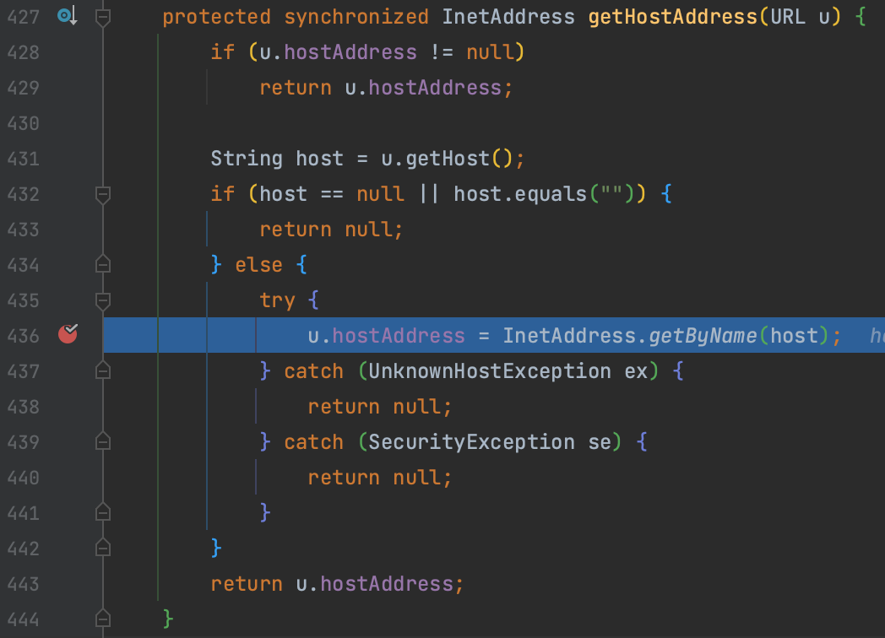
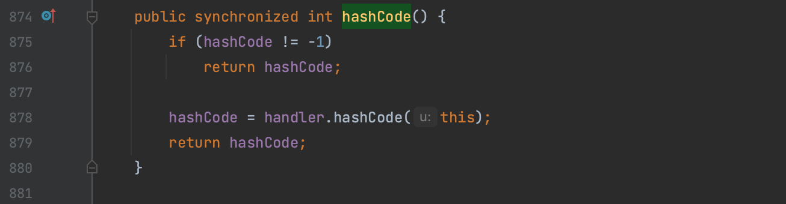
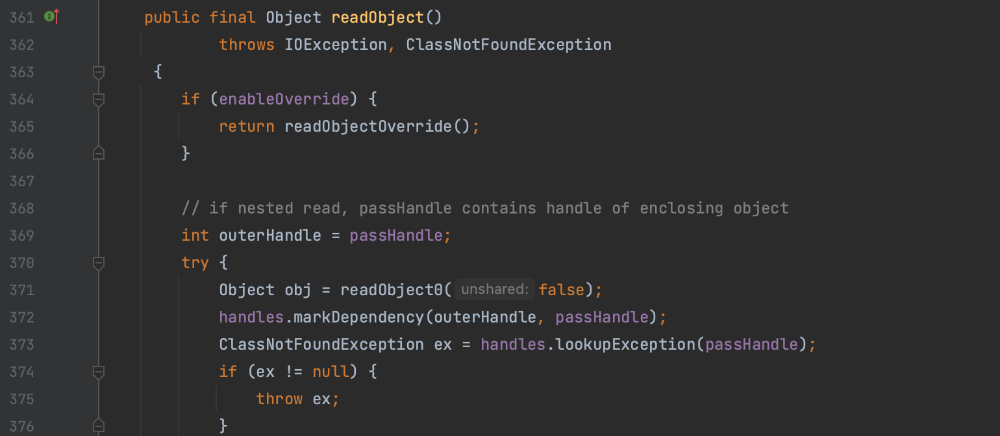

# URLDNS

## 0x00 sink

这个比较简单，网上类似文章很多，简要介绍一下。 `java.net.URLStreamHandler.getHostAddress()` 方法会触发一次查询，而该方法可以通过 `java.net.URL` 类的 `equals()` 和 `hashcode()` 方法调用。



## 0x01 source

soure 点选用 HashMap，具体原理可以参考 [hashMap原理](https://cloud.tencent.com/developer/article/1167574) 这篇文章。总结出当前分析需要关注的点 `put()` 函数会调用 `hashCode()` 计算 key 的 hash，然后再计算index。

而在 HashMap 的 `readObject()` 中调用 `putVal()` 计算 key 的 hash，所以用来触发。


在序列化时会调用 `put()` 方法，这时候会触发 `hashCode()` 方法，hashCode 属性值会被设为 -1，经过 `java.net.URL.hashCode()` 中判断，不会触发后续流程，所以需要反射修改 hashCode 值。

ysoserial 中实现了自定义的 `URLStreamHandler` 使得生成 gadget 时调用自定义 `getHostAddress()` 方法，避免提前触发dns查询。



## 0x02 类探测

在调用 HashMap 的 `putVal()` 前调用了这两个方法，而在 `readObject()` 中，当类不存在时会抛出 `ClassNotFoundException` 异常，也就不会触发到后续的请求，因此可以将 value 值插入为 Class 对象实现类探测。

```java
K key = (K) s.readObject();
V value = (V) s.readObject();
```



本地已有的类可以通过 `Class.forName(className);` 获取，如果想探测任意类呢？可以使用 javassist

```java
ClassPool.getDefault().makeClass(className).toClass();
```

