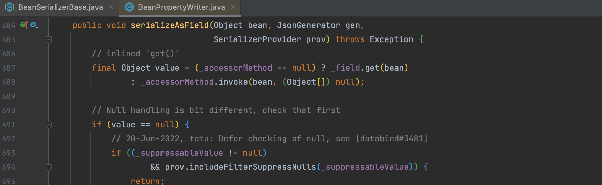

# Jackson

## 0x01 调用链构建

Jackson 的原生反序列化和 Fastjson 类似，都是通过调用其 `toString()` 方法来调用 `getter`。

Jackson 用到的是 `com.fasterxml.jackson.databind.node.BaseJsonNode` 这个类，还是一样的用 `javax.management.BadAttributeValueExpException` 来触发，这一部分内容不过多赘述。

只不过需要删除 `com.fasterxml.jackson.databind.node.BaseJsonNode#writeReplace()` 方法，避免在序列化时报错。

## 0x02 JACKSON 链的不稳定性

在反序列化时，可以会因为 Jackson 触发 getter 的顺序不同，调用到 `TemplatesImpl` 类的 `getStylesheetDOM()` 方法，因为  `_sdom` 为 null 抛出空指针异常，可以参考这篇文章 [从JSON1链中学习处理JACKSON链的不稳定性](https://xz.aliyun.com/t/12846) 的处理。

