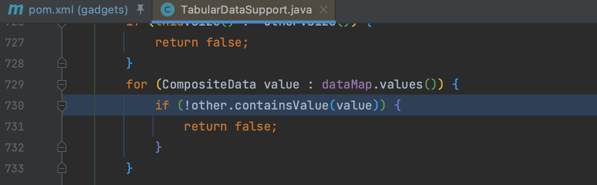
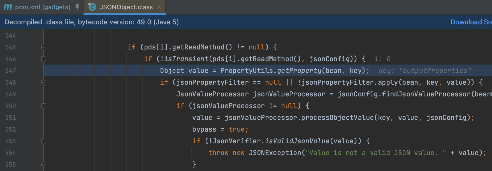
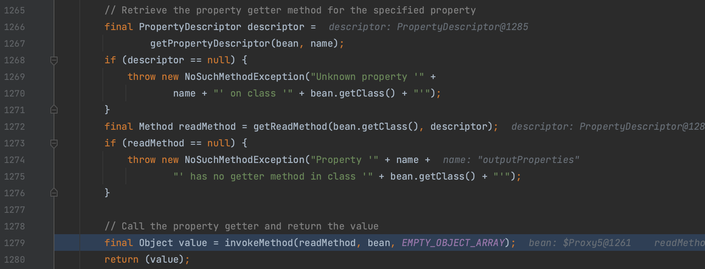
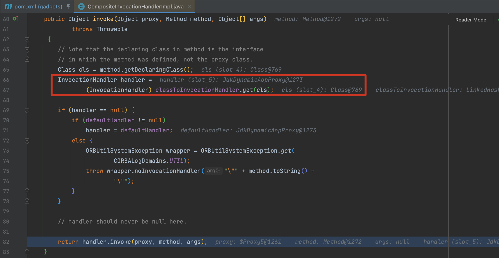

# JSON

前面已经分析过 Fastjson 和 Jackson 了，ysoserial 中的 JSON1 这条链子同样是用通过触发 getter 的方式来触发，这不过这条复杂一点。

这条链的 Kick-off 是选用的 `HashMap.equlas()` ，之后通过 `javax.management.openmbean.TabularDataSupport` 类的 `equlas()` 方法触发到 `net.sf.json.JSONObject.containsValue()`

继续跟进可以看到在 `net.sf.json.JSONObject.defaultBeanProcessing()` 对 Bean 对象进行处理，调用 `org.apache.commons.beanutils.PropertyUtils.getProperty()` 方法来处理。

`getProperty()` 方法用来提取 Bean 对象的属性值，即 JSON 用的 CB 的方法代理调用 getter

ysoserial 中用到了 `com.sun.corba.se.spi.orbutil.proxy.CompositeInvocationHandlerImpl` 这个类来代理，调用其 handler 属性值，套了一层来调用 `JdkDynamicAopProxy` ，这里有点没理解，实际上直接用 `JdkDynamicAopProxy` 也是可以的。

