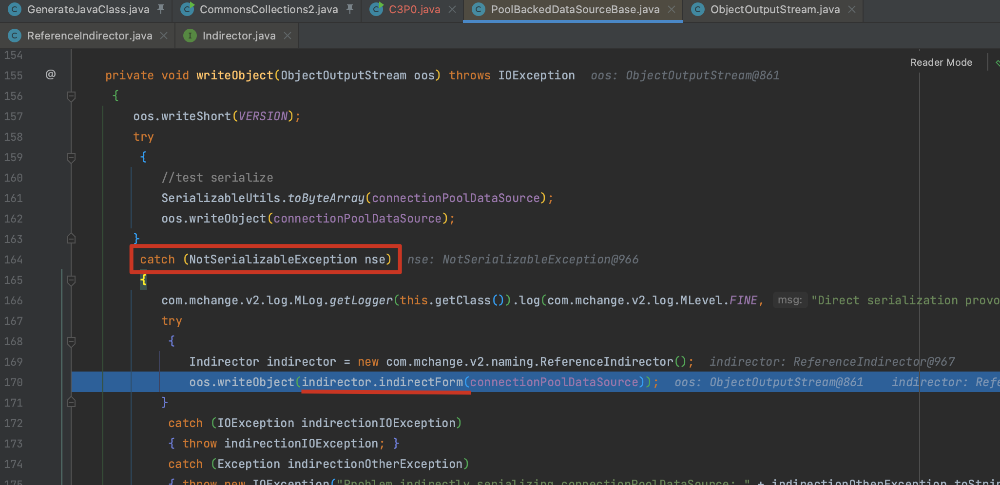
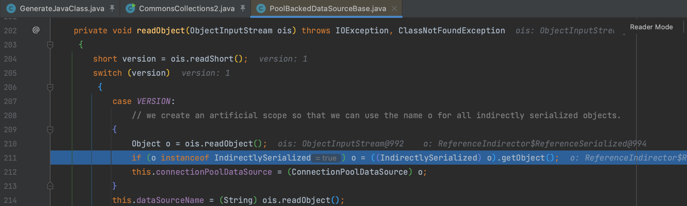
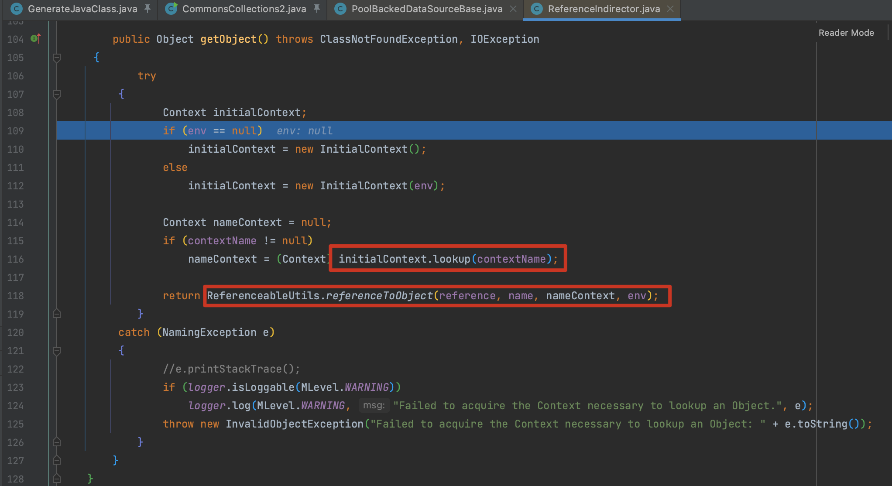
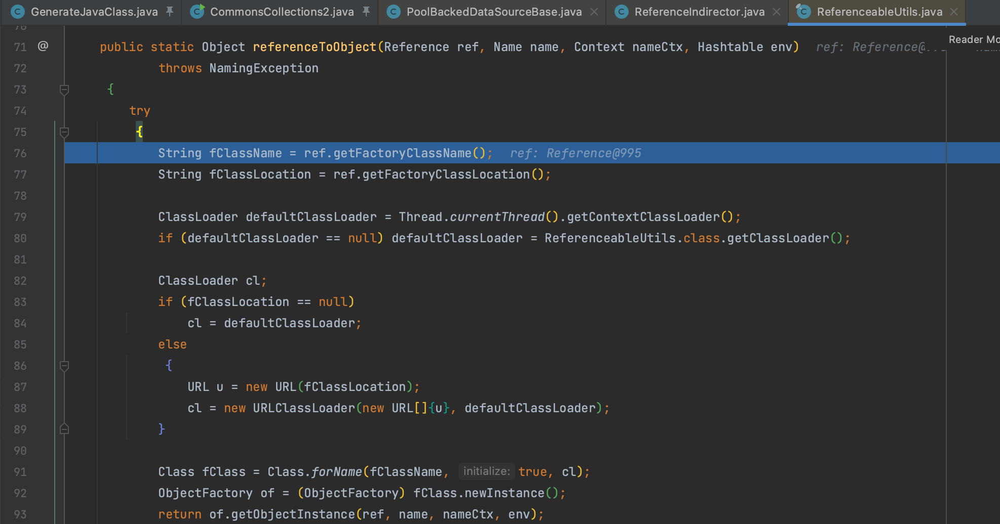
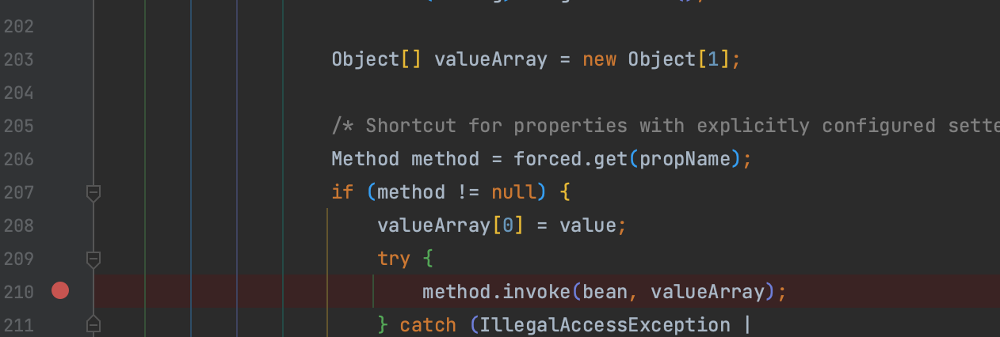

# C3P0

C3P0（Connection Pool 3.0）是一个用于管理数据库连接池的开源 Java 库，实现了数据源和 JNDI 绑定，支持 JDBC3 规范和 JDBC2 的拓展，在很多开源项目中都使用到。

# 0x01 原始调用链分析

先看看 `com.mchange.v2.c3p0.impl.PoolBackedDataSourceBase` 类的 `writeObject()` 方法，在序列化时，会尝试序列化变量 `connectionPoolDataSource` ，如果 `connectionPoolDataSource` 是不可序列化的对象，则使用 `ReferenceIndirector.indirectForm()` 进行封装。



跟进 `indirectForm()` 方法，会调用 `javax.naming.Referenceable#getReference()` 返回一个 `Reference` 对象，并用 `ReferenceSerialized` 封装后返回


在反序列化时重新生成 `ConnectionPoolDataSource` 对象。



跟进 `getObject()` 方法，调用 `javax.naming.Context.lookup()` 通过 JNDI 获取对象。当 env、contextName 为 null 时则会调用 `com.mchange.v2.naming.ReferenceableUtils.referenceToObject()` 加载远程对象



`referenceToObject()` 方法就是一个简单的 URLClassLoader 加载远程对象。



所以这个调用链的构造就很简单了，构造一个带有恶意利用的 `ConnectionPoolDataSource` 对象，通过远程加载实现利用。这个地方的 contextName 没法控制，所以不能通过 lookup 实现 JNDI 注入。

# 0x02 org.apache.naming.factory.BeanFactory

在 `org.apache.naming.factory.BeanFactory.getObjectInstance()` 方法中，还可以反射调用方法，变动一下 `getReference()` 方法就可以使用 `javax.el.ELProcessor` 实现 EL 表达式注入，具体见项目。



```java
public Reference getReference() throws NamingException {
    String s = RanDomUtils.generateRandomString(3);
    ResourceRef resourceRef = new ResourceRef("javax.el.ELProcessor", null, "", "", true, "org.apache.naming.factory.BeanFactory", null);
    resourceRef.add(new StringRefAddr("forceString", s + "=eval"));

    resourceRef.add(new StringRefAddr("a", String.format("Runtime.getRuntime().exec(\"%s\")", script)));

    return resourceRef;
}
```

除了 EL、Groovy、SnakeYaml 等也可以触发。
