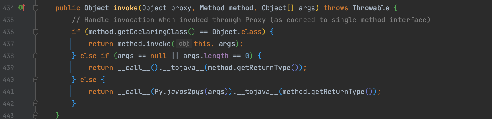
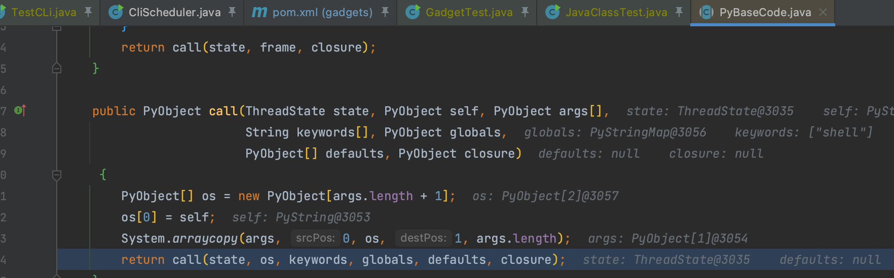
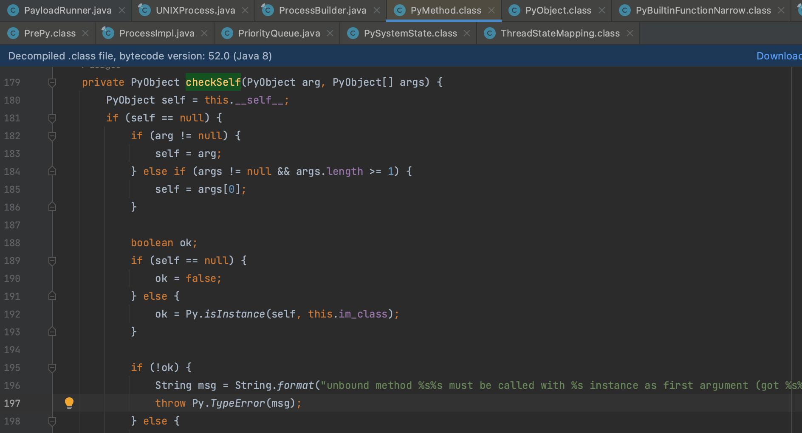
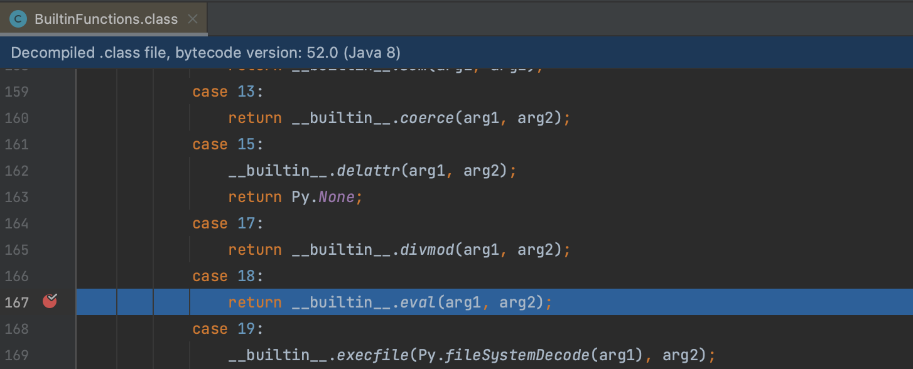
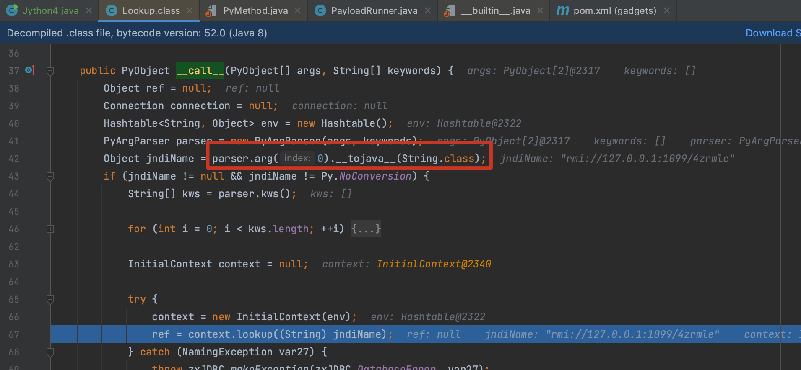

# Jython

Jython 是 Python 编程语言的一个实现，它是用 Java 编写的，并且运行在 Java 平台上。因此可以在 Jython 中使用与标准 Python 相同的语法和标准库来执行系统命令，并且可以利用 Java 平台的特性和库，可以通过这个代码执行命令

```java
public static void main(String[] args) {
    PythonInterpreter pythonInterpreter = new PythonInterpreter();
    String pythonCode = "__import__('os').system('open -a Calculator.app')";
    PyFunction pyFunction = (PyFunction) pythonInterpreter.eval(pythonCode);
    pyFunction.__call__();
}
```

## Jython1

### 0x01 PyFunction

`org.python.core.PyFunction` 是 Jython 中的一个类，用于表示 Python 中的函数对象。`PyFunction` 类提供了访问和操作 Python 函数的方法和属性。

`PyFunction` 类中有几个关键的类和方法

- `__call__(PyObject[] args, String[] keywords)`：调用 Python 函数，传递参数和关键字参数。
- `__getattr__(String name)`：获取函数的属性。
- `__code__`：函数的字节码对象，包含函数的代码、参数列表等信息。
- `__name__`：函数的名称。
- `__doc__`：函数的文档字符串。

所以我们要代码执行实际上就是要调用其 `__call__` 方法，而 `PyFunction` 类还实现了 `java.lang.reflect.InvocationHandler` 接口，好巧不巧 `invoke()` 方法中就调用了 `__call__` ，这代表可以用这个类来动态代理获取真正的执行结果。



### 0x02 PyCode

`org.python.core.PyCode` 用于表示 Python 中的代码对象，包括函数、模块、类等的字节码表示。我们可以看到 `org.python.core.PyFunction#__call__()` 方法最终会调用 `org.python.core.PyCode#call()` 方法来执行 Python 代码。

`org.python.core.PyBaseCode` 是 `PyCode` 的基础抽象类，`org.python.core.PyBytecode` 和 `org.python.core.PyTableCode` 对其进行了具体实现。

跟进最开始给出的执行代码的 demo 可以看到调用了 `org.python.core.PyBaseCode.call()` 方法来执行命令。



通过最开始的 `PythonInterpreter` 创建的 `PyFunction` 的 `PyCode` 是 `PyTableCode` ，其执行命令的是 `funcs` 是一个 `org.python.core.PyFunctionTable` 抽象类是在运行时动态生成的没办法直接使用，所以用 `PyTableCode` 来实现的恶意 `org.python.core.PyFunction` 的创建。

`PyBytecode` 构建信息可以通过 `python -m dis exec.py` 来生成，这里以 Jython1 为例。

```python
def execEvil(a, b):
    f = open(a, 'w')
    f.write(b)
    f.close()
    execfile(a)

if __name__ == '__main__':
    print(execEvil.__code__.co_code.encode('hex'))
    print(execEvil.__code__.co_name)
    print(execEvil.__code__.co_names)
    print(execEvil.__code__.co_consts)
    print(execEvil.__code__.co_varnames)
    print(execEvil.__code__.co_filename)
    print(execEvil.__code__.co_argcount)
    print(execEvil.__code__.co_stacksize)
    print(execEvil.__code__.co_nlocals)
    print(execEvil.__code__.co_flags)
    print(execEvil.__code__.co_lnotab)
    print(execEvil.__code__.co_firstlineno)
    print(dis.dis(execEvil.__code__))
```

Jython2 和 Jython1 一样，只不过换成 os.system() 来执行，避免写文件。

## Jython3

### 0x01 PyMethod 

`org.python.core.PyMethod` 这个类同样实现了动态代理，其 `invoke()` 方法调用了 `__call__()` 方法，构造的时候满足 `PyMethod` 的判断即可：

`__self__` 类型与 args 保持一致，`org.python.core.PyMethod.checkSelf()` 方法会有个判断。



`index` 为 18 触发真正的 `eval()`



Jython3 用的是 `org.python.core.BuiltinFunctions` 这个类来触发

## Jython4

Jython4 这条链用的 `com.ziclix.python.sql.connect.Lookup#__call__()` 来触发，这个利用比较简单，将参数 1 设置为远程调用地址就行。



