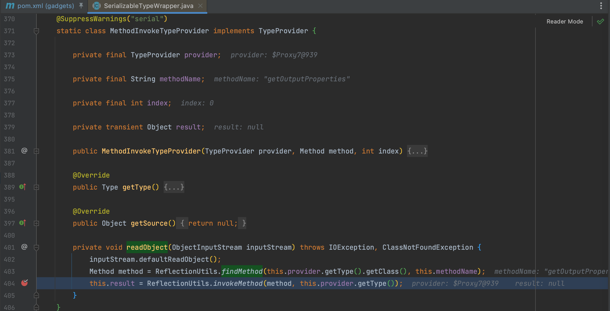
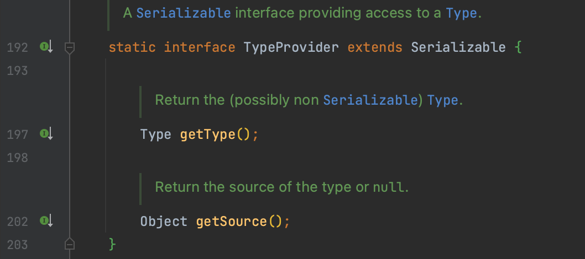
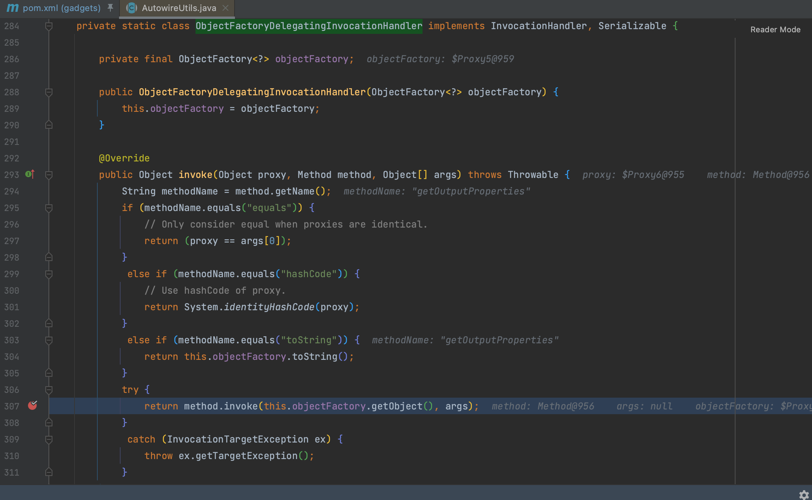

# Spring

## Spring1

### 0x01 MethodInvokeTypeProvider

`org.springframework.core.SerializableTypeWrapper.MethodInvokeTypeProvider` 类实现了 `TypeProvider` 接口，`readObject()` 方法中通过 `ReflectionUtils.invokeMethod` 调用 `provider` 的无参方法。

`org.springframework.core.SerializableTypeWrapper.TypeProvider` 接口约定了实现该接口的方法必须是序列化的。

所以当 `this.provider.getType()` 获取到为 `TemplatesImpl` 就能触发利用，很容易就能想到动态代理。

### 0x02 ObjectFactoryDelegatingInvocationHandler

`org.springframework.beans.factory.support.AutowireUtils.ObjectFactoryDelegatingInvocationHandler` 类的 `invoke()` 方法会调用 `this.objectFactory.getObject()` 返回的对象执行来反射调用，因为是泛型 `ObjectFactory` ，所以可以用动态代理来返回期望对象。并且 `ObjectFactoryDelegatingInvocationHandler` 本身也是 Proxy ，可以和之前的 `MethodInvokeTypeProvider` 串联起来。

## Spring2

### 0x01 JdkDynamicAopProxy

Spring1 这条链通过 `ObjectFactoryDelegatingInvocationHandler` 类的 `ObjectFactory` 来获取对象，同样功能的还有之前的 `JdkDynamicAopProxy` 类，通过其 `targetSource` 来也是一样能实现，即 Spring2 的构造。
