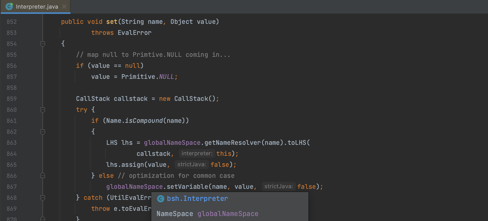
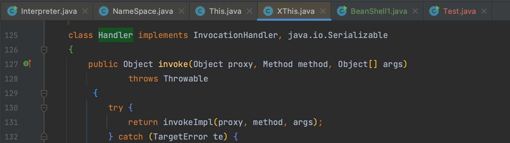
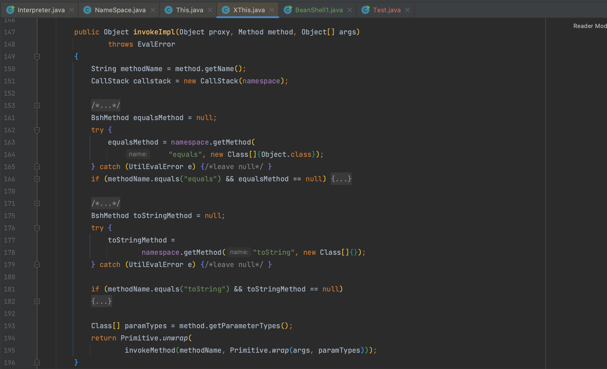
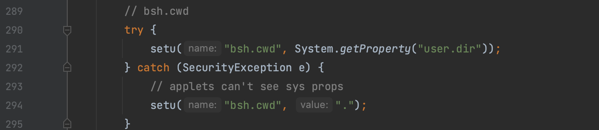

# BeanShell

BeanShell是一个小型的，免费的，可嵌入的Java源代码解释器，具有对象脚本语言功能，用Java编写。BeanShell动态地执行标准Java语法，并使用常见的脚本便利（如Perl和JavaScript中的松散类型、命令和方法闭包）对其进行扩展。

## 0x01 基本信息

通过以下 Demo 可以执行命令，解析一下 Demo 中各个部分的作用

```java
public class Test {
    public static void main(String[] args) throws Exception {
        Interpreter interpreter = new Interpreter();

        String func = "exec(Object cmd){java.lang.Runtime.getRuntime().exec(cmd);}";
        interpreter.eval(func);

        String payload = "exec(poc)";
        interpreter.set("poc", "open -a Calculator.app");
        interpreter.eval(payload);
    }
}
```

### bsh.Interpreter

`bsh.Interpreter` 是脚本解释器，提供了执行 BeanShell 脚本的功能，通过 `eval()` 方法用于执行给定的 BeanShell 表达式或语句。

### bsh.NameSpace

`set()` 方法用于设置变量或属性值，保存在 `bsh.NameSpace` 中，这个变量用于管理解释器的变量、函数和类的命名空间。



## 0x02 bsh.This

而 `bsh.NameSpace` 和 `bsh.Interpreter` 共同构成 BeanShell 的上下文对象，用 `bsh.This` 类表示。

`bsh.XThis` 是其子类， `invokeMethod()` 方法提供了从脚本中调用方法的能力，上文的例子转化为通过 `XThis` 来执行如下：

```java
Interpreter interpreter = new Interpreter();
String func = "exec(Object cmd){java.lang.Runtime.getRuntime().exec(cmd);}";
interpreter.eval(func);
XThis xThis = new XThis(interpreter.getNameSpace(), interpreter);
xThis.invokeMethod("exec", new Object[]{"open -a Calculator.app"});
```

`bsh.XThis` 又一个内部 `Handler` 类实现了动态代理，并且调用了 `invokeImpl()` 方法



而 `invokeImpl()` 方法中通过 `invokeMethod()` 执行了方法，所以与 Jython 的调用链类似，同样可以用 `Comparator` 来触发。



## 0x03 BeanShell1 user.dir 泄露

BeanShell1 这条调用链在生成时会泄露文件路径，参考这篇文章 https://mp.weixin.qq.com/s/CQ-jlcb3w72OP5UyGynMHg

在 `Interpreter` 对象初始化时，会调用 `bsh.Interpreter.initRootSystemObject()` 方法，将 `user.dir` 赋值给 `bsh.cwd` 属性，避免这个泄露需要反射修改该值


