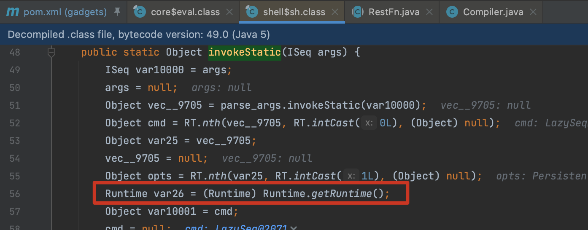
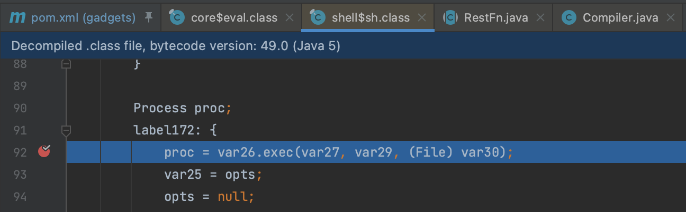
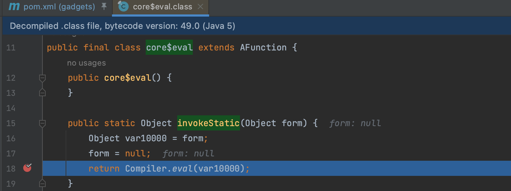
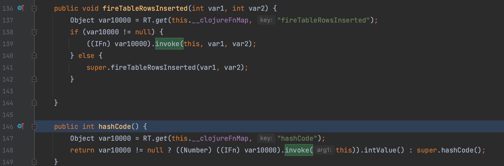
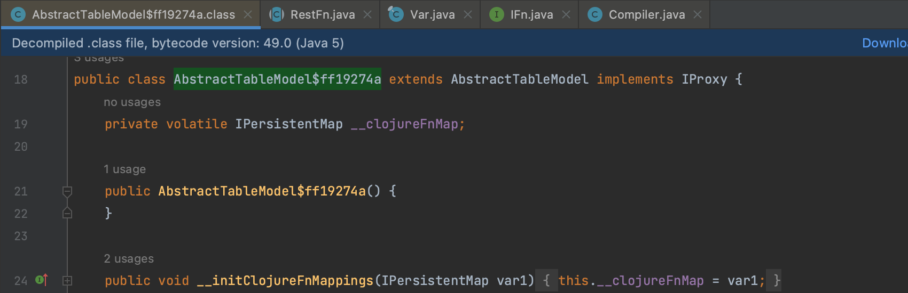
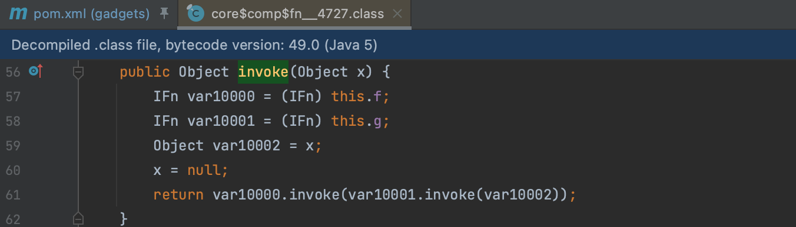
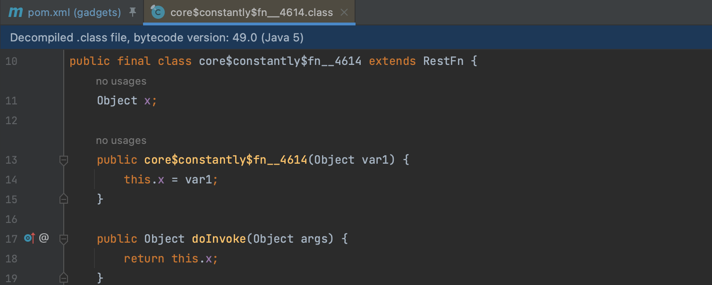
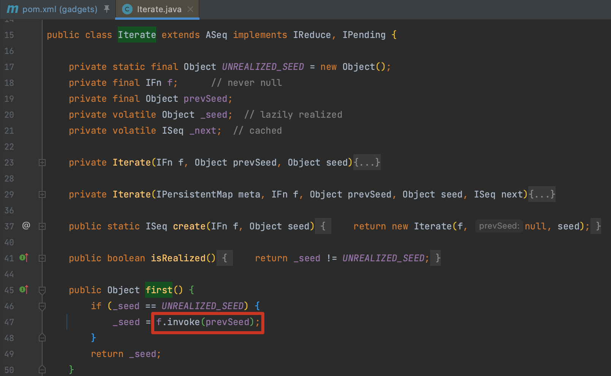
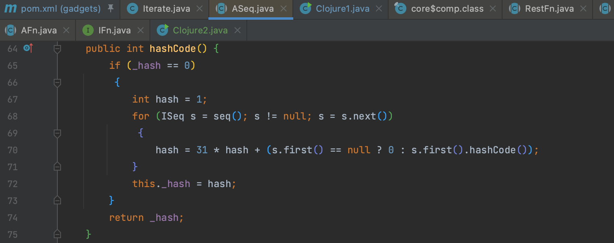

# Clojure

## Clojure1

### 0x01 clojure.java.shell$sh

Clojure 是 LISP 在 Java 的实现，是直接运行在 JVM 上的，可以直接调用 Java 的类和方法，以下例子中使用了 Clojure 提供的 Java API，通过 `clojure.java.api.Clojure` 类来加载 Clojure 的核心命名空间，并使用 `IFunction` 接口来获取 Clojure 中的函数执行命令。

```java
public class ClojureTest {
    public static void main(String[] args) {
        // 加载 Clojure 核心命名空间
        IFn require = Clojure.var("clojure.core", "require");
        require.invoke(Clojure.read("clojure.java.shell"));

        // 获取 Clojure 的 sh 函数
        IFn sh = Clojure.var("clojure.java.shell", "sh");

        // 执行命令
        String command = "whoami";
        Object result = sh.invoke(command);

        String output = (String) Clojure.var("clojure.core", "str").invoke(result);
        System.out.println(output);
    }
}
```

跟进以下可以看到最后真正的执行代码逻辑位于 `clojure.java.shell$sh.invokeStatic()` 这个方法中，这个方法的作用很简单，就是提供了执行命令并获取输出的能力，直接调用了 `Runtime.exec()` 。





### 0x02 clojure.main$eval_opt

上文的例子中我们加载了 `clojure.core` 核心空间来执行命令，还有其他写法么，是有的。直接用到 `clojure.main` 这个类来调用。

```java
public class ClojureTest {
    public static void main(String[] args) {
        String cmd = "(use '[clojure.java.shell :only [sh]]) (sh \"open\" \"-a\" \"Calculator.app\")";;
        new clojure.main$eval_opt().invoke(cmd);
    }
}
```

跟进一下 `clojure.main$eval_opt().invoke(cmd)` 做了些什么，跟进到 `clojure.core$eval.invokeStatic()` 这个方法，这个方法用于在 Clojure 的内部使用以便在 Java 代码中执行 Clojure 代码。



### 0x03 AbstractTableModel$ff19274a

gadget 形成用到的是 `clojure.inspector.proxy$javax.swing.table.AbstractTableModel$ff19274a` 这个类，这个类是一个匿名类实例，通常用于 GUI 相关操作，是 JackOfMostTrades 用 [gadgetinspector](https://github.com/JackOfMostTrades/gadgetinspector) 挖掘得到的链子，具体可以看 [blackhat Automated-Discovery-of-Deserialization-Gadget-Chains](https://i.blackhat.com/us-18/Thu-August-9/us-18-Haken-Automated-Discovery-of-Deserialization-Gadget-Chains.pdf) 这个议题，这里就直接分析了。

这个类的每一个方法都是对 `clojure.lang.IPersistentMap` 类型的对象 `__clojureFnMap` 进行操作，从中获取对象，再调用其 `invoke()` 方法。



`__clojureFnMap` 通过 `__initClojureFnMappings()` 方法指定。



### 0x04 clojure.core$comp$fn__4727

`clojure.core$comp$fn__4727#invoke()` 方法中，会将 `this.g` 调用 `invoke()` 后交给 `this.f` 再次调用 `invoke()` 。



### 0x05 core$constantly$fn__4614

根据之前的分析 `this.f` 可以定义为 `clojure.main$eval_opt` 对象，`this.g` 应该为需要执行的命令。 `core$constantly$fn__4614` 这个类，在调用其 `doInvoke()` 方法时，会直接返回存储的对象。



Kick-off 的触发选用 `hashCode()` 于是选择 HashMap

## Clojure2

### 0x01 Iterate

在 `clojure.lang.Iterate.first()` 方法中会调用 `f.invoke()` ，这个 `f` 是一个 `clojure.lang.IFn` 接口的实现类，我们前面分析的 `core$comp` 就实现了这个接口，所以只需要找触发 `first()` 的方法。



`Iterate` 还继承了抽象类 `ASeq` 刚好提供了 `hashCode()` 方法，`seq()` 又返回自身，所以就还是用 HashMap 这个 Kick-off 去触发就好了。




**参考**

> https://su18.org/post/ysuserial/
