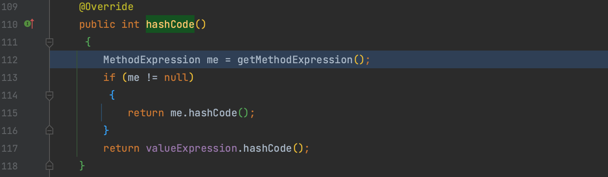
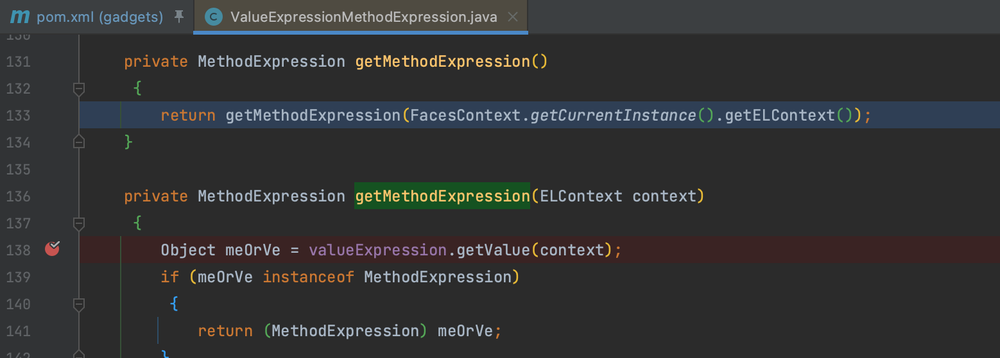

# Myfaces 

这条调用链最后的 EL 表达式没复现出来，简单记录下调用链

`org.apache.myfaces.view.facelets.el.ValueExpressionMethodExpression.hashCode()` 方法中会调用 `org.apache.myfaces.view.facelets.el.ValueExpressionMethodExpression.getMethodExpression()` 方法。

方法内解析了 EL 表达式，source 点可以直接用 HashMap 来触发 `hashCode()` 。

