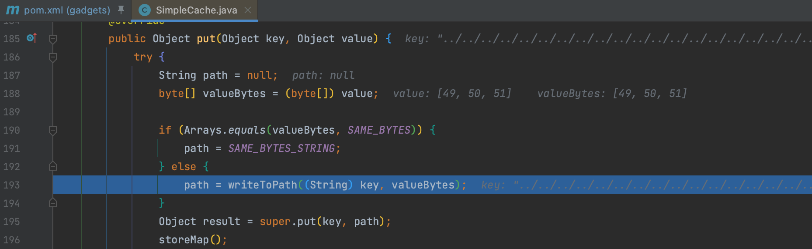
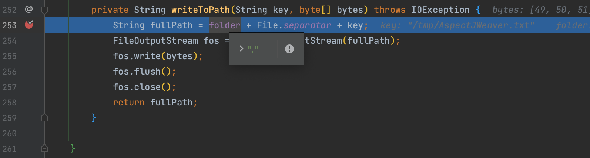
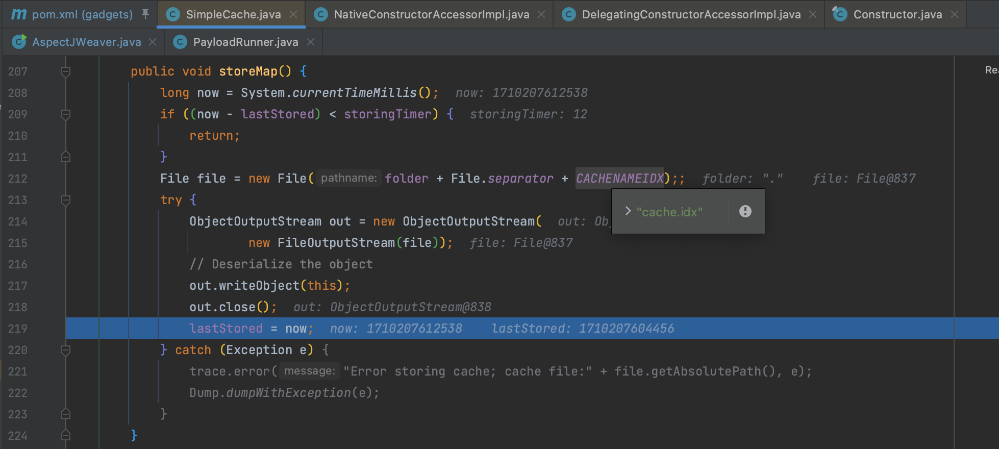

# AspectJWeaver

## 0x01 SimpleCache$StoreableCachingMap

这条链没什么好说的，和 CC6 类似，只不过用到了 `org.aspectj.weaver.tools.cache.SimpleCache$StoreableCachingMap` 这个类触发其 `put()` 方法。

写入文件时会拼接当前路径，这个通过构造函数指定

并且写入成功后会在该目录下生成一个 `cache.idx` 文件。

