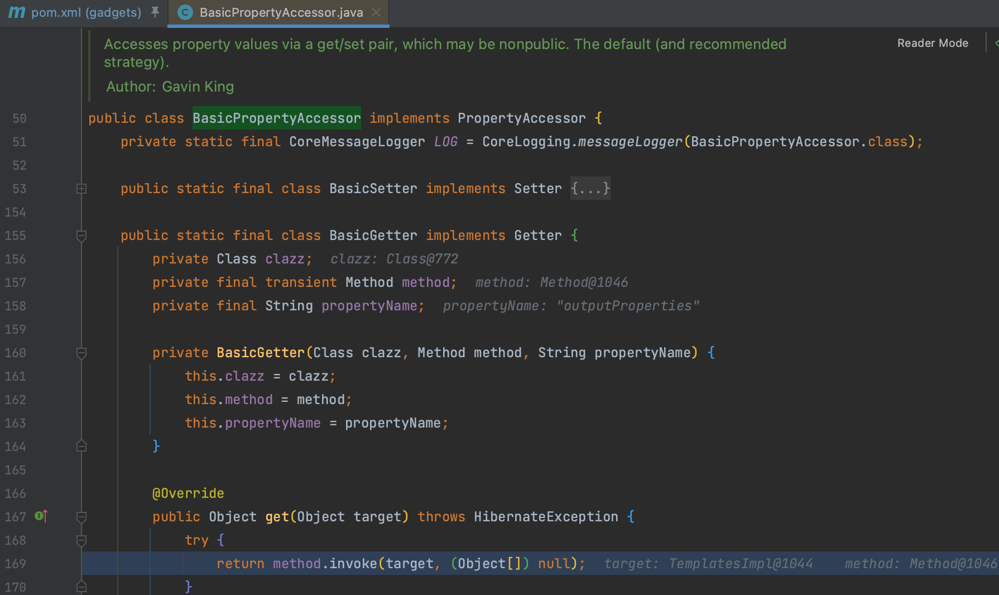
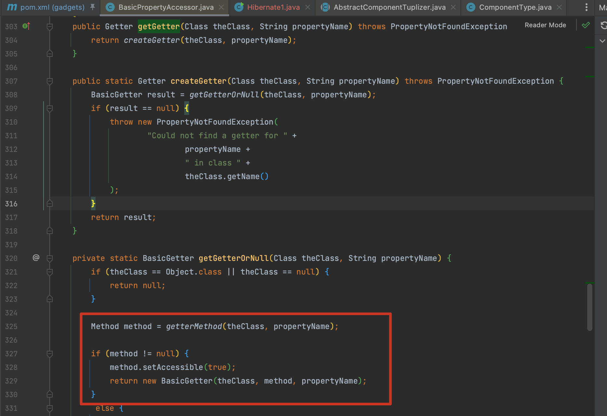
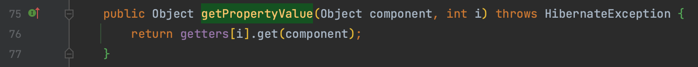
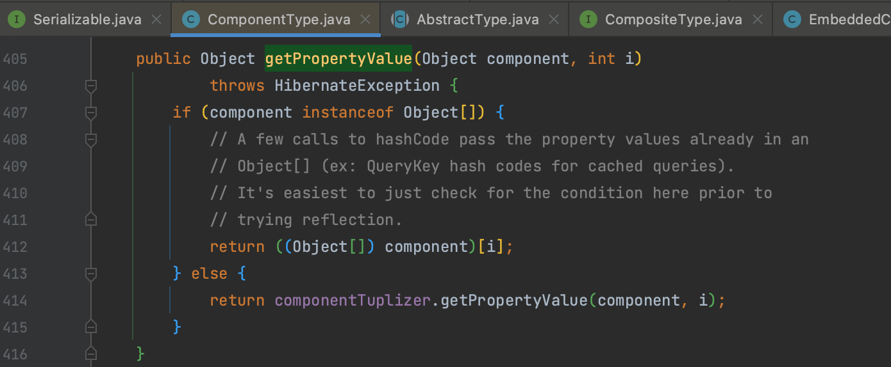
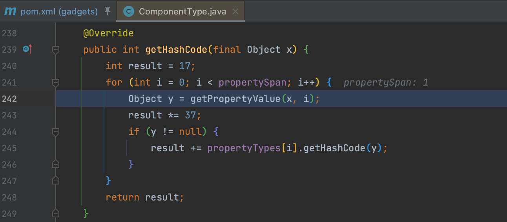
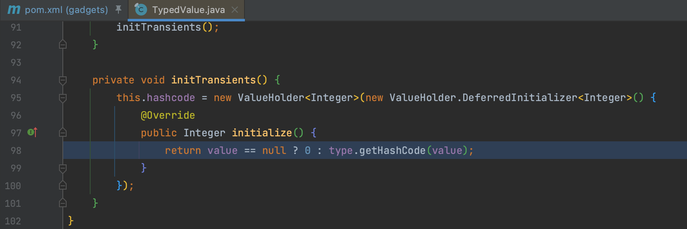
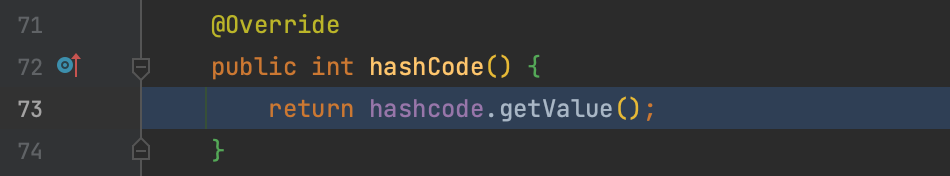
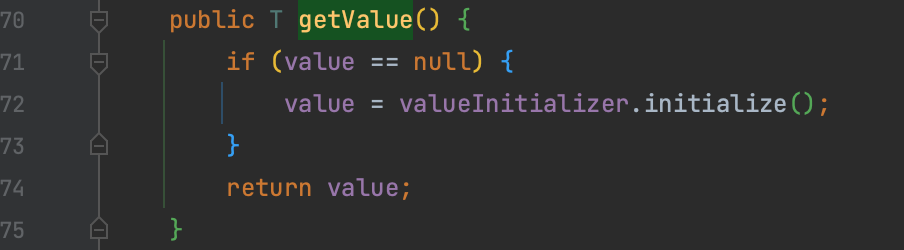

# Hibernate

ORM 框架

## Hibernate1

### 0x01 BasicPropertyAccessor

`org.hibernate.property.BasicPropertyAccessor` 类提供通过 setter 和 getter 操作属性值的能力，这个属性值可以是 nopublic 的，在 `org.hibernate.property.BasicPropertyAccessor.BasicGetter.get()` 方法中反射调用。

`org.hibernate.property.BasicPropertyAccessor.getGetter()` 方法提供了构造 `BasicGetter` 对象的能力，所以直接用这个类就能出发 getter 了，但是 `BasicPropertyAccessor` 没有实现 `Serializable` 可惜。

### 0x02 AbstractComponentTuplizer

在 `org.hibernate.tuple.component.AbstractComponentTuplizer.getPropertyValue()` 方法中遍历 `Getter[]` 时调用了 `BasicGetter.get()` 。

`AbstractComponentTuplizer` 本身是一个抽象类，gadget 使用的其中一个继承类 `org.hibernate.tuple.component.PojoComponentTuplizer` 

### 0x03 ComponentType

通过 `org.hibernate.type.ComponentType.getPropertyValue()` 方法调用 `getPropertyValue()` ，又被自身的 `getHashCode()` 方法调用。

`PojoComponentTuplizer` 和 `ComponentType` 这两个类从命名来看都有 `Component` （组件），这个是 Hibernate 的一个概念，简单来说用来表示对象内的一部分或者一组相关属性，可以作为对象的一部分持久化，也可以嵌入其他实体。他们共同完成持久化行为，所以存在调用也更好理解。

### 0x04 TypedValue

继续寻找调用了 `ComponentType.getHashCode()` 的方法，定位到 `org.hibernate.engine.spi.TypedValue` 这个类。

`initTransients()` 方法新建了一个 `org.hibernate.internal.util.ValueHolder` 对象，但是构造方法是新建了一个新的 `DeferredInitializer` 对象，同时重写了 `initialize()` 方法。

这里就开始绕起来了，`TypedValue.hashCode()` 方法调用了 `ValueHolder.getValue()` 方法

而 `ValueHolder.getValue()` 方法又会调用 `DeferredInitializer.initialize()` 也就是前面初始化被改变的。相当于 `TypedValue` 调用其 `hashCode()` 方法时，`ValueHolder` 作为跳板让其跳回调用 `TypedValue` 类的 `initTransients()` 方法，又因为重写了所以进入新的 `initialize` 方法。

之后用 HashMap 这个 Kick-off 去触发就是这条调用链了。

## Hibernate2

Sink 改用 `com.sun.rowset.JdbcRowSetImpl.getDatabaseMetaData()` ，其他没动。
