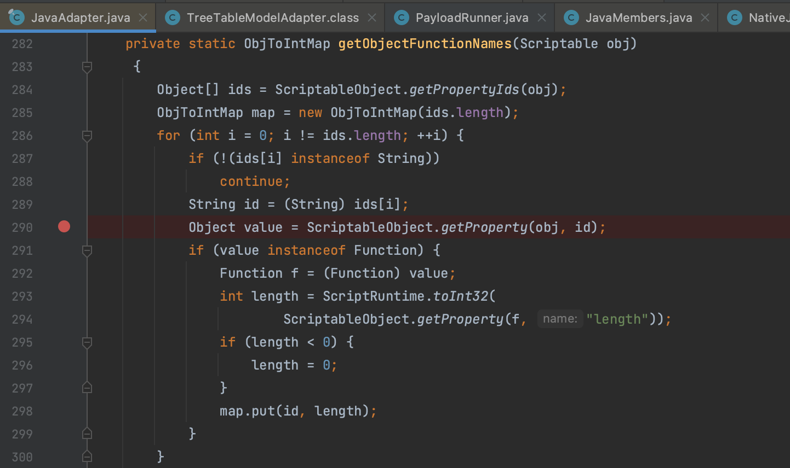

# MozillaRhino

Mozilla Rhino JavaScript 是一个开源的 JavaScript 引擎，由 Mozilla Foundation 开发，用于在 Java 环境中执行 JavaScript 代码。

## MozillaRhino1

### 0x01 MemberBox

`org.mozilla.javascript.MemberBox` 类通常用于将 JavaScript 对象的成员（方法或变量）包装成 Java 对象，以便在 Java 代码中使用。`invoke()` 方法中存在一个反射调用，这个 Method 通过 `method()` 方法中直接获取 `memberObject` 属性值。

`memberObject` 属性虽然被 transient 修饰，不过该类还实现了 `writeMember()`、`readMember()` 参与序列化过程来写入值，所以仍然可控。

### 0x02 NativeJavaMethod

调用 `MemberBox.invoke()` 方法的方法定位到 `org.mozilla.javascript.NativeJavaMethod.call()` ，meth 通过构造的 `methods[]` 中拿取，并且元素不为空前面的 if 条件不影响。javaObject 对象通过 `org.mozilla.javascript.Wrapper` 类型对象的 `unwrap()` 方法获取，通过传入的 `thisObj` 指定 Wrapper。

### 0x03 NativeJavaObject

`org.mozilla.javascript.NativeJavaObject` 类的 `unwrap()` 方法直接返回 `javaObject` 属性值，和前面一样有 transient 修饰，不过仍提供了类似处理来写入。

并且 `NativeJavaObject` 类实现了序列化接口 先 mark 住后面分析。

### 0x04 NativeError

调用链通过 `org.mozilla.javascript.NativeError` 这个类串联起来，这个类继承了抽象类 `IdScriptableObject` ，后者又继承了抽象类 `ScriptableObject` 所以后续我们在看的时候其实可以就看作是 `NativeError` 本身，便于理解。看到 `NativeError.getString()` 方法调用了 `ScriptableObject#getProperty()`。

`js_toString()` 调用 `getString()` ，传入 ID `name、message` ，`thisObj` 是通过 `toString()` 传入的自身。

顺着 `ScriptableObject.getProperty()` 一直跟下去走到 `org.mozilla.javascript.ScriptableObject.getImpl()` 方法，根据 name 调用 `getSlot()` 方法获取 `Slot` 对象，通过其 getter 属性值得到 `getterObj` 对象决定进入的分支。else 分支下执行了 `f.call()` 方法，和前面的 `NativeJavaMethod` 串联起来形成 MozillaRhino1 的 gadget ，再用 `BadAttributeValueExpException` Kick-off 去触发 `toString()`。

## MozillaRhino2

### 0x01 JavaMembers

在 `org.mozilla.javascript.JavaMembers.get()` 方法中也调用了 `MemberBox.invoke()` 方法，这个方法接收一个属性名，通过 name 来获取 member ，如果为 `BeanProperty` 就会进入分支执行 `bp.getter.invoke()`

### 0x02 NativeJavaObject

在 `NativeJavaObject.get()` 方法中调用了上述方法，members 属性值可控

### 0x03 NativeJavaArray

调用了 `NativeJavaObject.get()` 的方法有很多，gadget 选用的是 `org.mozilla.javascript.NativeJavaArray` 这个类，继承自 `NativeJavaObject` 。

### 0x04 Environment

接着用 `org.mozilla.javascript.tools.shell.Environment` 来串联 gadget，`Enviroment` 类继承了抽象类 `org.mozilla.javascript.ScriptableObject` ，在 `getProperty()` 调用了上述方法。

### 0x05 NativeJavaObject

之前提到了 `NativeJavaObject` 实现了 `Serializable` 接口，用这个类来替换 `BadAttributeValueExpException`。

`org.mozilla.javascript.NativeJavaObject` 这个类的作用是将非数组 Java 对象映射到 JS 环境中，前面我们就提到利用其 `unwrap()` 方法来获取属性值，除此之外还能调用方法，简单来说 `NativeJavaObject` 用来表示已经存在的对象。

`adapter_readAdapterObject` 在 static 中被定义为 `org.mozilla.javascript.NativeJavaObject.readObject()`。

### 0x06 JavaAdapter

在 `getObjectFunctionNames()` 方法中正好调用了 `ScriptableObject.getProperty()` 。为什么会刚好被这个类调用呢，前面介绍 `NativeJavaObject` 用来表达 Java 对象，那么就需要一个操作类或者说工具类，`JavaAdapter` 就承担了这样的角色。

## MozillaRhino3

### 0x01 NativeScript

这条链可以跳转 [国外的分析](https://testbnull.medium.com/return-of-the-rhino-analysis-of-mozillarhino-gadgetchain-also-the-writeup-of-hitb-linkextractor-a2074b4ae624) ，有点像前面两条链的结合，与 MozillaRhino1 很类似，区别在 `org.mozilla.javascript.ScriptableObject.getImpl()` 方法，MozillaRhino1 用的 `NativeJavaMethod` 来触发，MozillaRhino3 用了一个新的类 `org.mozilla.javascript.NativeScript`

`org.mozilla.javascript.NativeScript.call()` 方法允许动态执行 Rhino JavaScript ，类似 Nashorn `ScriptEngineManager` 的 `eval()` 。

### 0x02 JavaAdapter

还是一样向上寻找调用了 `org.mozilla.javascript.ScriptableObject.getProperty()` 的方法，这条链用到了和 MozillaRhino2 一样的 `JavaAdapter` 这个类触发类似，然后按实际利用类的要求去构造就出来了，刚好原文是一步步截图的，就不再赘述。