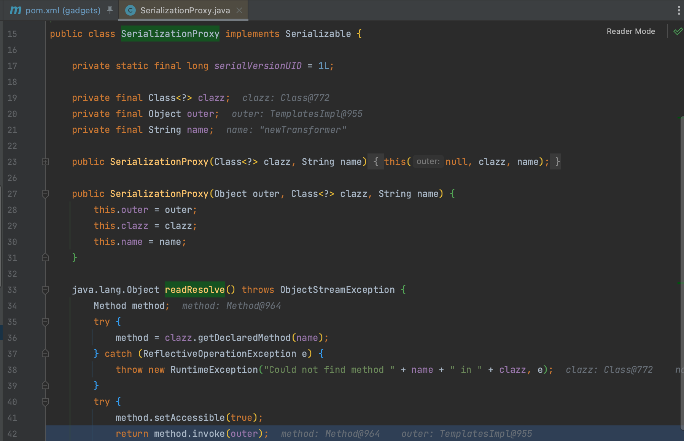

# Ceylon

Ceylon 是一种面向对象编程语言，旨在提供一种简洁、可读性强、可靠性高的编程语言，适用于企业级应用程序开发和大规模软件工程项目。

## 0x01 SerializationProxy

`com.redhat.ceylon.compiler.java.language.SerializationProxy` 是 Ceylon 编译器库中的一个类，用于处理序列化相关的任务。具体来说，它是 Ceylon 语言在 Java 平台上的序列化代理类，反序列化时将调用 `readResolve()` 方法来调用相应的 method。

