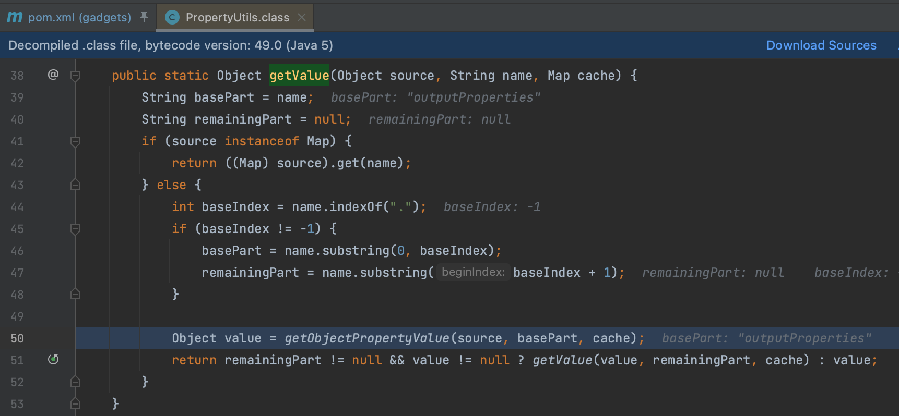
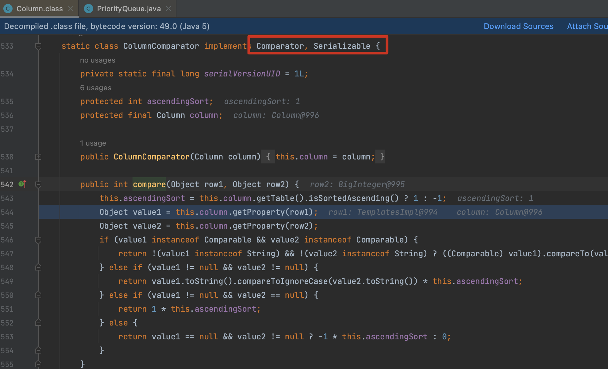

# Click

Click Framework 是一个用于构建基于 Java 的 Web 应用程序的开源框架，太老了，简单记录一下。

## 0x01 PropertyUtils

`org.apache.click.util.PropertyUtils.getValue()` 方法用于获取对象的属性值，调用的 getter 方法

`org.apache.click.control.Column.ColumnComparator` 实现了 `Comparator, Serializable` 这两个接口，很容易的联想到之前的分析。

