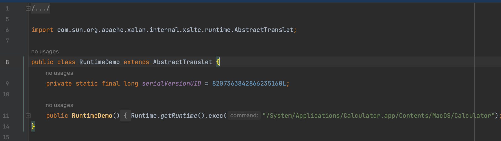
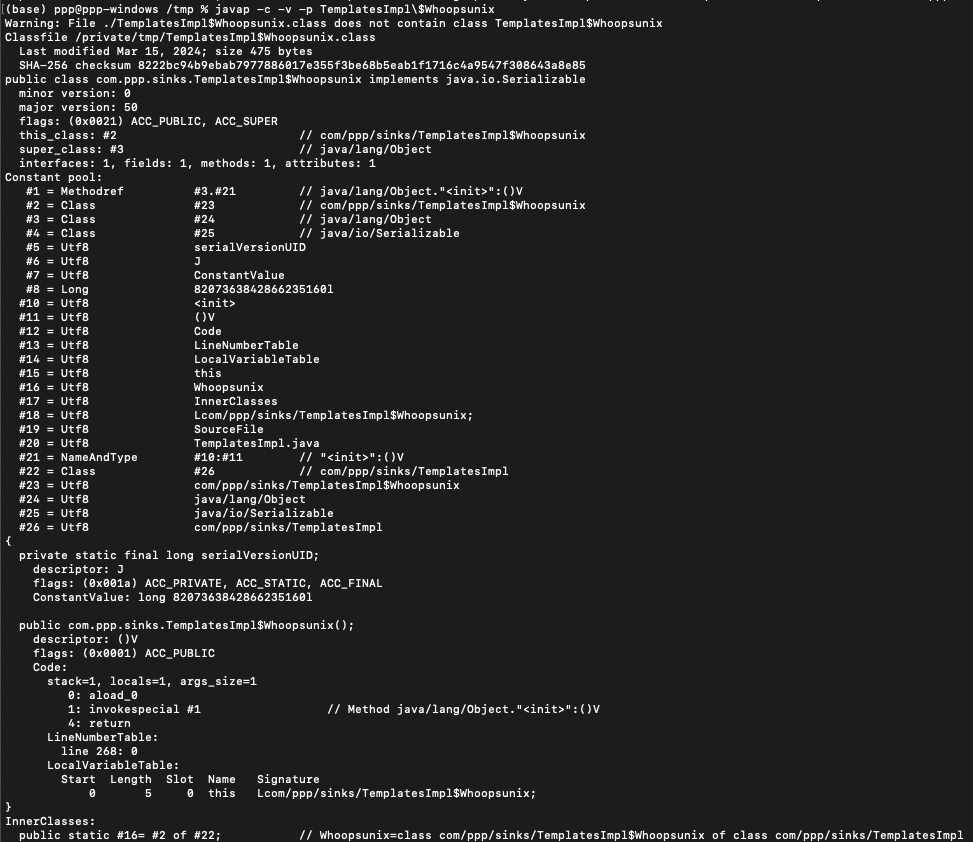
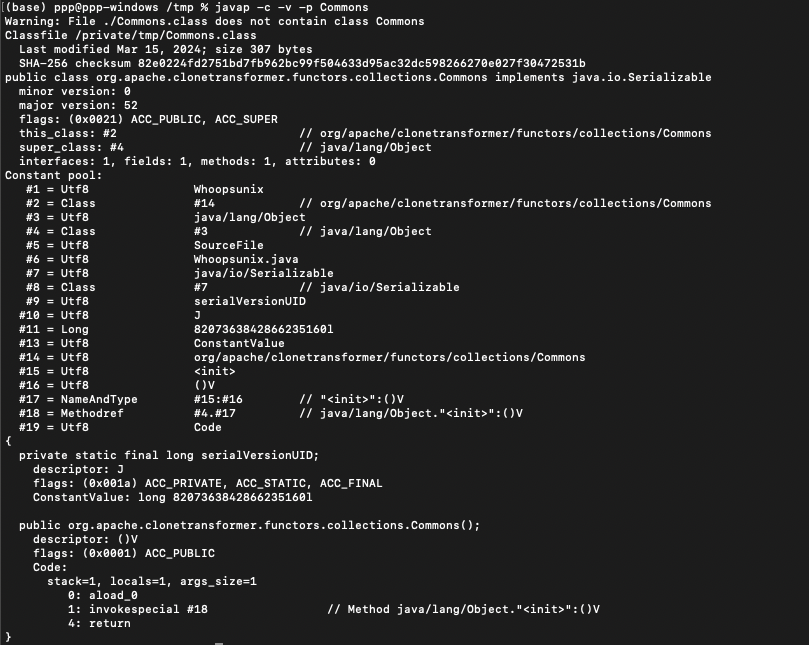
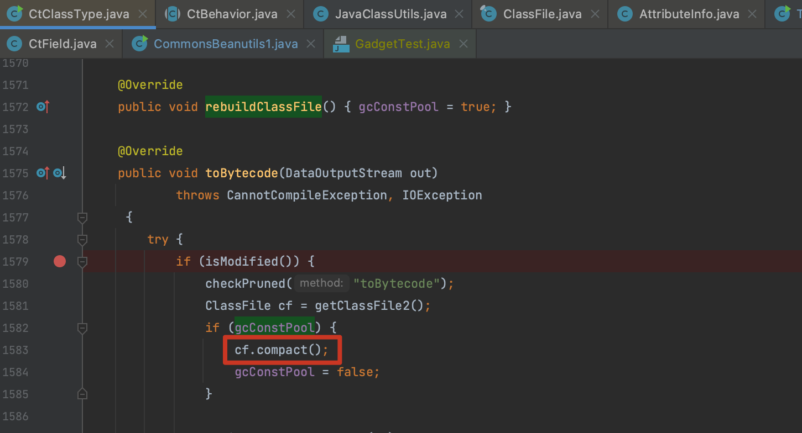
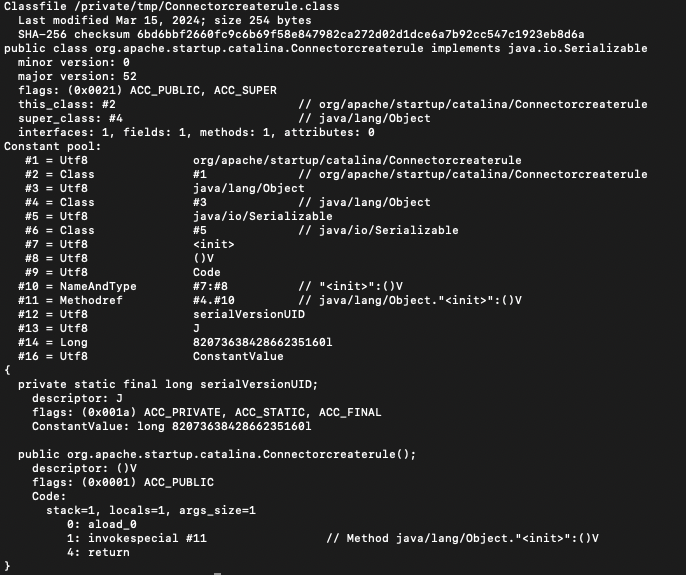

# JavaClass 生成优化

## 0x01 保留 AbstractTranslet

在 TemplatesImpl 分析文章中将 AbstractTranslet 移除，这在一定程度上将 payload 长度已经大幅减少了生成 payload 长度，以 CC3 为例，原始未改动 payload byte length: 3642，移除 AbstractTranslet 后 byte length: 2330。

但是 payload 其实只需要满足父类为 `AbstractTranslet` 这个条件，并不需要 `transform()` 方法，所以可以利用 javassist 直接添加父类，这种方式操作后  byte length: 2378

```java
CtClass superCtClass = pool.get(AbstractTranslet.class.getName());
ctClass.setSuperclass(superCtClass);
```



## 0x02 JavaClass 无用信息移除

以 ysoserial 生成 `_bytecodes` 为例，第二个无用 byte[] 是直接用 `classPool.getCtClass` 构建的。

```java
public static class Whoopsunix implements Serializable {
    private static final long serialVersionUID = 8207363842866235160L;
}

CtClass ctClass = classPool.getCtClass(className);
```

我们用 `javap -c -v -p TemplatesImpl\$Whoopsunix` 分析一下 JavaClass 结构，这里面有几个比较扎眼的信息

- #19 sourceFile 记录了该类对应的源文件名称
- 结尾的 InnerClasses
- 类名



### 修改类名、移除 InnerClasses

直接 `CtClass ctClass = classPool.getCtClass(className);` 读取的类还是存在 InnerClasses，干脆自己创建一个。

```java
ClassPool classPool = ClassPool.getDefault();
CtClass ctClass = classPool.makeClass("Whoopsunix");
ctClass.addInterface(classPool.get("java.io.Serializable"));
ctClass.addField(CtField.make("private static final long serialVersionUID = 8207363842866235160L;", ctClass));
```

当然还可以通过 `ctClass.setName(javaClassName);` 修改类名，这两个逻辑在实现工具化的时候被我拆开了，为了修改内存马等类名。



### 移除 SourceFile

JavaClass 中的一些无用信息也可以移除，比如源文件信息 SourceFileAttribute、行号信息 LineNumberAttribute，如果要修改信息必须先调用 `ctClass.rebuildClassFile()` 方法将 `gcConstPool` 属性值修改为 true，否则无法进入 `cf.compact()` 覆盖。



```java
// 移除类文件部分属性
ctClass.rebuildClassFile();
ClassFile classFile = ctClass.getClassFile();
// 源文件信息
classFile.removeAttribute(SourceFileAttribute.tag);
// 移除行号信息
classFile.removeAttribute(LineNumberAttribute.tag);
classFile.removeAttribute(LocalVariableAttribute.tag);
classFile.removeAttribute(LocalVariableAttribute.typeTag);
classFile.removeAttribute(DeprecatedAttribute.tag);
classFile.removeAttribute(SignatureAttribute.tag);
classFile.removeAttribute(StackMapTable.tag);
```
最后生成出来结果如下：



**参考**

> 终极Java反序列化Payload缩小技术 https://developer.aliyun.com/article/1160545
