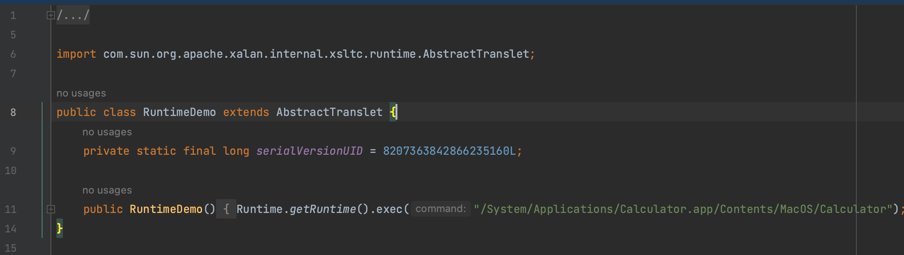

# ysoserial payload 缩短

## 0x01 Gadgets.createTemplatesImpl()

前文将 AbstractTranslet 移除，这在一定程度上将 payload 长度已经大幅减少了生成 payload 长度

以 CC3 为例，原始未改动 payload byte length: 3642


移除 AbstractTranslet 后 byte length: 2330


因为 payload 只需要满足父类为 `AbstractTranslet` 这个条件，并不需要 `transform()` 方法，所以利用 javassist 添加后  byte length: 2378



这时候如果不要 `AbstractTranslet`长度已经缩短到 byte length: 1555

ClassFile 中的一些无用信息也可以移除，比如移除行号信息 LineNumberAttribute、源文件信息 SourceFileAttribute，就再次降到 byte length: 1515

```java
// 移除类文件部分属性
ClassFile classFile = ctClass.getClassFile();
// 源文件信息
classFile.removeAttribute(SourceFileAttribute.tag);
// 移除行号信息
classFile.removeAttribute(LineNumberAttribute.tag);
classFile.removeAttribute(LocalVariableAttribute.tag);
classFile.removeAttribute(LocalVariableAttribute.typeTag);
classFile.removeAttribute(DeprecatedAttribute.tag);
classFile.removeAttribute(SignatureAttribute.tag);
classFile.removeAttribute(StackMapTable.tag);
```
**参考**

> 终极Java反序列化Payload缩小技术 https://developer.aliyun.com/article/1160545
>
