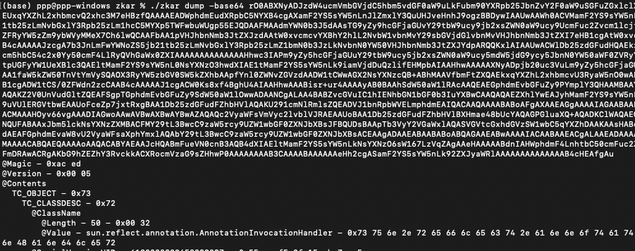
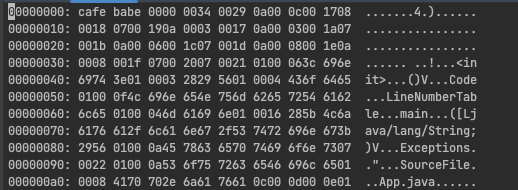
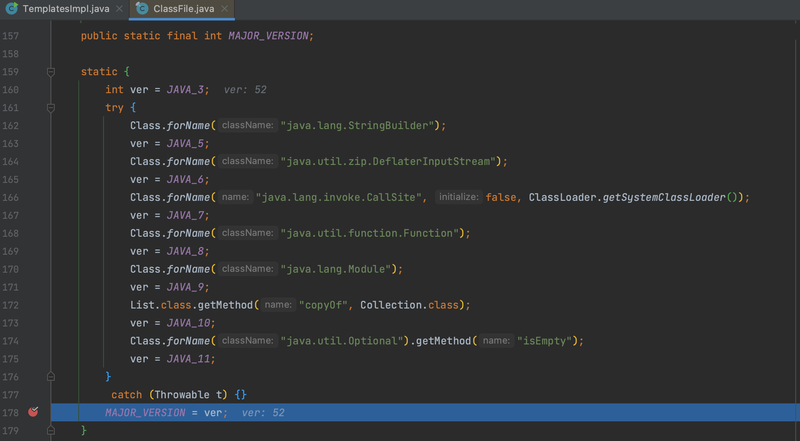

# javassist 生成 JavaClass 版本号问题

## 0x01 聊聊序列化

在序列化 payload 时如果编码为 base64 ，那么对于 `rO0AB` 开头的字符就一定不会陌生。

我们用 [zkar](https://github.com/phith0n/zkar) 对一个序列化数据进行分析，可以看到是以 `AC ED 00 05` 开头，base64 编码后就为 `rO0ABxxx` 开头的字符，所以在检测序列化数据时，这个也通常作为很多设备的检测标准之一，那种检测到 `rO0AB` 就直接拦截的设备就真的非常不讲武德。具体序列化流的解读可以跳转 [JDK8u20](/docs/01-PPPYSO/01-gadgets/06-JDK/JDK8u20/JDK8u20.md) 的分析。



base64 编码时会把数据分成固定块再编码，就涉及到不同分组情况的编码，但实际上除了 `rO0AB` 我还没见到过其他种类的

```
Base64加密的可能情况（base64将3字节转换为4字节3×8bit=4×16bit）：
AC ED 00 05在开头，按3，1分组ACED00=>rO0A，05xxxx=>BXXX 结果rO0ABxxx 特征：rO0AB
AC ED 00 05在中间，按2，2分组xxACED=>xxzt, 0005xx=>AAxx, 结果xxztAAxx 特征：ztAA
AC ED 00 05在中间，按1，3分组xxxxAC=>xxxs, ED0005=>7QAF 结果xxxs7QAF 特征：s7QAF
```

## 0x02 JavaClass

Java 字节码文件（Java Class File）是由 Java 编译器生成的一种二进制文件格式，包含了编译后的 Java 类的字节码，保存在 `.class` 扩展名的文件中，最后交由 JVM 执行。



`ca fe ba be` 这四个是固定的，用于标识该文件为字节码文件，`00 00 00 34` 用于指示版本号，以及该字节码是否兼容当前运行的 JVM，34 代表是 JDK8。

## 0x03 payload 版本差异

而 javassist 调用 `ClassPool.getDefault()` 方法时，会计算当前运行的 JVM 版本，所以会生成 JDK 8，解决办法也很简单，直接修改刚刚说到的第八个字节为 JDK 6

```java
byte[] classBytes = ctClass.toBytecode();
classBytes[7] = 50;
```


