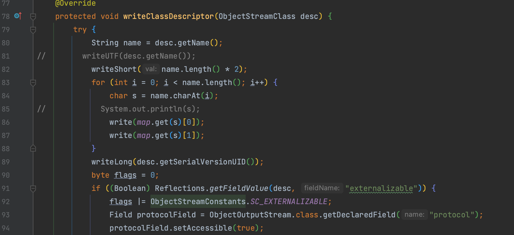
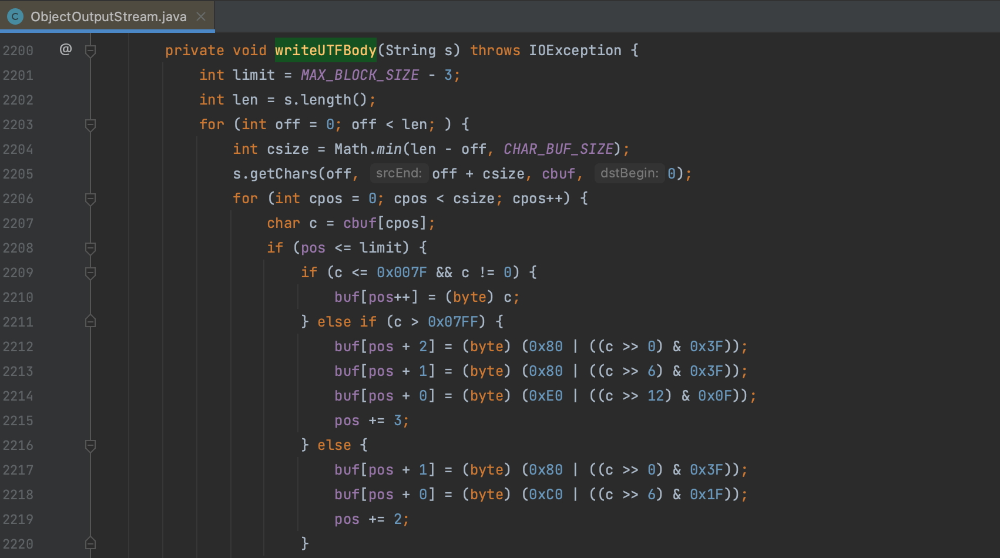
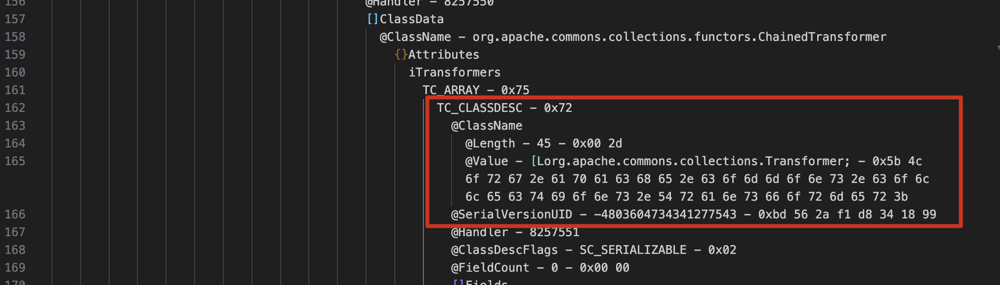
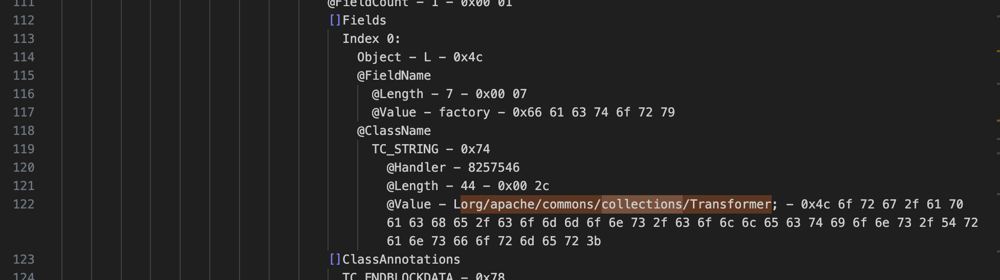
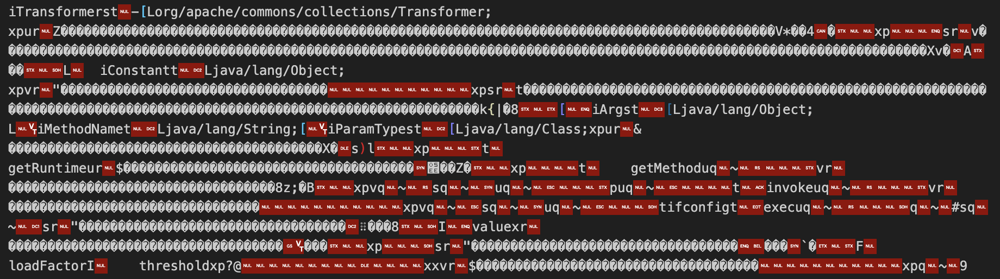
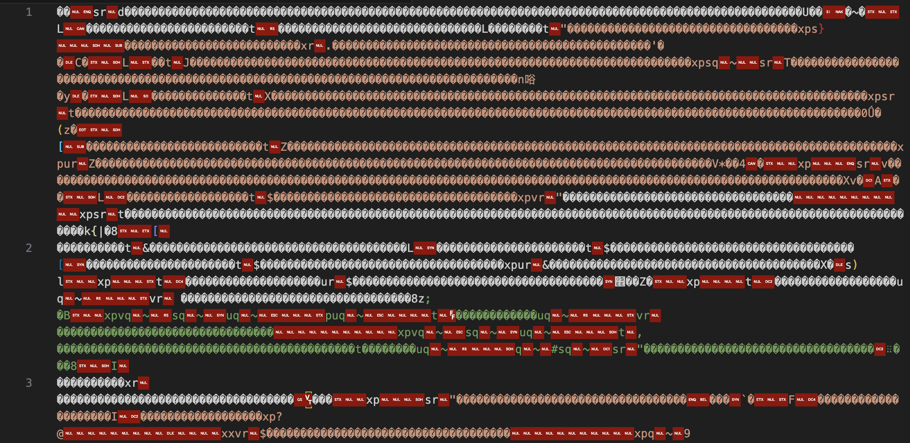
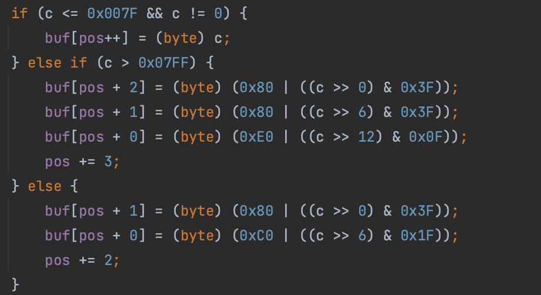
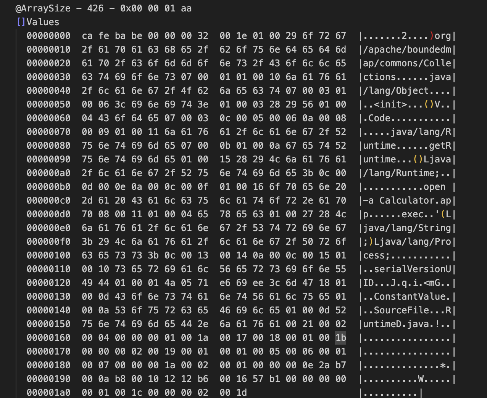
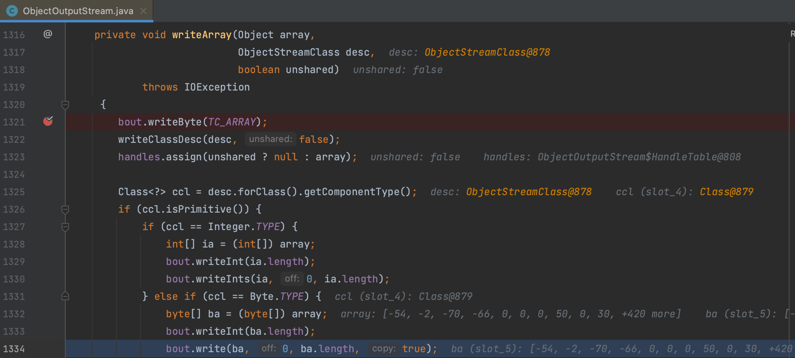
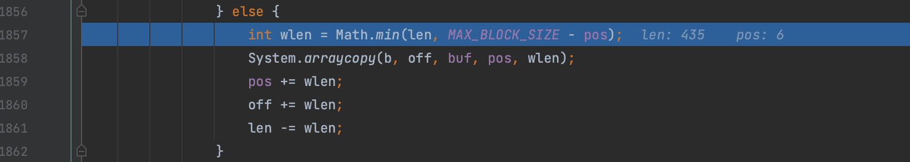

# 原生序列化 UTF 混淆

周末看了下 1ue 师傅 探索Java反序列化绕WAF新姿势 这篇文章想把这个 trick 实现到自己的工具里，分析了一下实现了一个算法直接加密原始数据。Demo 见 GitHub  https://github.com/Whoopsunix/utf-8-overlong-encoding

## 0x01 原来的思路

文章介绍了对 `java.io.ObjectOutputStream.BlockDataOutputStream#writeUTFBody()` 方法的应用来混淆序列化数据 ，给出的 Demo 重写了 `ObjectOutputStream` 类，自实现了一个 `writeClassDescriptor()` 方法来编码。

这样子编码不全，对序列化数据进行分析可以看到只对 TC_CLASSDESC 进行了处理

像 Filed 信息仍是明文，这个特征依旧明显

原本的思路还是和文章一下重写 `ObjectOutputStream` 类来做，实操了一下很多东西调用不到，反射写起来很麻烦，重写 `writeObject()` 权衡了一下不如直接对 JDK 下手。然后想了想序列化数据流其实是有强特征的，理论上可以识别原始序列化数据中这些强特征来加密，理论可行实践开始。

## 0x02 选择特征比较明显的标记加密序列化数据

用 zkar 分析后选取了几个存在重要特征的标记，将序列化函数里的编码逻辑提出来直接加密序列化后的字节码也是一样的效果。：

1.  `TC_CLASSDESC` : 用于描述一个类的结构，包括类的名称、序列化版本号、类的字段等信息
2.  `TC_PROXYCLASSDESC` : 用于描述一个代理类的结构，与TC_CLASSDESC类似，但用于描述动态代理类的结构
3.  `TC_STRING`  : 表示接下来的数据是一个字符串
4.  `TC_REFERENCE` : 表示一个对象引用

经过处理后可以看到特征基本上都被去掉了。

加密算法比较简单，稍微改动一下三字节的也同样可以写出来。

## 0x03 剩下的的信息

第二步思路已经可以将序列化时本身的信息处理干净了，但是用 CC2 生成的 payload 还是有明显特征，这部分信息通过 `TC_ARRAY` 来标识，存储的是我们生成的恶意 JavaClass 字节码，这部分的混淆就与很多例子了，这里不过多展开。

简单跟进一下 `java.io.ObjectOutputStream.writeArray()` 这个方法，可以看到命中 `Byte` 类型后直接调用 `java.lang.System#arraycopy()` 写入的，没有额外的编码操作。

**参考**

> 序列化流程分析总结  https://www.cnpanda.net/sec/893.html
