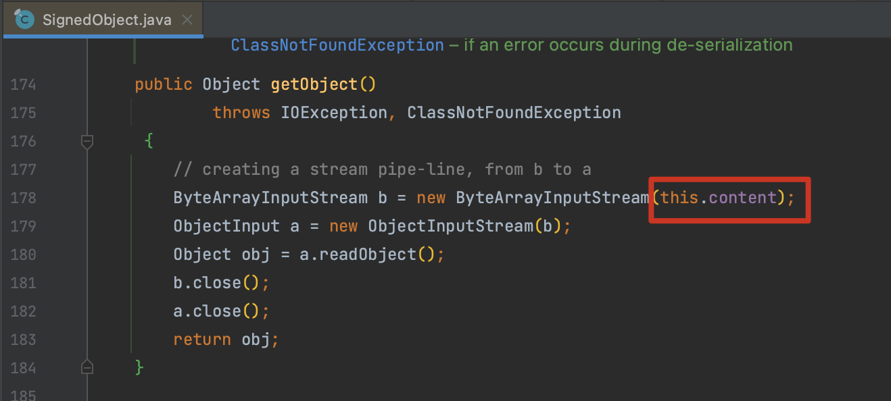
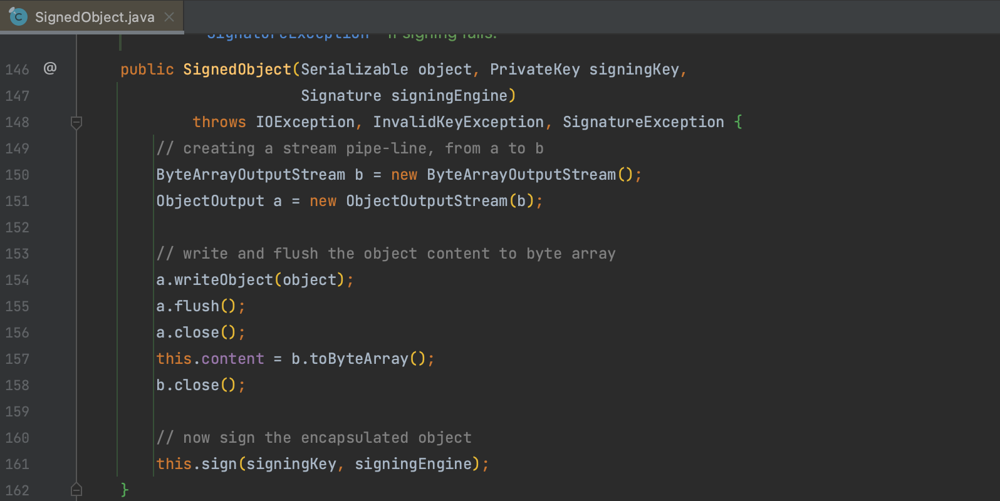
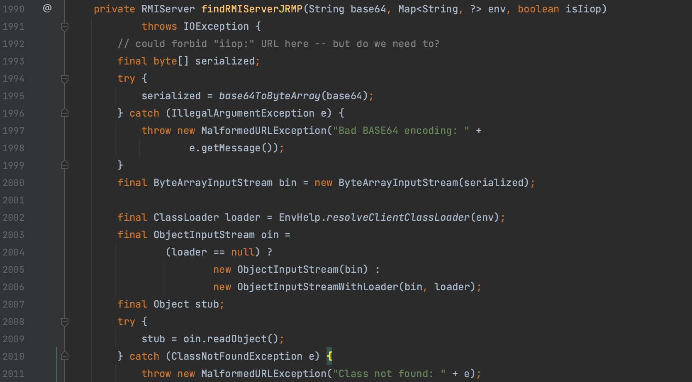
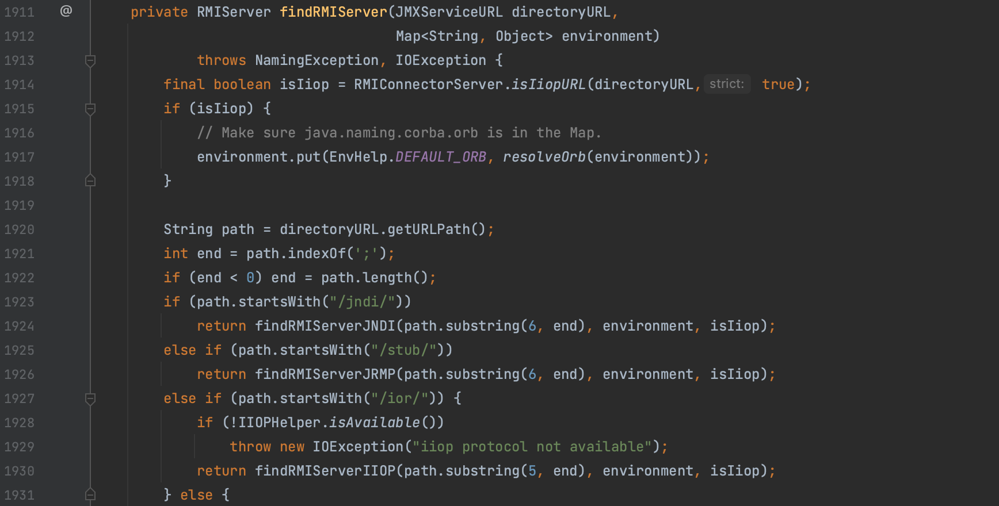
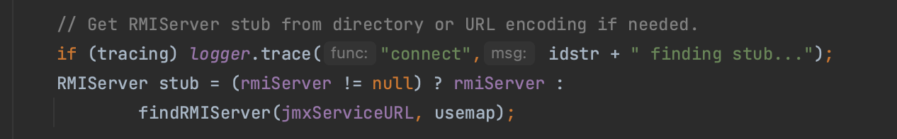
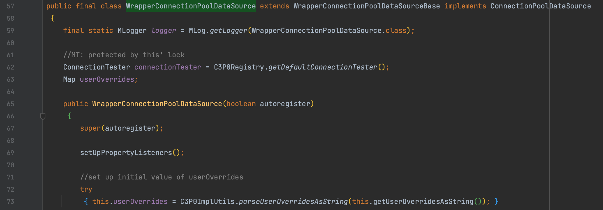
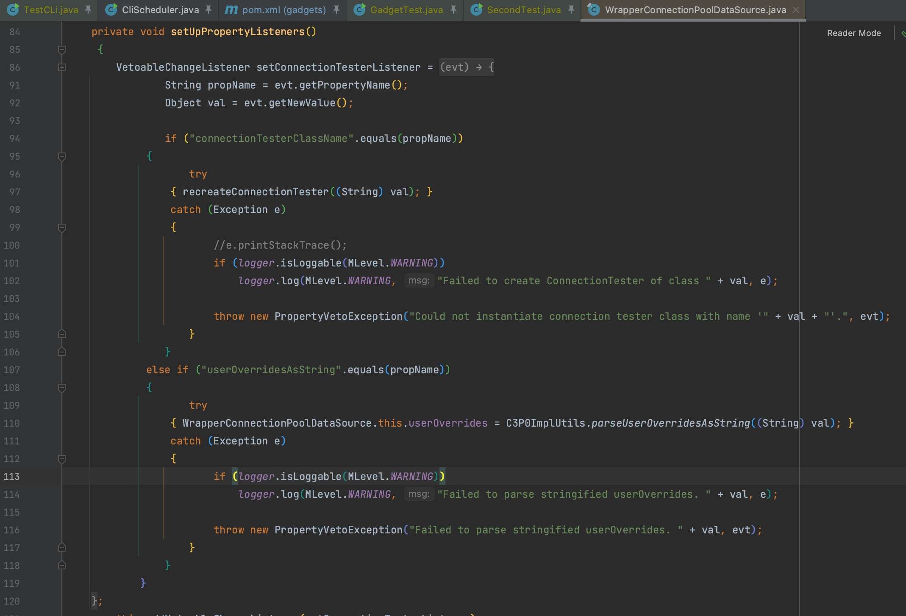
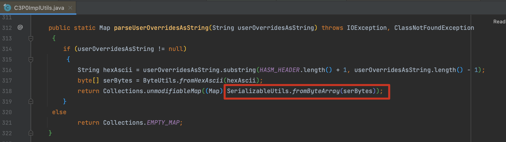
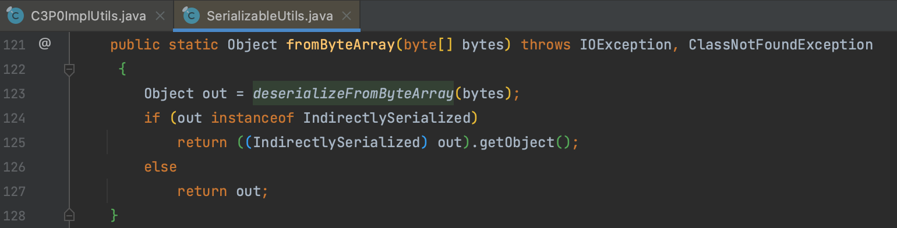

# 二次反序列化

二次反序列化简单来说就是在一次反序列化的中包含了另一个需要反序列化的对象，而包含对象并没有用重新实现的含有黑名单的 `ObjectInputStream` 处理，从而形成绕过。

## 0x01 SignedObject

`java.security.SignedObject` 的 `getObject()` 方法会对 content 对象进行一次反序列化，



构造方法对 content 赋值，所以只需要寻找一个能调用 getObject() 的方法就能触发二次反序列化，很容易就想到通过 `toString()` 方法触发到 getter ，所以引出 fastjson、ROME 等的利用。



## 0x02 RMIConnector

`javax.management.remote.rmi.RMIConnector` 类存在一个 `findRMIServerJRMP()` 方法将传入的 base64 字符串解码后反序列化。



而在 `findRMIServer()` 方法中调用了该方法，要求以如下字符开头



而在 `connect()` 方法中也调用了改方法，要求 rmiServer 为 null



刚好存在一个符合条件的方法


与 `SignedObject` 不同，这个比较苛刻，需要任意方法调用来触发 `connect()` 方法，如果用 `InvokerTransformer` 来实现的话，那就只适用于存在 `TemplatesImpl` 黑名单的情况，而这个是比较矛盾的，因为 `InvokerTransformer` 本身就已经是一个利用方法。

实际的场景中，可以寻找应用是否存在一个类调用了 connect 方法，多见于数据库操作。不过话说回来真不如直接打 jmx jndi

```java
JMXServiceURL jmxServiceURL = new JMXServiceURL("service:jmx:rmi://");
setFieldValue(jmxServiceURL, "urlPath", "/stub/rO0ABXNyA");
```

## 0x03 WrapperConnectionPoolDataSource

`com.mchange.v2.c3p0.WrapperConnectionPoolDataSource` 类的构造方法中中存在一个 `setUpPropertyListeners()` 方法调用了 `com.mchange.v2.c3p0.impl.C3P0ImplUtils.parseUserOverridesAsString()` 



需要注意这里有个判断要求符合 userOverridesAsString ，所以构建时需要形如 `HexAsciiSerializedMap:%s;`



最终调用到 `com.mchange.v2.ser.SerializableUtils.fromByteArray()` 执行反序列化





然后就是要找怎么去触发该类的构造方法，并且还能给 `userOverridesAsString` 字段赋值，搜了一圈都集中在用 fastjson 来触发，埋个坑之后来看看。

```java
String hex = Serializer.serializeHexAscii(object);
WrapperConnectionPoolDataSource source = new WrapperConnectionPoolDataSource();
//        source.setUserOverridesAsString(String.format("HexAsciiSerializedMap:%s;", hex));
Reflections.setFieldValue(source, "userOverridesAsString", String.format("HexAsciiSerializedMap:%s;", hex));
```

