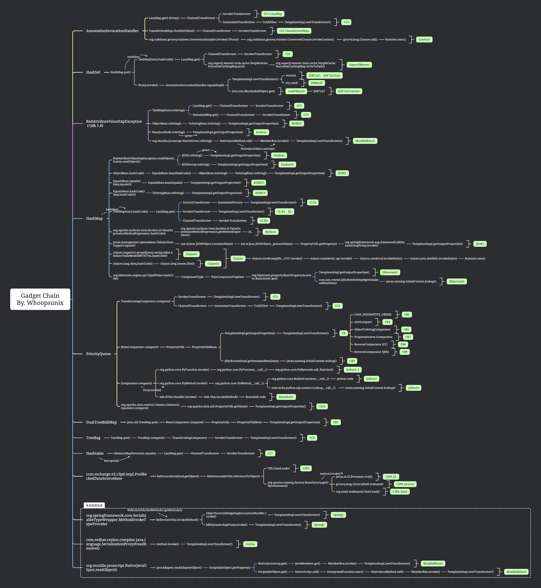

# PPPYSO

该篇章为 Java 反序列化相关分析文章，分析时会按照 [Marshalling Pickles](https://www.slideshare.net/frohoff1/appseccali-2015-marshalling-pickles) 中提到的 gadget chain 概念，将 [ysoserial](https://github.com/frohoff/ysoserial) 原先的调用链拆分为入口点 (kick-off), 触发点 (sink)，其余为中间的调用链 (chain) 来分析。

具体工具化实现跳转 [PPPYSO](https://github.com/Whoopsunix/PPPYSO)

附一张调用链图

