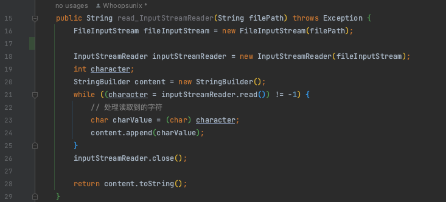
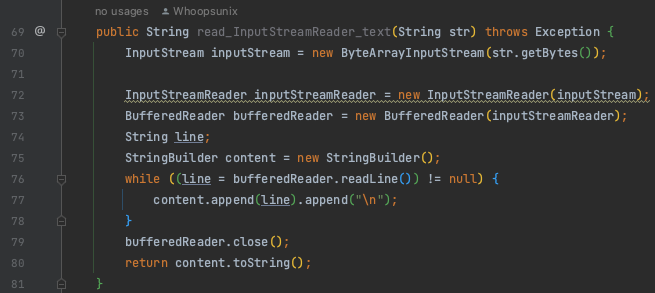
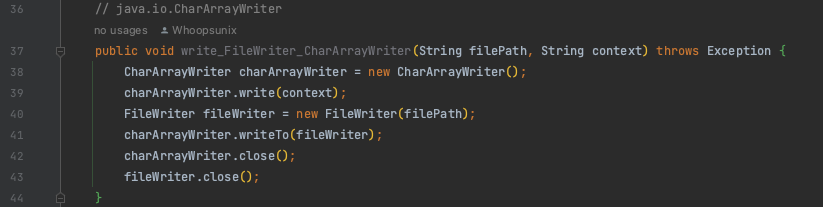
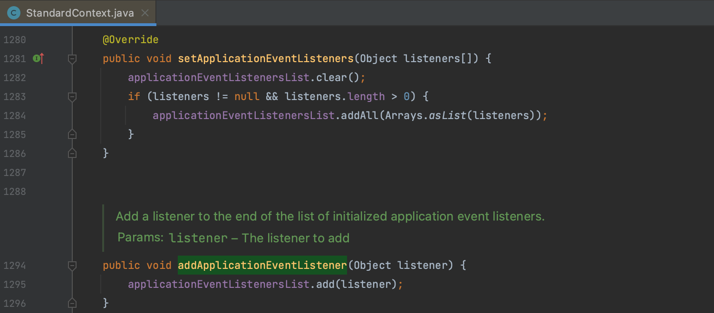

# RASP 绕过 Trick

RASP 越来越多了，应用最多的是 Java 场景，其他语言大多是用的 c 实现了类似功能不参与讨论。从 [JDK 1.5](https://docs.oracle.com/en/java/javase/11/docs/api/java.instrument/java/lang/instrument/package-summary.html) 开始，Java 提供了一种动态代理机制，允许代理检测在 JVM 中运行的服务，通过插桩的方式修改方法的字节码。简单来说就是 hook 系统的关键函数实现防护，通常将这类函数称为 Sink 点，参数来源函数称为 Source 点，产品形态决定了其在绕过思路上与 WAF 这类产品有很大的不同，举一些例子：

以 ysoserial 生成的 pyaload 为例，需要考虑两种类型漏洞的绕过 反序列化+命令执行，更复杂的攻击方式比如 JNDI 从检测顺序来看会经过 SSRF、JNDI、反序列化、RCE 等算法的检测，所以实际攻击时是需要灵活变换思路与之对抗的，并不是 "一键 RCE" 模式的 bypass 套路。

本文旨在介绍一下 RASP 这个产品是什么？实现时有什么通用问题？以及存在的绕过 Trick，所以不针对某个产品，交流为主。

之后关于 Hook 点的研究会同步到 [PPPRASP](https://github.com/Whoopsunix/PPPRASP) 项目中，漏洞 Demo 见 [JavaRce](https://github.com/Whoopsunix/JavaRce) 项目

## 0x01 与 WAF 不太一样的参数绕过

先从最熟悉的 WAF 开篇，WAF 主要分析流量中的特征来过滤攻击，防护能力很大程度上依赖于特征库，所以一直以来关于 WAF 都存在着各种花式绕过，对于 SQL 注入、xss 有很大一部分 payload 在 RASP 场景下仍然适用，这里先介绍一下 RASP 处理参数的优缺点

1. 优点：RASP 能获取到最终 Sink 函数真实传入的参数，只要够底层，前面的各种编码绕过都是无效的。
2. 缺点：无法关联到具体的 Source 参数，严格来说这并不是一个完全不能解决的问题，毕竟还有另一个类似的产品 IAST ，但这确实也是 RASP 形成差异化的关键点。

因为有第二点问题的存在，RASP 通常会检测进入 Sink 函数的参数。以 SQL 注入为例，因为可以拿到最终的 sql 语句，所以会引入选用词法、语法分析引擎进行处理，分析 sql 语句的结构是否因为用户输入而改变。但是这类引擎能力不会很强（性能损耗考虑），所以引出了破坏引擎分析结果的绕过思路，这部分绕过建议看 Glassy 师傅的文章 [突破语义分析的黑魔法](https://mp.weixin.qq.com/s/Co_PPJ79azyyolBu07Qz_g) 讲的很详细，测试了几个引擎后发现效果很好。

## 0x02 从命令注入代入 RASP 视角

RASP 是怎么防护命令执行的呢？跟进 `Runtime.exec()` 方法，底层是 `ProcessBuilder` 再底层 `ProcessImpl` 更底层的 `forkandexec` 方法在早两年前是很有效的绕过思路，当时的 RASP 产品并没有 hook native 方法，目前基本都已经跟进 Hook 了。

另一个思路就是通过开启一个线程来执行命令，导致 RASP 失去该上下文堆栈的分析数据，使得算法失效， [JRASP](https://github.com/jvm-rasp/jrasp-agent) 提供了解决思路，通过 `java.lang.InheritableThreadLocal`类在父线程创建子线程时，向子线程传递变量。

这俩方法似乎都已失效，但给我们提供了 RASP 绕过的两个方法论：

1. 寻找难以覆盖的 hook 点
2. 构造在上下文堆栈中难处理的代码

## 0x03 寻找难以覆盖的 hook 点 - 输入输出流

Java 提供了多种输入输出流的类和接口，主要是为了适应不同的输入输出需求和数据类型场景，根据需求可以大致的分类出以下情况：

1. 数据类型差异：字节流（Byte Stream）和字符流（Character Stream）
2. 性能优化：缓冲输入输出流（如 `BufferedInputStream` 和 `BufferedOutputStream`）
3. 数据去向：文件、网络套接字、内存、管道
4. 标准化和扩展：Java 支持扩展性，允许开发人员创建自定义的输入输出流来满足特定需求

比如这两个例子中都使用了 InputStreamReader 来读取文件，并且污染参数都为传入的 String 类型参数，未经处理直接 hook 的话在应用运行时将产生大量的误报，这是在生产环境中不可接受的误拦截。比如 Tomcat 等中间件在创建页面时就用到的 InputStream 执行类似的读写操作。

正是由于输入输出流的难处理，给了我们很大的操作空间，比如 CharArrayWriter 这个类，我们看到将文件路径 path 和内容 context 都通过 java.io.Writer 的实现类进行封装，然后对这两个流进行操作，这种情况下会发生多重引用的问题，如果没有特殊处理就会丢失文件内容。

还有哪些操作用到了流处理吗？线程 -> 管道也同样可以读写文件，具体代码见 [JavaRce](https://github.com/Whoopsunix/JavaRce) 项目。

## 0x04 构造在上下文堆栈中难处理的代码 - Filed 的运用

构造在上下文堆栈中难处理的代码算是一个比较复杂的利用，需要对 RASP 技术比较了解，介绍一个比较简单的且能在工具化时用到的 Trick。

以 Tomcat 环境下注入 Listener 内存马为例，大多数demo都直接用的 `org.apache.catalina.core.StandardContext#addApplicationEventListener()` 方法添加恶意对象，实际上可以通过反射获取 `applicationEventListenersList` 数组添加恶意对象。这时候我们调用的 `List.add()` 就是再正常不过的操作，并且集合操作广泛存在于应用中，通常不会作为 hook 点存在，因此规避算法。

当然内存马不是一个单独存在的漏洞，需要配合反序列化、远程加载等漏洞，并且如果只是最基本的执行命令的内存马同样会被检测，可以用代理内存马，寻求内网突破或者配合第三点中介绍的的写入文件。

### 防护思路

既然提到可以利用 Filed 的绕过这个问题，也讲一下防护思路叭。其实很简单，内存马本质就是加载了一个恶意类，所以可以将防护思路转移到类加载检测上，比如检测是否来自敏感 classloader 调用、是否存在本地 class 文件。
