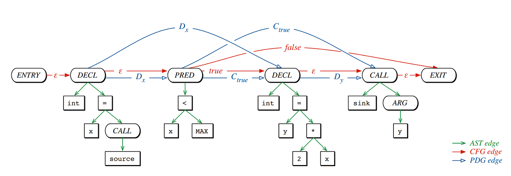
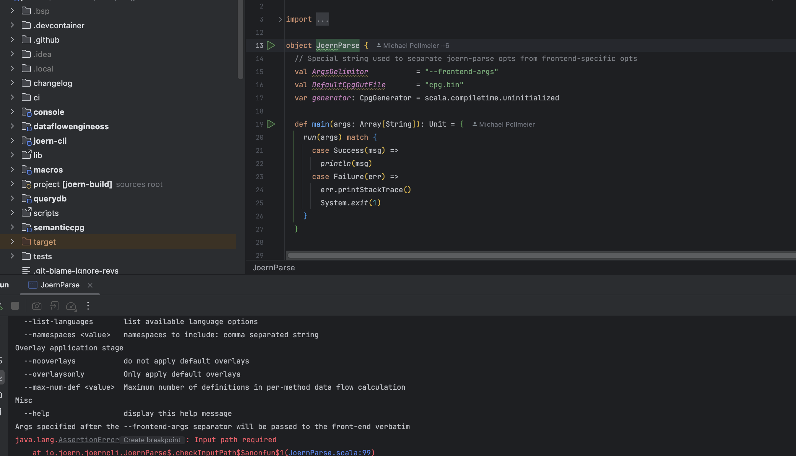
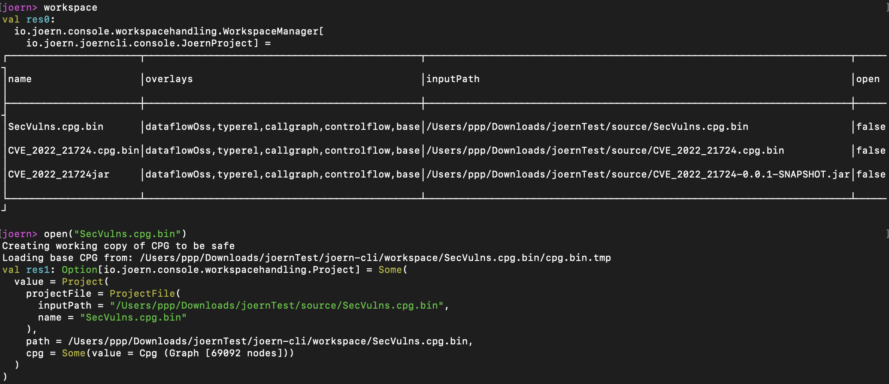
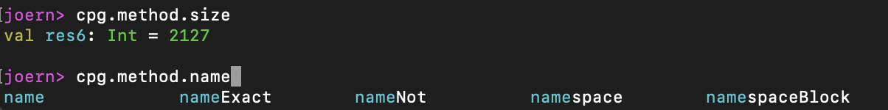
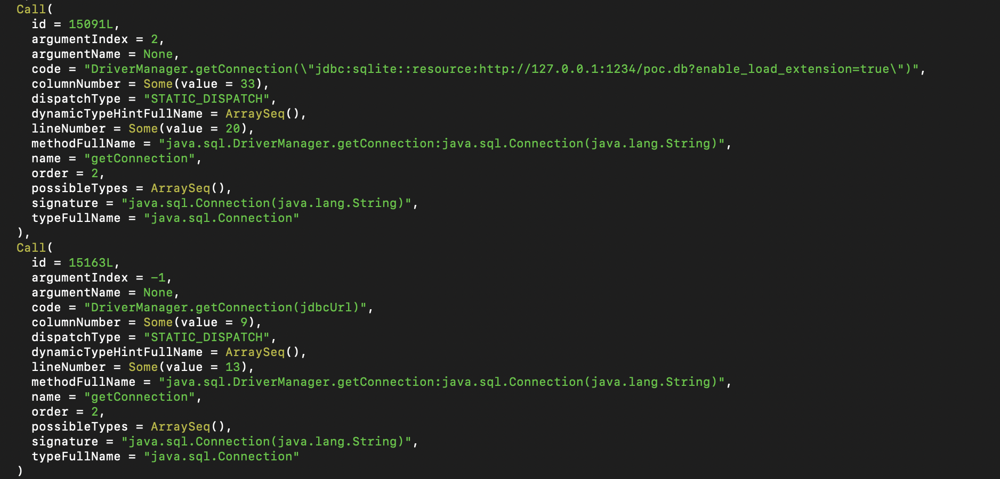

# joern 入门篇 (一)

## 关于 joern

[joern](https://github.com/joernio/joern) 是基于 CPG 的一种代码分析框架，这篇文章从应用的角度来了解一下 joern，概念的东西会放参考链接就不赘述。

> 关于 joern 的设计理念可以现看看作者是怎么说的
>
> https://blog.shiftleft.io/semantic-code-property-graphs-and-security-profiles-b3b5933517c1?gi=e675bb96e6b1
>
> https://github.com/joernio/workshops/blob/master/2021-RSA/RSA-LAB2-R08.pdf

## CPG

joern 引入 CPG(Code Property Graph) 作为代码的处理结构，将 AST + CFG + PDG 合并而来表示同一程序的复杂行为。



更多的可以看官方基础理论 https://blog.shiftleft.io/why-your-code-is-a-graph-f7b980eab740

joern cpg

- https://cpg.joern.io/
- https://github.com/ShiftLeftSecurity/codepropertygraph


## start

### 安装

快速安装

```
wget https://github.com/joernio/joern/releases/latest/download/joern-install.sh
chmod +x ./joern-install.sh
sudo ./joern-install.sh
joern
```

考虑到需求手动安装

```
下载 joern-cli  https://github.com/joernio/joern/releases
JDK21
brew install coreutils
```

### 二开

1. [sbt](https://www.scala-sbt.org/download/) 、JDK、maven、idea scala插件 等基础环境配置
2. `git clone https://github.com/joernio/joern.git`
3. 项目根路径 `sbt stage` （挂个 Proxy
4. idea 打开，选择 BSP 项目
5. 运行 `io.joern.joerncli.JoernParse` 成功，配置完成



#### 记录

```
交互入口  io.joern.joerncli.console.ReplBridge
```

### 资料

> 基于OverflowDb的查询语言 https://queries.joern.io/
>
> 关键字含义  https://docs.joern.io/cpgql/reference-card/

## 从 demo 入手

以 [JavaRce](https://github.com/Whoopsunix/JavaRce) 项目为例来熟悉 joern ，inputPath 设置源码路径，可绝对或者相对路径，projectName 设置工程名

```
importCode(inputPath="/JavaRce/SecVulns",projectName="SecVulns")
```

也可以先生成 CPG 图后再导入查询

```shell
# 生成 cpg 需要选择解压后的目录
./javasrc2cpg -J-Xmx2048m /Users/ppp/Documents/pppRepository/github_file/JavaRce/SecVulns --output ../source/SecVulns.cpg.bin

# 导入 cpg
importCpg("../source/SecVulns.cpg.bin")
```

设置好后可以通过 `workspace` 命令查看工程， `open("SecVulns.cpg.bin")` 打开工程，cpg 变量即代码的 CPG。`close` 关闭工程



在输入时可以通过 tab 键补全命令



我们先来看一个最简单的 JDBC 反序列化

```java
import java.sql.Connection;
import java.sql.DriverManager;

public static void connect(String jdbcUrl) throws Exception{
    Class.forName("org.h2.Driver");
    Connection connection = DriverManager.getConnection(jdbcUrl);
}
```

我们知道漏洞是出在 `getConnection()` 的 URL 参数可控，所以可以通过 `cpg.call.name("getConnection")` 提取所有方法名为 `getConnection` 的方法，姑且将其当为 sink 点，查询结果中可以看到有两个结果，还有不可控的的 sql 注入连接语句。所以我门还需要再找到 Source 点



以 Springboot2 为例，可以直接获取具有形如 `@xxxMapping` 的注解方法，这里以 `request.getParameter("")` 的情况为例。

```scala
cpg.method.where(_.annotation.name(".*Mapping")).parameter
```

之后就是数据流分析，可以用 joern 提供的 [reachablebyflows](https://docs.joern.io/cpgql/data-flow-steps/#reachablebyflows) 来做，所以最后可以通过如下语句查询

```scala
def source = cpg.method.where(_.annotation.name(".*Mapping")).parameter
def sink = cpg.call.name("getConnection")
sink.reachableByFlows(source).p
```

sink 点还可以写的复杂一点，限定参数类型来规避一些非 SQL 的同名方法。

```scala
def sink = cpg.call.methodFullName("java.sql.DriverManager.getConnection.*").typeFullName("java.sql.Connection")
```


## joern 命令记录

官方文档  https://docs.joern.io/traversal-basics/

todo 做个 xmind

```sh
# 设置最大内存

# 生成 cpg 需要选择解压后的目录
./javasrc2cpg -J-Xmx2048m /Users/ppp/Documents/pppRepository/github_file/JavaRce/SecVulns --output ../source/SecVulns.cpg.bin

# 导入 cpg
importCpg("../source/SecVulns.cpg.bin")

# 获取工作目录位置
## 可以删除错误的 workspace
workspace.getPath

# 获取方法
cpg.method.take(1).l

# 运行 scala 脚本
./joern --script /Users/ppp/Documents/pppRepository/github_file/JavaRce/joern/joern.sc --param cpgFile=../source/SecVulns.cpg.bin --param outFile=../source/output.log
```


**参考**

> https://lorexxar.cn/2023/08/21/joern-and-cpg


