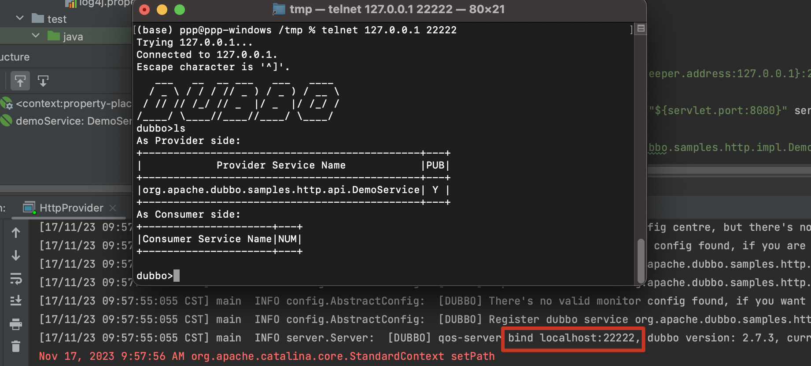
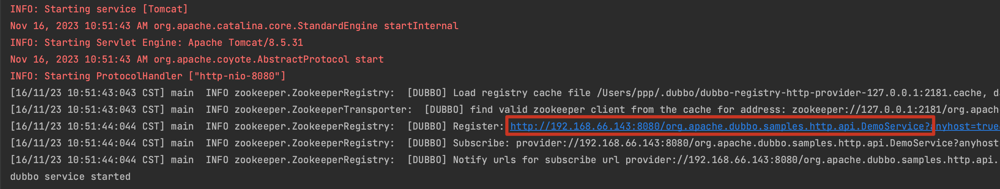
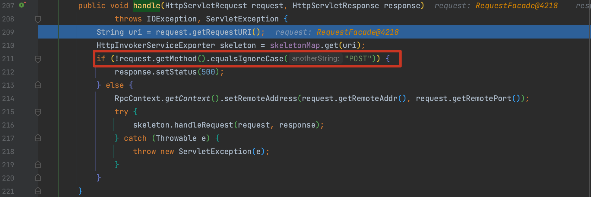
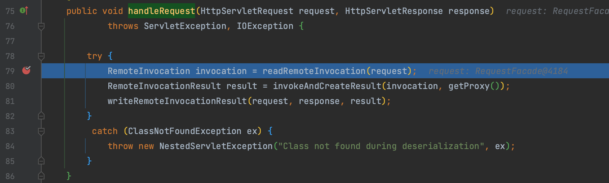
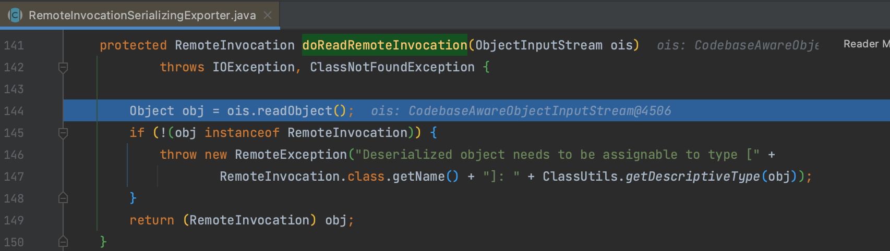
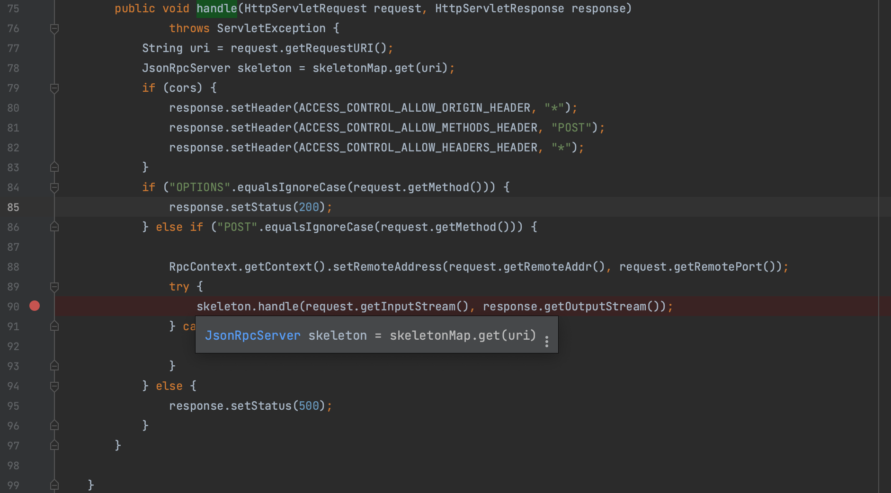

# CVE-2019-17564 Apache Dubbo Provider http协议反序列化漏洞

## 概述

### 影响版本

2.5.x、[2.6.0, 2.6.7]、[2.7.0, 2.7.4]

## 复现分析

dubbo 启动时可以看到我们定义的 service 接口 `org.apache.dubbo.samples.http.api.DemoService` ，这个接口可以通过 Dubbo 的调试接口中得到

直接访问该接口返回 500 响应。

`org.apache.dubbo.remoting.http.servlet.DispatcherServlet` 是 Dubbo HTTP 协议中的一个关键类，用于处理 HTTP 请求，其中的 `service()` 方法用于处理 http 请求，我们对该方法打断点。发送请求后来到 `org.apache.dubbo.rpc.protocol.http.HttpProtocol.InternalHandler#handle()` 方法，非 POST 请求会返回 500 ，所以重新构造请求。

进入 `org.springframework.remoting.httpinvoker.HttpInvokerServiceExporter#handleRequest()` 方法，通过 `org.springframework.remoting.httpinvoker.HttpInvokerServiceExporter#readRemoteInvocation()` 处理 request。

接着调试到 `org.springframework.remoting.rmi.RemoteInvocationSerializingExporter#doReadRemoteInvocation()` 方法，对传入的数据进行反序列化。dubbo 默认引入了 jackson，所以直接构造 jackson 反序列化 payload。

## 补丁

补丁也比较简单，针对 `org.apache.dubbo.rpc.protocol.http.HttpProtocol.InternalHandler#handle()` 的修复，将 `org.springframework.remoting.httpinvoker.HttpInvokerServiceExporter` 替换为 `com.googlecode.jsonrpc4j.JsonRpcServer`

