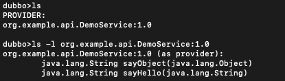

# CVE-2020-11995 Apache Dubbo 代码问题漏洞 GHSL-2021-034

## 2.7.7 补丁问题

2.7.7 对于 CVE-2020-1948 的修复方式存在问题，可以看看关于此问题的 [讨论](https://github.com/apache/dubbo/pull/6374?spm=a2c4g.11174386.n2.5.7f583df8HvMqiA) ，DecodeableRpcInvocation 新增的入参校验方法 `RpcUtils.isGenericCall()` 和 `RpcUtils.isEcho()` 存在绕过，通过修改 methodName 值为 `$invoke、$invokeAsync、$echo` 中的任一个来绕过。

## 补充说明

关于这个问题还要再说一下，如果我们已知服务端存在一个接口是参数格式，比如这里接收 Object 参数。那么我们可以按照这个格式构造请求 sayObject 接口。只要方法调用入参完全符合接口声明的情况下就能获取到 pts 值，也就不存在对于 `RpcUtils.isGenericCall()` 方法的调用。

这个补丁做的事情其实只是对还原对象这个过程进行处理，它无法检测对象本身所携带的信息是否恶意，所以之后也在 `com.alibaba.com.caucho.hessian.io.ClassFactory#load()` 方法中引入了类黑白名单机制。

## 有问题的补丁

看了一下其他的分析文章，说是因为增加了如图这个额外处理不能利用

但是 `$echo` 这个情况似乎也不是很难满足，所以有搞头！

