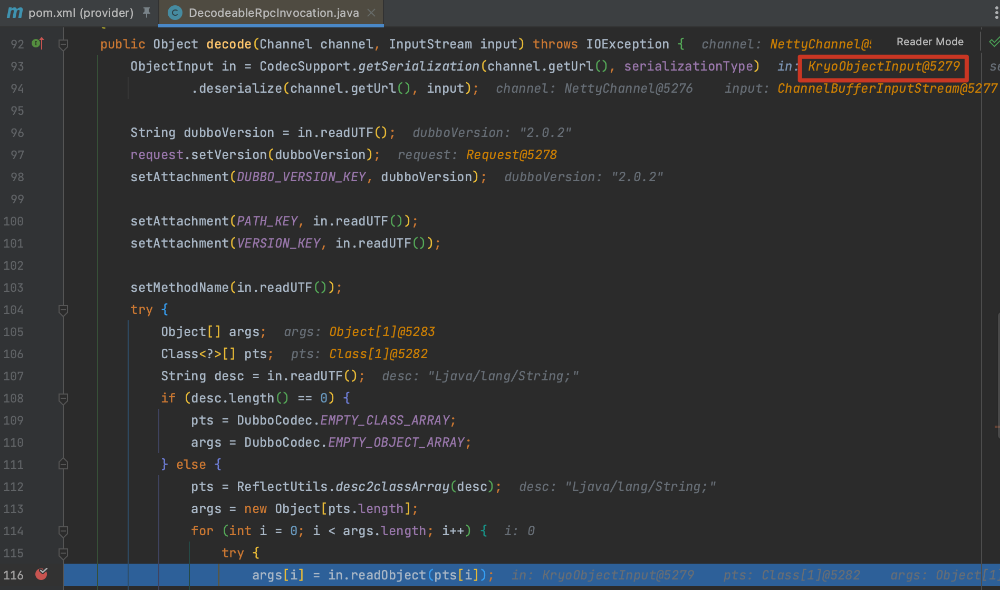
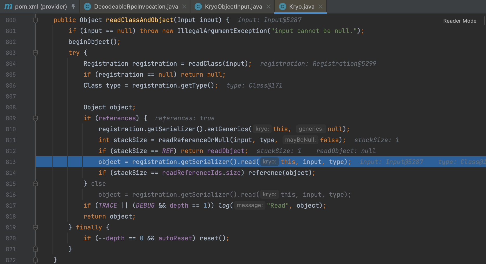
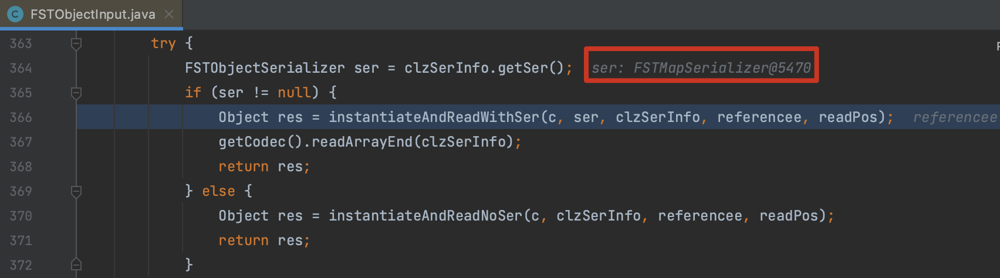
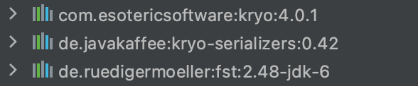

# CVE-2021-25641 可信数据反序列化（弱验证器）GHSL-2021-035

## 概述

### 影响版本

[2.5.0, 2.6.8]、[2.7.0, 2.7.7]

## 复现分析

首先看一下 [漏洞披露邮件](https://lists.apache.org/thread/g129y1xjtcxswjj506pvzmlbzfvtmsqw) 是这样描述的，可以通过篡改字节前标志来更改 Provider 的序列化 ID，使其使用弱验证器（Kryo、FST）来反序列化。

前面分析过 CVE-2020-1948，同样是 dubbo 的 RPC 通信，所以还是在同样的位置打个断点分析 `org.apache.dubbo.rpc.protocol.dubbo.DecodeableRpcInvocation.decode()` ，根据客户端传入的标志位获取到 `KryoObjectInput` 用于反序列化。

再跟进后就是 `Map.equals() ` 触发的常规操作不再赘述。

`FSTObjectInput` 最后也是调用的一个 `MapSerializer` 不再赘述。

## 关于 kryo 想到的

这个漏洞复现的时候使用的是 dubbo-common <= 2.7.3 的版本，之后的版本中少了这几个关键包无法利用。所以本质上还是因为引入了 Kryo 产生的问题。

Kryo 也是基于 Java 原生的序列化机制来实现的，来改进 Java 原生的序列化机制。与 Hessian 不同，Kryo 的底层依赖于 ASM，所以限制了只能运用在 JVM 上，但也给 Kryo 带来了高效率的优势。Kryo 广泛的运用在各个组件中（Apache Spark、Apache Storm、Akka、Kafka、Apache Flink），埋个坑下一步研究这个。

**参考**

> https://github.com/Dor-Tumarkin/CVE-2021-25641-Proof-of-Concept