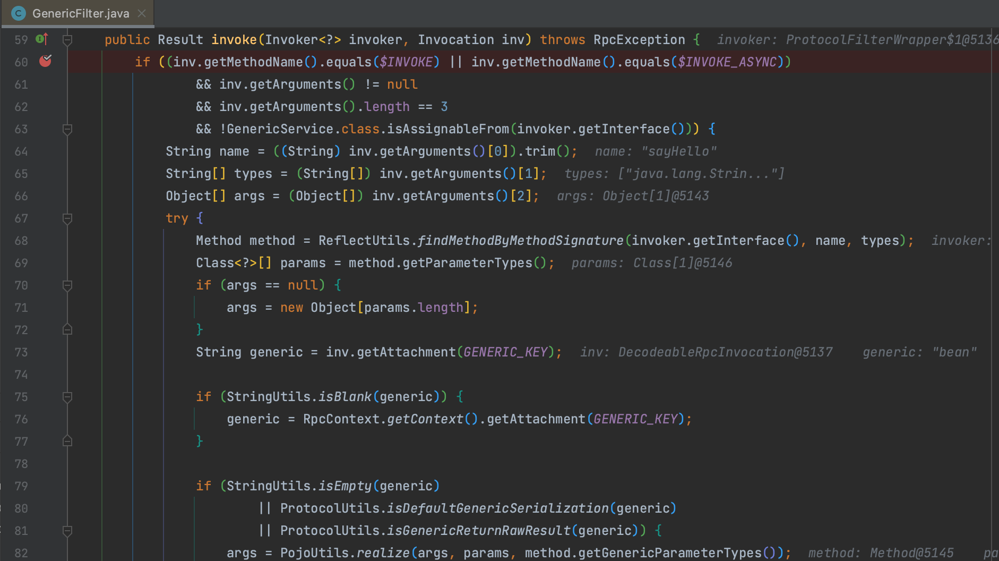
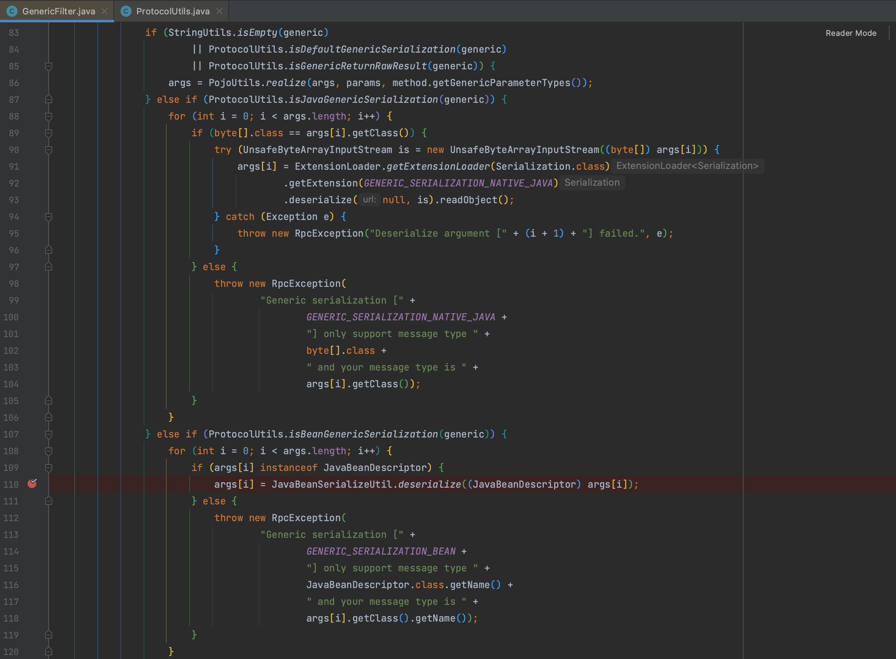
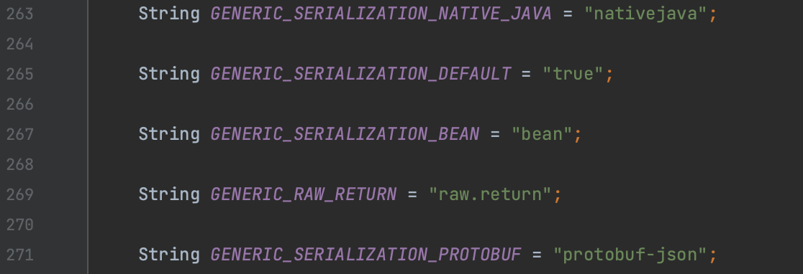
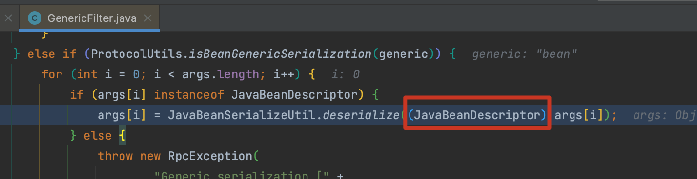
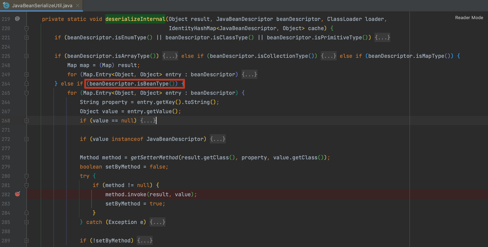
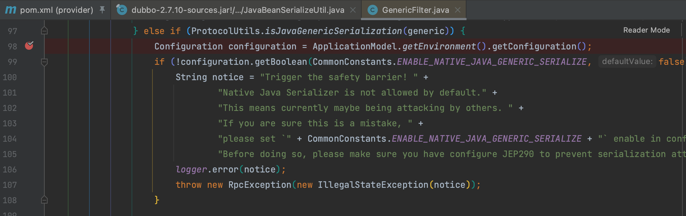

# CVE-2021-30179 Apache Dubbo Generic filter 远程代码执行漏洞 GHSL-2021-037 GHSL-2021-038

## 概述

### 影响版本

2.5.x、[2.6.0, 2.6.8]、[2.7.0, 2.7.9]

## 复现分析

首先看一下 [漏洞披露邮件](https://lists.apache.org/thread/980x0wb42tghghwmskpcm47fc77936pp) ，问题出在 GenericFilter 这个类，当调用 `$invoke` 或 `$invokeAsync` 方法时如果 methodDesc 为 `Ljava/lang/String;[Ljava/lang/String;[Ljava/lang/Object;` ，`generic` 为下图列出的几个会调用实际第三个字节数组反序列化。


`org.apache.dubbo.rpc.filter.GenericFilter` 是 Dubbo 框架中的一个过滤器，用于处理泛化调用（Generic Invocation）。泛化调用是 Dubbo 提供的一种调用方式，允许调用者通过传递方法名和参数列表的方式，而无需依赖服务提供方提供的接口，适用于一些动态性很高的场景，比如前端通过动态配置的方式调用服务。

进入 `invoke()` 方法首先对方法名，参数进行判断



之后当 generic 不为空时会进入不同的逻辑，即邮件所披露的几种情况。





我们选取其中的 bean 分支，进入 `org.apache.dubbo.common.beanutil.JavaBeanSerializeUtil#deserialize()` 方法。一步步跟进到 `org.apache.dubbo.common.beanutil.JavaBeanSerializeUtil#deserializeInternal()` ，由于我们在 `GenericFilter#invoke()` 方法调用时定义为 JavaBeanDescriptor，所以最终进入 bean 分支，触发最终的 `method.invoke()` 方法。





## 补丁

以 `bean` 为例，在进入 `JavaBeanSerializeUtil#deserialize()` 的流程后，引入 `SerializeClassChecker` 进行黑名单验证


nativejava 则是在 `org.apache.dubbo.rpc.support.ProtocolUtils` 直接判断配置文件是否支持



黑名单如下：

```
java\.lang\.RuntimeException true
bsh. false
ch.qos.logback.core.db. false
clojure. false
com.alibaba.citrus.springext.support.parser. false
com.alibaba.citrus.springext.util.SpringExtUtil. false
com.alibaba.druid.pool. false
com.alibaba.hotcode.internal.org.apache.commons.collections.functors. false
com.alipay.custrelation.service.model.redress. false
com.alipay.oceanbase.obproxy.druid.pool. false
com.caucho.config.types. false
com.caucho.hessian.test. false
com.caucho.naming. false
com.ibm.jtc.jax.xml.bind.v2.runtime.unmarshaller. false
com.ibm.xltxe.rnm1.xtq.bcel.util. false
com.mchange.v2.c3p0. false
com.mysql.jdbc.util. false
com.rometools.rome.feed. false
com.sun.corba.se.impl. false
com.sun.corba.se.spi.orbutil. false
com.sun.jndi.rmi. false
com.sun.jndi.toolkit. false
com.sun.org.apache.bcel.internal. false
com.sun.org.apache.xalan.internal. false
com.sun.rowset. false
com.sun.xml.internal.bind.v2. false
com.taobao.vipserver.commons.collections.functors. false
groovy.lang. false
java.awt. false
java.beans. false
java\.lang\.ProcessBuilder false
java\.lang\.Runtime false
java.rmi.server. false
java.security. false
java\.util\.ServiceLoader false
java\.util\.StringTokenizer false
javassist.bytecode.annotation. false
javassist\.tools\.web\.Viewer false
javassist.util.proxy. false
javax.imageio. false
javax.imageio.spi. false
javax.management. false
javax.media.jai.remote. false
javax.naming. false
javax.script. false
javax.sound.sampled. false
javax.swing. false
javax.xml.transform. false
net.bytebuddy.dynamic.loading. false
oracle.jdbc.connector. false
oracle.jdbc.pool. false
org.apache.aries.transaction.jms. false
org.apache.bcel.util. false
org.apache.carbondata.core.scan.expression. false
org.apache.commons.beanutils. false
org.apache.commons.codec.binary. false
org.apache.commons.collections.functors. false
org.apache.commons.collections4.functors. false
org.apache.commons.codec. false
org.apache.commons.configuration. false
org.apache.commons.configuration2. false
org.apache.commons.dbcp.datasources. false
org.apache.commons.dbcp2.datasources. false
org.apache.commons.fileupload.disk. false
org.apache.ibatis.executor.loader. false
org.apache.ibatis.javassist.bytecode. false
org.apache.ibatis.javassist.tools. false
org.apache.ibatis.javassist.util. false
org.apache.ignite.cache. false
org.apache.log.output.db. false
org.apache.log4j.receivers.db. false
org.apache.myfaces.view.facelets.el. false
org.apache.openjpa.ee. false
org.apache.openjpa.ee. false
org.apache.shiro. false
org.apache.tomcat.dbcp. false
org.apache.velocity.runtime. false
org.apache.velocity. false
org.apache.wicket.util. false
org.apache.xalan.xsltc.trax. false
org.apache.xbean.naming.context. false
org.apache.xpath. false
org.apache.zookeeper. false
org.aspectj. false
org.codehaus.groovy.runtime. false
org.datanucleus.store.rdbms.datasource.dbcp.datasources. false
org.dom4j. false
org.eclipse.jetty.util.log. false
org.geotools.filter. false
org.h2.value. false
org.hibernate.tuple.component. false
org.hibernate.type. false
org.jboss.ejb3. false
org.jboss.proxy.ejb. false
org.jboss.resteasy.plugins.server.resourcefactory. false
org.jboss.weld.interceptor.builder. false
org.junit. false
org.mockito.internal.creation.cglib. false
org.mortbay.log. false
org.mockito. false
org.thymeleaf. false
org.quartz. false
org.springframework.aop.aspectj. false
org\.springframework\.beans\.BeanWrapperImpl$BeanPropertyHandler false
org.springframework.beans.factory. false
org.springframework.expression.spel. false
org.springframework.jndi. false
org.springframework.orm. false
org.springframework.transaction. false
org.yaml.snakeyaml.tokens. false
ognl. false
pstore.shaded.org.apache.commons.collections. false
sun.print. false
sun.rmi.server. false
sun.rmi.transport. false
weblogic.ejb20.internal. false
weblogic.jms.common. false

```