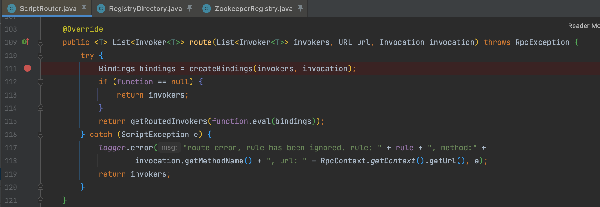
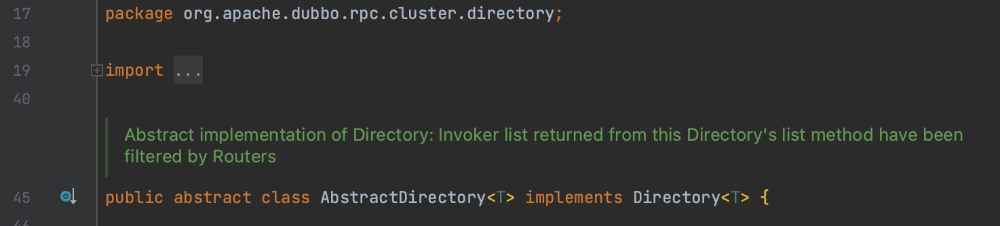
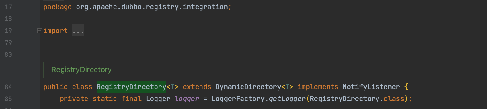
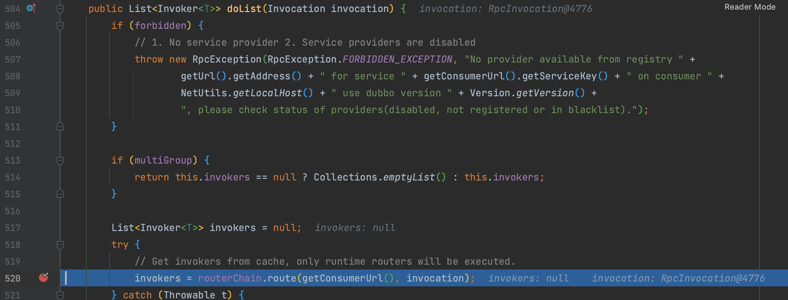
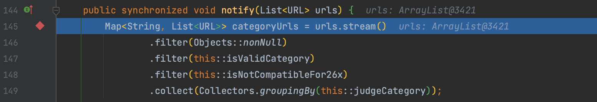

# CVE-2021-30181 Apache Dubbo cluster scriptEngine pre-auth 代码执行漏洞 GHSL-2021-042

## 概述

### 影响版本

[2.5.0, 2.6.9]、[2.7.0, 2.7.9]

## 复现分析

首先看一下 [漏洞披露邮件](https://lists.apache.org/thread/xxfk15q85hwy33v84tvvmoz3mp7cvw68) 是这样描述的，Dubbo 支持 Script 路由配置，这些配置被加载到配置中心（Zookeeper, Nacos等）。customer 发起请求时将默认使用不安全的 ScriptEngine 解析，所以还是一个预授权的代码执行。

在 `org.apache.dubbo.rpc.cluster.router.script.ScriptRouter#route()` 中存在未经验证的代码执行。

而在 `org.apache.dubbo.rpc.cluster.directory.AbstractDirectory` 的 `list()` 方法实现了对路由 `Router` 的管理，并实现了相应的逻辑。

`org.apache.dubbo.registry.integration.RegistryDirectory` 是 `AbstractDirectory` 的继承，重写了 `doList()` 方法，实现对 router 的管理。

又实现了 `NotifyListener` 接口，所以一样是存在 `notify()` 在发生变动时能通知 consumer

这个 payload 需要注意的是注册中心的 url 必须满足格式，具体要求可以在 `org.apache.dubbo.registry.zookeeper.ZookeeperRegistry#toUrlsWithoutEmpty()` 和 `org.apache.dubbo.common.utils.UrlUtils#isMatch()` 这两个方法打断点自己调试，就不是很想赘述了。

